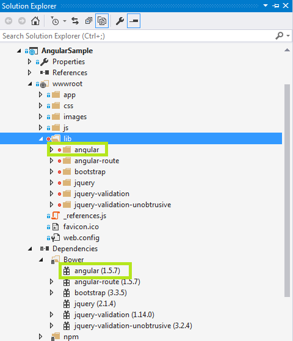

使用Angular构建单页应用程序(SPAs)
=================================================

作者： `Venkata Koppaka`_ 和 `Scott Addie`_

翻译： `耿晓亮(Blue)`_

在本文中你会学到如何通过 AngularJS 构建一个 SPA-style ASP.NET 应用程序。

.. contents:: Sections:
  :local:
  :depth: 1
  
`查看或者下载示例代码 <https://github.com/aspnet/Docs/tree/master/aspnet/client-side/angular/sample>`__

什么事 AngularJS？
------------------

`AngularJS <http://angularjs.org/>`_ 是 Google 通常用来处理单页面应用程序（SPAs）的一个现代化 JavaScript 框架。AngularJS 是遵从 MIT 协议的开源项目，AngularJS 的开发进度可以跟踪 `它的 GitHub repository <https://github.com/angular/angular.js>`_。因为 HTML 使用尖角号所以命名 Angular。

AngularJS 不是像 jQuery 一样的 DOM 操作库，但是它用了 jQuery 的一个叫 jQLite 的子集。AngularJS 主要是基于 HTML 特性的声明所有你可以添加到 HTML 标签里。你可以通过 `Code School 网站 <http://campus.codeschool.com/courses/shaping-up-with-angular-js/intro>`_ 在浏览器里尝试 AngularJS。

当前稳定版是 1.5.x 并且 Angular 团队正在致力于 AngularJS 的一个大改动的 V2.0 版目前仍然在开发中。本文专注在 Angular 1.X 附带一些 Angular 2.0 方向的注释。

入门
---------------

开始在 ASP.NET 应用程序里应用 AngularJS 前，首先你必须安装它来作为你项目的一部分，或者从内容分发网络（CDN）引用。

安装
^^^^^^^^^^^^

有几种方式添加 AngularJS 到你的应用程序。如果你正在 Visual Studio 里开始一个新的 ASP.NET Core web 应用程序，你可以通过内置 :ref:`Bower <bower-index>` 添加 AngularJS 。只需打开 ``bower.json``，并添加一个条目到 ``dependencies`` 属性：

.. _angular-bower-json:

.. literalinclude:: angular/sample/AngularSample/src/AngularSample/bower.json
  :language: json
  :linenos:
  :emphasize-lines: 9
  
一旦保存 ``bower.json`` 文件，Angular 将会安装到项目的 ``wwwroot/lib`` 文件夹。另外，还会在 ``Dependencies/Bower`` 文件夹中列出来。见下边的截图。

接下来，在 HTML 页或 `_Layout.cshtml` 文件的 ``<body>`` 段的下边添加一个 ``<script>``, 像这里展示的一样：

.. literalinclude:: angular/sample/AngularSample/src/AngularSample/Views/Shared/_Layout.cshtml
  :language: html
  :linenos:
  :lines: 48-52
  :emphasize-lines: 4

推荐生产应用程序利用 CDN 获取公共类库比如 Angular。你可以从一个或者几个 CDN 引用 Angular，比如这个示例：

.. literalinclude:: angular/sample/AngularSample/src/AngularSample/Views/Shared/_Layout.cshtml
  :language: html
  :linenos:
  :lines: 53-67
  :emphasize-lines: 10

一旦你有了 angular.js 脚本文件的引用，就可以开始在 web 页面使用 Angular。

关键组件
--------------

AngularJS 包含了大量的主要组件，例如 *directives*, *templates*, *repeaters*, *modules*, *controllers*, 和更多其他的组件。让我们来看看这些组件是如何协同工作以增加 web 页面的行为。

指令（Directives）
^^^^^^^^^^

AngularJS 通过 `directives <https://docs.angularjs.org/guide/directive>`_ 自定义的特性和元素来扩展 HTML。AngularJS 指令通过 ``data-ng-*`` 或者 ``ng-*`` 前缀定义 (``ng`` 是 angular 的简写)。有两种类型的 AngularJS 指令:

  #. **原始指令**: 这些是 Angular 团队预定义的并且是 AngularJS 框架的一部分。
  #. **自定义指令**: 这些是由你定义的自定义指令。

其中一个用于所有AngularJS 应用程序的原始指令是 ``ng-app`` 指令，用于启动 AngularJS 应用程序。这个指令可以应用到 ``<body>`` 标签或者 body 的子元素。让我们用行动来看一个示例。假设在一个 ASP.NET 项目里，你可以添加一个 HTML 文件到 ``wwwroot`` 文件夹, 或者添加一个新的 controller action 和一个相关的 view。在本例中，
我已经添加了一个 ``Directives`` action 方法到 ``HomeController.cs``。相关视图如下所示：

.. literalinclude:: angular/sample/AngularSample/src/AngularSample/Views/Home/Directives.cshtml
  :language: html
  :linenos:
  :emphasize-lines: 5,7

保持这些示例相对独立，我没有使用共享布局文件。你可以看到我们用 ``ng-app`` 指令修饰 body 标签以表明本页是一个 AngularJS 应用程序。``{{2+2}}`` 是一个 Angular 数据绑定表达式，接下来你马上会学到更多。如果你运行这个应用程序就会出现下边的效果： 

.. image:: angular/_static/simple-directive.png

AngularJS 中的其他原始指令包括：

``ng-controller``
  确定 JavaScript controller 绑定到 view。

``ng-model``
  确定 model 绑定到 HTML 元素属性的值。

``ng-init``
  用来初始化当前作用域中表达式的应用程序数据。

``ng-if``
  用提供表达式的真实值移除或替换 DOM 中给定 HTML 元素。

``ng-repeat``
  用一组数据重复替换一个给定的 HTML 块。

``ng-show``
  用提供的表达式示或隐藏给定的 HTML 元素。

AngularJS 支持的所有原始指令列表，请参见 `AngularJS 文档网站的指令文件章节 <https://docs.angularjs.org/api/ng/directive>`_。

数据绑定（Data Binding）
^^^^^^^^^^^^

AngularJS 提供了 `数据绑定 <https://docs.angularjs.org/guide/databinding>`_ 支持预置通过 ``ng-bind`` 指令或者像 ``{{expression}}`` 数据绑定表达式语法。AngularJS 支持双向数据绑定保持 model 的数据和 view 模板一直同步。View 的任何改变会自动反映到 model 里。同样的，Model 的任何改变也会反映到 view 里。

创建一个 HTML 文件或者一个 controller action 和一个 ``Databinding`` 伴随的view。View 里会包含以下内容：

.. literalinclude:: angular/sample/AngularSample/src/AngularSample/Views/Home/Databinding.cshtml
  :language: html
  :linenos:
  :emphasize-lines: 8-10

注意你可以显示通过指令或者数据绑定(``ng-bind``)。结果页应该像这样：

.. image:: angular/_static/simple-databinding.png

模板（Templates）
^^^^^^^^^

在 AngularJS 里 `模板 <https://docs.angularjs.org/guide/templates>`_ 只是用 AngularJS directives 和 artifacts 修饰的普通 HTML 页面。在 AngularJS里  template 混合了 directives，expressions，filters 和 controls 结合 view 中 HTML。

添加另一个 view 到演示模板，并添加下面内容：

.. literalinclude:: angular/sample/AngularSample/src/AngularSample/Views/Home/Templates.cshtml
  :language: html
  :linenos:
  :emphasize-lines: 8-10

模板有像 ``ng-app``, ``ng-init``, ``ng-model`` 的 AngularJS 指令和数据绑定表达式语法绑定到 ``personName`` 属性。运行浏览器，view 看起来像下面的截图：

.. image:: angular/_static/simple-templates-1.png

如果你通过在输入框里输入的内容来改变名字，你就会看到输入框旁边的文本动态更新，在 action 中显示了 Angular 的双向数据绑定。

.. image:: angular/_static/simple-templates-2.png

表达式（Expressions）
^^^^^^^^^^^

AngularJS 中的 `表达式 <https://docs.angularjs.org/guide/expression>`_ 是写在 ``{{ expression }}`` 语法中类似 JavaScript 的代码片段。这些表达式的数据以 ``ng-bind`` 指令同样的方式绑定到 HTML。AngularJS 表达式和正规的 JavaScript 表达式的主要不同是 AngularJS 表达式针对评估 AngularJS 中的 ``$scope`` 对象。 

下边示例中的 AngularJS 表达式绑定了 ``personName`` 和一个简单的 JavaScript 计算表达式：

.. literalinclude:: angular/sample/AngularSample/src/AngularSample/Views/Home/Expressions.cshtml
  :language: html
  :linenos:
  :emphasize-lines: 8-10

运行在浏览器中的示例显示了 ``personName`` 数据和计算结果：

.. image:: angular/_static/simple-expressions.png

中继器（Repeaters）
^^^^^^^^^

AngularJS 中的 repeating 是通过叫 ``ng-repeat`` 的原始指令完成的。``ng-repeat`` 指令用重复数据数组的长度重复 view 中一个给定的 HTML 元素。AngularJS 中的 repeaters 可以重复一个 string 数组或者 object 数组。这是一个 string 数组的简单重复的用法。

.. literalinclude:: angular/sample/AngularSample/src/AngularSample/Views/Home/Repeaters.cshtml
  :language: html
  :linenos:
  :emphasize-lines: 8,10-11

`Repeat 指令 <https://docs.angularjs.org/api/ng/directive/ngRepeat>`_ 在一个没有排序列表输出一系列列表项，你会在开发者工具中看到如屏幕截图中显示的：

.. image:: angular/_static/repeater.png

这是一个 object 数组的简单重复的用法。``ng-init`` 指令建立了一个 ``names`` 的数组，每一个元素都是包含了 first 和 last names。``ng-repeat`` 赋值, ``name in names``, 把每一个数组元素输出到列表项。

.. literalinclude:: angular/sample/AngularSample/src/AngularSample/Views/Home/Repeaters2.cshtml
  :language: html
  :linenos:
  :emphasize-lines: 8-11,13-14

这个实例的输出和之前示例的一样。

Angular 提供了一些附加指令可以帮助提供基于执行循环的行为。

``$index``
  用 ``ng-repeat`` 循环中 ``$index`` 定义你当前循环的 index 位置。

``$even`` and ``$odd``
  用 ``ng-repeat`` 循环中的 ``$even`` 定义你的循环中当前 index 是否是一个偶数行的 index。同样的，用 ``$odd`` 定义如果当前 index 是一个奇数行的 index。

``$first`` and ``$last``
  在 ``ng-repeat`` 循环中用 ``$first`` 定义是否当前循环中当前 index 是第一行的。同样的, 用 ``$last`` 定义如果当前 index 是最后一行的。

下面是在 action 中展示了 ``$index``, ``$even``, ``$odd``, ``$first``, 和 ``$last`` 的示例：

.. literalinclude:: angular/sample/AngularSample/src/AngularSample/Views/Home/Repeaters3.cshtml
  :language: html
  :linenos:
  :emphasize-lines: 14-18

这里是输出结果：

.. image:: angular/_static/repeaters2.png

$scope
^^^^^^

``$scope`` 是一个充当 view (template) 和 controller 之间的桥梁（解释见下边）。在 AngularJS 中 view 模板只知道附加到 controller 中 ``$scope`` 对象的值。

注意

在 MVVM 世界中，AngularJS 中的 ``$scope`` 对象通常定义成 ViewModel。AngularJS 团队指定 ``$scope`` 对象作为 Data-Model。`学习更多关于 AngularJS 中的 Scopes <https://docs.angularjs.org/guide/scope>`_。

下面是一个简单的示例展示了如何在单独的 JavaScript 文件的 ``$scope`` 上设置属性，``scope.js``：

.. literalinclude:: angular/sample/AngularSample/src/AngularSample/wwwroot/app/scope.js
  :language: html
  :linenos:
  :emphasize-lines: 2-3

观察在第 2 行传递到 controller 的 ``$scope`` 参数。这个对象是 view 知道的。在第 3 行，设置 "name" 属性为 "Mary Jane"。 

当 view 没有找到一个特定属性会发生什么？下面定义的 view 指向了 "name" 和 "age" 属性：

.. literalinclude:: angular/sample/AngularSample/src/AngularSample/Views/Home/Scope.cshtml
  :language: html
  :linenos:
  :emphasize-lines: 9-10,14

注意第 9 行我们让 Angular 通过表达式语法显示 "name" 属性。第 10 行指向 "age"，一个不存在的属性。正在运行的示例显示了 name 设置成 "Mary Jane" 并且没设置 age。丢失的属性忽略。

.. image:: angular/_static/scope.png

Modules
^^^^^^^

在 AngularJS 中 `module <https://docs.angularjs.org/guide/module>`_ 是 controllers，services，directives 等集合。在 AngularJS 中 ``angular.module()`` 函数调用用于 create，register 和 retrieve modules。所有的 modules，包括那些由 AngularJS 团队封装的和第三方类库，都应该通过 ``angular.module()`` 函数注册。 

下面的代码段显示了如何在 AngularJS 中创建一个新的 module。第一个参数是 module 的名字。第二个参数定义了其他 module 的依赖关系。在本文后面，我们会展示如何通过 ``angular.module()`` 方法调用传递这些依赖关系。

.. code-block:: javascript

  var personApp = angular.module('personApp', []);

在页面上用 ``ng-app`` 指令表示一个 AngularJS module。要使用 module，先分配 module 的名字，本例中的 ``personApp``，再到模板中的 ``ng-app`` 指令。

.. code-block:: html

  <body ng-app="personApp">

控制器（Controllers）
^^^^^^^^^^^

在 AngularJS 中 `Controllers <https://docs.angularjs.org/guide/controller>`_ 是代码入口的第一点。在 AngularJS 中调用 ``<module name>.controller()`` 函数 create 和 register controllers。``ng-controller`` 指令用来表示 HTML 页面上的一个 AngularJS controller。在 Angular 中 controller 的角色是设置状态和数据模型 （``$scope``）的行为。Controllers 不应该用于直接操作 DOM。

下面是注册一个新 controller 的代码片段。片段中的 ``personApp`` 变量引用了第二行定义的 Angular module。

.. literalinclude:: angular/sample/AngularSample/src/AngularSample/wwwroot/app/controllers.js
  :language: javascript
  :linenos:
  :emphasize-lines: 2,5

View 用 ``ng-controller`` 指令给 controller 名字赋值：

.. literalinclude:: angular/sample/AngularSample/src/AngularSample/Views/Home/Controllers.cshtml
  :language: html
  :linenos:
  :emphasize-lines: 8,14

页面显示了把符合 ``firstName`` 和 ``lastName`` 属性的 "Mary" 和 "Jane" 附加到 ``$scope`` 对象上：

.. image:: angular/_static/controllers.png

Services
^^^^^^^^

在 AngularJS 中 `services <https://docs.angularjs.org/guide/services>`_ 通常是抽象成一个文件用来在 Angular 应用程序整个生命周期共享代码。Services 是延迟加载的，意味着不会有一个服务的实例除非一个基于 service 的组件被调用。Factories 是一个在 AngularJS 应用程序中 service 示例的调用。Factories 是通过 ``myApp.factory()`` 函数调用创建的，``myApp`` 是 module。

下面的示例显示了如何在 AngularJS 中使用 factories： 

.. literalinclude:: angular/sample/AngularSample/src/AngularSample/wwwroot/app/simpleFactory.js
  :language: javascript
  :linenos:
  :emphasize-lines: 1

从 controller 中调用 factory，``personFactory`` 作为参数传递到 ``controller`` 函数：

.. code-block:: javascript

  personApp.controller('personController', function($scope,personFactory) {
    $scope.name = personFactory.getName();
  });

使用 services 和 REST endpoint 通信
^^^^^^^^^^^^^^^^^^^^^^^^^^^^^^^^^^^^^^^^^

下面是一个使用 AngularJS 中的 services 和 ASP.NET Core Web API endpoint 端到端交互的示例。示例从 Web API 获取数据并且在 view template 中显示数据。让我们先从 view 开始：

.. literalinclude:: angular/sample/AngularSample/src/AngularSample/Views/People/Index.cshtml
  :language: html
  :linenos:
  :emphasize-lines: 5,8,10,17-19

在这个 view 中，我们有一个叫做 ``PersonsApp`` 的 module 和一个叫做 ``personController`` 的 controller。我们用 ``ng-repeat`` 遍历 persons 列表。我们在 17-19 行引用了 3 个自定义 JavaScript 文件。

``personApp.js`` 文件用来注册 ``PersonsApp`` module；并且，语法和之前的示例相似。我们用 ``angular.module`` 函数创建一个 module 的新实例接下来用。

.. literalinclude:: angular/sample/AngularSample/src/AngularSample/wwwroot/app/personApp.js
  :language: javascript
  :linenos:
  :emphasize-lines: 3

让我们看看下面的 ``personFactory.js``。我们调用 module 的 ``factory`` 方法创建一个 factory。第 12 行展示了内置 Angular 的 ``$http`` 服务从 web 服务获取信息 。

.. literalinclude:: angular/sample/AngularSample/src/AngularSample/wwwroot/app/personFactory.js
  :language: javascript
  :linenos:
  :emphasize-lines: 6-7,12

在 ``personController.js`` 中，我们调用 module 的 ``controller`` 方法创建 controller。把 personFactory 返回的值赋值到 ``$scope`` 对象的 ``people`` 属性（第 13 行）。

.. literalinclude:: angular/sample/AngularSample/src/AngularSample/wwwroot/app/personController.js
  :language: javascript
  :linenos:
  :emphasize-lines: 6-7,13

让我们快速看一下 Web API 和它后面第 model。``Person`` model 是一个带有 ``Id``，``FirstName`` 和 ``LastName`` 属性的 POCO (Plain Old CLR Object)。

.. literalinclude:: angular/sample/AngularSample/src/AngularSample/Models/Person.cs
  :language: csharp
  :linenos:

``Person`` controller 返回一个 JSON 格式的 ``Person`` 对象列表：

.. literalinclude:: angular/sample/AngularSample/src/AngularSample/Controllers/Api/PersonController.cs
  :language: csharp
  :linenos:
  :emphasize-lines: 9-10,19

让我们运行起来看看应用程序：

.. image:: angular/_static/rest-bound.png

你可以 `在 GitHub 上查看应用程序的实例 <https://github.com/aspnet/Docs/tree/master/aspnet/client-side/angular/sample>`_。

.. 注意:: 更多 AngularJS 应用程序架构，参见 `John Papa's Angular 样式指南 <https://github.com/johnpapa/angular-styleguide>`_

.. 注意:: 为了更容易的创建 AngularJS module, controller, factory, directive 和 view 文件，请确认查阅 Sayed Hashimi 的 `SideWaffle template pack for Visual Studio <http://sidewaffle.com/>`_。Sayed Hashimi 微软 Visual Studio Web 团队的高级项目经理并且 SideWaffle templates 被认为是黄金标准。在写这篇文章的时候，SideWaffle 已经在 Visual Studio 2012, 2013, and 2015 可用。

路由和多视图
^^^^^^^^^^^^^^^^^^^^^^^^^^

AngularJS 有一个内置路由 提供程序来处理基于导航的 SPA (Single Page Application) 。在 AngularJS 里使用路由，你必须通过 Bower 添加 ``angular-route`` 类库。你会在本文的开始看见 :ref:`bower.json <angular-bower-json>` 文件引用 ，我们已经在项目中引用了它。

安装程序包后，添加脚本引用 (``angular-route.js``) 到 view 中。

现在让我们看看已经建立并且添加导航的 Person 程序。首先，通过创建叫做 ``Spa`` 的 ``PeopleController`` action 复制应用的副本和复制 ``People`` 文件夹中的 Index.cshtml view 创建相应的 ``Spa.cshtml``。添加脚本引用到 ``angular-route`` （参见第 11 行）。再添加一个 ``div`` 标记作为占位符到 place views。我们打算使用几个在 第 13-16 行引用的附加 ``.js`` 文件。

.. literalinclude:: angular/sample/AngularSample/src/AngularSample/Views/People/Spa.cshtml
  :language: html
  :linenos:
  :emphasize-lines: 6,11-16
  
让我们看一看 ``personModule.js`` 文件来看看如何用路由初始化 module。我们将 ``ngRoute`` 作为一个类库传递到 module。这个 module 在应用程序中处理路由。

.. literalinclude:: angular/sample/AngularSample/src/AngularSample/wwwroot/app/personModule.js
  :language: javascript
  :linenos:

``personRoutes.js`` 文件，下面，定义了基于路由提供器的路由。第 4-7 行用有效的话定义导航，当一个带 ``/persons`` 的 URL 被请求时，通过 ``personListController`` 调用 ``partials/personlist`` 模板。第 8-11 行表明一个 ``personId`` 路由参数第详细页。如果 URL 没有匹配到一个模式。Angular 默认转到 ``/persons`` view。

.. literalinclude:: angular/sample/AngularSample/src/AngularSample/wwwroot/app/personRoutes.js
  :language: javascript
  :linenos:
  :emphasize-lines: 4-7, 8-11, 13

``personlist.html`` 文件是一个只包含需要显示 person 列表 HTML 的 partial view。

.. literalinclude:: angular/sample/AngularSample/src/AngularSample/wwwroot/app/partials/personlist.html
  :language: html
  :linenos:
  :emphasize-lines: 3

controller 是通过 ``personListController.js`` 中的 module 的 ``controller`` 函数定义的。

.. literalinclude:: angular/sample/AngularSample/src/AngularSample/wwwroot/app/personListController.js
  :language: javascript
  :linenos:
  :emphasize-lines: 1

如果运行这个应用程序并且导航到 ``people/spa#/persons`` URL，就会看到：

.. image:: angular/_static/spa-persons.png

如果导航到详细页，例如 ``people/spa#/persons/2``，就会看到详细页的 partial view：

.. image:: angular/_static/spa-persons-2.png

你可以在 `GitHub <https://github.com/aspnet/Docs/tree/master/aspnet/client-side/angular/sample>`_ 上查看完整的源码和没有展示的任何文件。

Event Handlers
^^^^^^^^^^^^^^

在 AngularJS 中大量的指令添加 event-handling 能力到 HTML DOM 中到输入元素。下面是内置到 AngularJS 事件的列表。

  - ``ng-click``
  - ``ng-dbl-click``
  - ``ng-mousedown``
  - ``ng-mouseup``
  - ``ng-mouseenter``
  - ``ng-mouseleave``
  - ``ng-mousemove``
  - ``ng-keydown``
  - ``ng-keyup``
  - ``ng-keypress``
  - ``ng-change``

.. 注意:: 你可以使用 `AngularJS 中的自定义指令功能 <https://docs.angularjs.org/guide/directive>`_ 添加自己的 event handlers。

让我们看看 ``ng-click`` 事件是如果连接起来的。创建一个叫 ``eventHandlerController.js`` 的新 JavaScript 文件，并把下面的代码添加进去：

.. literalinclude:: angular/sample/AngularSample/src/AngularSample/wwwroot/app/eventHandlerController.js
  :language: javascript
  :linenos:
  :emphasize-lines: 5-7

注意上面 ``eventHandlerController`` 中第 5 行新的 ``sayName`` 函数。所有的方法都会显示一个欢迎信息的 JavaScript 提示。

下面的 view 绑定了一个 controller 函数到一个 AngularJS 事件。第 9 行有一个应用了 ``ng-click`` Angular 指令的按钮。它会调用 ``sayName`` 函数，通过这个 view 附加到 ``$scope`` 对象。

.. literalinclude:: angular/sample/AngularSample/src/AngularSample/Views/People/Events.cshtml
  :language: html
  :linenos:
  :emphasize-lines: 9

运行的示例证明了当按钮点击后会自动调用 controller 的 ``sayName`` 函数。

.. image:: angular/_static/events.png

更多关于 AngularJS 内置 event handler 指令的详细信息，请参考 AngularJS 的 `文档网站 <https://docs.angularjs.org/api/ng/directive/ngClick>`_。

Angular 2.0
-----------

Angular 2.0 是完全用 ES6 构建并考虑移动端的下一版 AngularJS。它用微软的 TypeScript 语言构建 。Angular 2.0 当前还是 RC 版并且预计 2016 年初发布。Angular 2.0 将会引入几个重大的改变，所以Angular团队正在努力向开发者提供一个指南。随着发布临近迁移路线会更清晰。如果你希望现在就开始 Angular 2.0，Angular 团队已经创建了 `Angular.io <http://angular.io>`_ 来展示他们的进展, 提供早期的文档，并收集反馈意见。

总结
-------

本文为 ASP.NET 开发者提供了一个 AngularJS 的预览。旨在帮助新接触 SPA 框架的开发者快速开始 。

发布的资源
-----------------

- `Angular Docs <https://docs.angularjs.org>`_
- `Angular 2 Info <http://angular.io>`_

