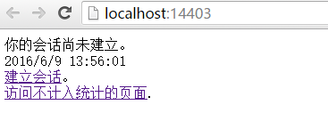
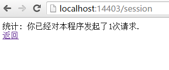
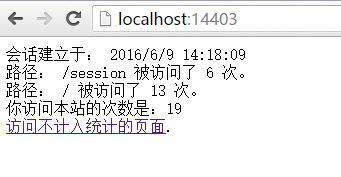

:version: 1.0.0-rc1

Managing Application State
==========================

管理应用程序状态
===================

作者：`Steve Smith`_

翻译：`姚阿勇（Dr.Yao） <http://github.com/yaoay>`_

校对： 

In ASP.NET Core, application state can be managed in a variety of ways, depending on when and how the state is to be retrieved. This article provides a brief overview of several options, and focuses on installing and configuring Session state support in ASP.NET Core applications.

在 ASP.NET Core 中，有多种途径可以对应用程序状态进行管理，取决于检索状态的时机和方式。本文简要介绍几种可选的方式，并着重介绍为 ASP.NET Core 应用程序安装并配置会话状态支持。

.. contents:: 章节
  :local:
  :depth: 1

`View or download sample code <https://github.com/aspnet/Docs/tree/master/aspnet/fundamentals/app-state/sample>`__

`查看或下载示例代码 <https://github.com/aspnet/Docs/tree/master/aspnet/fundamentals/app-state/sample>`__

Application State Options
-------------------------

`Application state` refers to any data that is used to represent the current representation of the application. This includes both global and user-specific data. Previous versions of ASP.NET (and even ASP) have had built-in support for global ``Application`` and ``Session`` state stores, as well as a variety of other options.

应用程序状态的可选方式
----------------------

`应用程序状态` 指的是用于描述应用程序当前状况的任意数据。包括全局的和用户特有的数据。之前版本的ASP.NET（甚至ASP）都内建了对全局的 ``Application`` 和 ``State`` 以及其他很多种状态存储的支持。

.. note:: The ``Application`` store had the same characteristics as the ASP.NET ``Cache``, with fewer capabilities. In ASP.NET Core, ``Application`` no longer exists; applications written for previous versions of ASP.NET that are migrating to ASP.NET Core replace ``Application`` with a :doc:`/performance/caching/index` implementation. 

.. note:: ``Application`` 储存和ASP.NET的 ``Cache`` 缓存的特性几乎一样，只是少了一些功能。在 ASP.NET Core 中，``Application`` 已经没有了；可以用 :doc:`/performance/caching/index` 的实现来代替 ``Application`` 的功能，从而把之前版本的 ASP.NET 应用程序升级到 ASP.NET Core 。

Application developers are free to use different state storage providers depending on a variety of factors:

应用程序开发人员可以根据不同因素来选择不同的方式储存状态数据：

- How long does the data need to persist?
- How large is the data?
- What format is the data?
- Can it be serialized?
- How sensitive was the data? Could it be stored on the client?

- 数据需要储存多久？
- 数据有多大？
- 数据的格式是什么？
- 数据是否可以序列化？
- 数据有多敏感？能不能保存在客户端？

Based on answers to these questions, application state in ASP.NET Core apps can be stored or managed in a variety of ways.

根据这些问题的答案，可以选择不同的方式储存和管理 ASP.NET Core 应用程序的状态。

HttpContext.Items
^^^^^^^^^^^^^^^^^

The ``Items`` collection is the best location to store data that is only needed while processing a given request. Its contents are discarded after each request. It is best used as a means of communicating between components or middleware that operate at different points in time during a request, and have no direct relationship with one another through which to pass parameters or return values. See `Working with HttpContext.Items`_, below.

HttpContext.Items
^^^^^^^^^^^^^^^^^

当数据仅用于一个请求之中时，用 ``Items`` 集合储存是最好的方式。数据将在每个请求结束之后被丢弃。它可以作为组件和中间件在一个请求期间的不同时间点进行互相通讯的最佳手段。

QueryString and Post
^^^^^^^^^^^^^^^^^^^^

State from one request can be provided to another request by adding values to the new request's query string or by POSTing the data. These techniques should not be used with sensitive data, because these techniques require that the data be sent to the client and then sent back to the server. It is also best used with small amounts of data. Query strings are especially useful for capturing state in a persistent manner, allowing links with embedded state to be created and sent via email or social networks, for use potentially far into the future. However, no assumption can be made about the user making the request, since URLs with query strings can easily be shared, and care must also be taken to avoid `Cross-Site Request Forgery (CSRF) <https://www.owasp.org/index.php/Cross-Site_Request_Forgery_(CSRF)>`_ attacks (for instance, even assuming only authenticated users are able to perform actions using query string based URLs, an attacker could trick a user into visiting such a URL while already authenticated).

QueryString 和 Post
^^^^^^^^^^^^^^^^^^^^

在查询字符串（ ``QueryString`` ）中添加数值、或利用 POST 发送数据，可以将一个请求的状态数据提供给另一个请求。这种技术不应该用于敏感数据，因为这需要将数据发送到客户端，然后再发送回服务器。这种方法也最好用于少量的数据。查询字符串对于持久地保留状态特别有用，可以将状态嵌入链接通过电子邮件或社交网络发出去，以备日后使用。然而，用户提交的请求是无法预期的，由于带有查询字符串的网址很容易被分享出去，所以必须小心以避免跨站请求伪装攻击（ `Cross-Site Request Forgery (CSRF) <https://www.owasp.org/index.php/Cross-Site_Request_Forgery_(CSRF)>`_ ）。(例如，即便设定了只有通过验证的用户才可以访问带有查询字符串的网址执行请求，攻击者还是可能会诱骗已经验证过的用户去访问这样的网址)。

Cookies
^^^^^^^

Very small pieces of state-related data can be stored in Cookies. These are sent with every request, and so the size should be kept to a minimum. Ideally, only an identifier should be used, with the actual data stored somewhere on the server, keyed to the identifier.

Cookies
^^^^^^^

与状态有关的非常小量的数据可以储存在 Cookies 中。他们会随每次请求被发送，所以应该保持在最小的尺寸。理想情况下，应该只使用一个标识符，而真正的数据储存在服务器端的某处，键值与这个标识符关联。

Session
^^^^^^^

Session storage relies on a cookie-based identifier to access data related to a given browser session (a series of requests from a particular browser and machine). You can't necessarily assume that a session is restricted to a single user, so be careful what kind of information you store in Session. It is a good place to store application state that is specific to a particular session but which doesn't need to be persisted permanently (or which can be reproduced as needed from a persistent store). See `Installing and Configuring Session`_, below for more details.

Session
^^^^^^^

会话（ ``Session`` ）储存依靠一个基于 Cookie 的标识符来访问与给定浏览器（来自一个特定机器和特定浏览器的一系列访问请求）会话相关的数据。你不能假设一个会话只限定给了一个用户，因此要慎重考虑在会话中储存哪些信息。这是用来储存那种针对具体会话，但又不要求永久保持的（或者说，需要的时候可以再从持久储存中重新获取的）应用程序状态的好地方。详情请参考下文 `安装和配置 Session` 。

Cache
^^^^^

Caching provides a means of storing and efficiently retrieving arbitrary application data based on developer-defined keys. It provides rules for expiring cached items based on time and other considerations. Learn more about :doc:`/performance/caching/index`.

Cache
^^^^^

缓存（ ``Caching`` ）提供了一种方法，用开发者自定义的键对应用程序数据进行储存和快速检索。它提供了一套基于时间和其他因素来使缓存项目过期的规则。详情请阅读 :doc:`/performance/caching/index` 。

Configuration
^^^^^^^^^^^^^

Configuration can be thought of as another form of application state storage, though typically it is read-only while the application is running. Learn more about :doc:`configuration`.

Configuration
^^^^^^^^^^^^^

配置（ ``Configuration`` ）可以被认为是应用程序状态储存的另外一种形式，不过通常它在程序运行的时候是只读的。详情请阅读 :doc:`configuration`。

Other Persistence
^^^^^^^^^^^^^^^^^

Any other form of persistent storage, whether using Entity Framework and a database or something like Azure Table Storage, can also be used to store application state, but these fall outside of what ASP.NET supports directly.

其他持久化
^^^^^^^^^^^

任何其他形式的持久化储存，无论是 Entity Framework 和数据库还是类似 Azure Table Storage 的东西，都可以被用来储存应用程序状态，不过这些都超出了 ASP.NET 直接支持的范围。

Working with HttpContext.Items
------------------------------

The ``HttpContext`` abstraction provides support for a simple dictionary collection of type ``IDictionary<object, object>``, called ``Items``. This collection is available from the start of an ``HttpRequest`` and is discarded at the end of each request. You can access it by simply assigning a value to a keyed entry, or by requesting the value for a given key.

使用 HttpContext.Items
----------------------

``HttpContext`` 抽象提供了一个简单的 ``IDictionary<object, object>`` 类型的字典集合，叫作 ``Items``。在每个请求中，这个集合从 ``HttpRequest`` 开始起就可以使用，直到请求结束后被丢弃。要存取集合，你可以直接给键控项赋值，或根据给定键查询值。

For example, some simple :doc:`middleware` could add something to the ``Items`` collection:

举个例子，一个简单的中间件（ :doc:`middleware` ）可以在 ``Items`` 集合中增加一些内容：

.. code-block:: c#

  app.Use(async (context, next) =>
    {
      // perform some verification
      context.Items["isVerified"] = true;
      await next.Invoke();
    });

and later in the pipeline, another piece of middleware could access it:

而在之后的管道中，其他的中间件就可以访问到这些内容了：

.. code-block:: c#

  app.Run(async (context) =>
  {
    await context.Response.WriteAsync("Verified request? " + context.Items["isVerified"]);
  });

.. note:: Since keys into ``Items`` are simple strings, if you are developing middleware that needs to work across many applications, you may wish to prefix your keys with a unique identifier to avoid key collisions (e.g. "MyComponent.isVerified" instead of just "isVerified").

.. note::  ``Items`` 的键名是简单的字符串，所以如果你是在开发跨越多个应用程序工作的中间件，你可能要用一个唯一标识符作为前缀以避免键名冲突。（如：采用 “ MyComponent.isVerified ”，而非简单的 “ isVerified ”）。

.. _session: 

Installing and Configuring Session
----------------------------------

ASP.NET Core ships a session package that provides middleware for managing session state. You can install it by including a reference to the ``Microsoft.AspNetCore.Session`` package in your project.json file:

安装和配置 Session
-------------------

ASP.NET Core 发布了一个关于会话的程序包，里面提供了用于管理会话状态的中间件。你可以在 project.json 中加入对 ``Microsoft.AspNetCore.Session`` 的引用来安装这个程序包：

Once the package is installed, Session must be configured in your application's ``Startup`` class. Session is built on top of ``IDistributedCache``, so you must configure this as well, otherwise you will receive an error.

当安装好程序包后，必须在你的应用程序的 ``Startup`` 类中对 Session 进行配置。Session 是基于 ``IDistributedCache`` 构建的，因此你也必须把它配置好，否则会得到一个错误。

.. note:: If you do not configure at least one ``IDistributedCache`` implementation, you will get an exception stating "Unable to resolve service for type 'Microsoft.Extensions.Caching.Distributed.IDistributedCache' while attempting to activate 'Microsoft.AspNetCore.Session.DistributedSessionStore'."

.. note:: 如果你一个 ``IDistributedCache`` 的实现都没有配置，则会得到一个异常，说“在尝试激活 'Microsoft.AspNetCore.Session.DistributedSessionStore' 的时候，无法找到类型为 'Microsoft.Extensions.Caching.Distributed.IDistributedCache' 的服务。”

ASP.NET ships with several implementations of ``IDistributedCache``, including an in-memory option (to be used during development and testing only). To configure session using this in-memory option, add the ``Microsoft.Extensions.Caching.Memory`` package in your project.json file and then add the following to ``ConfigureServices``:

ASP.NET 提供了 ``IDistributedCache`` 的多种实现， in-memory 是其中之一（仅用于开发期间和测试）。要配置会话采用 in-memory ，需将 ``Microsoft.Extensions.Caching.Memory`` 依赖项加入你的 project.json 文件然后再把以下代码添加到 ``ConfigureServices``：

.. code-block:: c#

  services.AddDistributedMemoryCache();
  services.AddSession();

Then, add the following to ``Configure`` and you're ready to use session in your application code:

然后，将下面的代码添加到 ``Configure`` 中，你就可以在程序代码里使用会话了：

.. code-block:: c#

  app.UseSession();

You can reference Session from ``HttpContext`` once it is installed and configured.

安装和配置好之后，你就可以从 ``HttpContext`` 引用 Session 了。

.. note:: If you attempt to access ``Session`` before ``UseSession`` has been called, you will get an ``InvalidOperationException`` exception stating that "Session has not been configured for this application or request."
.. note:: 如果你在调用 ``UseSession`` 之前尝试访问 ``Session`` ，则会得到一个 ``InvalidOperationException`` 异常，说“ Session 还没有在这个应用程序或请求中配置好。”

.. warning:: If you attempt to create a new ``Session`` (i.e. no session cookie has been created yet) after you have already begun writing to the ``Response`` stream, you will get an ``InvalidOperationException`` as well, stating that "The session cannot be established after the response has started". This exception may not be displayed in the browser; you may need to view the web server log  to discover it, as shown below:

.. warning:: 如果在开始向 ``Response`` 响应流中写入内容之后再尝试创建一个新的 ``Session`` （比如，还没有创建会话 cookie），你将会得到一个 ``InvalidOperationException`` 异常，说“不能在开始响应之后再建立会话。”

.. image:: app-state/_static/session-after-response-error.png

Implementation Details
^^^^^^^^^^^^^^^^^^^^^^

Session uses a cookie to track and disambiguate between requests from different browsers. By default this cookie is named ".AspNet.Session" and uses a path of "/". Further, by default this cookie does not specify a domain, and is not made available to client-side script on the page (because ``CookieHttpOnly`` defaults to ``true``).

实现细节
^^^^^^^^^

Session 利用一个 cookie 来跟踪和区分不同浏览器发出的请求。默认情况下，这个 cookie 命名为 “.AspNet.Session” 并使用路径 "/"。此外，在默认情况下这个 cookie 不指定域，而且对于页面的客户端脚本是不可使用的（因为 ``CookieHttpOnly`` 的默认值是 ``True``）。

These defaults, as well as the default ``IdleTimeout`` (used on the server independent from the cookie), can be overridden when configuring ``Session`` by using ``SessionOptions`` as shown here:
这些默认值，包括 ``IdleTimeout`` （独立于 cookie 在服务端使用），都可以在通过 ``SessionOptions`` 配置 ``Session`` 的时候覆盖重写，如下所示：

.. code-block:: c#

  services.AddSession(options =>
  {
    options.CookieName = ".AdventureWorks.Session";
    options.IdleTimeout = TimeSpan.FromSeconds(10);
  });

The ``IdleTimeout`` is used by the server to determine how long a session can be idle before its contents are abandoned. Each request made to the site that passes through the Session middleware (regardless of whether Session is read from or written to within that middleware) will reset the timeout. Note that this is independent of the cookie's expiration.

``IdleTimeout`` 在服务端用来决定在会话被抛弃之前可以闲置多久。任何来到网站的请求通过 Session 中间件（无论这中间件对 Session 是读取还是写入）都会重置会话的超时时间。

.. note:: ``Session`` is *non-locking*, so if two requests both attempt to modify the contents of session, the last one will win. Further, ``Session`` is implemented as a *coherent session*, which means that all of the contents are stored together. This means that if two requests are modifying different parts of the session (different keys), they may still impact each other.

.. note:: ``Session`` 是 *无锁* 的，因此如果两个请求都尝试修改会话的内容，最后一个会成功。此外，``Session`` 被实现为一个 *内容连贯的会话* ，就是说所有的内容都是一起储存的。这就意味着，如果两个请求是在修改会话中不同的部分（不同的键），他们还是会互相造成影响。

ISession
^^^^^^^^^

Once session is installed and configured, you refer to it via HttpContext, which exposes a property called ``Session`` of type :dn:iface:`~Microsoft.AspNetCore.Http.ISession`. You can use this interface to get and set values in ``Session``,such as ``byte[]``.

ISession
^^^^^^^^^

一旦 Session 安装和配置完成，你就可以通过 ``HttpContext`` 的一个名为 ``Session``，类型为 :dn:iface:`~Microsoft.AspNetCore.Http.ISession` 的属性来引用会话了。

.. code-block:: c#

  public interface ISession
  {
    bool IsAvailable { get; }
    string Id { get; }
    IEnumerable<string> Keys { get; }
    Task LoadAsync();
    Task CommitAsync();
    bool TryGetValue(string key, out byte[] value);
    void Set(string key, byte[] value);
    void Remove(string key);
    void Clear();
    IEnumerable<string> Keys { get; }
  }

Because ``Session`` is built on top of ``IDistributedCache``, you must always serialize the object instances being stored. Thus, the interface works with ``byte[]`` not simply ``object``. However, there are extension methods that make working with simple types such as ``String`` and ``Int32`` easier, as well as making it easier to get a byte[] value from session.

因为 ``Session`` 是建立在 ``IDistributedCache`` 之上的，所以总是需要序列化被储存的对象实例。因此，这个接口使用 ``byte[]`` 而不是直接使用 ``object``。不过，有扩展方法可以让我们在使用诸如 ``String`` 和 ``Int32`` 的简单类型时更加容易。

.. code-block:: c#

  // session extension usage examples
  context.Session.SetInt32("key1", 123);
  int? val = context.Session.GetInt32("key1");
  context.Session.SetString("key2", "value");
  string stringVal = context.Session.GetString("key2");
  byte[] result = context.Session.Get("key3");

If you're storing more complex objects, you will need to serialize the object to a ``byte[]`` in order to store them, and then deserialize them from ``byte[]`` when retrieving them.

如果要储存更复杂的对象，你需要把对象序列化为一个 ``byte[]`` 字节流以便储存，而后在获取对象的时候，还要将它们从 ``byte[]`` 字节流进行反序列化。

A Working Sample Using Session
------------------------------

The associated sample application demonstrates how to work with Session, including storing and retrieving simple types as well as custom objects. In order to see what happens when session expires, the sample has configured sessions to last just 10 seconds:

使用 Session 的示例
--------------------

这个示例程序演示了如何使用 Session ，包括储存和获取简单类型以及自定义对象。为了便于观察会话过期后会发生什么，示例中将会话的超时时间配置为短短的10秒：

.. literalinclude:: app-state/sample/src/AppState/Startup.cs
  :linenos:
  :language: c#
  :lines: 15-23
  :dedent: 8
  :emphasize-lines: 2,6

When you first navigate to the web server, it displays a screen indicating that no session has yet been established:

当你首次访问这个网页，它会在屏幕上显示说还没有会话被建立：

This default behavior is produced by the following middleware in *Startup.cs*, which runs when requests are made that do not already have an established session (note the highlighted sections):

这个默认的行为是由下面这些 *Startup.cs* 里的中间件产生的，当有尚未建立会话的请求来访的时候，这些中间件就会执行（注意高亮部分）：

.. literalinclude:: app-state/sample/src/AppState/Startup.cs
  :linenos:
  :language: c#
  :lines: 77-107
  :dedent: 12
  :emphasize-lines: 4,6,8-11,28-29

``GetOrCreateEntries`` is a helper method that will retrieve a ``RequestEntryCollection`` instance from ``Session`` if it exists; otherwise, it creates the empty collection and returns that. The collection holds ``RequestEntry`` instances, which keep track of the different requests the user has made during the current session, and how many requests they've made for each path.

``GetOrCreateEntries`` 是一个辅助方法，它会从 ``Session`` 获取一个 ``RequestEntryCollection`` 集合，如果没有则创建一个空的，然后将其返回。这个集合保存 ``RequestEntry`` 对象实例，用来跟踪当前会话期间，用户发出的不同请求，以及他们对每个路径发出了多少请求。

.. literalinclude:: app-state/sample/src/AppState/Model/RequestEntry.cs
  :linenos:
  :language: c#
  :lines: 3-
  :dedent: 4

.. literalinclude:: app-state/sample/src/AppState/Model/RequestEntryCollection.cs
  :linenos:
  :language: c#
  :lines: 6-
  :dedent: 4

.. note:: The types that are to be stored in session must be marked with ``[Serializable]``.

.. note:: 储存在会话中的类型必须用 ``[Serializable]`` 标记为可序列化的。

Fetching the current instance of ``RequestEntryCollection`` is done via the ``GetOrCreateEntries`` helper method:

获取当前的 ``RequestEntryCollection`` 实例是由辅助方法 ``GetOrCreateEntries`` 来完成的：

.. literalinclude:: app-state/sample/src/AppState/Startup.cs
  :linenos:
  :language: c#
  :lines: 109-124
  :dedent: 8
  :emphasize-lines: 4,8-9

When the entry for the object exists in ``Session``, it is retrieved as a ``byte[]`` type, and then deserialized using a ``MemoryStream`` and a ``BinaryFormatter``, as shown above. If the object isn't in ``Session``, the method returns a new instance of the ``RequestEntryCollection``.

如果对象实体存在于 ``Session`` 中，则会以 ``byte[]`` 字节流的类型获取，然后利用 ``MemoryStream`` 和 ``BinaryFormatter`` 将它反序列化，如上所示。如果 ``Session`` 中没有这个对象，这个方法则返回一个新的 ``RequestEntryCollection`` 实例。

In the browser, clicking the Establish session hyperlink makes a request to the path "/session", and returns this result:

在浏览器中，点击“建立会话”链接发起一个对路径“/session”的访问请求，然后得到如下结果：

Refreshing the page results in the count incrementing; returning to the root of the site (after making a few more requests) results in this display, summarizing all of the requests that were made during the current session:

刷新页面会使计数增加；再刷新几次之后，回到网站的根路径，如下显示，统计了当前会话期间所发起的所有请求：

Establishing the session is done in the middleware that handles requests to "/session":

建立会话是由一个中间件通过处理 "/session" 请求来完成的。

.. literalinclude:: app-state/sample/src/AppState/Startup.cs
  :linenos:
  :language: none
  :lines: 56-75
  :dedent: 12
  :emphasize-lines: 2,8-14

Requests to this path will get or create a ``RequestEntryCollection``, will add the current path to it, and then will store it in session using the helper method ``SaveEntries``, shown below:

对该路径的请求会获取或创建一个 ``RequestEntryCollection`` 集合，再把当前路径添加到集合里，最后用辅助方法 ``SaveEntries`` 把集合储存到会话中去，如下所示：

.. literalinclude:: app-state/sample/src/AppState/Startup.cs
  :linenos:
  :language: c#
  :lines: 126-132
  :dedent: 8
  :emphasize-lines: 6

``SaveEntries`` demonstrates how to serialize a custom object into a ``byte[]`` for storage in ``Session`` using a ``MemoryStream`` and a ``BinaryFormatter``.

``SaveEntries`` 演示了如何利用 ``MemoryStream`` 和 ``BinaryFormatter`` 将自定义类型对象序列化为一个 ``byte[]`` 字节流，以便储存到 ``Session`` 中。

The sample includes one more piece of middleware worth mentioning, which is mapped to the "/untracked" path. You can see its configuration here:

这个示例中还有一段中间件的代码值得注意，就是映射 "/untracked" 路径的代码。可以在下面看看它的配置：

.. literalinclude:: app-state/sample/src/AppState/Startup.cs
  :linenos:
  :language: c#
  :lines: 42-54
  :dedent: 12
  :emphasize-lines: 2,13

Note that this middleware is configured **before** the call to ``app.UseSession()`` is made (on line 13). Thus, the ``Session`` feature is not available to this middleware, and requests made to it do not reset the session ``IdleTimeout``. You can confirm this behavior in the sample application by refreshing the untracked path several times within 10 seconds, and then return to the application root. You will find that your session has expired, despite no more than 10 seconds having passed between your requests to the application.

注意这个中间件是在 ``app.UseSession`` 被调用（第13行）*之前* 就配置好的。因此， ``Session`` 的功能在中间件中还不能用，那么访问到这个中间件的请求将不会重置会话的 ``IdleTimeout`` 。为了证实这一点，你可以在 /untracked 页面上反复刷新10秒钟，再回到首页查看。你会发现会话已经超时了，即使你最后一次刷新到现在根本没有超过10秒钟。
