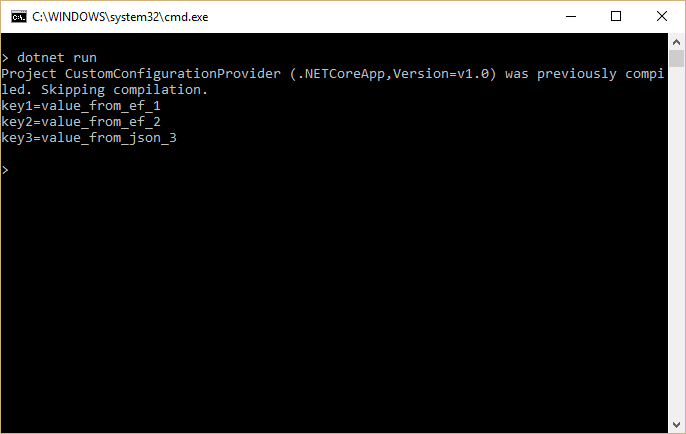

.. _fundamentals-configuration:

Configuration
=============

配置
=============

作者： `Steve Smith`_, `Daniel Roth`_

翻译： `刘怡(AlexLEWIS) <http://github.com/alexinea>`_

校对： 

ASP.NET Core supports a variety of different configuration options. Application configuration data can come from files using built-in support for JSON, XML, and INI formats, as well as from environment variables, command line arguments or an in-memory collection. You can also write your own :ref:`custom configuration provider <custom-config-providers>`.

ASP.NET Core 支持多种配置选项。应用程序配置数据内建支持读取 JSON、XML 和 INI 格式的配置文件和环境变量、命令行参数以及内存集合。你也可以编写自己的 :ref:`自定义配置提供程序 <custom-config-providers>`。

.. contents:: 章节:
  :local:
  :depth: 1

`View or download sample code <https://github.com/aspnet/docs/tree/master/aspnet/fundamentals/configuration/sample>`__

`访问或下载样例代码 <https://github.com/aspnet/docs/tree/master/aspnet/fundamentals/configuration/sample>`__

Getting and setting configuration settings
------------------------------------------

获取和设置配置
------------------------------------------

ASP.NET Core's configuration system has been re-architected from previous versions of ASP.NET, which relied on ``System.Configuration`` and XML configuration files like ``web.config``. The new configuration model provides streamlined access to key/value based settings that can be retrieved from a variety of sources. Applications and frameworks can then access configured settings in a strongly typed fashion using the new :ref:`Options pattern <options-config-objects>`

ASP.NET Core 配置系统针对以前的 ASP.NET 版本（依赖于 ``System.Configuration`` 和 XML 配置文件（如 ``Web.config``））进行了重新架构。新的配置模型提供了精简高效的通过检索多样化数据源的获取基于键/值对配置的能力。应用程序和框架可以通过新的强类型风格的 :ref:`选择模式 <options-config-objects>` 访问配置。

To work with settings in your ASP.NET application, it is recommended that you only instantiate a ``Configuration`` in your application's ``Startup`` class. Then, use the :ref:`Options pattern <options-config-objects>` to access individual settings.

在 ASP.NET 应用程序中，建议你在应用程序的 ``Startup`` 类中只实例化一个 ``Configuration`` 实例。然后使用 :ref:`选择模式 <options-config-objects>` 来访问各自的设置。

At its simplest, ``Configuration`` is just a collection of sources, which provide the ability to read and write name/value pairs. If a name/value pair is written to ``Configuration``, it is not persisted. This means that the written value will be lost when the sources are read again.

简单来说，``Configuration`` 类只是一个提供了读写名/值对能力的数据源集合。如果名/值对已被写入 ``Configuration`` 则不再写入。这意味着重复读取到的数据源的值将会丢失。

You must configure at least one source in order for ``Configuration`` to function correctly. The following sample shows how to test working with ``Configuration`` as a key/value store:

你至少需要配置一个数据源，使得 ``Configuration`` 能正常工作。下例演示了如何测试把 ``Configuration`` 作为一个键/值对存储来处理。

.. literalinclude:: configuration/sample/src/CodeSnippets/ConfigSummarySnippet.cs
  :language: c#
  :dedent: 12
  :start-after: // SNIPPET-START
  :end-before: // SNIPPET-END

.. note:: You must set at least one configuration source.

.. note:: 你至少需要设置一个数据源。

It's not unusual to store configuration values in a hierarchical structure, especially when using external files (e.g. JSON, XML, INI). In this case, configuration values can be retrieved using a ``:`` separated key, starting from the root of the hierarchy. For example, consider the following *appsettings.json* file:

一般不会把配置值存储在一个有层次的结构中，尤其是使用外部文件（如 JSON、XML、INI）时。在此情况下，可以使用以 ``:`` 符号分隔（从层次结构的根开始）的键来取回配置值。以下面的 *appsettings.json* 文件为例：

.. _config-json:

.. literalinclude:: /../common/samples/WebApplication1/src/WebApplication1/appsettings.json
  :language: json

The application uses configuration to configure the right connection string. Access to the ``DefaultConnection`` setting is achieved through this key: ``ConnectionStrings:DefaultConnection``, or by using the :dn:method:`~Microsoft.Extensions.Configuration.ConfigurationExtensions.GetConnectionString` extension method and passing in ``"DefaultConnection"``.

应用程序使用 configuration 配置正确的连接字符串。可以通过键 ``ConnectionStrings:DefaultConnection`` 来访问 ``DefaultConnection`` 的设置，或通过扩展方法 :dn:method:`~Microsoft.Extensions.Configuration.ConfigurationExtensions.GetConnectionString` 进入``"DefaultConnection"`` 。

The settings required by your application and the mechanism used to specify those settings (configuration being one example) can be decoupled using the :ref:`options pattern <options-config-objects>`. To use the options pattern you create your own options class (probably several different classes, corresponding to different cohesive groups of settings) that you can inject into your application using an options service. You can then specify your settings using configuration or whatever mechanism you choose.

应用程序所需要的设置和指定配置的机制（configuration 便是一例）都可通过使用 :ref:`选择模式 <options-config-objects>` 解耦。创建自己的配置类（可以是几个不同的类，分别对应不同的配置组），而后通过选项服务注入到应用程序中。然后你就可以通过配置或其它你所选择的机制来设置了。

.. note:: You could store your ``Configuration`` instance as a service, but this would unnecessarily couple your application to a single configuration system and specific configuration keys. Instead, you can use the :ref:`Options pattern <options-config-objects>` to avoid these issues.

.. note:: 你可将 ``Configuration`` 实例设计为一个服务，但这会导致不必要地把应用程序和配置系统与指定配置键耦合在一起。相反可通过 :ref:`选择模式 <options-config-objects>` 来避免这一问题。

Using the built-in sources
----------------------------

使用内建数据源
----------------------------

The configuration framework has built-in support for JSON, XML, and INI configuration files, as well as support for in-memory configuration (directly setting values in code) and the ability to pull configuration from environment variables and command line parameters. Developers are not limited to using a single configuration source. In fact several may be set up together such that a default configuration is overridden by settings from another source if they are present.

配置框架已内建支持 JSON、XML 和 INI 配置文件，内存配置（直接通过代码设置值），从环境变量和命令行参数中拉取配置。开发者并不受限于必须使用单个数据源。事实上可以把多个数据源组合在一起，就像是用从当前存在的另一个数据源中获取配置值覆盖默认配置一样。

Adding support for additional configuration sources is accomplished through extension methods. These methods can be called on a :dn:class:`~Microsoft.Extensions.Configuration.ConfigurationBuilder` instance in a standalone fashion, or chained together as a fluent API. Both of these approaches are demonstrated in the sample below.

扩展方法支持为配置添加额外的配置源。这些方法能被单例式的或链式的（如 fluent API）调用在 :dn:class:`~Microsoft.Extensions.Configuration.ConfigurationBuilder` 实例之上。以下代码同时演示了这两种风格：

.. _custom-config:

.. literalinclude:: configuration/sample/src/CustomConfigurationProvider/Program.cs
  :dedent: 12
  :language: c#
  :lines: 12-25

The order in which configuration sources are specified is important, as this establishes the precedence with which settings will be applied if they exist in multiple locations. In the example above, if the same setting exists in both *appsettings.json* and in an environment variable, the setting from the environment variable will be the one that is used. The last configuration provider specified "wins" if a setting exists in more than one location. The ASP.NET team recommends specifying environment variables last, so that the local environment can override anything set in deployed configuration files.

指定配置源的顺序非常重要，这将影响它们的设置被应用的优先级（如果存在于多个位置）。上例中，如果相同的配置同时存在于 *appsettings.json* 和环境变量，则环境变量的设置将被最终使用。最后指定的配置提供程序将“获胜”（如果该设置存在于至少两处位置）。ASP.NET 团队建议最后指定环境变量，如此一来本地环境可以覆盖任何部署在配置文件中的设置。

.. note:: To override nested keys through environment variables in shells that don't support ``:`` in variable names, replace them with ``__`` (double underscore).

.. note:: 如果通过环境变量重写嵌套键，请把变量中键名的 ``:`` 替换为 ``__`` （两个下划线）。

It can be useful to have environment-specific configuration files. This can be achieved using the following:

这对于指定环境的配置文件非常有用，这能通过以下代码来实现：

.. literalinclude:: /../common/samples/WebApplication1/src/WebApplication1/Startup.cs
  :dedent: 8
  :language: none
  :lines: 20-35
  :emphasize-lines: 6

The :dn:iface:`~Microsoft.AspNetCore.Hosting.IHostingEnvironment` service is used to get the current environment. In the ``Development`` environment, the highlighted line of code above would look for a file named ``appsettings.Development.json`` and use its values, overriding any other values, if it's present. Learn more about :doc:`environments`.

:dn:iface:`~Microsoft.AspNetCore.Hosting.IHostingEnvironment` 服务用于获取当前环境。在 ``Development`` 环境中，上例高亮行代码将寻找名为 ``appsettings.Development.json`` 的配置文件，并用其中的值覆盖当前存在的其它值。更多请参见 :doc:`environments` 。

When specifying files as configuration sources, you can optionally specify whether changes to the file should result in the settings being reloaded. This is configured by passing in a ``true`` value for the ``reloadOnChange`` parameter when calling :dn:method:`~Microsoft.Extensions.Configuration.JsonConfigurationExtensions.AddJsonFile` or similar file-based extension methods.

一旦将指定文件作为配置源，你就可以选择一旦文件发生变化后是否重载这部分的配置。如果需要重载，则可在调用 :dn:method:`~Microsoft.Extensions.Configuration.JsonConfigurationExtensions.AddJsonFile` 时或类似的基于文件的扩展方法中通过将 ``reloadOnChange`` 参数的值值为 ``true`` 实现。

.. warning:: You should never store passwords or other sensitive data in configuration provider code or in plain text configuration files. You also shouldn't use production secrets in your development or test environments. Instead, such secrets should be specified outside the project tree, so they cannot be accidentally committed into the configuration provider repository. Learn more about :doc:`environments` and managing :doc:`/security/app-secrets`.

.. warning:: 谨记，严禁把密码或其他敏感数据保存在代码或纯文本配置文件中，严谨在开发环境或测试环境中使用生产环境的机密数据（这些机密数据应当在项目树的外部被指定，这样就不会意外提交到仓库内）。移步了解更多 :doc:`environments` 和管理 :doc:`/security/app-secrets` 。

One way to leverage the order precedence of ``Configuration`` is to specify default values, which can be overridden. In the console application below, a default value for the ``username`` setting is specified in an in-memory collection, but this is overridden if a command line argument for ``username`` is passed to the application. You can see in the output how many different configuration sources are configured in the application at each stage of its execution.

影响 ``Configuration`` 优先级顺序的一个因素是指定可被重写的默认值。在下例控制台应用程序中，默认的 ``username`` 设置由内存集合指定，但如果命令行参数中有个 ``username`` 参数被传递给应用程序，它将被覆盖。在输出中可以看到程序的每一个步骤中有多少个配置源在进行配置工作。

.. literalinclude:: configuration/sample/src/ConfigConsole/Program.cs
  :emphasize-lines: 22,25
  :linenos:
  :language: none

When run, the program will display the default value unless a command line parameter overrides it.

当运行时，程序将显示默认值，除非使用命令行参数重写之。

.. _options-config-objects:

Using Options and configuration objects
---------------------------------------

使用选项和配置对象
---------------------------------------

The options pattern enables using custom options classes to represent a group of related settings. A class needs to have a public read-write property for each setting and a constructor that does not take any parameters (e.g. a default constructor) in order to be used as an options class.

选项模式可使用定制的配置类来表示一组相关设置。为使这个类成为配置类，需要为每个配置项提供公开的可读写属性，以及一个无参构造函数（比如默认构造函数）。

It's recommended that you create well-factored settings objects that correspond to certain features within your application, thus following the `Interface Segregation Principle (ISP) <http://deviq.com/interface-segregation-principle/>`_ (classes depend only on the configuration settings they use) as well as `Separation of Concerns <http://deviq.com/separation-of-concerns/>`_ (settings for disparate parts of your app are managed separately, and thus are less likely to negatively impact one another).

推荐把你创建的配置根据应用程序的功能分解为多个配置对象，从而实现 `ISP <http://deviq.com/interface-segregation-principle/>`_ （Interface Segregation Principle，接口隔离原则，类只依赖于它们自己使用的配置设置） 和 `SoC <http://deviq.com/separation-of-concerns/>`_ （Separation of Concerns，关注分离，设置与应用程序相互隔离，减少彼此之间的干扰和影响）。

A simple ``MyOptions`` class is shown here:

一个简单的 ``MyOptions`` 类如下所示：

.. literalinclude:: configuration/sample/src/UsingOptions/Models/MyOptions.cs
  :language: c#
  :lines: 3-7
  :dedent: 4

Options can be injected into your application using the :dn:iface:`~Microsoft.Extensions.Options.IOptions\<TOptions>` accessor service. For example, the following :doc:`controller </mvc/controllers/index>`  uses ``IOptions<MyOptions>`` to access the settings it needs to render the ``Index`` view:

通过 :dn:iface:`~Microsoft.Extensions.Options.IOptions\<TOptions>` ，配置选项将被注入到应用程序中。比方说，如 :doc:`controller </mvc/controllers/index>` 使用 ``IOptions<TOptions>`` 来访问需要在 ``Index`` 视图中渲染的配置：

.. literalinclude:: configuration/sample/src/UsingOptions/Controllers/HomeController.cs
  :language: c#
  :lines: 9-20
  :dedent: 4
  :emphasize-lines: 3,5,8

.. tip:: Learn more about :doc:`dependency-injection`.

.. tip:: 更多请浏览 :doc:`dependency-injection` 。

To setup the :dn:iface:`~Microsoft.Extensions.Options.IOptions\<TOptions>` service you call the :dn:method:`~Microsoft.Extensions.DependencyInjection.OptionsServiceCollectionExtensions.AddOptions` extension method during startup in your ``ConfigureServices`` method:

为设置 :dn:iface:`~Microsoft.Extensions.Options.IOptions\<TOptions>` 服务，你需在启动期间在 ``ConfigureServices`` 方法内调用 :dn:method:`~Microsoft.Extensions.DependencyInjection.OptionsServiceCollectionExtensions.AddOptions` 扩展方法。

.. literalinclude:: configuration/sample/src/UsingOptions/Startup.cs
  :language: c#
  :lines: 26-30
  :emphasize-lines: 4
  :dedent: 8

.. _options-example:

The ``Index`` view displays the configured options:

``Index`` 视图将显示配置选项：

.. image:: configuration/_static/index-view.png

You configure options using the :dn:method:`~Microsoft.Extensions.DependencyInjection.OptionsServiceCollectionExtensions.Configure\<TOptions>` extension method. You can configure options using a delegate or by binding your options to configuration:

配置选项使用 :dn:method:`~Microsoft.Extensions.DependencyInjection.OptionsServiceCollectionExtensions.Configure\<TOptions>` 扩展方法。你可以通过委托或绑定配置选项的方式来进行配置：

.. literalinclude:: configuration/sample/src/UsingOptions/Startup.cs
  :language: c#
  :lines: 26-45
  :dedent: 8
  :emphasize-lines: 7,10-13,16

When you bind options to configuration each property in your options type is bound to a configuration key of the form ``property:subproperty:...``. For example, the ``MyOptions.Option1`` property is bound to the key ``Option1``, which is read from the ``option1`` property in *appsettings.json*. Note that configuration keys are case insensitive.

当你通过绑定选项来配置选项类型的每一个属性，实际上是绑定到每一个配置键（比如 ``property:subproperty:...``）。比方说，``MyOptions.Option1`` 属性绑定到键 ``Option1``，那么就会从 *appsettings.json* 中读取 ``option1`` 属性。注意，配置键是大小写不敏感的。

Each call to :dn:method:`~Microsoft.Extensions.DependencyInjection.OptionsServiceCollectionExtensions.Configure\<TOptions>` adds an :dn:iface:`~Microsoft.Extensions.Options.IConfigureOptions\<TOptions>` service to the service container that is used by the :dn:iface:`~Microsoft.Extensions.Options.IOptions\<TOptions>` service to provide the configured options to the application or framework. If you want to configure your options using objects that must be obtained from the service container (for example, to read settings from a database) you can use the ``AddSingleton<IConfigureOptions<TOptions>>`` extension method to register a custom :dn:iface:`~Microsoft.Extensions.Options.IConfigureOptions\<TOptions>` service.

通过调用 :dn:method:`~Microsoft.Extensions.DependencyInjection.OptionsServiceCollectionExtensions.Configure\<TOptions>` 将一个 :dn:iface:`~Microsoft.Extensions.Options.IConfigureOptions\<TOptions>` 服务加入服务容器，是为了之后应用程序或框架能通过 :dn:iface:`~Microsoft.Extensions.Options.IOptions\<TOptions>` 服务来获取配置选项。若是想从服务容器（比如从数据库中读配置）获取配置，你可使用 ``AddSingleton<IConfigureOptions<TOptions>>`` 扩展方法注册定制的 :dn:iface:`~Microsoft.Extensions.Options.IConfigureOptions\<TOptions>` 服务。

You can have multiple :dn:iface:`~Microsoft.Extensions.Options.IConfigureOptions\<TOptions>` services for the same option type and they are all applied in order. In the :ref:`example <options-example>` above, the values of ``Option1`` and ``Option2`` are both specified in `appsettings.json`, but the value of ``Option1`` is overridden by the configured delegate with the value "value1_from_action".

同一个选项类型可以有多个 :dn:iface:`~Microsoft.Extensions.Options.IConfigureOptions\<TOptions>` 服务，届时将按顺序应用。在上 :ref:`例 <options-example>` 中， ``Option1`` 和 ``Option2`` 都在 `appsettings.json` 中指定，但 ``Option1`` 的值最后被配置委托（值为 "value1_from_action"）所覆盖。

.. _custom-config-providers:

Writing custom providers
------------------------

编写自定义提供程序
------------------------

In addition to using the built-in configuration providers, you can also write your own. To do so, you simply implement the :dn:iface:`~Microsoft.Extensions.Configuration.IConfigurationSource` interface, which exposes a :dn:method:`~Microsoft.Extensions.Configuration.IConfigurationSource.Build` method. The build method configures and returns an :dn:iface:`~Microsoft.Extensions.Configuration.IConfigurationProvider`.

除使用内建的配置提供程序，你也可自行定制。为此，你只需实现 ``ConfigurationProvider`` 接口（该接口向外暴露 :dn:method:`~Microsoft.Extensions.Configuration.IConfigurationSource.Build` 方法）。构建方法配置并返回 :dn:iface:`~Microsoft.Extensions.Configuration.IConfigurationProvider` 。

Example: Entity Framework Settings
^^^^^^^^^^^^^^^^^^^^^^^^^^^^^^^^^^

例子：Entity Framework 设置
^^^^^^^^^^^^^^^^^^^^^^^^^^^^^^^^^^

You may wish to store some of your application's settings in a database, and access them using Entity Framework Core(EF). There are many ways in which you could choose to store such values, ranging from a simple table with a column for the setting name and another column for the setting value, to having separate columns for each setting value. In this example, we're going to create a simple configuration provider that reads name-value pairs from a database using EF.

你或许希望将应用程序的配置保存在数据库中，然后通过 EntityFramework Core（EF）来访问它们。保存这些配置值有很多办法可以选择，比方说一张简易表格，一列表示配置名、另一列表示配置的值。在本例中，我们创建一个简易的配置提供程序，通过 EF 从数据库中读取名值对（name-value pair）。

To start off we'll define a simple ``ConfigurationValue`` entity for storing configuration values in the database:

在开始之前我们先定义一个简单的 ``ConfigurationValue`` 实体模型用来表示存储在数据库中的配置值。

.. literalinclude:: configuration/sample/src/CustomConfigurationProvider/ConfigurationValue.cs
  :language: c#
  :lines: 3-7
  :dedent: 4

You need a ``ConfigurationContext`` to store and access the configured values using EF:

然后需要一个 ``ConfigurationContext`` 用来通过 EF 存储和访问配置值

.. literalinclude:: configuration/sample/src/CustomConfigurationProvider/ConfigurationContext.cs
  :language: c#
  :lines: 5-12
  :dedent: 4
  :emphasize-lines: 7

Create an ``EntityFrameworkConfigurationSource`` that inherits from :dn:iface:`~Microsoft.Extensions.Configuration.IConfigurationSource`:

创建一个继承自 :dn:iface:`~Microsoft.Extensions.Configuration.IConfigurationSource` 的 ``EntityFrameworkConfigurationSource`` ：

.. literalinclude:: configuration/sample/src/CustomConfigurationProvider/EntityFrameworkConfigurationSource.cs
  :language: c#
  :emphasize-lines: 7,16-19

Next, create the custom configuration provider by inheriting from :dn:class:`~Microsoft.Extensions.Configuration.ConfigurationProvider`. The configuration data is loaded by overriding the ``Load`` method, which reads in all of the configuration data from the configured database. For demonstration purposes, the configuration provider also takes care of initializing the database if it hasn't already been created and populated:

接着，通过继承 :dn:class:`~Microsoft.Extensions.Configuration.ConfigurationProvider` 创建一个定制的配置提供程序。配置数据由重写的 ``Load`` 方法（该方法将从配置数据库中读取所有配置数据）所提供。由于这是演示，所以配置提供程序需要自行初始化数据库（如果该数据库尚未创建并初始化的话）。

.. literalinclude:: configuration/sample/src/CustomConfigurationProvider/EntityFrameworkConfigurationProvider.cs
  :language: c#
  :emphasize-lines: 9,18-30,37-38

Note the values that are being stored in the database ("value_from_ef_1" and "value_from_ef_2"); these are displayed in the sample below to demonstrate the configuration is reading values from the database properly.

注意存入数据库的值（"value_from_ef_1" 和 "value_from_ef_2"）；下例将演示从数据库中读取配置值。

By convention you can also add an ``AddEntityFrameworkConfiguration`` extension method for adding the configuration source:

按惯例，你同样可以添加一个 ``AddEntityFrameworkConfiguration`` 扩展方法来增加配置源：

.. literalinclude:: configuration/sample/src/CustomConfigurationProvider/EntityFrameworkExtensions.cs
  :language: c#
  :emphasize-lines: 9

You can see an example of how to use this custom configuration provider in your application in the following example. Create a new :dn:class:`~Microsoft.Extensions.Configuration.ConfigurationBuilder` to setup your configuration sources. To add the ``EntityFrameworkConfigurationProvider``, you first need to specify the EF data provider and connection string. How should you configure the connection string? Using configuration of course! Add an *appsettings.json* file as a configuration sources to bootstrap setting up the ``EntityFrameworkConfigurationProvider``. By adding the database settings to an existing configuration with other sources specified, any settings specified in the database will override settings specified in *appsettings.json*:

在下例中将演示如何在应用程序中使用此定制的配置源。创建一个新的 :dn:class:`~Microsoft.Extensions.Configuration.ConfigurationBuilder` 来设置配置提供程序。指定数据提供程序和连接字符串后，添加 ``EntityFrameworkConfigurationProvider`` 配置提供程序。那你如何配置连接字符串呢？当然也是使用配置了！添加 *appsettings.json* 作为配置源来引导建立 ``EntityFrameworkConfigurationProvider`` 。通过为带有其他配置源的现有配置添加数据库配置，在数据库中指定的任何配置都将覆盖 *appsettings.json* 中所指定的对应设置：

.. literalinclude:: configuration/sample/src/CustomConfigurationProvider/Program.cs
  :language: c#
  :emphasize-lines: 21-24

Run the application to see the configured values:

运行程序，看到所配置的值。

Summary
-------

总结
-------

ASP.NET Core provides a very flexible configuration model that supports a number of different file-based options, as well as command-line, in-memory, and environment variables. It works seamlessly with the options model so that you can inject strongly typed settings into your application or framework. You can create your own custom configuration providers as well, which can work with or replace the built-in providers, allowing for extreme flexibility. 

ASP.NET Core 提供了非常灵活的配置模型，支持多种配置文件类型、命令行、内存和环境变量。它能与配置模型无缝协作，因此你可为你的应用程序或框架注入强类型配置。你也可以创建自己定制的配置提供程序，用于协同或取代内置提供程序，保证了最大程序的灵活性。