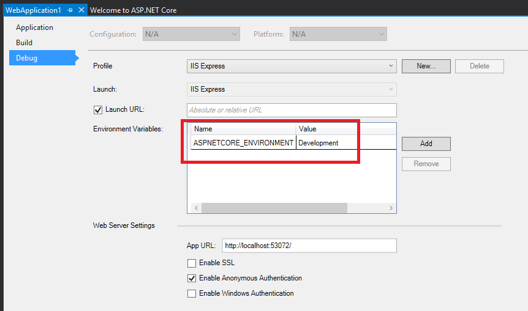

Working with Multiple Environments
==================================
在多个环境中工作
================

作者： `Steve Smith`_

翻译： `刘浩杨 <http://github.com/liuhaoyang>`_

ASP.NET Core introduces improved support for controlling application behavior across multiple environments, such as development, staging, and production. Environment variables are used to indicate which environment the application is running in, allowing the app to be configured appropriately.

ASP.NET Core 介绍了支持在多个环境中管理应用程序行为的改进，如开发（development），预演（staging）和生产（production）。环境变量用来指示应用程序正在运行的环境，允许应用程序适当地配置。

.. contents:: Sections:
  :local:
  :depth: 1

`View or download sample code <https://github.com/aspnet/Docs/tree/master/aspnet/fundamentals/environments/sample>`__

`查看或下载示例代码 <https://github.com/aspnet/Docs/tree/master/aspnet/fundamentals/environments/sample>`__

Development, Staging, Production
--------------------------------

开发，预演，生产
-----------------

ASP.NET Core references a particular `environment variable <https://github.com/aspnet/Home/wiki/Environment-Variables>`_, ``ASPNETCORE_ENVIRONMENT`` to describe the environment the application is currently running in. This variable can be set to any value you like, but three values are used by convention: ``Development``, ``Staging``, and ``Production``. You will find these values used in the samples and templates provided with ASP.NET Core.

ASP.NET Core 引用了一个特定的 `环境变量 <https://github.com/aspnet/Home/wiki/Environment-Variables>`_  ``ASPNETCORE_ENVIRONMENT`` 来描述应用程序当前运行的环境。这个变量可以被设置为任何你喜欢的值，但是有三个值被约定使用： ``Development``，``Staging`` 和 ``Production``。你会发现这些值在 ASP.NET Core 提供的示例和模板中被使用。

The current environment setting can be detected programmatically from within your application. In addition, you can use the Environment :doc:`tag helper </mvc/views/tag-helpers/index>` to include certain sections in your :doc:`view </mvc/views/index>` based on the current application environment.

当前的环境设置可以通过编程方式从应用程序中被检测到。除此之外，你可以基于当前的应用程序环境在你的 :doc:`view </mvc/views/index>` 里使用 Environment :doc:`tag helper </mvc/views/tag-helpers/index>` 来包含某些部分。

.. note:: The specified environment name is case insensitive. Whether you set the variable to ``Development`` or ``development`` or ``DEVELOPMENT`` the results will be the same.

.. note:: 指定的环境变量名称不区分大小写。无论你把变量设置为 ``Development`` 或者 ``development`` 或者 ``DEVELOPMENT`` 的结果将会是相同的。

Development
^^^^^^^^^^^

开发
^^^^^^

This should be the environment used when developing an application. When using Visual Studio, this setting can be specified in your project's debug profiles, such as for IIS Express, shown here:

这应该是在开发应用程序时所使用的环境。当使用 Visual Studio 时，这个设置可以在项目的调试配置文件中指定，比如  IIS Express，在这里显示：

When you modify the default settings created with the project, your changes are persisted in *launchSettings.json* in the ``Properties`` folder. This file holds settings specific to each profile Visual Studio is configured to use to launch the application, including any environment variables that should be used. (Debug profiles are discussed in more detail in :doc:`servers`). For example, after adding another profile configured to use IIS Express, but using an ``ASPNETCORE_ENVIRONMENT`` value of ``Staging``, the ``launchSettings.json`` file in our sample project is shown below:

当你修改该项目创建的默认设置，你的更改会保留在 ``Properties`` 文件夹的 *launchSettings.json* 文件中。这个文件对于 Visual Studio 中每一个用来启动应用程序的配置文件都包含特定的设置，包括应该使用的任何环境变量。（在 :doc:`servers` 中更详细的讨论了调试配置文件）。例如，添加另一个 profile 配置来使用 IIS Express，使用 ``Staging`` 作为 ``ASPNETCORE_ENVIRONMENT`` 的值，在我们的示例项目中 ``launchSettings.json`` 文件如下图所示：

.. literalinclude:: environments/sample/src/Environments/Properties/launchSettings.json
  :language: javascript
  :caption: launchSettings.json
  :emphasize-lines: 15,22
  :linenos:

.. note:: Changes made to project profiles or to *launchSettings.json* directly may not take effect until the web server used is restarted (in particular, kestrel must be restarted before it will detect changes made to its environment).

.. note:: 项目配置文件或 *launchSettings.json* 所做的更改在使用的 web 服务器重启之前可能不会直接生效（尤其是， kestrel 在将要检测它的环境变化之前必须重启）。

You can create multiple different launch profiles for various different configurations of your application, including those that require other environment variables.

你可以为你的应用程序的不同配置文件创建多个不同的启动配置，包括它们需要的其他环境变量。

.. warning:: Environment variables stored in *launchSettings.json* are not secured in any way and will be part of the source code repository for your project, if you use one. **Never store credentials or other secret data in this file.** If you need a place to store such data, use the *Secret Manager* tool described in :ref:`security-app-secrets`.

.. warning:: 环境变量存储在 *launchSettings.json* 不是安全的，并且将作为你的应用程序源代码仓库的一部分，如果你使用其中一个。 **坚决不要在这个文件里存储证书或其他安全数据。** 如果你需要一个地方来存储这些数据，使用 :ref:`security-app-secrets` 里描述的 *Secret Manager* 工具。

Staging
^^^^^^^
预演
^^^^^^

By convention, a ``Staging`` environment is a pre-production environment used for final testing before deployment to production. Ideally, its physical characteristics should mirror that of production, so that any issues that may arise in production occur first in the staging environment, where they can be addressed without impact to users.

按照惯例， ``Staging`` 环境是用于部署到生产环境前进行最后测试的预生产环境。理想的情况下，它的物理特征应该是生产环境的真实写照，因此生产环境中可能出现的任何问题都首先发生在预演环境中，在这里可以解决它们而不影响到用户。

Production
^^^^^^^^^^
生产
^^^^^

The ``Production`` environment is the environment in which the application runs when it is live and being used by end users. This environment should be configured to maximize security, performance, and application robustness. Some common settings that a production environment might have that would differ from development include:

``Production`` 环境是应用程序运行的环境，它是活动的并且被终端用户使用。这个环境应该被配置为最大限度提高安全性，性能和应用程序的鲁棒性。生产环境不同于开发环境的一些通用的设置包括：

- Turn on caching
- Ensure all client-side resources are bundled, minified, and potentially served from a CDN
- Turn off diagnostic ErrorPages
- Turn on friendly error pages
- Enable production logging and monitoring (for example, `Application Insights <https://azure.microsoft.com/en-us/documentation/articles/app-insights-asp-net-five/>`_)

- 启用缓存
- 确保所有的客户端资源被打包，压缩和尽可能从CDN提供
- 关闭诊断错误页面
- 启用友好的错误页面
- 启用生产日志和监控 (例如, `Application Insights <https://azure.microsoft.com/en-us/documentation/articles/app-insights-asp-net-five/>`_)

This is by no means meant to be a complete list. It's best to avoid scattering environment checks in many parts of your application. Instead, the recommended approach is to perform such checks within the application's ``Startup`` class(es) wherever possible

这并不是一个完整的列表。最好避免在你的应用程序各个部分散乱的环境检查。相反，推荐的方式是尽可能在应用程序的 ``Startup`` 类中进行这样的检查。

Determining the environment at runtime
--------------------------------------
在运行时确定环境
-----------------

The :dn:iface:`~Microsoft.AspNetCore.Hosting.IHostingEnvironment` service provides the core abstraction for working with environments. This service is provided by the ASP.NET hosting layer, and can be injected into your startup logic via :doc:`dependency-injection`. The ASP.NET Core web site template in Visual Studio uses this approach to load environment-specific configuration files (if present) and to customize the app's error handling settings. In both cases, this behavior is achieved by referring to the currently specified environment by calling :dn:prop:`~Microsoft.AspNetCore.Hosting.IHostingEnvironment.EnvironmentName` or :dn:method:`~Microsoft.AspNetCore.Hosting.HostingEnvironmentExtensions.IsEnvironment` on the instance of :dn:iface:`~Microsoft.AspNetCore.Hosting.IHostingEnvironment` passed into the appropriate method.

:dn:iface:`~Microsoft.AspNetCore.Hosting.IHostingEnvironment` 服务为工作环境提供了核心抽象。该服务由 ASP.NET 宿主层提供，并且能够通过 :doc:`dependency-injection` 注入到你的启动逻辑中。在 Visual Studio 中的 ASP.NET Core 网站模板使用这种方式来加载特定的环境配置文件（如果存在的话）并且自定义应用程序的错误处理设置。在这两种情况下，这种行为是由通过参照当前指定的环境来调用 :dn:iface:`~Microsoft.AspNetCore.Hosting.IHostingEnvironment` 的实例上的 :dn:prop:`~Microsoft.AspNetCore.Hosting.IHostingEnvironment.EnvironmentName` 或 :dn:method:`~Microsoft.AspNetCore.Hosting.HostingEnvironmentExtensions.IsEnvironment` 上传递到适当的方法来实现。

.. note:: If you need to check whether the application is running in a particular environment, use ``env.IsEnvironment("environmentname")`` since it will correctly ignore case (instead of checking if ``env.EnvironmentName == "Development"`` for example).

.. note:: 如果你需要检查该应用程序是否在特定环境中运行，使用 ``env.IsEnvironment("environmentname")`` 因为它会正确的忽略大小写（而不是检查例如 ``env.EnvironmentName == "Development"`` ）。

For example, you can use the following code in your Configure method to setup environment specific error handling:

例如，你可以使用如下代码在你的配置方法中设置特定环境的错误处理：

.. literalinclude:: environments/sample/src/Environments/Startup.cs
  :language: c#
  :linenos:
  :dedent: 8
  :start-after: STARTSNIP:error-handling
  :end-before: ENDSNIP:error-handling

If the app is running in a ``Development`` environment,then it enables the runtime support necessary to use the "BrowserLink" feature in Visual Studio, development-specific error pages (which typically should not be run in production) and special database error pages (which provide a way to apply migrations and should therefore only be used in development). Otherwise, if the app is not running in a development environment, a standard error handling page is configured to be displayed in response to any unhandled exceptions.

如果应用程序运行在 ``Development`` 环境中，那么它在 Visual Studio 中开启必要运行时支持来使用浏览器链接（BrowserLink）功能，特定的开发错误页面（这通常不应该在生产中运行）和特定的数据库错误页面（它提供了一种应用迁移的方法，因此应该仅在开发中使用）。另外的，如果应用程序不是在开发环境中运行，配置一个标准的错误处理页面来显示响应中的任何未处理异常。

You may need to determine which content to send to the client at runtime, depending on the current environment. For example, in a development environment you generally serve non-minimized scripts and style sheets, which makes debugging easier. Production and test environments should serve the minified versions and generally from a CDN. You can do this using the Environment :doc:`tag helper </mvc/views/tag-helpers/intro>`. The Environment tag helper will only render its contents if the current environment matches one of the environments specified using the ``names`` attribute.

你可能需要在运行时确定需要向客户端发送哪些内容。例如，在开发环境中你通常提供非最小化的脚本和样式表，这更容易调试。在生产和测试环境一般应当从 CND 提供最小化的版本。你可以使用环境 :doc:`tag helper </mvc/views/tag-helpers/intro>` 做到这一点。如果当然环境与使用 ``names`` 特性指定的环境相匹配，环境  tag helper 将只提供它的内容。

.. literalinclude:: environments/sample/src/Environments/Views/Shared/_Layout.cshtml
  :language: html
  :dedent: 4
  :start-after: STARTSNIP:env-tag-helper
  :end-before: ENDSNIP:env-tag-helper

To get started with using tag helpers in your application see :doc:`/mvc/views/tag-helpers/intro`.

在你的应用程序开始使用 tag helpers 查看 :doc:`/mvc/views/tag-helpers/intro`。

Startup conventions
-------------------
启动约定
---------

ASP.NET Core supports a convention-based approach to configuring an application's startup based on the current environment. You can also programmatically control how your application behaves according to which environment it is in, allowing you to create and manage your own conventions.

ASP.NET Core 支持一种基于约定的方法来根据当前环境配置应用程序的启动。依据你的应用程序在哪一种环境，你也可以使用编程的方式控制应用程序的行为，允许你创建和管理你自己的约定。

When an ASP.NET Core application starts, the ``Startup`` class is used to bootstrap the application, load its configuration settings, etc. (:doc:`learn more about ASP.NET startup <startup>`). However, if a class exists named ``Startup{EnvironmentName}`` (for example ``StartupDevelopment``), and the ``Hosting:Environment`` environment variable matches that name, then that ``Startup`` class is used instead. Thus, you could configure ``Startup`` for development, but have a separate ``StartupProduction`` that would be used when the app is run in production. Or vice versa.

当 ASP.NET Core 应用程序启动， ``Startup`` 类用来引导应用程序，加载其配置设置等（:doc:`learn more about ASP.NET startup <startup>`）。然而，如果一个类的命名存在 ``Startup{EnvironmentName}`` （例如 ``StartupDevelopment``），并且 ``Hosting:Environment`` 环境变量和它的名称相匹配，那么则使用那个 ``Startup`` 类。

In addition to using an entirely separate ``Startup`` class based on the current environment, you can also make adjustments to how the application is configured within a ``Startup`` class. The ``Configure()`` and ``ConfigureServices()`` methods support environment-specific versions similar to the ``Startup`` class itself, of the form ``Configure[EnvironmentName]()`` and ``Configure[EnvironmentName]Services()``. If you define a method ``ConfigureDevelopment()`` it will be called instead of ``Configure()`` when the environment is set to development. Likewise, ``ConfigureDevelopmentServices()`` would be called instead of ``ConfigureServices()`` in the same environment.

除了使用一个基于当前环境的完全独立的启动类，你也可以在 ``Startup`` 类中对应用程序如何配置做出调整。``Configure()`` 和 ``ConfigureServices()`` 方法类似 ``Startup`` 类，以 ``Configure[EnvironmentName]()`` 和 ``Configure[EnvironmentName]Services()`` 的形式支持特定环境的版本。当设置为开发环境时，如果你定义一个 ``ConfigureDevelopment()`` 方法，将调用这个方法而不是 ``Configure()``。同样，在相同的环境里将调用 ``ConfigureDevelopmentServices()`` 而不是 ``ConfigureServices()``。

Summary
-------
概要
------

ASP.NET Core provides a number of features and conventions that allow developers to easily control how their applications behave in different environments. When publishing an application from development to staging to production, environment variables set appropriately for the environment allow for optimization of the application for debugging, testing, or production use, as appropriate.

ASP.NET Core 提供了许多功能和约定来允许开发者更容易的控制在不同的环境中他们的应用程序的行为。当发布一个应用程序从开发到预演再到生产，为环境设置适当的环境变量允许对应用程序的调试，测试或生产使用进行适当的优化。

Additional Resources
--------------------
附加资源
---------

- :doc:`configuration`
- :doc:`/mvc/views/tag-helpers/intro`
