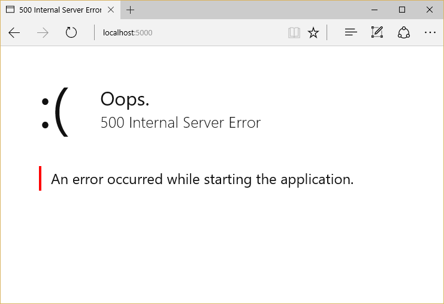
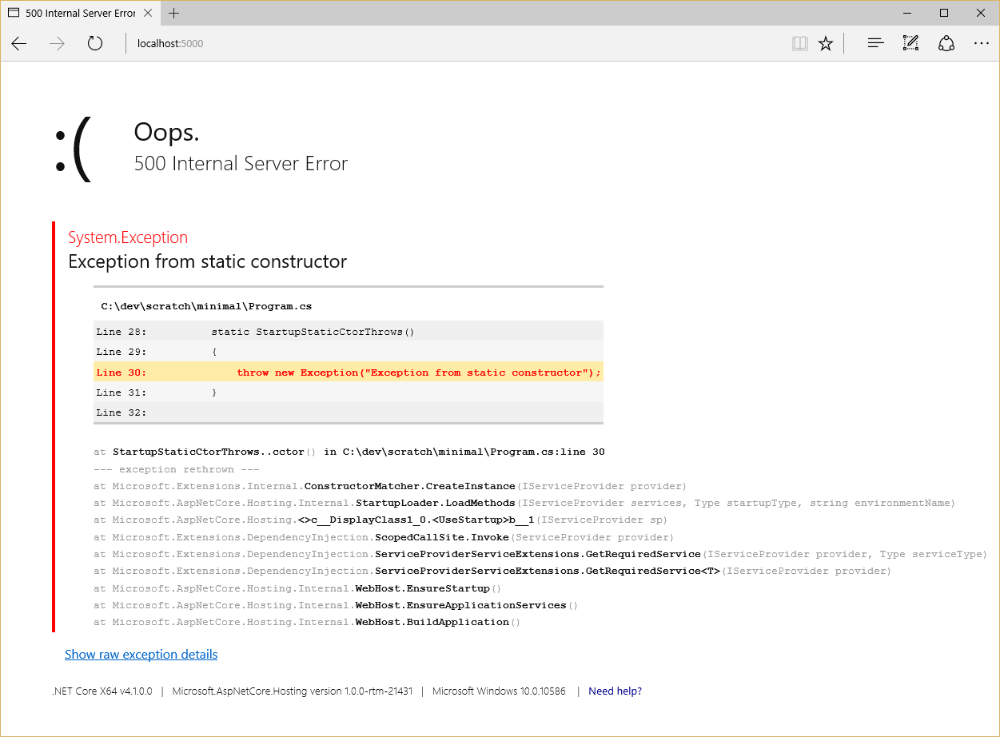

:version: 1.0.0

Hosting
=======

托管
=======

作者： `Steve Smith`_

翻译： `娄宇(Lyrics) <http://github.com/xbuilder>`_

校对： `何镇汐 <http://github.com/utilcore>`_、`许登洋(Seay) <https://github.com/SeayXu>`_

To run an ASP.NET Core app, you need to configure and launch a host using `WebHostBuilder <https://docs.asp.net/projects/api/en/latest/autoapi/Microsoft/AspNetCore/Hosting/WebHostBuilder/index.html>`_.

为了运行 ASP.NET Core 应用程序，你需要使用 `WebHostBuilder <https://docs.asp.net/projects/api/en/latest/autoapi/Microsoft/AspNetCore/Hosting/WebHostBuilder/index.html>`_ 配置和启动一个宿主.

.. contents:: Sections:
  :local:
  :depth: 1

What is a Host?
---------------

什么是宿主？
---------------

ASP.NET Core apps require a *host* in which to execute. A host must implement the :dn:iface:`~Microsoft.AspNetCore.Hosting.IWebHost` interface, which exposes collections of features and services, and a ``Start`` method. The host is typically created using an instance of a :dn:class:`~Microsoft.AspNetCore.Hosting.WebHostBuilder`, which builds and returns a  :dn:class:`~Microsoft.AspNetCore.Hosting.Internal.WebHost` instance. The ``WebHost`` references the server that will handle requests. Learn more about :doc:`servers <servers>`.

ASP.NET Core 应用程序需要在宿主中执行。宿主必须实现 :dn:iface:`~Microsoft.AspNetCore.Hosting.IWebHost` 接口，这个接口暴露了功能和服务的集合，以及 ``Start`` 方法。宿主通常使用 :dn:class:`~Microsoft.AspNetCore.Hosting.WebHostBuilder` 的实例进行创建，该实例构建并返回一个 :dn:class:`~Microsoft.AspNetCore.Hosting.Internal.WebHost` 实例。``WebHost`` 引用服务器来处理请求。学习更多关于 :doc:`服务器 <servers>`。

What is the difference between a host and a server?
^^^^^^^^^^^^^^^^^^^^^^^^^^^^^^^^^^^^^^^^^^^^^^^^^^^

宿主和服务器的不同之处是什么？
^^^^^^^^^^^^^^^^^^^^^^^^^^^^^^^^^^^^^^^^^^^^^^^^^^^

The host is responsible for application startup and lifetime management. The server is responsible for accepting HTTP requests. Part of the host's responsibility includes ensuring the application's services and the server are available and properly configured. You can think of the host as being a wrapper around the server. The host is configured to use a particular server; the server is unaware of its host.

宿主负责应用程序启动和生命周期管理。服务器负责接受 HTTP 请求。确保应用程序服务和服务器可用并正确配置也是宿主职责的一部分。你可以把宿主看作是服务器的包装。宿主被配置为使用一个特定的服务器；服务器并不知道它的宿主。

Setting up a Host
-----------------

设置宿主
-----------------

You create a host using an instance of ``WebHostBuilder``. This is typically done in your app's entry point: ``public static void Main``, (which in the project templates is located in a *Program.cs* file). A typical *Program.cs*, shown below, demonstrates how to use a ``WebHostBuilder`` to build a host. 

使用 ``WebHostBuilder`` 实例创建一个宿主。这通常是在你的应用程序入口点：``public static void Main``，（在项目模板的 *Program.cs* 文件中）。一个典型的 *Program.cs* 如下所示，演示如何使用 ``WebHostBuilder`` 来构建一个宿主。

.. literalinclude:: /../common/samples/WebApplication1/src/WebApplication1/Program.cs
  :emphasize-lines: 14-21
  :language: c#

The ``WebHostBuilder`` is responsible for creating the host that will bootstrap the server for the app. ``WebHostBuilder`` requires you provide a server that implements :dn:iface:`~Microsoft.AspNetCore.Hosting.Server.IServer` (``UseKestrel`` in the code above). ``UseKestrel`` specifies the Kestrel server will be used by the app.

``WebHostBuilder`` 负责创建宿主，宿主会启动应用程序服务器。``WebHostBuilder`` 需要你提供实现了 :dn:iface:`~Microsoft.AspNetCore.Hosting.Server.IServer` （上面代码中的 ``UseKestrel``） 接口的服务器。 ``UseKestrel`` 指定应用程序会使用 Kestrel 服务器。

The server's *content root* determines where it searches for content files, like MVC View files. The default content root is the folder from which the application is run. 

服务器的 *内容根 ( content root )* 决定它将在哪里搜索内容文件，比如 MVC 视图文件。默认的内容根是应用程序运行的文件夹。

.. note:: Specifying ``Directory.GetCurrentDirectory`` as the content root will use the web project's root folder as the app's content root when the app is started from this folder (for example, calling ``dotnet run`` from the web project folder). This is the default used in Visual Studio and ``dotnet new`` templates.

.. note:: 指定 ``Directory.GetCurrentDirectory`` 作为内容根时，当应用程序启动时会使用 Web 项目的根目录作为应用程序的内容根（比如，从 Web 项目文件夹调用 ``dotnet run``）。Visual Studio 和 ``dotnet new`` 的模板是默认使用 ``Directory.GetCurrentDirectory`` 作为内容根的。

If the app should work with IIS, the ``UseIISIntegration`` method should be called as part of building the host. Note that this does not configure a *server*, like ``UseKestrel`` does. To use IIS with ASP.NET Core, you must specify both ``UseKestrel`` and ``UseIISIntegration``. Kestrel is designed to be run behind a proxy and should not be deployed directly facing the Internet. ``UseIISIntegration`` specifies IIS as the reverse proxy server.

如果应用程序需要使用 IIS，需要在构建宿主时调用 ``UseIISIntegration`` 方法。注意这不是像 ``UseKestrel`` 那样配置一个 *服务器*。为了让 ASP.NET Core 使用 IIS，你必须同时指定 ``UseKestrel`` 和 ``UseIISIntegration``。Kestrel 被设计为在代理后运行而不应该直接部署到互联网。``UseIISIntegration`` 指定 IIS 为反向代理服务器。

.. note:: ``UseKestrel`` and ``UseIISIntegration`` are very different actions. IIS is only used as a reverse proxy. ``UseKestrel`` creates the web server and hosts the code. ``UseIISIntegration`` specifies IIS as the reverse proxy server. It also examines environment variables used by IIS/IISExpress and makes decisions like which dynamic port use, which headers to set, etc. However, it doesn't deal with or create an ``IServer``.

.. note:: ``UseKestrel`` 与 ``UseIISIntegration`` 行为区别非常大。IIS 只是作为一个反向代理。``UseKestrel`` 创建 Web 服务器并且对代码进行托管。``UseIISIntegration`` 指定 IIS 作为反向代理服务器。它同时也检查了 IIS/IISExpress 使用的环境变量并做出比如使用哪个动态端口，设置什么 Header 等决定。然而它不处理或者创建 ``IServer``。

A minimal implementation of configuring a host (and an ASP.NET Core app) would include just a server and configuration of the app's request pipeline:

配置一个宿主（以及一个 ASP.NET Core 应用程序）的最小实现仅仅包含一个服务器和应用程序请求管道的配置：

.. code-block:: c#

    var host = new WebHostBuilder()
        .UseKestrel()
        .Configure(app => 
        {
            app.Run(async (context) => await context.Response.WriteAsync("Hi!"));
        })
        .Build();

    host.Run();

.. note:: When setting up a host, you can provide ``Configure`` and ``ConfigureServices`` methods, instead of or in addition to specifying a ``Startup`` class (which must also define these methods - see :doc:`startup`). Multiple calls to ``ConfigureServices`` will append to one another; calls to ``Configure`` or ``UseStartup`` will replace previous settings.

.. note:: 当设置一个宿主，你可以提供 ``Configure`` 和 ``ConfigureServices`` 方法，或者定义一个 ``Startup`` 类（也必须定义这些方法，参见 :doc:`startup`）。多次调用 ``ConfigureServices`` 会进行追加配置；多次调用 ``Configure`` 或者 ``UseStartup`` 会替换之前的设置。

Configuring a Host
------------------

配置宿主
------------------

The ``WebHostBuilder`` provides methods for setting most of the available configuration values for the host, which can also be set directly using ``UseSetting`` and associated key. For example, to specify the application name:

``WebHostBuilder`` 提供了方法用于为宿主设置大多数可用的配置值，它也可以被设置为直接使用 ``UseSetting`` 以及相关的键。比如，指定应用程序名字：

.. code-block:: c#

    new WebHostBuilder()
        .UseSetting("applicationName", "MyApp")

Host Configuration Values
^^^^^^^^^^^^^^^^^^^^^^^^^

宿主配置值
^^^^^^^^^^^^^^^^^^^^^^^^^

Application Name ``string``
    Key: ``applicationName``. This configuration setting specifies the value that will be returned from ``IHostingEnvironment.ApplicationName``.

应用程序名 ``string``
    键: ``applicationName``。这个配置设定指定的值将从 ``IHostingEnvironment.ApplicationName`` 返回。

Capture Startup Errors ``bool``
    Key: ``captureStartupErrors``. Defaults to ``false``. When ``false``, errors during startup result in the host exiting. When ``true``, the host will capture any exceptions from the ``Startup`` class and attempt to start the server. It will display an error page (generic, or detailed, based on the Detailed Errors setting, below) for every request. Set using the ``CaptureStartupErrors`` method.

捕获启动异常 ``bool``
    键： ``captureStartupErrors``。默认是 ``false``。当值为 ``false`` 时，在启动过程中的错误会导致宿主退出。当值为 ``true`` 时，宿主会捕捉 ``Startup`` 类中的任何异常，并试图启动服务器。同时将为每个请求显示错误页面（一般的，或详细的，这取决于下面提到的详细错误设置）。 可使用 ``CaptureStartupErrors`` 方法设置。

.. code-block:: c#

    new WebHostBuilder()
        .CaptureStartupErrors(true)

Content Root ``string``
    Key: ``contentRoot``. Defaults to the folder where the application assembly resides (for Kestrel; IIS will use the web project root by default). This setting determines where ASP.NET Core will begin searching for content files, such as MVC Views. Also used as the base path for the :ref:`Web Root setting <web-root-setting>`. Set using the ``UseContentRoot`` method. Path must exist, or host will fail to start.

内容根 ``string``
    Key: ``contentRoot``。默认是应用程序集所在的文件夹（针对 Kestrel；IIS 默认使用 Web 项目根目录）。这个设置决定了 ASP.NET Core 从哪里开始搜索内容文件，比如 MVC 视图。内容根同时被作为 :ref:`Web 根设置 <web-root-setting>` 的基础路径使用。可使用 ``UseContentRoot`` 方法设置。路径必须是存在的，否则宿主会启动失败。

.. code-block:: c#

    new WebHostBuilder()
        .UseContentRoot("c:\\mywebsite")

Detailed Errors ``bool``
    Key: ``detailedErrors``. Defaults to ``false``. When ``true`` (or when Environment is set to "Development"), the app will display details of startup exceptions, instead of just a generic error page. Set using ``UseSetting``.

详细错误 ``bool``
    键： ``detailedErrors``。默认是 ``false``。当值是 ``true`` 时（或者当环境设置为“Development”时），应用程序会显示详细的启动错误信息，而不仅仅是一般的错误页。可使用 ``UseSetting`` 设置。

.. code-block:: c#

    new WebHostBuilder()
        .UseSetting("detailedErrors", "true")

When Detailed Errors is set to ``false`` and Capture Startup Errors is ``true``, a generic error page is displayed in response to every request to the server.

当详细错误设置为 ``false`` 并且捕捉启动异常是 ``true`` 时，服务器在每个请求的（错误）响应中显示一般错误页。

When Detailed Errors is set to ``true`` and Capture Startup Errors is ``true``, a detailed error page is displayed in response to every request to the server.

当详细错误设置为 ``true`` 并且捕捉启动异常是 ``true`` 时，服务器在每个请求的（错误）响应中显示详细错误页。

Environment ``string``
    Key: ``environment``. Defaults to "Production". May be set to any value. Framework-defined values include "Development", "Staging", and "Production". Values are not case sensitive. See :doc:`environments`. Set using the ``UseEnvironment`` method.

环境 ``string``
    键： ``environment``。默认是“Production”。可以设置为任何值。框架定义的值包含“Development”，“Staging”，以及“Production”。值不区分大小写。参见 :doc:`environments`。可使用 ``UseEnvironment`` 方法设置。

.. code-block:: c#

    new WebHostBuilder()
        .UseEnvironment("Development")

.. note:: By default, the environment is read from the ``ASPNETCORE_ENVIRONMENT`` environment variable. When using Visual Studio, environment variables may be set in the *launchSettings.json* file.

.. note:: 默认情况下，环境是从 ``ASPNETCORE_ENVIRONMENT`` 环境变量中读取。当使用 Visual Studio，环境变量可能在 *launchSettings.json* 文件中进行设置。

Server URLs ``string``
    Key: ``urls``. Set to a semicolon (;) separated list of URL prefixes to which the server should respond. For example, "http://localhost:123". The domain/host name can be replaced with "*" to indicate the server should listen to requests on any IP address or host using the specified port and protocol (for example, "http://*:5000" or "https://*:5001"). The protocol ("http://" or "https://") must be included with each URL. The prefixes are interpreted by the configured server; supported formats will vary between servers.

服务器 URLs ``string``
    键： ``urls``。设置分号（;）来分隔服务器应该响应的 URL 前缀。比如，"http://localhost:123"。域名可以用“*”替换，表明服务器需要针对任何使用指定端口及协议的 IP 地址或域名监听请求（比如，“http://*:5000”或者 “https://*:5001”）。协议（“http://”或者“https://”）必须包含在每个URL里。前缀由配置好的服务器解释；服务器之间支持的格式会有所不同。

.. code-block:: c#

    new WebHostBuilder()
        .UseUrls("http://*:5000;http://localhost:5001;https://hostname:5002")

Startup Assembly ``string``
    Key: ``startupAssembly``. Determines the assembly to search for the ``Startup`` class. Set using the ``UseStartup`` method. May instead reference specific type using ``WebHostBuilder.UseStartup<StartupType>``. If multiple ``UseStartup`` methods are called, the last one takes precedence.

启动程序集 ``string``
    键： ``startupAssembly``。决定搜索 ``Startup`` 类的程序集。可使用 ``UseStartup`` 方法设置。可以使用 ``WebHostBuilder.UseStartup<StartupType>`` 指定特定的引用类型。如果调用多次 ``UseStartup`` 方法，最后一个调用的生效。

.. code-block:: c#

    new WebHostBuilder()
        .UseStartup("StartupAssemblyName")

.. _web-root-setting:

Web Root ``string``
    Key: ``webroot``. If not specified the default is ``(Content Root Path)\wwwroot``, if it exists. If this path doesn't exist, then a no-op file provider is used. Set using ``UseWebRoot``.

Web 根 ``string``
    键： ``webroot``。如果不指定，默认是 ``(Content Root Path)\wwwroot``，如果该路径存在。如果这个路径不存在，则使用一个没有文件操作的提供器。可使用 ``UseWebRoot`` 方法设置。

.. code-block:: c#

    new WebHostBuilder()
        .UseWebRoot("public")

Use :doc:`configuration` to set configuration values to be used by the host. These values may be subsequently overridden. This is specified using ``UseConfiguration``.

使用 :doc:`configuration` 来设置宿主所需的配置值。这些值可能随后被重写。可使用 ``UseConfiguration`` 指定。

.. code-block:: c#
  :emphasize-lines: 3-6,9

  public static void Main(string[] args)
  {
    var config = new ConfigurationBuilder()
      .AddCommandLine(args)
      .AddJsonFile("hosting.json", optional: true)
      .Build();

    var host = new WebHostBuilder()
      .UseConfiguration(config)
      .UseKestrel()
      .Configure(app => 
      {
        app.Run(async (context) => await context.Response.WriteAsync("Hi!"));
      })
    .Build();

    host.Run();
  }

In the example above, command line arguments may be passed in to configure the host, or configuration settings may optionally be specified in a *hosting.json* file. To specify the host run on a particular URL, you could pass in the desired value from the command line:

在上面的例子中，可以通过命令行参数配置宿主，或者在 *hosting.json* 文件中进行配置。要指定在特定的网址上运行宿主，你可以从命令行传递所需要的值：

.. code-block:: none

  dotnet run --urls "http://*:5000"

The ``Run`` method starts the web app and blocks the calling thread until the host is shutdown.

``Run`` 方法启动 Web 应用程序并且阻止调用线程，直到宿主关闭。

.. code-block:: c#

    host.Run();

You can run the host in a non-blocking manner by calling its ``Start`` method:

你可以通过调用宿主的 ``Start`` 方法来以非阻塞方式运行宿主。

.. code-block:: c#

  using (host)
  {
    host.Start();
    Console.ReadLine();
  }

Pass a list of URLs to the ``Start`` method and it will listen on the URLs specified:

传递一个 URL 列表到 ``Start`` 方法，它将监听指定的 URL：

.. code-block:: c#

  var urls = new List<string>() { 
    "http://*:5000", 
    "http://localhost:5001"
    };
  var host = new WebHostBuilder()
    .UseKestrel()
    .UseStartup<Startup>()
    .Start(urls.ToArray());
  
  using (host)
  {
    Console.ReadLine();
  }

Ordering Importance
^^^^^^^^^^^^^^^^^^^

排序的重要性
^^^^^^^^^^^^^^^^^^^

``WebHostBuilder`` settings are first read from certain environment variables, if set. These environment variables must use the format ``ASPNETCORE_{configurationKey}``, so for example to set the URLs the server will listen on by default, you would set ``ASPNETCORE_URLS``.

``WebHostBuilder`` 首先读取某些环境变量中的设置（如果环境变量中设置了）。这些环境变量必须采用格式 ``ASPNETCORE_{configurationKey}``，因此假如要设置默认情况下服务器监听的 URL，你需要设置 ``ASPNETCORE_URLS``。

You can override any of these environment variable values by specifying configuration (using ``UseConfiguration``) or by setting the value explicitly (using ``UseUrls`` for instance). The host will use whichever option sets the value last. For this reason, ``UseIISIntegration`` must appear after ``UseUrls``, because it replaces the URL with one dynamically provided by IIS. If you want to programmatically set the default URL to one value, but allow it to be overridden with configuration, you could configure the host as follows:

你可以通过指定配置来重写任何环境变量（使用 ``UseConfiguration``）或者明确地设置值（例如使用 ``UseUrls``）。宿主会使用任何选项最后设置的值。因此，``UseIISIntegration`` 必须出现在 ``UseUrls`` 之后，因为它将替换 IIS 动态提供的 URL。如果你想以编程方式设置默认 URL 的值，但是允许他通过配置重写，你需要如下配置宿主：

.. code-block:: c#

    var config = new ConfigurationBuilder()
    .AddCommandLine(args)
    .Build();
      
    var host = new WebHostBuilder()
        .UseUrls("http://*:1000") // default URL
        .UseConfiguration(config) // override from command line
        .UseKestrel()
        .Build();

Additional resources
--------------------

额外的资源
--------------------

- :doc:`/publishing/iis`
- :doc:`/publishing/linuxproduction`
- Hosting ASP.NET Core as a Windows Service
- Hosting ASP.NET Core Embedded in Another Application
