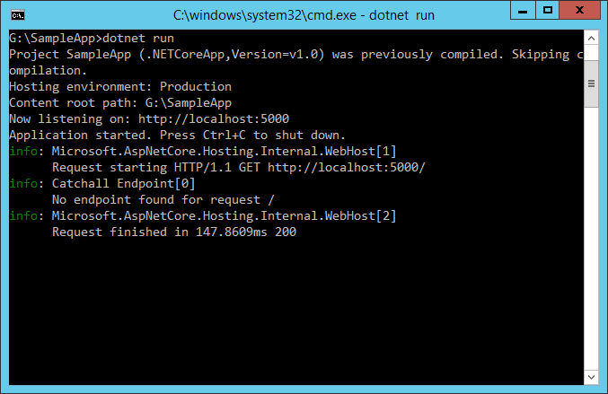

.. _fundamentals-logging:

Logging 
=======

日志
======

原文：`Logging <https://docs.asp.net/en/latest/fundamentals/logging.html>`_

作者： `Steve Smith`_

翻译： `刘怡(AlexLEWIS) <http://github.com/alexinea>`_

校对： `何镇汐 <http://github.com/utilcore>`_、`许登洋(Seay) <https://github.com/SeayXu>`_

ASP.NET Core has built-in support for logging, and allows developers to easily leverage their preferred logging framework's functionality as well. Implementing logging in your application requires a minimal amount of setup code. Once this is in place, logging can be added wherever it is desired.

ASP.NET Core 内建支持日志，也允许开发人员轻松切换为他们想用的其他日志框架。尽量用最少的代码来实现应用程序日志，只要做到这点，就能想在哪里加就能在那里加日志记录。

.. contents:: Sections:
  :local:
  :depth: 1

.. contents:: 章节:
  :local:
  :depth: 1

`View or download sample code <https://github.com/aspnet/Docs/tree/master/aspnet/fundamentals/logging/sample>`__

`访问或下载样例代码 <https://github.com/aspnet/Docs/tree/master/aspnet/fundamentals/logging/sample>`__

Implementing Logging in your Application
----------------------------------------

在应用程序中实现日志
-----------------------------------------

Adding logging to a component in your application is done by requesting either an ``ILoggerFactory`` or an ``ILogger<T>`` via :doc:`dependency-injection`. If an ``ILoggerFactory`` is requested, a logger must be created using its ``CreateLogger`` method. The following example shows how to do this:

通过 :doc:`dependency-injection` 请求 ``ILoggerFactory`` 或 ``ILogger<T>`` 可为应用程序增加日志功能。如果请求了 ``ILoggerFactory``，日志记录器就必须使用它的 ``CreateLogger`` 方法，在下例中将展示如何做到这一点：

.. literalinclude:: logging/sample/src/TodoApi/Startup.cs 
  :language: c#
  :lines: 53-54
  :dedent: 16

When a logger is created, a category name must be provided. The category name specifies the source of the logging events. By convention this string is hierarchical, with categories separated by dot (``.``) characters. Some logging providers have filtering support that leverages this convention, making it easier to locate logging output of interest. In this article's sample application, logging is configured to use the built-in `ConsoleLogger <https://docs.asp.net/projects/api/en/latest/autoapi/Microsoft/Extensions/Logging/Console/ConsoleLogger/index.html>`_ (see `Configuring Logging in your Application`_ below). To see the console logger in action, run the sample application using the ``dotnet run`` command, and make a request to configured URL (``localhost:5000``). You should see output similar to the following:

当日志记录器创建时，需要提供类别名称。类别名称指定了日志记录事件的根源。根据约定，这一字符串通过点符号（``.``）来分割以体现其层次性。一些日志记录提供程序还提供了过滤功能，这使得输出的日志更易被检索。在本文的示例应用程序中，日志被配置为使用内建的 `ConsoleLogger <https://docs.asp.net/projects/api/en/latest/autoapi/Microsoft/Extensions/Logging/Console/ConsoleLogger/index.html>`_ （查阅下文的 `在应用程序中配置日志`_ 一节）。使用 ``dotnet run`` 命令运行应用程序，并请求已配置的 URL（``localhost:5000``），查看运行中的控制台记录器。你将看到如下输出：

You may see more than one log statement per web request you make in your browser, since most browsers will make multiple requests (i.e. for the favicon file) when attempting to load a page. Note that the console logger displayed the log level (``info`` in the image above) followed by the category (``[Catchall Endpoint]``), and then the message that was logged.

你可能会发现每次通过浏览器发出一个 Web 请求都会产生超过一条日志记录，这是因为大多数浏览器尝试加载一个页面的时候会发出多个请求（既请求网站的图标文件）。注意一点，在控制台记录器显示的日志级别（比如上图中的 ``info``），然后是类别（``[Catchall Endpoint]``），最后是日志消息。

The call to the log method can utilize a format string with named placeholders (like `{path}`). These placeholders are populated in the order in which they appear by the args values passed into the method call. Some logging providers will store these names along with their mapped values in a dictionary that can later be queried. In the example below, the request path is passed in as a named placeholder:

日志方法被调用时，可以利用命名占位符（如 `{path}` ）来实现格式化。按照方法调用时传入参数的顺序一一填充出现在其中的占位符。一些日志提供程序会用一个字典来保存名称和映射值以供以后使用。在下例中，请求路径通过命名占位符传入：

.. literalinclude:: logging/sample/src/TodoApi/Startup.cs
  :language: c#
  :lines: 54
  :dedent: 16

In your real world applications, you will want to add logging based on application-level, not framework-level, events. For instance, if you have created a Web API application for managing To-Do Items (see :doc:`/tutorials/first-web-api`), you might add logging around the various operations that can be performed on these items.

在实际的应用程序中，你会希望基于应用程序级别来添加日志，而不是基于框架级别或事件。例如，你创建了一个 Web API 应用程序来管理 To-Do 条目（参见 :doc:`/tutorials/first-web-api` ），你可能会为这些条目的各种操作添加日志记录。

The logic for the API is contained within the `TodoController`, which uses :doc:`dependency-injection` to request the services it requires via its constructor. Ideally, classes should follow this example and use their constructor to `define their dependencies explicitly <http://deviq.com/explicit-dependencies-principle/>`_ as parameters. Rather than requesting an `ILoggerFactory` and creating an instance of `ILogger` explicitly, `TodoController` demonstrates another way to work with loggers in your application - you can request an `ILogger<T>` (where `T` is the class requesting the logger).

对于 API 的逻辑部分被包含在 `TodoController` 中，在构造函数中通过依赖注入（ :doc:`dependency-injection` ）的方式来请求需要的服务。理想情况下，类应当像这个例子一样使用构造函数来 `显式定义它们的依赖项 <http://deviq.com/explicit-dependencies-principle/>`_ 并使其作为参数传入，而不是请求 `ILoggerFactory` 并显式创建 `ILogger` 实例。 `TodoController` 展示了另一种应用程序使用日志记录器的方法——通过请求 `ILogger<T>` （其中 `T` 是所请求的记录器的类）。

.. literalinclude:: logging/sample/src/TodoApi/Controllers/TodoController.cs
  :language: c#
  :lines: 11-30
  :dedent: 4
  :emphasize-lines: 5,8,11,17

Within each controller action, logging is done through the use of the local field, `_logger`, as shown on line 17, above. This technique is not limited to controllers, but can be utilized by any of your application services that utilize :doc:`dependency-injection`.

在每个控制器 Action 内，通过本地字段 `_logger` （上例第 17 行所示）来记录日志。这种技术并不仅限于控制器内，通过 :doc:`dependency-injection` 它能被用于应用程序内所有的服务中。

Working with ILogger<T>
^^^^^^^^^^^^^^^^^^^^^^^

使用 ILogger<T>
^^^^^^^^^^^^^^^^^^^^^^^

As we have just seen, your application can request an instance of ``ILogger<T>`` as a dependency in a class's constructor, where ``T`` is the type performing logging. The ``TodoController`` shows an example of this approach. When this technique is used, the logger will automatically use the type's name as its category name. By requesting an instance of ``ILogger<T>``, your class doesn't need to create an instance of a logger via ``ILoggerFactory``. You can use this approach anywhere you don't need the additional functionality offered by ``ILoggerFactory``.

如您所见，应用程序可通过构造函数请求到 ``ILogger<T>`` 实例，其中 ``T`` 是执行日志记录的类型。``TodoController`` 就是用了这种方法。当使用这种技术时，日志记录器会自动使用该类型的名称作为其日志类别的名称。通过请求 ``ILogger<T>`` 实例，类自己不必通过 ``ILoggerFactory`` 来实例化日志记录器。这种方法可以用在所有的地方——而不必使用 ``ILoggerFactory`` 。

Logging Verbosity Levels
^^^^^^^^^^^^^^^^^^^^^^^^

日志记录级别
^^^^^^^^^^^^^^^^^^^^^^^^

When adding logging statements to your application, you must specify a `LogLevel <https://docs.asp.net/projects/api/en/latest/autoapi/Microsoft/Extensions/Logging/LogLevel/index.html>`_. The LogLevel allows you to control the verbosity of the logging output from your application, as well as the ability to pipe different kinds of log messages to different loggers. For example, you may wish to log debug messages to a local file, but log errors to the machine's event log or a database.

当应用程序添加一条日志记录时，必须指定 `日志级别 <https://docs.asp.net/projects/api/en/latest/autoapi/Microsoft/Extensions/Logging/LogLevel/index.html>`_ 。日志级别允许你控制应用程序输出日志的详细程度，以及把不同类型的日志传送给不同的日志记录器。比方说，你可能会希望调试消息在一个本地文件，而把错误消息记录到计算机的事件日志或数据库中。

ASP.NET Core defines six levels of logging verbosity, ordered by increasing importance or severity:

ASP.NET Core 详尽地定义了六个日志级别，通过增加重要性或严重程度排序：

Trace
  Used for the most detailed log messages, typically only valuable to a developer debugging an issue. These messages may contain sensitive application data and so should not be enabled in a production environment. *Disabled by default.* Example: ``Credentials: {"User":"someuser", "Password":"P@ssword"}``

Trace
  用于记录最详细的日志消息，通常仅用于开发阶段调试问题。这些消息可能包含敏感的应用程序数据，因此不应该用于生产环境。*默认应禁用*。举例：``Credentials: {"User":"someuser", "Password":"P@ssword"}``

Debug
  These messages have short-term usefulness during development. They contain information that may be useful for debugging, but have no long-term value. This is the default most verbose level of logging. Example: ``Entering method Configure with flag set to true``

Debug
  这种消息在开发阶段短期内比较有用。它们包含一些可能会对调试有所助益、但没有长期价值的信息。默认情况下这是最详细的日志。举例： ``Entering method Configure with flag set to true``

Information
  These messages are used to track the general flow of the application. These logs should have some long term value, as opposed to ``Verbose`` level messages, which do not. Example: ``Request received for path /foo``

Information
  这种消息被用于跟踪应用程序的一般流程。与 ``Verbose`` 级别的消息相反，这些日志应该有一定的长期价值。举例： ``Request received for path /foo``

Warning
  The Warning level should be used for abnormal or unexpected events in the application flow. These may include errors or other conditions that do not cause the application to stop, but which may need to be investigated in the future. Handled exceptions are a common place to use the Warning log level. Examples: ``Login failed for IP 127.0.0.1`` or ``FileNotFoundException for file foo.txt``

Warning
  当应用程序出现错误或其它不会导致程序停止的流程异常或意外事件时使用警告级别，以供日后调查。在一个通用的地方处理警告级别的异常。举例： ``Login failed for IP 127.0.0.1`` 或 ``FileNotFoundException for file foo.txt``

Error
  An error should be logged when the current flow of the application must stop due to some failure, such as an exception that cannot be handled or recovered from. These messages should indicate a failure in the current activity or operation (such as the current HTTP request), not an application-wide failure. Example: ``Cannot insert record due to duplicate key violation``

Error
  当应用程序由于某些故障停止工作则需要记录错误日志。这些消息应该指明当前活动或操作（比如当前的 HTTP 请求），而不是应用程序范围的故障。举例： ``Cannot insert record due to duplicate key violation``

Critical
  A critical log level should be reserved for unrecoverable application or system crashes, or catastrophic failure that requires immediate attention. Examples: data loss scenarios, out of disk space

Critical
  当应用程序或系统崩溃、遇到灾难性故障，需要立即被关注时，应当记录关键级别的日志。举例：数据丢失、磁盘空间不够等。

The ``Logging`` package provides `helper extension methods <https://docs.asp.net/projects/api/en/latest/autoapi/Microsoft/Extensions/Logging/LoggerExtensions/index.html>`_ for each  ``LogLevel`` value, allowing you to call, for example, ``LogInformation``, rather than the more verbose ``Log(LogLevel.Information, ...)`` method. Each of the ``LogLevel``-specific extension methods has several overloads, allowing you to pass in some or all of the following parameters:

``Logging`` 包为每个 ``LogLevel`` 值提供 `helper 扩展方法 <https://docs.asp.net/projects/api/en/latest/autoapi/Microsoft/Extensions/Logging/LoggerExtensions/index.html>`_ ，允许你调用，例如， ``LogInformation`` ，而不是更多详尽的 ``Log(LogLevel.Information, ...)`` 方法。每个 ``LogLevel`` - 特定扩展方法有多个重载，允许你传递下面的一些或者是所有的参数：

string data
  The message to log.

string data
  记录消息。

EventId eventId
  A numeric id to associate with the log, which can be used to associate a series of logged events with one another. Event IDs should be static and specific to a particular kind of event that is being logged. For instance, you might associate adding an item to a shopping cart as event id 1000 and completing a purchase as event id 1001. This allows intelligent filtering and processing of log statements.

EventId eventId
  使用数字类型的 id 来标记日志，这样可以将一系列的事件彼此相互关联。被记录的事件 ID 应该是静态的、特定于指定类型时间的。比如，你可能会把添加商品到购物车的事件 ID 标记为 1000，然后把结单的事件 ID 标记为 1001，以便能智能过滤并处理这些日志记录。

string format
  A format string for the log message.

string format
  日志消息的格式字符串。

object[] args
  An array of objects to format.

object[] args
  用于格式化的一组对象。

Exception error
  An exception instance to log.

Exception error
  用于记录的异常实例。

.. note:: The ``EventId`` type can be implicitly casted to ``int``, so you can just pass an ``int`` to this argument.

.. note:: ``EventId`` 类型可以隐式转换为 ``int`` ，所以，你可以传递一个 ``int`` 参数。

.. note:: Some loggers, such as the built-in ``ConsoleLogger`` used in this article, will ignore the ``eventId`` parameter. If you need to display it, you can include it in the message string. This is done in the following sample so you can easily see the eventId associated with each message, but in practice you would not typically include it in the log message.

.. note:: 像本文中所使用的 ``ConsoleLogger`` 这类内建的日志记录器会忽略 ``eventId`` 参数。如果你需要显示它，你可以把它包含在消息文本内。在下例中你可以轻松发现 eventId 被关联到每一条消息，但实际上你通常不会将它包含在日志信息中。

In the ``TodoController`` example, event id constants are defined for each event, and log statements are configured at the appropriate verbosity level based on the success of the operation. In this case, successful operations log as ``Information`` and not found results are logged as ``Warning`` (error handling is not shown).

在 ``TodoController`` 这个例子中，事件 id 常数为每一个事件定义，根据操作是否成功配置日志语句的详细级别。在这种情况下，成功操作记录为 ``Information``，数据未发现则记录为 ``Warning`` （不显示错误处理）。

.. literalinclude:: logging/sample/src/TodoApi/Controllers/TodoController.cs
  :language: c#
  :lines: 24-43
  :dedent: 8
  :emphasize-lines: 4,12,16

.. note:: It is recommended that you perform application logging at the level of your application and its APIs, not at the level of the framework. The framework already has logging built in which can be enabled simply by setting the appropriate logging verbosity level.

.. note:: 建议在应用程序及其 API 上执行应用程序日志记录，而不是在框架级别上记录。框架已经有了一个内建的能够简单通过设置启用相应日志级别的日志记录器了。

To see more detailed logging at the framework level, you can adjust the `LogLevel` specified to your logging provider to something more verbose (like `Debug` or `Trace`). For example, if you modify the `AddConsole` call in the `Configure` method to use `LogLevel.Trace` and run the application, the result shows much more framework-level detail about each request:

要查看框架级别的详细日志，可以为日志提供程序调整为指定的日志级别，这样就能得到更为详细的日志记录（如 `Debug` 或 `Trace`）。比如，如果你在 `Configure` 方法中修改 `AddConsole` 调用的日志级别，改为使用 `LogLevel.Trace` 并运行应用程序的话，框架级别的每个请求详细日志就会像下图这般显示：

The console logger prefixes debug output with "dbug: "; there is no trace level debugging enabled by the framework by default. Each log level has a corresponding four character prefix that is used, so that log messages are consistently aligned.

控制台记录器输出时使用前缀「dbug: 」，默认的框架没有追踪的记录器，每一个日志级别都有使用对应的四个字符的前缀，使得日志信息始终一致。

=============  =============
Log Level	   Prefix
=============  =============
Critical       crit
Error          fail
Warning        warn
Information    info
Debug          dbug
Trace          trce
=============  =============

Scopes
^^^^^^

作用域
^^^^^

In the course of logging information within your application, you can group a set of logical operations within a *scope*. A scope is an ``IDisposable`` type returned by calling the ``ILogger.BeginScope<TState>`` method, which lasts from the moment it is created until it is disposed. The built-in ``TraceSource`` logger returns a scope instance that is responsible for starting and stopping tracing operations. Any logging state, such as a transaction id, is attached to the scope when it is created.

在应用程序记录日志信息的过程中，你可以将一组逻辑操作用 *作用域* 打包为一组。作用域也是一种 ``IDisposable`` 类型，通过调用 ``ILogger.BeginScope<TState>`` 方法来返回，它自创建起持续到释放为止。内建的 ``TraceSource`` 日志记录器会返回一个作用域实例用来响应启动与停止跟踪操作。任何诸如事务 ID 这样的日志状态从刚创建便关联到作用域了。

Scopes are not required, and should be used sparingly, if at all. They're best used for operations that have a distinct beginning and end, such as a transaction involving multiple resources.

作用域不是必须的，而且需要谨慎使用。它们适合用于具有比较明显的开始和结束的操作，比如在一个事务中调用多个资源。

Configuring Logging in your Application
----------------------------------------

在应用程序中配置日志
-----------------------------------------

To configure logging in your ASP.NET application, you should resolve ``ILoggerFactory`` in the ``Configure`` method in your ``Startup`` class. ASP.NET will automatically provide an instance of ``ILoggerFactory`` using :doc:`dependency-injection` when you add a parameter of this type to the ``Configure`` method. Once you've added ``ILoggerFactory`` as a parameter, you configure loggers within the ``Configure`` method by calling methods (or extension methods) on the logger factory. We have already seen an example of this configuration at the beginning of this article, when we added console logging by simply calling ``loggerFactory.AddConsole``. In addition to adding loggers, you can also control the verbosity of the application's logging by setting the ``MinimumLevel`` property on the logger factory. The default verbosity is ``Verbose``.

为在 ASP.NET 应用程序中配置日志，你须在 ``Startup`` 类 ``Configure`` 方法中解析 ``ILoggerFactory``。ASP.NET 会基于 :doc:`dependency-injection` 以参数的形式自动为 ``Configure`` 方法提供 ``ILoggerFactory`` 实例。当你把 ``ILoggerFactory`` 添作参数时，在 ``Configure`` 中，通过在日志记录器工厂上调用方法（或扩展方法）来配置日志记录器。我们已在本文开头处看到，通过简单地调用 ``loggerFactory.AddConsole`` 来加入控制台日志记录。除了添加日志记录器，你还可以通过设置日志记录器工厂的 ``MinimumLevel`` 属性来控制应用程序日志的详细程度。默认的详细程度是 ``Verbose`` 。

.. literalinclude:: logging/sample/src/TodoApi/Startup.cs
  :language: c#
  :lines: 23-25
  :dedent: 4
  :emphasize-lines: 25
  
Once you've added ``ILoggerFactory`` as a parameter, you configure loggers within the ``Configure`` method by calling methods (or extension methods) on the logger factory. We have already seen an example of this configuration at the beginning of this article, when we added console logging by calling ``loggerFactory.AddConsole``.  

.. note:: You can optionally configure logging when setting up :doc:`hosting`, rather than in ``Startup``.

.. note:: 你可以选择配置日志记录，当设置 :doc:`hosting` 时，而不是在启动时。

Each logger provides its own set of extension methods to ``ILoggerFactory``. The console, debug, and event log loggers allow you to specify the minimum logging level at which those loggers should write log messages. The console and debug loggers provide extension methods accepting a function to filter log messages according to their logging level and/or category (for example, ``logLevel => logLevel >= LogLevel.Warning`` or ``(category, loglevel) => category.Contains("MyController") && loglevel >= LogLevel.Trace``). The event log logger provides a similar overload that takes an ``EventLogSettings`` instance as argument, which may contain a filtering function in its ``Filter`` property. The TraceSource logger does not provide any of those overloads, since its logging level and other parameters are based on the  ``SourceSwitch`` and ``TraceListener`` it uses.

每个记录器为 `ILoggerFactory`` 提供了自己的一套扩展的方法。控制台，调试和事件日志记录器允许你指定要那些应该写的日志消息的最低日志记录级别。控制台和调试记录器根据自己的日志记录级别和/或类别提供的扩展方法接受一个函数来过滤日志消息（例如： ``logLevel => logLevel >= LogLevel.Warning`` 或者 ``(category, loglevel) => category.Contains("MyController") && loglevel >= LogLevel.Trace`` ）。事件日志记录提供了类似重载接受一个 ``EventLogSettings`` 实例作为参数，其 ``Filter`` 属性可包含过滤方法。该 TraceSource 记录器不提供任何的重载，因为它的记录级别和其他参数基于他使用的 ``SourceSwitch`` 和 ``TraceListener`` 。

A LoggerFactory instance can optionally be configured with custom ``FilterLoggerSettings``. The example below configures custom log levels for different scopes, limiting system and Microsoft built-in logging to warnings while allowing the app to log at debug level by default. The ``WithFilter`` method returns a new ``ILoggerFactory`` that will filter the log messages passed to all logger providers registered with it. It does not affect any other ``ILoggerFactory`` instances, including the original ``ILoggerFactory`` instance.

一个 LoggerFactory 实例可以选择性地使用自定义 ``FilterLoggerSettings`` 配置。下面的示例配置自定义日志级别不同的范围，限制系统和微软内置的日志记录警告，同时允许应用程序在默认情况下记录调试级别的。 `WithFilter`` 方法返回一个新的 ``ILoggerFactory`` ，将过滤传递的所有注册的记录器日志信息。它不会影响其它的任何 ``ILoggerFactory`` 实例，包括原始的 ``ILoggerFactory`` 实例。

.. literalinclude:: logging/sample/src/TodoApi/Startup.cs
  :language: c#
  :lines: 27-34
  :dedent: 12

Configuring TraceSource Logging
^^^^^^^^^^^^^^^^^^^^^^^^^^^^^^^

配置 TraceSource 日志
^^^^^^^^^^^^^^^^^^^^^

When running on the full .NET Framework you can configuring logging to use the existing `System.Diagnostics.TraceSource <https://msdn.microsoft.com/en-us/library/system.diagnostics.tracesource(v=vs.110).aspx>`_ libraries and providers, including easy access to the Windows event log. ``TraceSource`` allows you to route messages to a variety of listeners and is already in use by many organizations.

当运行在完整的 .NET 框架之上时，你可以使用现有的 `System.Diagnostics.TraceSource <https://msdn.microsoft.com/en-us/library/system.diagnostics.tracesource(v=vs.110).aspx>`_ 类库和提供程序来配置日志，包括轻松访问到 Windows 事件日志。``TraceSource`` 允许你将消息路由到不同的监听器上，而这已经被很多组织所使用。

First, be sure to add the ``Microsoft.Extensions.Logging.TraceSource`` package to your project (in *project.json*), along with any specific trace source packages you'll be using (in this case, ``TextWriterTraceListener``):

首先，确保项目已添加了 ``Microsoft.Extensions.Logging.TraceSource`` 包（在 *project.json* 中），与将使用的任何指定的追踪源代码包（这个例子中：  ``TextWriterTraceListener`` ）：

.. literalinclude:: logging/sample/src/TodoApi/project.json
  :language: javascript
  :lines: 8-18
  :dedent: 2
  :emphasize-lines: 7,10

The following example demonstrates how to configure a ``TraceSourceLogger`` instance for an application, logging only ``Warning`` or higher priority messages. Each call to ``AddTraceSource`` takes a ``TraceListener``. The call configures a ``TextWriterTraceListener`` to write to the console window. This log output will be in addition to the console logger that was already added to this sample, but its behavior is slightly different.

在下例中演示了如何在一个应用程序中配置一个的 ``TraceSourceLogger`` 实例，日志都只记录 ``Warning`` 或者是更高级别的消息。每次调用 ``AddTraceSource`` 都需要一个 ``TraceListener`` 。调用配置了一个 ``TextWriterTraceListener``，第二次配置了一个 ``EventLogTraceListener``，两个监听器都用于写 ``Application`` 事件日志。这两个监听器在 .NET Core 中都不可用，因此它们的配置需要被包裹在条件编译语句中。

.. literalinclude:: logging/sample/src/TodoApi/Startup.cs
  :language: c#
  :lines: 36-40
  :dedent: 12

The ``sourceSwitch`` is configured to use ``SourceLevels.Warning``, so only ``Warning`` (or higher) log messages are picked up by the ``TraceListener`` instance.

``sourceSwitch`` 是使用 ``SourceLevels.Warning`` 配置的，因此，仅 ``Warning`` （或更高） 日志信息被 ``TraceListener`` 实例提取。

The API action below logs a warning when the specified ``id`` is not found:

当指定的 id 没有找到时，下面 API 行为会记录一个警告信息：

.. literalinclude:: logging/sample/src/TodoApi/Controllers/TodoController.cs
  :language: c#

To test out this code, you can trigger logging a warning by running the app from the console and navigating to ``http://localhost:5000/api/Todo/0``. You should see output similar to the following:

为了测试这个代码，你通过运行控制台应用程序并导航到 ``http://localhost:5000/api/Todo/0`` 可以触发记录警告。你应该看到类似以下的输出：

The yellow line with the "warn: " prefix, along with the following line, is output by the ``ConsoleLogger``. The next line, beginning with "TodoApi.Controllers.TodoController", is output from the TraceSource logger. There are many other TraceSource listeners available, and the ``TextWriterTraceListener`` can be configured to use any ``TextWriter`` instance, making this a very flexible option for logging.

以"warn: "为前缀的黄线，随着后面的行，是由 ``ConsoleLogger`` 输出。以 “TodoApi.Controllers.TodoController” 开始的下一行，是由 TraceSource logger 输出。还有其他可用的 TraceSource，并且 ``TextWriterTraceListener`` 可以通过 ``TextWriter`` 实例配置，这对于记录是一个非常灵活的选择。

Configuring Other Providers
^^^^^^^^^^^^^^^^^^^^^^^^^^^

配置其它提供程序
^^^^^^^^^^^^^^^^^^^^^^^^^^^

In addition to the built-in loggers, you can configure logging to use other providers. Add the appropriate package to your *project.json* file, and then configure it just like any other provider. Typically, these packages include extension methods on ``ILoggerFactory`` to make it easy to add them.

除内置日志记录器外，你可以配置其它开放商提供的日志。将相应的包添加到 *project.json* 文件中，并以上文同样的方法配置它们。通常情况下，这些包应该会包含 ``ILoggerFactory`` 的扩展方法以便能方便地添加它们。

 * `elmah.io <https://github.com/elmahio/Elmah.Io.Framework.Logging>`_ - provider for the elmah.io service
 * `Loggr <https://github.com/imobile3/Loggr.Extensions.Logging>`_ - provider for the Loggr service
 * `NLog <https://github.com/NLog/NLog.Extensions.Logging>`_ - provider for the NLog library
 * `Serilog <https://github.com/serilog/serilog-framework-logging>`_ - provider for the Serilog library

 * `elmah.io <https://github.com/elmahio/Elmah.Io.Framework.Logging>`_ - 提供 elmah.io 服务
 * `Loggr <https://github.com/imobile3/Loggr.Extensions.Logging>`_ - 提供 Loggr 服务
 * `NLog <https://github.com/NLog/NLog.Extensions.Logging>`_ - 提供 NLog 库
 * `Serilog <https://github.com/serilog/serilog-framework-logging>`_ - 提供 Serilog 库

You can create your own custom providers as well, to support other logging frameworks or your own internal logging requirements.

你也可以创建自己定制的提供程序来支持其他的日志框架或自己内部的日志需求。

Logging Recommendations
-----------------------

日志记录建议
-----------------------

The following are some recommendations you may find helpful when implementing logging in your ASP.NET Core applications.

1. Log using the correct ``LogLevel``. This will allow you to consume and route logging output appropriately based on the importance of the messages.

2. Log information that will enable errors to be identified quickly. Avoid logging irrelevant or redundant information.

3. Keep log messages concise without sacrificing important information.

4. Although loggers will not log if disabled, consider adding code guards around logging methods to prevent extra method calls and log message setup overhead, especially within loops and performance critical methods.

5. Name your loggers with a distinct prefix so they can easily be filtered or disabled. Remember the ``Create<T>`` extension will create loggers named with the full name of the class.

6. Use Scopes sparingly, and only for actions with a bounded start and end. For example, the framework provides a scope around MVC actions. Avoid nesting many scopes within one another.

7. Application logging code should be related to the business concerns of the application. Increase the logging verbosity to reveal additional framework-related concerns, rather than implementing yourself.

当你在 ASP.NET Core 应用程序中实现日志时可以参考以下有用建议：

1. 使用正确的 ``LogLevel`` ，这将使不同重要级别的日志消息使用何路由到相关的输出目标。

2. 记录的日志信息要能立即识别问题所在，剔除不必要的冗余信息。

3. 保证日志内容简单明了，直指重要信息。

4. 尽管日志记录器被禁用后将不记录日志，但也请在日志方法的周围增加控制代码，以防止多余的方法调用和日志设置的开销，特别是在循环和对性能要求比较高的方法中。

5. 使用独有的前缀命名日志记录器以确保能快速过滤或禁用。谨记 ``Create<T>`` 扩展方法将创建的日志记录器使用该类的完全限定名作为日志记录器的类别名。

6. 使用作用域时保持谨慎，明晰动作的开始和结束的界限（比如框架提供的 MVC Action 的范围），避免相互嵌套。

7. 应用程序日志代码应关注应用程序 的业务。提高日志的详细程度级别来记录框架相关的问题，而不是日志记录器自己。

Summary
-------

总结
--------

ASP.NET Core provides built-in support for logging, which can easily be configured within the ``Startup`` class and used throughout the application. Logging verbosity can be configured globally and per logging provider to ensure actionable information is logged appropriately. Built-in providers for console and trace source logging are included in the framework; other logging frameworks can easily be configured as well.

ASP.NET Core 提供了内建支持的日志，能方便地通过 ``Startup`` 类来配置，并在应用程序中使用。日志记录的详细程序可以在全局配置，也可以为每个日志提供程序单独配置，以确保可操作信息能恰当地被记录下来。框架内建了控制台和跟踪源的日志提供程序；另外其他的日志框架也可以被方便配置。
