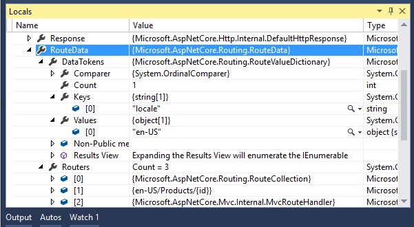

Routing
=======
路由
=======

原文：`Routing <https://docs.asp.net/en/latest/fundamentals/routing.html>`_

作者：`Ryan Nowak <https://github.com/rynowak>`__、`Steve Smith`_、和 `Rick Anderson`_

翻译：`张仁建(Stoneqiu) <https://github.com/stoneniqiu>`_

校对：`许登洋(Seay) <https://github.com/SeayXu>`_

Routing is used to map requests to route handlers. Routes are configured when the application starts up, and can extract values from the URL that will be used for request processing. Routing functionality is also responsible for generating links using the defined routes in ASP.NET apps.

路由用于将请求映射到路由处理程序。应用程序一启动就配置了路由，并且可以从 URL 中提取值用于处理请求。它还负责使用 ASP.NET 应用程序中定义的路由来生成链接。

This document covers the low level ASP.NET Core routing. For ASP.NET Core MVC routing, see :doc:`/mvc/controllers/routing`

这份文档涵盖了初级的 ASP.NET Core 路由. 对于 ASP.NET Core MVC 路由, 请查看 :doc:`/mvc/controllers/routing`

.. contents:: Sections
  :local:
  :depth: 1

`View or download sample code <https://github.com/aspnet/Docs/tree/master/aspnet/fundamentals/routing/sample>`__

`查看或下载示例代码 <https://github.com/aspnet/Docs/tree/master/aspnet/fundamentals/routing/sample>`__

Routing basics
----------------
路由基础
----------------

Routing uses *routes* (implementations of :dn:iface:`~Microsoft.AspNetCore.Routing.IRouter`) to:

路由使用 *routes* 类 ( :dn:iface:`~Microsoft.AspNetCore.Routing.IRouter` 的实现) 做到:

- map incoming requests to *route handlers*
- 映射传入的请求到 *路由处理程序*
- generate URLs used in responses
- 生成响应中使用的 URLs

Generally an app has a single collection of routes. The route collection is processed in order. Requests look for a match in the route collection by :ref:`URL-Matching-ref`. Responses use routing to generate URLs.

一般来说，一个应用会有单个路由集合。这个集合会按顺序处理。请求会在这个路由集合里按照 :ref:`URL-Matching-ref` 来查找匹配。响应使用路由生成 URLs。

Routing is connected to the :doc:`middleware <middleware>` pipeline by the :dn:class:`~Microsoft.AspNetCore.Builder.RouterMiddleware` class. :doc:`ASP.NET MVC </mvc/overview>` adds routing to the middleware pipeline as part of its configuration. To learn about using routing as a standalone component, see using-routing-middleware_.

 路由通过 :dn:class:`~Microsoft.AspNetCore.Builder.RouterMiddleware` 类连接到 :doc:`middleware <middleware>` 管道。  :doc:`ASP.NET MVC </mvc/overview>` 将路由作为其配置的一部分增加到中间件管道。 要了解如何将路由作为独立组件使用，请看 using-routing-middleware_ 。

.. _URL-Matching-ref:

URL matching
^^^^^^^^^^^^
URL 匹配
^^^^^^^^^^^^

URL matching is the process by which routing dispatches an incoming request to a *handler*. This process is generally based on data in the URL path, but can be extended to consider any data in the request. The ability to dispatch requests to separate handlers is key to scaling the size and complexity of an application.

路由匹配指的是路由调度请求到一个处理程序的过程。这个过程通常基于 URL 路径中的数据，但可以扩展到请求中的任何数据。将请求调度到单独处理程序的能力是缩小应用程序尺寸和复杂度的关键。

Incoming requests enter the :dn:cls:`~Microsoft.AspNetCore.Builder.RouterMiddleware` which calls the :dn:method:`~Microsoft.AspNetCore.Routing.IRouter.RouteAsync` method on each route in sequence. The :dn:iface:`~Microsoft.AspNetCore.Routing.IRouter` instance chooses whether to *handle* the request by setting the :dn:cls:`~Microsoft.AspNetCore.Routing.RouteContext` :dn:prop:`~Microsoft.AspNetCore.Routing.RouteContext.Handler` to a non-null :dn:delegate:`~Microsoft.AspNetCore.Http.RequestDelegate`. If a handler is set a route, it will be invoked to process the request and no further routes will be processed. If all routes are executed, and no handler is found for a request, the middleware calls *next* and the next middleware in the request pipeline is invoked.

传入请求进入 :dn:cls:`~Microsoft.AspNetCore.Builder.RouterMiddleware` 中间件，该中间件按顺序在每个路由上调用 :dn:method:`~Microsoft.AspNetCore.Routing.IRouter.RouteAsync` 方法。 :dn:iface:`~Microsoft.AspNetCore.Routing.IRouter` 的实例通过将处理程序 :dn:cls:`~Microsoft.AspNetCore.Routing.RouteContext` 的 :dn:prop:`~Microsoft.AspNetCore.Routing.RouteContext.Handler` 设置为非空的  :dn:delegate:`~Microsoft.AspNetCore.Http.RequestDelegate` 来决定是否处理该请求。如果处理程序设置了路由，那么它将被调用以处理请求，并且不再处理其他的路由。如果所有的路由都执行了，还没有为请求找到处理程序，那么该中间件则调用 *next* 方法，请求管道中的下一个中间件就被调用了。 

The primary input to ``RouteAsync`` is the :dn:cls:`~Microsoft.AspNetCore.Routing.RouteContext` :dn:prop:`~Microsoft.AspNetCore.Routing.RouteContext.HttpContext` associated with the current request. The ``RouteContext.Handler`` and :dn:cls:`~Microsoft.AspNetCore.Routing.RouteContext` :dn:prop:`~Microsoft.AspNetCore.Routing.RouteContext.RouteData` are outputs that will be set after a successful match.

``RouteAsync`` 的主要输入是和当前请求关联的 :dn:cls:`~Microsoft.AspNetCore.Routing.RouteContext` :dn:prop:`~Microsoft.AspNetCore.Routing.RouteContext.HttpContext`。``RouteContext.Handler`` 和:dn:cls:`~Microsoft.AspNetCore.Routing.RouteContext` :dn:prop:`~Microsoft.AspNetCore.Routing.RouteContext.RouteData` 则作为输出在成功匹配之后被设置。

A successful match during ``RouteAsync`` also will set the properties of the ``RouteContext.RouteData`` to appropriate values based on the request processing that was done. The ``RouteContext.RouteData`` contains important state information about the *result* of a route when it successfully matches a request.

在 ``RouteAsync`` 执行期间，成功匹配还会基于已完成的请求处理将 ``RouteContext.RouteData`` 的属性设置为合适的值。当路由与请求成功匹配时，``RouteContext.RouteData`` 包含了关于匹配结果的重要状态信息。

:dn:cls:`~Microsoft.AspNetCore.Routing.RouteData` :dn:prop:`~Microsoft.AspNetCore.Routing.RouteData.Values` is a dictionary of *route values* produced from the route. These values are usually determined by tokenizing the URL, and can be used to accept user input, or to make further dispatching decisions inside the application.

:dn:cls:`~Microsoft.AspNetCore.Routing.RouteData` :dn:prop:`~Microsoft.AspNetCore.Routing.RouteData.Values` 是一个从路由产生的 *路由值* 字典。这些值通常通过标记化 URL 来确定，可以用来接收用户输入，或者在应用内部做进一步的调度决策。

:dn:cls:`~Microsoft.AspNetCore.Routing.RouteData` :dn:prop:`~Microsoft.AspNetCore.Routing.RouteData.DataTokens`  is a property bag of additional data related to the matched route. ``DataTokens`` are provided to support associating state data with each route so the application can make decisions later based on which route matched. These values are developer-defined and do **not** affect the behavior of routing in any way. Additionally, values stashed in data tokens can be of any type, in contrast to route values which must be easily convertable to and from strings.

:dn:cls:`~Microsoft.AspNetCore.Routing.RouteData` :dn:prop:`~Microsoft.AspNetCore.Routing.RouteData.DataTokens` 是与匹配的路由相关的附加数据属性包。 ``DataTokens`` 用来将状态数据与每个路由相关联，这样应用程序可以在稍后根据匹配的路由进行决策。这些值是开发人员定义的，**不会** 以任何形式影响路由的行为。另外，与路由值必须易于和字符串互相转换不同， ``DataTokens`` 中的值可以是任何类型。

:dn:cls:`~Microsoft.AspNetCore.Routing.RouteData` :dn:prop:`~Microsoft.AspNetCore.Routing.RouteData.Routers` is a list of the routes that took part in successfully matching the request. Routes can be nested inside one another, and the ``Routers`` property reflects the path through the logical tree of routes that resulted in a match. Generally the first item in ``Routers`` is the route collection, and should be used for URL generation. The last item in ``Routers`` is the route that matched.

:dn:cls:`~Microsoft.AspNetCore.Routing.RouteData` :dn:prop:`~Microsoft.AspNetCore.Routing.RouteData.Routers` 是一个成功匹配请求的路由列表。路由可以彼此嵌套，而且 ``Routers`` 属性反映出了穿过路由逻辑树完成匹配所经过的路径。一般来说，``Routers`` 中的第一项就是一个路由集合，而且应该用来生成 URL 。``Routers`` 中的最后一项就是已匹配的路由。

URL generation
^^^^^^^^^^^^^^
URL 生成
^^^^^^^^^^^^^^

URL generation is the process by which routing can create a URL path based on a set of route values. This allows for a logical separation between your handlers and the URLs that access them.

URL 生成指的是路由基于一系列的路由值创建一个 URL 路径的过程。 这允许你的处理程序和能访问它们的 URL 之间有一个逻辑分离。

URL generation follows a similar iterative process, but starts with user or framework code calling into the :dn:method:`~Microsoft.AspNetCore.Routing.IRouter.GetVirtualPath` method of the route collection. Each *route* will then have its ``GetVirtualPath`` method called in sequence until a non-null :dn:cls:`~Microsoft.AspNetCore.Routing.VirtualPathData` is returned.

路由生成遵循一个类似的迭代过程，但开始于用户或框架代码调用到路由集合的 GetVirtualPath 方法时。每个路由的 ``GetVirtualPath`` 方法都会被依次调用，直到返回一个不为空的 :dn:cls:`~Microsoft.AspNetCore.Routing.VirtualPathData` 。

The primary inputs to ``GetVirtualPath`` are:

``GetVirtualPath`` 的主要输入是：

- :dn:cls:`~Microsoft.AspNetCore.Routing.VirtualPathContext` :dn:prop:`~Microsoft.AspNetCore.Routing.VirtualPathContext.HttpContext`
- :dn:cls:`~Microsoft.AspNetCore.Routing.VirtualPathContext` :dn:prop:`~Microsoft.AspNetCore.Routing.VirtualPathContext.Values`
- :dn:cls:`~Microsoft.AspNetCore.Routing.VirtualPathContext` :dn:prop:`~Microsoft.AspNetCore.Routing.VirtualPathContext.AmbientValues`

Routes primarily use the route values provided by the ``Values`` and ``AmbientValues`` to decide where it is possible to generate a URL and what values to include. The ``AmbientValues`` are the set of route values that were produced from matching the current request with the routing system. In contrast, ``Values`` are the route values that specify how to generate the desired URL for the current operation. The ``HttpContext`` is provided in case a route needs to get services or additional data associated with the current context.

路由主要使用 ``Values`` 和 ``AmbientValues`` 提供的路由值来决定在哪儿生成一个 URL 以及包含什么值。 ``AmbientValues`` 是随着路由系统匹配当前请求而产生的一系列路由值。 相反，``Values`` 是用于指定如何生成当前操作所需的 URL 的路由值。提供 ``HttpContext`` 是以防路由需要获取服务或当前上下文相关的附加数据。

.. tip:: Think of ``Values`` as being a set of overrides for the ``AmbientValues``. URL generation tries to reuse route values from the current request to make it easy to generate URLs for links using the same route or route values.

.. 建议:: 将 ``Values`` 看做是对 ``AmbientValues`` 的一系列重载。URL 生成尝试重复利用来自当前请求的路由值，从而更易于为使用了相同路由或路由值的链接生成 URL。

The output of ``GetVirtualPath`` is a :dn:cls:`~Microsoft.AspNetCore.Routing.VirtualPathData`. ``VirtualPathData`` is a parallel of ``RouteData``; it contains the ``VirtualPath`` for the output URL as well as the some additional properties that should be set by the route.

``GetVirtualPath`` 的输出是一个 :dn:cls:`~Microsoft.AspNetCore.Routing.VirtualPathData` 。``VirtualPathData`` 与 ``RouteData`` 类似；它包含了输出 URL 的 ``VirtualPath`` 以及应该由路由设置的一些额外属性。

The :dn:cls:`~Microsoft.AspNetCore.Routing.VirtualPathData` :dn:prop:`~Microsoft.AspNetCore.Routing.VirtualPathData.VirtualPath`
property contains the *virtual path* produced by the route. Depending on your needs you may need to process the path further. For instance, if you want to render the generated URL in HTML you need to prepend the base path of the application.

:dn:cls:`~Microsoft.AspNetCore.Routing.VirtualPathData` 的 :dn:prop:`~Microsoft.AspNetCore.Routing.VirtualPathData.VirtualPath` 属性包含路由生成的 *虚拟路径* 。稍后你可以根据需求进一步处理这个路径。例如，如果你想在HTML中呈现生成的 URL ，则需要把应用的基路径追加到前面。

The :dn:cls:`~Microsoft.AspNetCore.Routing.VirtualPathData` :dn:prop:`~Microsoft.AspNetCore.Routing.VirtualPathData.Router` is a reference to the route that successfully generated the URL.

:dn:cls:`~Microsoft.AspNetCore.Routing.VirtualPathData` 的 :dn:prop:`~Microsoft.AspNetCore.Routing.VirtualPathData.Router` 是对已成功生成 URL 的路由的引用。

The :dn:cls:`~Microsoft.AspNetCore.Routing.VirtualPathData` :dn:prop:`~Microsoft.AspNetCore.Routing.VirtualPathData.DataTokens` properties is a dictionary of additional data related to the route that generated the URL. This is the parallel of ``RouteData.DataTokens``.

:dn:cls:`~Microsoft.AspNetCore.Routing.VirtualPathData` 的 :dn:prop:`~Microsoft.AspNetCore.Routing.VirtualPathData.DataTokens` 属性是与已生成了 URL 的路由相关的附加数据字典，这个和 ``RouteData.DataTokens`` 类似。

Creating routes
^^^^^^^^^^^^^^^
创建路由
^^^^^^^^^^^^^^^

Routing provides the :dn:cls:`~Microsoft.AspNetCore.Routing.Route` class as the standard implementation of ``IRouter``. ``Route`` uses the *route template* syntax to define patterns that will match against the URL path when :dn:method:`~Microsoft.AspNetCore.Routing.IRouter.RouteAsync` is called. ``Route`` will use the same route template to generate a URL when :dn:method:`~Microsoft.AspNetCore.Routing.IRouter.GetVirtualPath` is called.

路由提供了 :dn:cls:`~Microsoft.AspNetCore.Routing.Route` 类作为 ``IRouter`` 的标准实现。当调用 :dn:method:`~Microsoft.AspNetCore.Routing.IRouter.RouteAsync` 方法时， ``Route`` 使用 *路由模板* 语法定义匹配URL路径的模式。当调用 :dn:method:`~Microsoft.AspNetCore.Routing.IRouter.GetVirtualPath` 方法时，``Route`` 会使用相同的路由模板生成 URL。

Most applications will create routes by calling ``MapRoute`` or one of the similar extension methods defined on :dn:iface:`~Microsoft.AspNetCore.Routing.IRouteBuilder`. All of these methods will create an instance of ``Route`` and add it to the route collection.

大多数的应用会通过调用 ``MapRoute`` 方法或者定义在 :dn:iface:`~Microsoft.AspNetCore.Routing.IRouteBuilder` 接口上的一个类似的扩展方法来创建路由。所有的这些方法会创建一个 ``Route`` 实例并添加到路由集合中。

.. note:: :dn:method:`~Microsoft.AspNetCore.Builder.MapRouteRouteBuilderExtensions.MapRoute` doesn't take a route handler parameter - it only adds routes that will be handled by the :dn:prop:`~Microsoft.AspNetCore.Routing.IRouteBuilder.DefaultHandler`. Since the default handler is an :dn:iface:`~Microsoft.AspNetCore.Routing.IRouter`, it may decide not to handle the request. For example, ASP.NET MVC is typically configured as a default handler that only handles requests that match an available controller and action. To learn more about routing to MVC, see :doc:`/mvc/controllers/routing`.

.. note:: :dn:method:`~Microsoft.AspNetCore.Builder.MapRouteRouteBuilderExtensions.MapRoute` 不接受路由处理程序参数 -- 它只添加将被 :dn:prop:`~Microsoft.AspNetCore.Routing.IRouteBuilder.DefaultHandler` 处理的路由。由于默认处理程序是一个 :dn:iface:`~Microsoft.AspNetCore.Routing.IRouter` 对象，所以它可能决定不处理请求。例如，ASP.NET MVC 通常被配置为默认处理程序，它只处理那些能匹配到可用控制器和操作的请求。要更多地了解 MVC 路由，请点击 :doc:`/mvc/controllers/routing`。

This is an example of a ``MapRoute`` call used by a typical ASP.NET MVC route definition:

这是一个典型的 ASP.NET MVC 路由调用 ``MapRoute`` 的例子

.. code-block:: c#

    routes.MapRoute(
        name: "default",
        template: "{controller=Home}/{action=Index}/{id?}");

This template will match a URL path like ``/Products/Details/17`` and extract the route values ``{ controller = Products, action = Details, id = 17 }``. The route values are determined by splitting the URL path into segments, and matching each segment with the *route parameter* name in the route template. Route parameters are named. They are defined by enclosing the parameter name in braces ``{ }``.

这个模板会匹配像 ``/Products/Details/17`` 这样的 URL 路径，并提取路由值 ``{ controller = Products, action = Details, id = 17 }`` 。通过将 URL 路径分成若干段，并匹配到路由模版中带有 *参数名* 的每一段，从而确定这些路由值。路由参数都是已命名的。它们是通过将参数名包括在大括号 ``{ }`` 中进行定义的。

The template above could also match the URL path ``/`` and would produce the values ``{ controller = Home, action = Index }``. This happens because the ``{controller}`` and ``{action}`` route parameters have default values, and the ``id`` route parameter is optional. An equals ``=`` sign followed by a value after the route parameter name defines a default value for the parameter. A question mark ``?`` after the route parameter name defines the parameter as optional. Route parameters with a default value *always* produce a route value when the route matches - optional parameters will not produce a route value if there was no corresponding URL path segment.

上面的这个模板也能匹配 URL 路径 ``/``，并将值生成为 ``{ controller = Home, action = Index }`` 。这是因为 ``{controller}`` 和 ``{action}`` 都定义了默认值，而且 ``id`` 是可选的。路由参数名后面加一个等号 ``=`` 再跟一个值就给该参数定义了默认值。而参数名后面的问号 ``?`` 标记着这个参数是可选的。带有默认值的路由参数 *总是* 会在路由匹配的时候产生一个路由值--而如果没有相应的 URL 路径段，可选参数将不会产生路由值。

See route-template-reference_ for a thorough description of route template features and syntax.

查看路由模板特性和语法的完整描述请移步 route-template-reference_

This example includes a *route constraint*:

这个例子使用了 *路由约束* :

.. code-block:: c#

    routes.MapRoute(
        name: "default",
        template: "{controller=Home}/{action=Index}/{id:int}");

This template will match a URL path like ``/Products/Details/17``, but not ``/Products/Details/Apples``. The route parameter definition ``{id:int}`` defines a *route constraint* for the ``id`` route parameter. Route constraints implement ``IRouteConstraint`` and inspect route values to verify them. In this example the route value ``id`` must be convertable to an integer. See route-constraint-reference_ for a more detailed explaination of route constraints that are provided by the framework.

这个模板将只会匹配像 ``/Products/Details/17`` 这样的 URL 路径，而不会匹配 ``/Products/Details/Apples`` 。 ``{id:int}`` 为 ``id`` 这个路由参数定义了一个 *路由约束* 。路由约束实现 ``IRouteConstraint`` 接口，它会检查并验证路由值。在这个例子中 ``id`` 必须可以转换为一个整型。要了解框架内置路由约束的更多详细说明请看 route-constraint-reference_ 。

Additional overloads of ``MapRoute`` accept values for ``constraints``, ``dataTokens``, and ``defaults``. These additional parameters of ``MapRoute`` are defined as type ``object``. The typical usage of these parameters is to pass an anonymously typed object, where the property names of the anonymous type match route parameter names.

``MapRoute`` 的其他重载还接受 ``constraints``, ``dataTokens``, 和 ``defaults`` 的值。 ``MapRoute`` 的这些附加参数都被定义为 ``object`` 类型。这些参数的典型用法是传递一个匿名类型的对象，该匿名类型的属性名与路由的参数名匹配。

The following two examples create equivalent routes:

下面这两个例子创建的路由是等效的：

.. code-block:: c#

    routes.MapRoute(
        name: "default_route",
        template: "{controller}/{action}/{id?}",
        defaults: new { controller = "Home", action = "Index" });

    routes.MapRoute(
        name: "default_route",
        template: "{controller=Home}/{action=Index}/{id?}");

.. tip:: The inline syntax for defining constraints and defaults can be more convenient for simple routes. However, there are features such as data tokens which are not supported by inline syntax.

.. 建议:: 对于简单的路由使用内联语法定义约束和默认值可能更方便些。然而，有些特性比如数据标记是不受内联语法支持的。

.. review-required: changed template and add MVC controller sample

This example demonstrates a few more features:

这个例子演示了更多特性：

.. code-block:: c#

  routes.MapRoute(
    name: "blog",
    template: "Blog/{*article}",
    defaults: new { controller = "Blog", action = "ReadArticle" });

This template will match a URL path like ``/Blog/All-About-Routing/Introduction`` and will extract the values ``{ controller = Blog, action = ReadArticle, article = All-About-Routing/Introduction }``. The default route values for ``controller`` and ``action`` are produced by the route even though there are no corresponding route parameters in the template. Default values can be specified in the route template. The ``article`` route parameter is defined as a *catch-all* by the appearance of an asterix ``*`` before the route parameter name. Catch-all route parameters capture the remainder of the URL path, and can also match the empty string.

这个模板会匹配 ``/Blog/All-About-Routing/Introduction`` 这样的 URL 路径并会提取出 ``{ controller = Blog, action = ReadArticle, article = All-About-Routing/Introduction }`` 值。即便在模版中并没有指定 ``controller`` 和 ``action`` 参数，但路由还是为它们生成了默认值。默认值可以在路由模板中指定。通过在路由参数名称前面增加一个 ``*`` 号，将 ``article`` 这个路由参数定义为一个 *全部捕获* 型 。 全部捕获型路由参数捕获剩下的URL路径，而且也能匹配空字符串。

This example adds route constraints and data tokens:

这个示例增加了路由约束和数据标记：

.. code-block:: c#

  routes.MapRoute(
      name: "us_english_products",
      template: "en-US/Products/{id}",
      defaults: new { controller = "Products", action = "Details" },
      constraints: new { id = new IntRouteConstraint() },
      dataTokens: new { locale = "en-US" });

This template will match a URL path like ``/en-US/Products/5`` and will extract the values ``{ controller = Products, action = Details, id = 5 }`` and the data tokens ``{ locale = en-US }``.

这个模板会匹配像 ``/en-US/Products/5`` 这样的URL路径并提取值 ``{ controller = Products, action = Details, id = 5 }`` 和数据标记 ``{ locale = en-US }``。

.. _url-generation:

URL generation
^^^^^^^^^^^^^^^
URL 生成
^^^^^^^^^^^^^^^

The ``Route`` class can also perform URL generation by combining a set of route values with its route template. This is logically the reverse process of matching the URL path.

``Route``类也可以通过结合一组路由值和路由模板来生成 URL。这在逻辑上是匹配URL路径的逆过程。

.. tip:: To better understand URL generation, imagine what URL you want to generate and then think about how a route template would match that URL. What values would be produced? This is the rough equivalent of how URL generation works in the ``Route`` class.

.. tip:: 为了更好的理解URL生成，想象一下你要生成的 URL 然后考虑一下路由模板该如何去匹配那个 URL 。会产生什么值？这和 ``Route`` 类中 URL 生成的原理大致相同。

This example uses a basic ASP.NET MVC style route:

本例使用了一个基本的 ASP.NET MVC 风格的路由:

.. code-block:: c#

    routes.MapRoute(
        name: "default",
        template: "{controller=Home}/{action=Index}/{id?}");

With the route values ``{ controller = Products, action = List }``, this route will generate the URL ``/Products/List``. The route values are substituted for the corresponding route parameters to form the URL path. Since ``id`` is an optional route parameter, it's no problem that it doesn't have a value.

根据路由值 ``{ controller = Products, action = List }`` ，这个路由会生成URL ``/Products/List``。路由值被相应的路由参数替换以形成URL路径。因为 id 是一个可选的路由参数，所以它没有值也没问题。

With the route values ``{ controller = Home, action = Index }``, this route will generate the URL ``/``. The route values that were provided match the default values so the segments corresponding to those values can be safely omitted. Note that both URLs generated would round-trip with this route definition and produce the same route values that were used to generate the URL.

根据路由值 ``{ controller = Home, action = Index }`` ，这个路由会生成 URL ``/`` 。因为提供的路由值匹配了默认值，因此可以安全地忽略相应的片段。注意，生成的这两个 URL 都可以根据这个路由定义进行反向操作，并提取与当初用来生成它们的那些值一样的路由值。

.. tip:: An app using ASP.NET MVC should use :dn:cls:`~Microsoft.AspNetCore.Mvc.Routing.UrlHelper` to generate URLs instead of calling into routing directly.

.. tip:: 在ASP.NET MVC应用中应该使用 :dn:cls:`~Microsoft.AspNetCore.Mvc.Routing.UrlHelper` 类生成 URL，而不是直接调用路由.

For more details about the URL generation process, see url-generation-reference_.

更多关于 URL 生成过程的细节可以点击 url-generation-reference_ 。

.. _using-routing-middleware:

Using Routing Middleware
-------------------------
使用路由中间件
-------------------------

To use routing middleware, add it to the **dependencies** in *project.json*:

``"Microsoft.AspNetCore.Routing": <current version>``

Add routing to the service container in *Startup.cs*:

要使用路由，需要将其添加到 **project.json** 的 **依赖项** 中：

.. literalinclude:: routing/sample/RoutingSample/Startup.cs
  :dedent: 8
  :language: c#
  :lines: 11-14
  :emphasize-lines: 3

Routes must configured in the ``Configure`` method in the ``Startup`` class. The sample below uses these APIs:

路由必须在 ``Startup`` 类的 ``Configure`` 方法中配置。下面的例子使用了这些APIs：

- :dn:cls:`~Microsoft.AspNetCore.Routing.RouteBuilder`
- :dn:method:`~Microsoft.AspNetCore.Routing.RouteBuilder.Build`
- :dn:method:`~Microsoft.AspNetCore.Routing.RequestDelegateRouteBuilderExtensions.MapGet`  Matches only HTTP GET requests
- :dn:method:`~Microsoft.AspNetCore.Routing.RequestDelegateRouteBuilderExtensions.MapGet`  只匹配GET请求
- :dn:method:`~Microsoft.AspNetCore.Builder.RoutingBuilderExtensions.UseRouter`

.. literalinclude:: routing/sample/RoutingSample/Startup.cs
  :dedent: 8
  :start-after: // Routes must configured in Configure
  :end-before: // Show link generation when no routes match.

The table below shows the responses with the given URIs.

已给 URLs 的响应列表。

===================== ====================================================
URI                    Response
===================== ====================================================
/package/create/3     Hello! Route values: [operation, create], [id, 3]
/package/track/-3     Hello! Route values: [operation, track], [id, -3]
/package/track/-3/    Hello! Route values: [operation, track], [id, -3]
/package/track/       <Fall through, no match>
/package/track/       <未通过,没有匹配>
GET /hello/Joe        Hi, Joe!
POST /hello/Joe       <Fall through, matches HTTP GET only>
POST /hello/Joe       <未通过, 只匹配GET请求>
GET /hello/Joe/Smith  <Fall through, no match>
GET /hello/Joe/Smith  <未通过,没有匹配>
===================== ====================================================

If you are configuring a single route, call ``app.UseRouter`` passing in an ``IRouter`` instance. You won't need to call ``RouteBuilder``.

如果你只配置一个路由，调用 ``app.UseRouter`` 方法，并传递一个 IRouter 实例。而不必调用 ``RouteBuilder`` 。

The framework provides a set of extension methods for creating routes such as:

框架提供了一系列的创建路由的扩展方法，比如：

- :dn:method:`~Microsoft.AspNetCore.Builder.MapRouteRouteBuilderExtensions.MapRoute`
- :dn:method:`~Microsoft.AspNetCore.Routing.RequestDelegateRouteBuilderExtensions.MapGet`
- :dn:method:`~Microsoft.AspNetCore.Routing.RequestDelegateRouteBuilderExtensions.MapPost`
- :dn:method:`~Microsoft.AspNetCore.Routing.RequestDelegateRouteBuilderExtensions.MapPut`
- :dn:method:`~Microsoft.AspNetCore.Routing.RequestDelegateRouteBuilderExtensions.MapDelete`
- :dn:method:`~Microsoft.AspNetCore.Routing.RequestDelegateRouteBuilderExtensions.MapVerb`

Some of these methods such as ``MapGet`` require a :dn:delegate:`~Microsoft.AspNetCore.Http.RequestDelegate` to be provided. The ``RequestDelegate`` will be used as the *route handler* when the route matches. Other methods in this family allow configuring a middleware pipeline which will be used as the route handler. If the *Map* method doesn't accept a handler, such as ``MapRoute``, then it will use the :dn:prop:`~Microsoft.AspNetCore.Routing.IRouteBuilder.DefaultHandler`.

一些像 ``MapGet`` 这样的方法，需要提供一个 :dn:delegate:`~Microsoft.AspNetCore.Http.RequestDelegate` 。 ``RequestDelegate`` 在路由匹配的时候将被用做 *路由处理程序* 。这个系列的其他方法允许配置一个中间件管道来用做路由处理程序。如果哪个 *Map* 不接受处理程序，例如 ``MapRoute`` ，那么它会采用默认处理程序 :dn:prop:`~Microsoft.AspNetCore.Routing.IRouteBuilder.DefaultHandler`。

The ``Map[Verb]`` methods use constraints to limit the route to the HTTP Verb in the method name. For example, see `MapGet <https://github.com/aspnet/Routing/blob/1.0.0/src/Microsoft.AspNetCore.Routing/RequestDelegateRouteBuilderExtensions.cs#L85-L88>`__ and `MapVerb <https://github.com/aspnet/Routing/blob/1.0.0/src/Microsoft.AspNetCore.Routing/RequestDelegateRouteBuilderExtensions.cs#L156-L180>`__.

 ``Map[谓词]`` 系列方法使用约束将路由限制在方法名中的 HTTP 谓词上。例如， `MapGet <https://github.com/aspnet/Routing/blob/1.0.0/src/Microsoft.AspNetCore.Routing/RequestDelegateRouteBuilderExtensions.cs#L85-L88>`__ 和 `MapVerb <https://github.com/aspnet/Routing/blob/1.0.0/src/Microsoft.AspNetCore.Routing/RequestDelegateRouteBuilderExtensions.cs#L156-L180>`__.

.. _route-template-reference:

Route Template Reference
------------------------
路由模板参考
------------------------

Tokens within curly braces (``{ }``) define *route parameters* which will be bound if the route is matched. You can define more than one route parameter in a route segment, but they must be separated by a literal value. For example ``{controller=Home}{action=Index}`` would not be a valid route, since there is no literal value between ``{controller}`` and ``{action}``. These route parameters must have a name, and may have additional attributes specified.

大括号里 (``{ }``) 的 tokens 定义了将会在路由成功匹配时被找到的一些 *路由参数* 。你可以在一个路由段中定义多个路由参数，但它们必须用文本值隔开。例如 ``{controller=Home}{action=Index}`` 就不是一个有效路由，因为在 ``{controller}`` 和 ``{action}`` 之间没有文本值。这些路由值参数必须有名称，并可以有附加指定的属性。

Literal text other than route parameters (for example, ``{id}``) and the path separator ``/`` must match the text in the URL. Text matching is case-insensitive and based on the decoded representation of the URLs path. To match the literal route parameter delimiter ``{`` or  ``}``, escape it by repeating the character (``{{`` or ``}}``).

除了路由参数（例如， ``{id}`` ）和路径分隔符 ``/`` 之外的文本必须与 URL 中的文本匹配。文本匹配是大小写敏感的且基于解码后的URLs路径。如果要匹配路由参数分隔符 ``{`` 或  ``}`` ，通过重复该字符（ ``{{`` 或 ``}}`` ）将其转义即可。

URL patterns that attempt to capture a filename with an optional file extension have additional considerations. For example, using the template ``files/{filename}.{ext?}`` -
When both ``filename`` and ``ext`` exist, both values will be populated. If only ``filename`` exists in the URL, the route matches because the trailing period ``.`` is  optional. The following URLs would match this route:

试图捕获一个带有可选扩展名的文件名的 URL 模式还需要有其他考虑。例如，使用模板 ``files/{filename}.{ext?}`` - 当文件名和扩展名都存在的时候，这两个值都会被填充。如果在 URL 中只存在文件名，因为末尾的句号 ``.`` 是可选的，所以路由也会匹配。下面的 URLs 将会匹配这个路由。

- ``/files/myFile.txt``
- ``/files/myFile.``
- ``/files/myFile``

You can use the ``*`` character as a prefix to a route parameter to bind to the rest of the URI - this is called a *catch-all* parameter. For example, ``blog/{*slug}`` would match any URI that started with ``/blog`` and had any value following it (which would be assigned to the ``slug`` route value). Catch-all parameters can also match the empty string.

你可以使用 ``*`` 号作为一个路由参数的前缀去绑定其余的 URI - 这被叫做全捕获参数。例如， ``blog/{*slug}`` 将会匹配任何以 ``/blog`` 开头以及跟有任何值（将赋值给 ``slug`` 路由值）的 URI。全捕获型参数也能匹配空字符串。

Route parameters may have *default values*, designated by specifying the default after the parameter name, separated by an ``=``. For example, ``{controller=Home}`` would define ``Home`` as the default value for ``controller``. The default value is used if no value is present in the URL for the parameter. In addition to default values, route parameters may be optional (specified by appending a ``?`` to the end of the parameter name, as in ``id?``). The difference between optional and "has default" is that a route parameter with a default value always produces a value; an optional parameter has a value only when one is provided.

路由参数可以有默认值，方法是在参数名称后面指定默认值，用 ``=`` 号分开。例如， ``{controller=Home}`` 将 ``Home`` 作为 ``controller`` 的默认值。如果在 URL 中没有这个参数的值则使用默认值。除了默认值之外，路由参数还可以是可选的（通过在参数名称后加一个 ``?`` 来指定 ，比如 ``id?`` ）。参数可选和拥有默认值之间的区别就是拥有默认值的路由参数总是会提取一个值；而可选的参数只有在 URL 提供了值的时候才会有值。

Route parameters may also have constraints, which must match the route value bound from the URL. Adding a colon ``:`` and constraint name after the route parameter name specifies an *inline constraint* on a route parameter. If the constraint requires arguments those are provided enclosed in parentheses ``( )`` after the constraint name. Multiple inline constraints can be specified by appending another colon ``:`` and constraint name. The constraint name is passed to the :dn:iface:`~Microsoft.AspNetCore.Routing.IInlineConstraintResolver` service to create an instance of :dn:iface:`~Microsoft.AspNetCore.Routing.IRouteConstraint` to use in URL processing. For example, the route template ``blog/{article:minlength(10)}`` specifies the ``minlength`` constraint with the argument ``10``. For more description route constraints, and a listing of the constraints provided by the framework, see route-constraint-reference_.

路由参数也可以有约束，约束只能从 URL 匹配已绑定的路由值。通过在路由参数名后增加一个冒号 ``:`` 和约束名来定义一个 *内联约束* 。如果内联约束需要参数，需要在约束名称后用括号括起来提供。多个内联约束可以通过附加另一个冒号 ``:`` 和约束名来定义。约束名被传给 :dn:iface:`~Microsoft.AspNetCore.Routing.IInlineConstraintResolver` 服务来创建 :dn:iface:`~Microsoft.AspNetCore.Routing.IRouteConstraint` 实例用于 URL 的处理。

The following table demonstrates some route templates and their behavior.

下面的列表展示了一些路由模板和他们的行为。

+-----------------------------------+--------------------------------+------------------------------------------------+
| Route Template                    | Example Matching URL           | Notes                                          |
+===================================+================================+================================================+
| hello                             | | /hello                       | | Only matches the single path ‘/hello’        +
+-----------------------------------+--------------------------------+------------------------------------------------+
|{Page=Home}                        | | /                            | | Matches and sets ``Page`` to ``Home``        |
+-----------------------------------+--------------------------------+------------------------------------------------+
|{Page=Home}                        | | /Contact                     | | Matches and sets ``Page`` to ``Contact``     |
+-----------------------------------+--------------------------------+------------------------------------------------+
| {controller}/{action}/{id?}       | | /Products/List               | | Maps to ``Products`` controller and ``List`` |
|                                   | |                              | | action                                       |
+-----------------------------------+--------------------------------+------------------------------------------------+
| {controller}/{action}/{id?}       | | /Products/Details/123        | | Maps to ``Products`` controller and          |
|                                   | |                              | | ``Details`` action.  ``id`` set to 123       |
+-----------------------------------+--------------------------------+------------------------------------------------+
| {controller=Home}/                | |   /                          | | Maps to ``Home`` controller and ``Index``    |
|            {action=Index}/{id?}   | |                              | | method; ``id`` is ignored.                   |
+-----------------------------------+--------------------------------+------------------------------------------------+

+-----------------------------------+--------------------------------+------------------------------------------------+
| 路由模板 　                        | 匹配 URL 示例　　               | 注释   　　　                                   |
+===================================+================================+================================================+
| hello                             | | /hello                       | | 只匹配 '/hello' 路径　　　　　　　　　　　      +
+-----------------------------------+--------------------------------+------------------------------------------------+
|{Page=Home}                        | | /                            | | 匹配并设置 ``Page`` 为 ``Home`` 。　　　   　　|
+-----------------------------------+--------------------------------+------------------------------------------------+
|{Page=Home}                        | | /Contact                     | | 匹配并设置 ``Page`` 为 ``Contact`` 。  　　　　|
+-----------------------------------+--------------------------------+------------------------------------------------+
| {controller}/{action}/{id?}       | | /Products/List               | | 映射到 ``Products`` 控制器和 ``List`` 方法。　 |
|                                   | |                              | |                                              |
+-----------------------------------+--------------------------------+------------------------------------------------+
| {controller}/{action}/{id?}       | | /Products/Details/123        | | 映射到 ``Products``控制器和 ``Details`` 方法　 |
|                                   | |                              | | 并设置 ``id`` 的值为 ``123``。　　　　　　　　　|
+-----------------------------------+--------------------------------+------------------------------------------------+
| {controller=Home}/                | | /                            | | 映射到 ``Home`` 控制器和 ``Index`` 方法　      |
|            {action=Index}/{id?}   | |                              | | 忽略 ``id`` 。   　                           |
+-----------------------------------+--------------------------------+------------------------------------------------+

Using a template is generally the simplest approach to routing. Constraints and defaults can also be specified outside the route template.

大体来说，设置路由的最简单的方法是使用模板。约束和默认值也可以在路由模板之外定义。

.. tip:: Enable :doc:`logging` to see how the built in routing implementations, such as ``Route``, match requests.

.. tip:: 启用日志 :doc:`logging` 以观察内置路由的实现方式，例如 ``Route`` , 如何匹配请求。

.. _route-constraint-reference:

Route Constraint Reference
--------------------------
路由约束参考
--------------------------

Route constraints execute when a ``Route`` has matched the syntax of the incoming URL and tokenized the URL path into route values. Route constraints generally inspect the route value associated via the route template and make a simple yes/no decision about whether or not the value is acceptable. Some route constraints use data outside the route value to consider whether the request can be routed. For example, the `HttpMethodRouteConstraint <https://docs.asp.net/projects/api/en/latest/autoapi/Microsoft/AspNetCore/Routing/Constraints/HttpMethodRouteConstraint/index.html#httpmethodrouteconstraint-class>`_ can accept or reject a request based on its HTTP verb.

当路由匹配到了传入 URL 的句法并且已将 URL 路径标记化为路由值的时候，约束就会执行。路由约束一般会对通过路由模版关联的路由值进行检查，并对于这个值是否可接受进行一个简单的是/否判定。有些路由约束利用路由值之外的数据来决定该请求是否可以进行路由。例如， `HttpMethodRouteConstraint <https://docs.asp.net/projects/api/en/latest/autoapi/Microsoft/AspNetCore/Routing/Constraints/HttpMethodRouteConstraint/index.html#httpmethodrouteconstraint-class>`_ 可以根据请求的 HTTP 谓词来接受或拒绝它。

.. warning:: Avoid using constraints for **input validation**, because doing so means that invalid input will result in a 404 (Not Found) instead of a 400 with an appropriate error message. Route constraints should be used to **disambiguate** between similar routes, not to validate the inputs for a particular route.

.. warning::  避免使用约束进行输入验证，因为这样做意味着无效输入会返回一个 404（没有找到），而不是带有适当错误信息的 400 。路由约束应该用于区分相似的路由，而不是为了特定的路由做输入验证。

The following table demonstrates some route constraints and their expected behavior.

下表展示了一些路由约束和他们的预期行为。

.. TODO to-do when we migrate to MD, make sure this table doesn't require a scroll bar

.. list-table:: Inline Route Constraints
  :header-rows: 1

  * - constraint
    - Example
    - Example Match
    - Notes
  * - ``int``
    - {id:int}
    - 123
    - Matches any integer
  * - ``bool``
    - {active:bool}
    - true
    - Matches ``true`` or ``false``
  * - ``datetime``
    - {dob:datetime}
    - 2016-01-01
    - Matches a valid ``DateTime`` value (in the invariant culture - see `options <http://msdn.microsoft.com/en-us/library/aszyst2c(v=vs.110).aspx>`_)
  * - ``decimal``
    - {price:decimal}
    - 49.99
    - Matches a valid ``decimal`` value
  * - ``double``
    - {weight:double}
    - 4.234
    - Matches a valid ``double`` value
  * - ``float``
    - {weight:float}
    - 3.14
    - Matches a valid ``float`` value
  * - ``guid``
    - {id:guid}
    - 7342570B-<snip>
    - Matches a valid ``Guid`` value
  * - ``long``
    - {ticks:long}
    - 123456789
    - Matches a valid ``long`` value
  * - ``minlength(value)``
    - {username:minlength(5)}
    - steve
    - String must be at least 5 characters long.
  * - ``maxlength(value)``
    - {filename:maxlength(8)}
    - somefile
    - String must be no more than 8 characters long.
  * - ``length(min,max)``
    - {filename:length(4,16)}
    - Somefile.txt
    - String must be at least 8 and no more than 16 characters long.
  * - ``min(value)``
    - {age:min(18)}
    - 19
    - Value must be at least 18.
  * - ``max(value)``
    - {age:max(120)}
    - 91
    - Value must be no more than 120.
  * - ``range(min,max)``
    - {age:range(18,120)}
    - 91
    - Value must be at least 18 but no more than 120.
  * - ``alpha``
    - {name:alpha}
    - Steve
    - String must consist of alphabetical characters.
  * - ``regex(expression)``
    - {ssn:regex(^\d{3}-\d{2}-\d{4}$)}
    - 123-45-6789
    - String must match the provided regular expression.
  * - ``required``
    - {name:required}
    - Steve
    - Used to enforce that a non-parameter value is present during URL generation.

  * - 约束
    - 示例
    - 匹配示例
    - 注释
  * - ``int``
    - {id:int}
    - 123
    - 匹配所有整型
  * - ``bool``
    - {active:bool}
    - true
    - 匹配 ``true`` 或 ``false``
  * - ``datetime``
    - {dob:datetime}
    - 2016-01-01
    - 匹配一个合法的 ``DateTime`` 值 (固定区域性 - 请看 `options <http://msdn.microsoft.com/en-us/library/aszyst2c(v=vs.110).aspx>`_)
  * - ``decimal``
    - {price:decimal}
    - 49.99
    - 匹配一个合法的 ``decimal`` 值
  * - ``double``
    - {weight:double}
    - 4.234
    - 匹配一个合法的 ``double`` 值
  * - ``float``
    - {weight:float}
    - 3.14
    - 匹配一个合法的 ``float`` 值
  * - ``guid``
    - {id:guid}
    - 7342570B-<snip>
    - 匹配一个合法的 ``Guid`` 值
  * - ``long``
    - {ticks:long}
    - 123456789
    - 匹配一个合法的 ``long`` 值
  * - ``minlength(value)``
    - {username:minlength(5)}
    - steve
    - 至少5个字符串长.
  * - ``maxlength(value)``
    - {filename:maxlength(8)}
    - somefile
    - 字符串不能超过8个字符长.
  * - ``length(min,max)``
    - {filename:length(4,16)}
    - Somefile.txt
    - 字符串至少8个长度且不超过16个字符长度.
  * - ``min(value)``
    - {age:min(18)}
    - 19
    - 值至少是18.
  * - ``max(value)``
    - {age:max(120)}
    - 91
    - 值不能超过120.
  * - ``range(min,max)``
    - {age:range(18,120)}
    - 91
    - 值必须介于18和120之间.
  * - ``alpha``
    - {name:alpha}
    - Steve
    - 字符串必须是由字母字符组成.
  * - ``regex(expression)``
    - {ssn:regex(\d{3}-\d{2}-\d{4})}
    - 123-45-6789
    - 字符串必须匹配提供的正则表达式.
  * - ``required``
    - {name:required}
    - Steve
    - 用于在URL生成时强制必须存在值.

.. warning:: Route constraints that verify the URL can be converted to a CLR type (such as ``int`` or ``DateTime``) always use the invariant culture - they assume the URL is non-localizable. The framework-provided route constraints do not modify the values stored in route values. All route values parsed from the URL will be stored as strings. For example, the `Float route constraint <https://github.com/aspnet/Routing/blob/1.0.0/src/Microsoft.AspNetCore.Routing/Constraints/FloatRouteConstraint.cs#L44-L60>`__ will attempt to convert the route value to a float, but the converted value is used only to verify it can be converted to a float.

.. warning:: 用来验证 URL 是否可转换为 CLR 类型（ 例如 int 或 DateTime ）的路由约束总是使用固定区域性 - 它们认为 URL 是不可本地化的。框架提供的路由约束不会修改路由值中保存的值。从 URL 解析过来的所有路由值都会存为字符串。例如，`浮点路由约束 <https://github.com/aspnet/Routing/blob/1.0.0/src/Microsoft.AspNetCore.Routing/Constraints/FloatRouteConstraint.cs#L44-L60>`__ 会试图将路由值转换为一个浮点型，但转换后的值只用于验证它是否能够转换为浮点型。

.. tip:: To constrain a parameter to a known set of possible values, you can use a regular expression ( for example ``{action:regex(list|get|create)}``. This would only match the ``action`` route value to ``list``, ``get``, or ``create``. If passed into the constraints dictionary, the string "list|get|create" would be equivalent. Constraints that are passed in the constraints dictionary (not inline within a template) that don't match one of the known constraints are also treated as regular expressions.

.. tip:: 要把一个参数约束为一组已知的可能的值，可以使用正则表达式（例如 ``{action:regex(list|get|create)}`` 。这将只会把 ``action`` 路由值匹配到 ``list`` 、 ``get`` 或 ``create`` 。 如果是传入约束字典中，那么字符串 "list|get|create" 是等效的。传入约束字典的（不是模版中内联的）未定义约束，都会被视为正则表达式。

.. _url-generation-reference:

URL Generation Reference
------------------------
URL 生成参考
------------------------

The example below shows how to generate a link to a route given a dictionary of route values and a ``RouteCollection``.

下面的例子展示了在给定一个路由值字典和一个路由集合的情况下如何生成一个链接。

.. literalinclude:: routing/sample/RoutingSample/Startup.cs
  :start-after: // Show link generation when no routes match.
  :end-before: // End of app.Run
  :dedent: 12

The ``VirtualPath`` generated at the end of the sample above is ``/package/create/123``.

上面示例最终生成的 ``VirtualPath`` 是 ``/package/create/123``。

The second parameter to the :dn:cls:`~Microsoft.AspNetCore.Routing.VirtualPathContext` constructor is a collection of `ambient values`. Ambient values provide convenience by limiting the number of values a developer must specify within a certain request context. The current route values of the current request are considered ambient values for link generation. For example, in an ASP.NET MVC app if you are in the ``About`` action of the ``HomeController``, you don't need to specify the controller route value to link to the ``Index`` action (the ambient value of ``Home`` will be used).

``VirtualPathContext`` 构造函数的第二个参数是一个环境值（ `ambient values` ） 的集合。环境值减少了在特定请求上下文中必须指定的值，从而为开发人员提供了方便。生成链接时，当前请求的当前路由值被当做环境值。例如，在 ASP.NET MVC 应用中，如果正在 Home 控制器的 About 方法中，链接到 Index 方法时你不必再指定控制器路由值（环境值 ``Home`` 将会被采用）。

Ambient values that don't match a parameter are ignored, and ambient values are also ignored when an explicitly-provided value overrides it, going from left to right in the URL.

没有匹配到参数的环境值将被忽略，当有显式提供的值覆盖它的时候，按照 URL 中从左到右的顺序，环境值也会被忽略。

Values that are explicitly provided but which don't match anything are added to the query string. The following table shows the result when using the route template ``{controller}/{action}/{id?}``.

显式提供的但没有匹配的值将会被加到查询字符串中。下表展示了使用路由模板 ``{controller}/{action}/{id?}`` 的结果

.. list-table:: Generating links with ``{controller}/{action}/{id?}`` template
  :header-rows: 1

  * - Ambient Values
    - Explicit Values
    - Result
  * - 环境值
    - 显式值
    - 结果  

  * - controller="Home"
    - action="About"
    - ``/Home/About``
  * - controller="Home"
    - controller="Order",action="About"
    - ``/Order/About``
  * - controller="Home",color="Red"
    - action="About"
    - ``/Home/About``
  * - controller="Home"
    - action="About",color="Red"
    - ``/Home/About?color=Red``

If a route has a default value that doesn't correspond to a parameter and that value is explicitly provided, it must match the default value. For example:

如果路由有一个无对应参数的默认值，而且这个值又被显式提供了，那它必须与默认值一致。例如：

.. code-block:: c#

  routes.MapRoute("blog_route", "blog/{*slug}",
    defaults: new { controller = "Blog", action = "ReadPost" });

Link generation would only generate a link for this route when the matching values for controller and action are provided.

只有为 controller 和 action 提供了匹配的值才能生成这个路由的链接。
