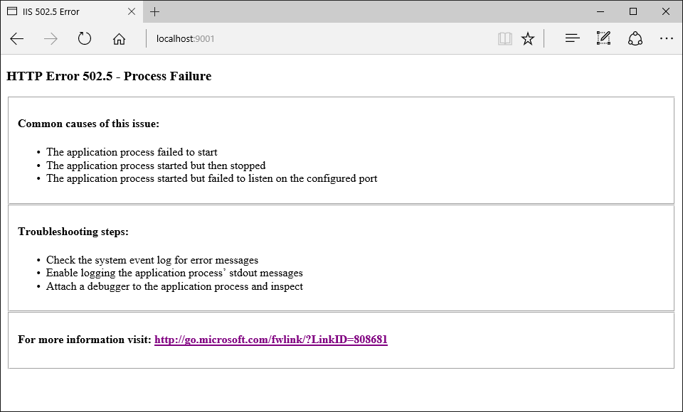

ASP.NET Core Module Configuration Reference
=============================================

ASP.NET Core 模块配置参考
=============================================

By `Luke Latham`_, `Rick Anderson`_ and `Sourabh Shirhatti`_

作者： `Luke Latham`_, `Rick Anderson`_ and `Sourabh Shirhatti`_

翻译 `谢炀（Kiler） <https://github.com/kiler398/aspnetcore>`_ 

In ASP.NET Core, the web application is hosted by an external process outside of IIS. The ASP.NET Core Module is an IIS 7.5+ module, which is responsible for process management of ASP.NET Core http listeners and to proxy requests to processes that it manages. This document provides an overview of how to configure the ASP.NET Core Module for shared hosting of ASP.NET Core.

在 ASP.NET Core 中，Web 应用程序宿主在 IIS外部进程之上的。 ASP.NET Core 模块是一个 IIS7.5 及更高版本的模块，它负责 ASP.NET Core HTTP侦听器的进程管理和代理请求到它所管理的进程。本文提供了如何配置 ASP.NET Core 模块来共享 ASP.NET Core 主机的概述。

.. contents:: Sections:
  :local:
  :depth: 2

Installing the ASP.NET Core Module
----------------------------------

安装 ASP.NET Core 模块
----------------------------------

Install the `.NET Core Windows Server Hosting <https://go.microsoft.com/fwlink/?LinkId=817246>`__ bundle on the server. The bundle will install the .NET Core Runtime, .NET Core Library, and the ASP.NET Core Module.

在服务器上安装 `.NET Core Windows Server Hosting <https://go.microsoft.com/fwlink/?LinkId=817246>`__ 包。该软件包将安装.NET Core 运行时，.NET Core 库 和 ASP.NET Core 模块。

Configuring the ASP.NET Core Module
-----------------------------------

配置 ASP.NET Core 模块
-----------------------------------

The ASP.NET Core Module is configured via a site or application *web.config* file and has its own configuration section within ``system.webServer - aspNetCore``.

ASP.NET Core 模块直接在一个网站或应用程序的 *web.config* 文件中进行配置，它有一个专属的 ``system.webServer - aspNetCore`` 配置节。

Configuration Attributes
^^^^^^^^^^^^^^^^^^^^^^^^

配置属性
^^^^^^^^^^^^^^^^^^^^^^^^

+---------------------------+----------------------------------------------------+
| Attribute                 |     Description                                    |
+===========================+====================================================+
| processPath               | | Required string attribute.                       |
|                           | |                                                  |
|                           | | Path to the executable or script that will launch|
|                           | | a process listening for HTTP requests.           |
|                           | | Relative paths are supported. If the path        |
|                           | | begins with '.', the path is considered to be    |
|                           | | relative to the site root.                       |
|                           | |                                                  |
|                           | | There is no default value.                       |
+---------------------------+----------------------------------------------------+
| arguments                 | | Optional string attribute.                       |
|                           | |                                                  |
|                           | | Arguments to the executable or script            |
|                           | | specified in **processPath**.                    |
|                           | |                                                  |
|                           | | The default value is an empty string.            |
+---------------------------+----------------------------------------------------+
| startupTimeLimit          | | Optional integer attribute.                      |
|                           | |                                                  |
|                           | | Duration in seconds for which the                |
|                           | | the handler will wait for the executable or      |
|                           | | script to start a process listening on           |
|                           | | the port. If this time limit is exceeded,        |
|                           | | the handler will kill the process and attempt to |
|                           | | launch it again **startupRetryCount** times.     |
|                           | |                                                  |
|                           | | The default value is 120.                        |
+---------------------------+----------------------------------------------------+
| shutdownTimeLimit         | | Optional integer attribute.                      |
|                           | |                                                  |
|                           | | Duration in seconds for which the                |
|                           | | the handler will wait for the executable or      |
|                           | | script to gracefully shutdown when the           |
|                           | | *app_offline.htm* file is detected               |
|                           | |                                                  |
|                           | | The default value is 10.                         |
+---------------------------+----------------------------------------------------+
| rapidFailsPerMinute       | | Optional integer attribute.                      |
|                           | |                                                  |
|                           | | Specifies the number of times the process        |
|                           | | specified in **processPath** is allowed to crash |
|                           | | per minute. If this limit is exceeded,           |
|                           | | the handler will stop launching the              |
|                           | | process for the remainder of the minute.         |
|                           | |                                                  |
|                           | | The default value is 10.                         |
+---------------------------+----------------------------------------------------+
| requestTimeout            | | Optional timespan attribute.                     |
|                           | |                                                  |
|                           | | Specifies the duration for which the             |
|                           | | ASP.NET Core Module will wait for a response     |
|                           | | from the process listening on                    |
|                           | | %ASPNETCORE_PORT%.                               |
|                           | |                                                  |
|                           | | The default value is "00:02:00".                 |
+---------------------------+----------------------------------------------------+
| stdoutLogEnabled          | | Optional Boolean attribute.                      |
|                           | |                                                  |
|                           | | If true, **stdout** and **stderr** for the       |
|                           | | process specified in **processPath** will be     |
|                           | | redirected to the file specified in              |
|                           | | **stdoutLogFile**.                               |
|                           | |                                                  |
|                           | | The default value is false.                      |
+---------------------------+----------------------------------------------------+
| stdoutLogFile             | | Optional string attribute.                       |
|                           | |                                                  |
|                           | | Specifies the relative or absolute file path for |
|                           | | which **stdout** and **stderr** from the process |
|                           | | specified in **processPath** will be logged.     |
|                           | | Relative paths are relative to the root of the   |
|                           | | site. Any path starting with '.' will be         |
|                           | | relative to the site root and all other paths    |
|                           | | will be treated as absolute paths.               |
|                           | |                                                  |
|                           | | The default value is ``aspnetcore-stdout``.      |
+---------------------------+----------------------------------------------------+
| forwardWindowsAuthToken   | | True or False.                                   |
|                           | |                                                  |
|                           | | If  true, the token will be forwarded to the     |
|                           | | child process listening on %ASPNETCORE_PORT% as a|
|                           | | header 'MS-ASPNETCORE-WINAUTHTOKEN' per request. |
|                           | | It is the responsibility of that process to call |
|                           | | CloseHandle on this token per request.           |
|                           | |                                                  |
|                           | | The default value is false.                      |
+---------------------------+----------------------------------------------------+
| disableStartUpErrorPage   | | True or False.                                   |
|                           | |                                                  |
|                           | | If true, the **502.5 - Process Failure** page    |
|                           | | will be supressed and the 502 status code page   |
|                           | | configured in your *web.config* will take        |
|                           | | precedence.                                      |
|                           | |                                                  |
|                           | | The default value is false.                      |
+---------------------------+----------------------------------------------------+

+---------------------------+----------------------------------------------------+
| 属性                      |     描述                                            |
+===========================+====================================================+
| processPath               | | 必填  字符串字段。                                |
|                           | |                                                  |
|                           | | 用于启动 HTTP 监听器进程的可执行文件或者脚本的路径， |
|                           | | 支持相对路径，如果路径以'.'开始，路径被认为相对与站点 |
|                           | | 的根路径                                          |
|                           | |                                                  |
|                           | | 没有默认值。                                      |
+---------------------------+----------------------------------------------------+
| arguments                 | | 可选  字符串字段。                                |
|                           | |                                                  |
|                           | | **processPath** 可执行文件或者脚本的指定运行参数。  |
|                           | |                                                  |
|                           | | 默认值为空。                                      |
+---------------------------+----------------------------------------------------+
| startupTimeLimit          | | 可选  整数字段。                                  |
|                           | |                                                  |
|                           | | 处理等待可执行文件或者脚本开启进程端口监听操作的时间，|
|                           | | 如果超过了时间限制， 处理会杀掉进程，重新尝试启动进程 |
|                           | | ，重试 **startupRetryCount** 次                   |
|                           | |                                                  |
|                           | | 默认值为 120。                                    |
+---------------------------+----------------------------------------------------+
| shutdownTimeLimit         | | 可选  整数字段。                                  |
|                           | |                                                  |
|                           | | 当发现 *app_offline.htm* 文件的时候，处理等待可执行 |
|                           | | 文件或者脚本正常关闭的时间                         |
|                           | |                                                  |
|                           | | 默认值为 10。                                     |
+---------------------------+----------------------------------------------------+
| rapidFailsPerMinute       | | 可选  整数字段。                                  |
|                           | |                                                  |
|                           | | 指定 **processPath** 定义的进程每分钟允许崩溃的次数，|
|                           | | 如果超过这个限制，处理在本分钟内将不再尝试启动进程。  |
|                           | |                                                  |
|                           | | 默认值为 10。                                     |
+---------------------------+----------------------------------------------------+
| requestTimeout            | | 可选  时间字段。                                  |
|                           | |                                                  |
|                           | | 指定 ASP.NET Core 模块等待进程监听                 |
|                           | | %ASPNETCORE_PORT%端口响应的响应超时时间。          |
|                           | |                                                  |
|                           | | 默认值为 "00:02:00"。                             |
+---------------------------+----------------------------------------------------+
| stdoutLogEnabled          | | 可选  布尔字段。                                  |
|                           | |                                                  |
|                           | | 如果为 true, **processPath** 指定进程的 **stdout** |
|                           | | 以及 **stderr** 会重定向到 **stdoutLogFile** 指定  |
|                           | | 的文件.                                           |
|                           | |                                                  |
|                           | | 默认值为 false。                                  |
+---------------------------+----------------------------------------------------+
| stdoutLogFile             | | 可选  字符串字段。                                |
|                           | |                                                  |
|                           | | 指定 **processPath** 进程日志所需的 **stdout**     |
|                           | | 以及 **stderr**路径。相对路径相对站点根路径，如果    |
|                           | | 路径以'.'开头，会相对于站点根路径，并且其他路径会被  |
|                           | | 当做绝对路径                                      |
|                           | |                                                  |
|                           | | 默认值为 ``aspnetcore-stdout``。                  |
+---------------------------+----------------------------------------------------+
| forwardWindowsAuthToken   | | 是或者否。                                        |
|                           | |                                                  |
|                           | | 如果为 true, 根据请求头的                          |
|                           | | 'MS-ASPNETCORE-WINAUTHTOKEN“，令牌将被转发到监听到 |
|                           | | ％ASPNETCORE_PORT％ 的子进程之上。进程的职责是为每  |
|                           | | 个请求的令牌调用CloseHandle。                      |
|                           | |                                                  |
|                           | | 默认值为 false。                                  |
+---------------------------+----------------------------------------------------+
| disableStartUpErrorPage   | | 是或者否。                                        |
|                           | |                                                  |
|                           | | 如果为 true, **502.5 - Process Failure** 页面会被 |
|                           | | 消除， *web.config* 中配置的 502 status 状态码页面 |
|                           | | 将会优先显示。                                    |
|                           | |                                                  |
|                           | | 默认值为 false。                                  |
+---------------------------+----------------------------------------------------+

 
Child Elements
^^^^^^^^^^^^^^^

子元素
^^^^^^^^^^^^^^^

+---------------------------+----------------------------------------------------+
| Attribute                 |     Description                                    |
+===========================+====================================================+
| environmentVariables      | | Configures **environmentVariables** collection   |
|                           | | for the process specified in **processPath**.    |
+---------------------------+----------------------------------------------------+
| recycleOnFileChange       | | Specify a list of files to monitor. If any of    |
|                           | | these files are updated/deleted, the Core Module |
|                           | | will restart the backend process.                |
+---------------------------+----------------------------------------------------+

+---------------------------+----------------------------------------------------+
| 属性                      |     描述                                            |
+===========================+====================================================+
| environmentVariables      | | 配置 **environmentVariables** 集合                |
|                           | | 指定进程参数 **processPath**.                     |
+---------------------------+----------------------------------------------------+
| recycleOnFileChange       | | 指定监控文件列表. 如果列表中的任何文件更新或者删除了，|
|                           | | Core 模块会重启后台线程                            |
+---------------------------+----------------------------------------------------+

ASP.NET Core Module *app_offline.htm*
-------------------------------------

ASP.NET Core 模块 *app_offline.htm*
-------------------------------------

If you place a file with the name *app_offline.htm* at the root of a web application directory, the ASP.NET Core Module will attempt to gracefully shut-down the application and stop processing any new incoming requests. If the application is still running after ``shutdownTimeLimit`` number of seconds, the ASP.NET Core Module will kill the running process.

如果你把一个名为 *app_offline.htm* 的文件在Web应用程序的根目录下，ASP.NET Core 模块将尝试正常的关闭应用程序的操作，并停止处理任何新传入的请求。如果应用程序  ``shutdownTimeLimit`` 设置的秒数之后在仍在运行中，ASP.NET Core 模块将杀死正在运行的进程。

While the *app_offline..htm* file is present, the ASP.NET Core Module will repond to all requests by sending back the contents of the *app_offline.htm* file. Once the *app_offline.htm* file is removed, the next request loads the application, which then responds to requests.

当 *app_offline..htm* 文件存在的时候，ASP.NET Core 模块将通过发送 *app_offline.htm* 文件的内容来响应所有请求。一旦 *app_offline.htm* 文件被删除，下一个请求将会加载该应用程序，然后响应请求。

If the ASP.NET Core Module fails to launch the backend process or the backend process starts but fails to listen on the configured port, you will see an HTTP 502.5 status code page. To supress this page and revert to the default IIS 502 status code page, use the ``disableStartUpErrorPage`` attribute. Look at the `HTTP Errors attribute <https://www.iis.net/configreference/system.webserver/httperrors>`__ to override this page with a custom error page.

ASP.NET Core 模块未能启动后台进程或后台进程启动但无法监听配置端口，你会看到一个HTTP 502.5 状态代码页面。微课为了消除这个页面，还原到默认的 IIS 502 状态码页面，使用 ``disableStartUpErrorPage`` 属性。参考 `HTTP Errors attribute <https://www.iis.net/configreference/system.webserver/httperrors>`__ 来重写自定义错误页。

ASP.NET Core Module Start-up Error Page
---------------------------------------

ASP.NET Core 模块启动页和错误页
---------------------------------------

If the ASP.NET Core Module fails to launch the backend process or the backend process starts but fails to listen on the configured port, you will see an HTTP 502.5 status code page. To supress this page and revert to the default IIS 502 status code page, use the ``disableStartUpErrorPage`` attribute. Look at the `HTTP Errors attribute <https://www.iis.net/configreference/system.webserver/httperrors>`__ to override this page with a custom error page.

如果 ASP.NET Core 模块未能启动后台进程或后台进程启动已有但无法监听配置的端口上，你会看到一个 HTTP 502.5 状态代码页。要消除这个页面，还原为默认的 IIS 502 状态码页面，设置 ``disableStartUpErrorPage`` 属性。参考 `HTTP Errors attribute <https://www.iis.net/configreference/system.webserver/httperrors>`__ 来重写自定义错误页。

ASP.NET Core Module configuration examples
-------------------------------------------

ASP.NET Core 模块配置示例
-------------------------------------------

.. _log-redirection:

Log creation and redirection
^^^^^^^^^^^^^^^^^^^^^^^^^^^^

日志的创建和重定向
^^^^^^^^^^^^^^^^^^^^^^^^^^^^

To save logs, you must create the *logs* directory. The ASP.NET Core Module can redirect ``stdout`` and ``stderr`` logs to disk by setting the ``stdoutLogEnabled`` and ``stdoutLogFile`` attributes of the ``aspNetCore`` element. Logs are not rotated (unless process recycling/restart occurs). It is the responsibilty of the hoster to limit the disk space the logs consume.

如果需要保存日志，必须创建 *logs* 目录。 ASP.NET Core 模块可以通过设置 ``aspNetCore`` 素 `stdoutLogEnabled``属性来重定``stdout`` 以及 ``stderr`` 的日志向到磁盘。日志不会轮流（除非进程回收/重启时）。主机管理者的有责任限制日志磁盘空间的消耗。

.. literalinclude:: aspnet-core-module/sample/web.config
  :language: xml
  :lines: 12-15,19

Setting environment variables
^^^^^^^^^^^^^^^^^^^^^^^^^^^^^

设置环境变量
^^^^^^^^^^^^^^^^^^^^^^^^^^^^^

The ASP.NET Core Module allows you specify environment variables for the process specified in the ``processPath`` setting by specifying them in ``environmentVariables`` child attribute to the ``aspNetCore`` attribute.

ASP.NET Core 模块允许你通过 ``aspNetCore``的子属性 ``environmentVariables`` 的 ``processPath`` 设置来制定进程环境变量。

.. literalinclude:: aspnet-core-module/sample/web.config
  :language: xml
  :lines: 12-19
