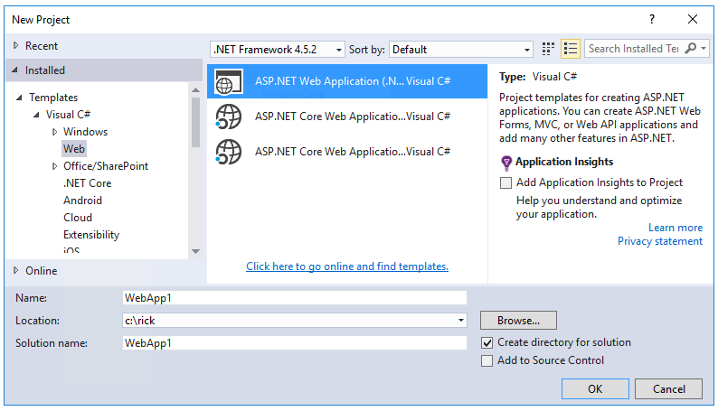
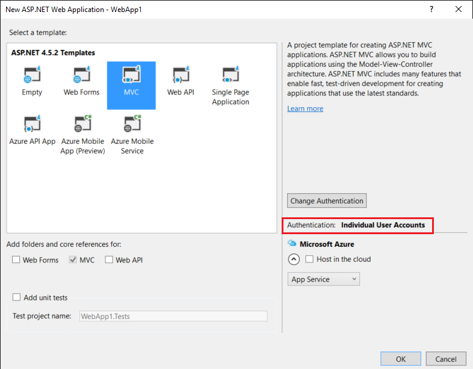
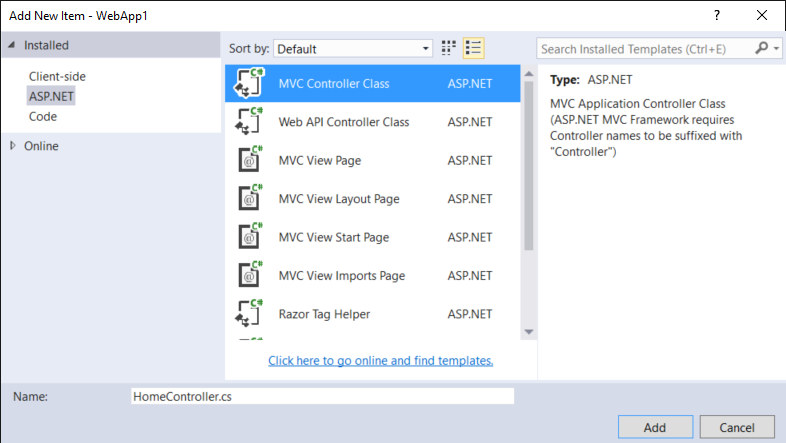
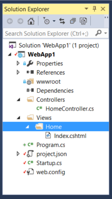

:version: 1.0.0-rc2

从 ASP.NET MVC 迁移到 ASP.NET Core MVC
================================================

作者： `Rick Anderson`_ 、`Daniel Roth`_ 、`Steve Smith`_ 以及 `Scott Addie`_ 

翻译： `刘怡(AlexLEWIS) <http://github.com/alexinea>`_

校对：

This article shows how to get started migrating an ASP.NET MVC project to :doc:`ASP.NET Core MVC </mvc/index>`. In the process, it highlights many of the things that have changed from ASP.NET MVC. Migrating from ASP.NET MVC is a multiple step process and this article covers the initial setup, basic controllers and views, static content, and client-side dependencies. Additional articles cover migrating configuration and identity code found in many ASP.NET MVC projects.

本文介绍如何迁移 ASP.NET MVC 项目到 :doc:`ASP.NET Core MVC </mvc/index>` 。在这一过程中，我们将着重突出那些与 ASP.NET MVC 不同的东西。从 ASP.NET MVC 迁移需要很多步骤来处理，本文将涵盖即使设置、基本的控制器与视图、静态内容以及客户端依赖等内容。关于配置和身份验证的迁移则在其它文章中介绍。

.. contents:: 章节:
  :local:
  :depth: 1

创建启动 ASP.NET MVC 项目
---------------------------------------

To demonstrate the upgrade, we'll start by creating a ASP.NET MVC app. Create it with the name *WebApp1* so the namespace will match the ASP.NET Core project we create in the next step.

为演示升级，我们将创建 ASP.NET MVC 应用。名称创建为 *WebApp1* ，这样命名空间就能匹配下一步我们所创建的 ASP.NET Core 项目了。

*Optional:* Change the name of the Solution from *WebApp1* to *Mvc5*. Visual Studio will display the new solution name (*Mvc5*), which will make it easier to tell this project from the next project.

*可选项：* 把项目的名字从 *WebApp1* 改为 *Mvc5* 。Visual Studio 将显示新的解决方案名（*Mvc5*），它将更易于让你分辨这个项目和下一步将创建的项目。

创建 ASP.NET Core 项目
-----------------------------------

Create a new *empty* ASP.NET Core web app with the same name as the previous project (*WebApp1*) so the namespaces in the two projects match. Having the same namespace makes it easier to copy code between the two projects. You'll have to create this project in a different directory than the previous project to use the same name.

使用与之前相同的名称（*WebApp1*）创建一个空的（*empty*）ASP.NET Core 网络应用程序，这样两个项目的命名空间将匹配。命名空间一样可以让代码的赋值变得容易。当然你必须在不同的目录创建这两个项目，因为它俩的名字一样。

.. image:: mvc/_static/new_core.png

.. image:: mvc/_static/new-project-select-empty-aspnet5-template.png
.. ToDo I think we no longer need full template with **Individual User Accounts**. Next update try this without **Individual User Accounts**

- *Optional:* Create a new ASP.NET Core app named *WebApp1* with authentication set to **Individual User Accounts**. Rename this app *FullAspNetCore*.  Creating this project will save you time in the conversion. You can look at the template generated code to see the end result or to copy code to the conversion project. It's also helpful when you get stuck on a conversion step to compare with the template generated project.

- *可选项：* 创建名为 *WebApp1* 的带有 **个人账户** 身份验证的新 ASP.NET Core 应用，然后把这个应用程序重命名为 *FullAspNetCore* 。创建这么一个项目将节省你的转换时间。你可以看一下模板生成代码，看看最终生成的结果或者复制代码到转换项目内。当你陷入转换步骤与生成的模板项目进行比较时，这即为有帮助。

通过配置，让站点使用 MVC
-----------------------------

Open the *project.json* file.

打开 *project.json* 文件。

- Add ``Microsoft.AspNetCore.Mvc`` and ``Microsoft.AspNetCore.StaticFiles`` to the ``dependencies`` property:

- 在 ``dependencies`` 属性中添加 ``Microsoft.AspNetCore.Mvc`` 和 ``Microsoft.AspNetCore.StaticFiles``：

- Add the "prepublish" line to the "scripts" section:

- 在「scripts」节点中添加「prepublish」行：

.. code-block:: JavaScript
  
  "scripts": {
     "prepublish": [ "npm install", "bower install", "gulp clean", "gulp min" ],
	 "postpublish": [ "dotnet publish-iis 
	   --publish-folder %publish:OutputPath% 
	   --framework %publish:FullTargetFramework%" ]
  }  

- ``Microsoft.AspNetCore.Mvc`` Installs in the ASP.NET Core MVC framework package

- 在  SP.NET Core MVC framework package 中安装 ``Microsoft.AspNetCore.Mvc``

- ``Microsoft.AspNetCore.StaticFiles`` is the static file handler. The ASP.NET runtime is modular, and you must explicitly opt in to serve static files (see :doc:`/fundamentals/static-files`).

- ``Microsoft.AspNetCore.StaticFiles`` 是静态文件处理程序。ASP.NET 运行时是模块化的，你必须明确选择添加提供静态文件的支持（查看 :doc:`/fundamentals/static-files` ）。

- The "scripts"/"prepublish" line is needed for Gulp, Bower and NPM. We'll talk about that later.

- Gulp、Bower 和 NPM 需要 "scripts"/"prepublish" 行，我们之后再说这件事。

- Open the *Startup.cs* file and change the code to match the following:

- 打开 *Startup.cs* 文件并修改代码以匹配以下内容：

.. literalinclude:: mvc/samples/WebApp1/src/WebApp1/Startup.cs
  :language: c#
  :emphasize-lines: 7, 13-
  :lines: 11-34
  :dedent: 4

``UseStaticFiles`` adds the static file handler. As mentioned previously, the ASP.NET runtime is modular, and you must explicitly opt in to serve static files. ``app.UseMvc(routes =>`` adds routing. For more information, see :doc:`/fundamentals/startup` and :doc:`/fundamentals/routing`.

使用 ``UseStaticFiles`` 添加静态文件处理程序。正如前文所述，ASP.NET 运行时是模块化的，你必须明确操作来支持静态文件。``app.UseMvc(routes =>``  将添加到路由。更多信息可以阅读 :doc:`/fundamentals/startup` 和 :doc:`/fundamentals/routing` 。

增加控制器与视图
-------------------------

In this section, you'll add a minimal controller and view to serve as placeholders for the ASP.NET MVC controller and views you'll migrate in the next section.

本节中将提供最精小的控制器和视图，为下一节中迁移的 ASP.NET MVC 控制器和视图作占位之用。

- Add a *Controllers* folder.
- Add an **MVC controller class** with the name *HomeController.cs* to the *Controllers* folder.

- 添加 *Controllers* 文件夹。
- 在 *Controllers* 文件夹中添加名为 *HomeController.cs* 的 **MVC controller class** 

- Add a *Views* folder.
- Add a *Views/Home* folder.
- Add an *Index.cshtml* MVC view page to the *Views/Home* folder.

- 添加 *Views* 文件夹。
- 添加 *Views/Home* 文件夹。
- 在 *Views/Home* 文件夹中添加 *Index.cshtml* MVC 视图页。

.. image:: mvc/_static/view.png

The project structure is shown below:

项目结构将如下所示：

Replace the contents of the *Views/Home/Index.cshtml* file with the following:

如下这般修改 *Views/Home/Index.cshtml* 文件中的内容：

.. code-block:: html

  <h1>Hello world!</h1>

Run the app.

运行应用程序。

.. image:: mvc/_static/hello-world.png

See :doc:`/mvc/controllers/index` and :doc:`/mvc/views/index` for more information.

更多信息请阅读 :doc:`/mvc/controllers/index` 和 :doc:`/mvc/views/index` 。

Now that we have a minimal working ASP.NET Core project, we can start migrating functionality from the ASP.NET MVC project. We will need to move the following:

至此我们有了一个最小化的 ASP.NET Core 工作项目，我们就可以开始逐步将功能从 ASP.NET MVC 项目迁移到 ASP.NET Core MVC 了。我们需要移动的清单如下：

- client-side content (CSS, fonts, and scripts)
- controllers
- views
- models
- bundling
- filters
- Log in/out, identity (This will be done in the next tutorial.)

- 客户端内容（包括CSS、字体以及脚本）
- controllers
- views
- models
- bundling
- 过滤器
- 登入/登出，身份识别（这将在下一篇教程中介绍）

控制器与视图
---------------------

- Copy each of the methods from the ASP.NET MVC ``HomeController`` to the new ``HomeController``. Note that in ASP.NET MVC, the built-in template's controller action method return type is `ActionResult <https://msdn.microsoft.com/en-us/library/system.web.mvc.actionresult(v=vs.118).aspx>`__; in ASP.NET Core MVC the actions return `IActionResult <https://docs.asp.net/projects/api/en/latest/autoapi/Microsoft/AspNetCore/Mvc/IActionResult/index.html>`__ instead. ``ActionResult`` implements ``IActionResult``, so there is no need to change the return type of your action methods.
- Copy the *About.cshtml*, *Contact.cshtml*, and *Index.cshtml* Razor view files from the ASP.NET MVC project to the ASP.NET Core project.
- Run the ASP.NET Core app and test each method. We haven't migrated the layout file or styles yet, so the rendered views will only contain the content in the view files. You won't have the layout file generated links for the ``About`` and ``Contact`` views, so you'll have to invoke them from the browser (replace **2468** with the port number used in your project).

- 从 ASP.NET MVC ``HomeController`` 中逐一复制方法到新的 ``HomeController`` 中。注意，在 ASP.NET MVC 中，内建模板的控制器 Action 方法返回的结果是 `ActionResult <https://msdn.microsoft.com/en-us/library/system.web.mvc.actionresult(v=vs.118).aspx>`__ ，但在 ASP.NET Core MVC 中 Action 将返回 `IActionResult <https://docs.asp.net/projects/api/en/latest/autoapi/Microsoft/AspNetCore/Mvc/IActionResult/index.html>`__ 。``ActionResult`` 是 ``IActionResult`` 的实现，所以你不需要为返回类型作任何改变。
- 从 ASP.NET MVC 项目复制 *About.cshtml*、*Contact.cshtml* 和 *Index.cshtml* Razor 视图文件到 ASP.NET Core MVC 项目。
- 运行 ASP.NET Core 应用并测试每个方法。你尚未迁移布局文件以及样式，因此所渲染出的页面将只包含视图文件的内容。你还没有布局文件为你生成 ``About`` 和 ``Contact`` 视图的链接，所以你必须手工在浏览器的地址栏中调用它们（注意要把端口号从 **2468**  改为你项目的实际端口号）。

  - \http://localhost:2468/home/about
  - \http://localhost:2468/home/contact

Note the lack of styling and menu items. We'll fix that in the next section.

注意此处缺失的风格以及菜单项，我们将在下一节中进行修复。

静态内容
--------------

In previous versions of  ASP.NET MVC, static content was hosted from the root of the web project and was intermixed with server-side files. In ASP.NET Core, static content is hosted in the *wwwroot* folder. You'll want to copy the static content from your old ASP.NET MVC app to the *wwwroot* folder in your ASP.NET Core project. In this sample conversion:

在之前的 ASP.NET MVC 版本中，静态内容放在 Web 项目的根节点下，与服务器端文件混合在一起。在 ASP.NET Core MVC 中，静态内通将放在 *wwwroot* 文件夹内。所以你需要将静态内容从你的老项目复制到新项目的 *wwwroot* 文件夹中。在本地中为：

- Copy the *favicon.ico* file from the old MVC project to the *wwwroot* folder in the ASP.NET Core project.

- 从老的 MVC 项目中复制 *favicon.ico* 文件到 ASP.NET Core 项目的 *wwwroot* 文件夹。

The old ASP.NET MVC project uses `Bootstrap <http://getbootstrap.com/>`__ for its styling and stores the Bootstrap files in the *Content* and *Scripts* folders. The template-generated old ASP.NET MVC project references Bootstrap in the layout file (*Views/Shared/_Layout.cshtml*). You could copy the *bootstrap.js* and *bootstrap.css* files from the ASP.NET MVC project to the *wwwroot* folder in the new project, but that approach doesn't use the improved mechanism for managing client-side dependencies in ASP.NET Core.

老项目使用 `Bootstrap <http://getbootstrap.com/>`__ 作为其样式，Bootstrap 文件则存放于 *Content* 和 *Scripts* 文件夹内。模板生成的老的 ASP.NET MVC 项目通过布局文件（*Views/Shared/_Layout.cshtml*）引用 Bootstrap。你可以从老项目复制 *bootstrap.js* 和 *bootstrap.css* 到新项目的 *wwwroot* 中，但在 ASP.NET Core MVC 中这种方式并不使用客户端的依赖管理机制。

In the new project, we'll add support for Bootstrap (and other client-side libraries) using `Bower <http://bower.io/>`__:

在新项目中，我们将通过使用 `Bower <http://bower.io/>`__ 增加对 Bootstrap（以及其他客户端库）的支持：

- Add a `Bower <http://bower.io/>`__ configuration file named *bower.json* to the project root (Right-click on the project, and then **Add > New Item > Bower Configuration File**). Add `Bootstrap <http://getbootstrap.com/>`__ and `jQuery <https://jquery.com/>`__ to the file :sup:`[1]`: (see the highlighted lines below).

- 在项目的根节点（右键点击项目，选择 **Add > New Item > Bower Configuration File**）添加名为 *bower.json* 的 `Bower <http://bower.io/>`__ 配置文件。添加 `Bootstrap <http://getbootstrap.com/>`__ 以及 `jQuery <https://jquery.com/>`__ 到文件中 :sup:`[1]` ：（看下面的高亮行）

.. literalinclude:: mvc/samples/WebApp1/src/WebApp1/bower.json
  :language: json
  :emphasize-lines: 5-6

Upon saving the file, Bower will automatically download the dependencies to the *wwwroot/lib* folder. You can use the **Search Solution Explorer** box to find the path of the assets.

在保存文件的时候，Bower 将自动下载依赖项到 *wwwroot/lib* 文件夹中。你可以通过 **Search Solution Explorer** 框来查找这些文件的路径。

.. image:: mvc/_static/search.png

.. Note:: *bower.json* is not visible in **Solution Explorer**. You can display the hidden *.json* files by selecting the project in **Solution Explorer** and then tapping the **Show All Files** icon. You won't see **Show All Files** unless the project is selected.

.. Note:: *bower.json* 并不显示在 **Solution Explorer** 中。你可以通过选中 **Solution Explorer** 中的项目并点击 **Show All Files**图标来显示所有被隐藏的 *.json* 文件。除非项目被选中，否则你看不到 **Show All Files** 。

.. image:: mvc/_static/show_all_files.png

See :doc:`/client-side/bower` for more information.

查看更多信息请移步 :doc:`/client-side/bower` 。

Gulp
----

WWhen you create a new web app using the ASP.NET Core Web Application template, the project is setup to use `Gulp <http://gulpjs.com>`__. Gulp is a streaming build system for client-side code (HTML, LESS, SASS, etc.). The *gulpfile.js* contains JavaScript that defines a set of gulp tasks that you can set to run automatically on build events or you can run manually using **Task Runner Explorer**. In this section we'll show how to use *gulpfile.js* to bundle and minify the projects JavaScript and CSS files.

当你通过 ASP.NET Core MVC 网络应用程序模板创建了新的应用，项目将被设置为使用 `Gulp <http://gulpjs.com>`__ 。Gulp 是一种客户端代码（HTML、LESS、SASS 等）构建系统。*gulpfile.js* 文件所包含的 JavaScript 定义了一组 gulp 任务，当项目构建时会自动运行，当然你也可以使用 **Task Runner Explorer** 手工运行。在本节中我们将展示如何使用 *gulpfile.js* 绑定和压缩项目中的 JavaScirpt 和 CSS 文件。

If you created the optional *FullAspNetCore* project (a new ASP.NET Core web app with Individual User Accounts), add *gulpfile.js* from that project to the project we are updating. In Solution Explorer, right-click the web app project and choose **Add > Existing Item**.

如果你创建了可选的 *FullAspNetCore* 项目（一种新的带有用于验证机制的 ASP.NET Core网络应用程序），在升级时从项目中添加 *gulpfile.js* 文件。在 Solution Explorer 中，右键点击网络应用程序项目并选择 **Add > Existing Item** 。

.. image:: mvc/_static/addExisting.png

Navigate to *gulpfile.js* from the new ASP.NET Core web app with Individual User Accounts and add the add *gulpfile.js* file. Alternatively, right-click the web app project and choose **Add > New Item**. Select **Gulp Configuration File**, and name the file *gulpfile.js*. The *gulpfile.js* file:

在带身份验证的 ASP.NET Core 网络应用程序（的面板）中导航到 *gulpfile.js*，然后添加 *gulpfile.js* 文件。或者右键点击网络应用程序项目，然后选择 **Add > New Item**，选择 **Gulp Configuration File**，接着命名为 *gulpfile.js*。这就是 *gulpfile.js* 文件：

.. literalinclude:: mvc/samples/WebApp1/src/WebApp1/gulpfile.js
  :language: javascript

The code above performs these functions:

上面的代码将执行这些功能：

- Cleans (deletes) the target files.
- Minifies the JavaScript and CSS files.
- Bundles (concatenates) the JavaScript and CSS files.

- 清理目标文件。
- 压缩 JavaScript 和 CSS 文件。
- 绑定（连接） JavaScript 和 CSS 文件。

See :doc:`/client-side/using-gulp`.

请查看 :doc:`/client-side/using-gulp` 。

NPM
---

`NPM <https://docs.npmjs.com/>`__ (Node Package Manager) is a package manager which is used to acquire tooling such as `Bower <http://bower.io/>`__ and `Gulp <http://gulpjs.com/>`__; and, it is fully supported in Visual Studio. We'll use NPM to manage Gulp dependencies.

包管理器 `NPM <https://docs.npmjs.com/>`__ （Node Package Manager）可用于获取诸如 `Bower <http://bower.io/>`__ 以及 `Gulp <http://gulpjs.com/>`__ 等工具，并且它被 Visual Studio 完整支持。我们将使用 NPM 来管理我们的 Glup 依赖。

If you created the optional *FullAspNetCore* project, add the *package.json* NPM file from that project to the project we are updating. The *package.json* NPM file lists the dependencies for the client-side build processes defined in `gulpfile.js`.

如果你创建了可选的 *FullAspNetCore* 项目，从该项目中到我们正在升级的项目里添加 *package.json* NPM 文件。*package.json* NPM 文件罗列了 `gulpfile.js` 定义的客户端构建的依赖项。

.. Note:: *package.json* is not visible in **Solution Explorer**.

.. Note:: *package.json* 并不在 **Solution Explorer** 。

Right-click the web app project, choose **Add > Existing Item**, and add the *package.json* NPM file. Alternatively, you can add a new NPM configuration file as follows:

右键点击网络应用项目，选择 **Add > Existing Item**，然后添加 *package.json* NPM 文件。或者你也可以按如下步骤添加新的 NPM 配置文件：

#. In Solution Explorer, right-click the project
#. Select **Add** > **New Item**
#. Select **NPM Configuration File**
#. Leave the default name: *package.json*
#. Tap **Add**

#. 在 Solution Explorer 中右键点击项目
#. 选择 **Add** > **New Item**
#. 选择 **NPM Configuration File**
#. 保留默认名字： *package.json*
#. 点击 **Add**

The *package.json* file :sup:`[1]`:

*package.json* 文件 :sup:`[1]` ：

.. literalinclude:: mvc/samples/WebApp1/src/WebApp1/package.json
  :language: json

Right-click on *gulpfile.js* and select **Task Runner Explorer**. Double-click on a task to run it.

右键单击 *gulpfile.js* 并选择 **Task Runner Explorer** 。双击启动任务。

For more information, see :doc:`/client-side/index`.

获取更多信息，请阅读 :doc:`/client-side/index` 。

.. _migrate-layout-file:

迁移布局文件
-----------------------

- Copy the *_ViewStart.cshtml* file from the old ASP.NET MVC project's *Views* folder into the ASP.NET Core project's *Views* folder. The *_ViewStart.cshtml* file has not changed in ASP.NET Core MVC.
- Create a *Views/Shared* folder.
- Optional: Copy *_ViewImports.cshtml* from the old MVC project's *Views* folder into the ASP.NET Core project's *Views* folder. Remove any namespace declaration in the *_ViewImports.cshtml* file. The *_ViewImports.cshtml* file provides namespaces for all the view files and brings  in doc:`Tag Helpers </mvc/views/tag-helpers/index>`. :doc:`Tag Helpers </mvc/views/tag-helpers/index>` are used in the new layout file. The *_ViewImports.cshtml* file is new for ASP.NET Core
- Copy the *_Layout.cshtml* file from the old ASP.NET MVC project's *Views/Shared* folder into the ASP.NET Core project's *Views/Shared* folder.

- 从老的 ASP.NET MVC 项目的 *Views* 文件夹中复制 *_ViewStart.cshtml* 文件到 ASP.NET Core 项目的 *Views* 文件夹。*_ViewStart.cshtml* 文件在 ASP.NET Core MVC 中并没有什么改变。
- 创建 *Views/Shared* 文件夹。
- 可选项：从老的 ASP.NET MVC 项目的 *Views* 文件夹中复制 *_ViewImports.cshtml* 到 ASP.NET Core 项目的 *Views* 文件夹。在 *_ViewImports.cshtml* 文件中移除所有的命名空间声明。*_ViewImports.cshtml* 为所有视图文件提供命名空间，并且提供了 :doc:`Tag Helpers </mvc/views/tag-helpers/index>` 。:doc:`Tag Helpers </mvc/views/tag-helpers/index>` 将用于新的布局文件中。*_ViewImports.cshtml* 文件就是为 ASP.NET Core 而新添加的。
- 从老的 ASP.NET MVC 项目的 *Views/Shared* 文件夹中复制 *_Layout.cshtml*  ASP.NET Core 项目的 *Views/Shared* 文件夹中。

Open *_Layout.cshtml* file and make the following changes (the completed code is shown below):

打开 *_Layout.cshtml* 文件，并按下面的步骤进行修改（下面将展示完成后的代码）

  - Replace @Styles.Render("~/Content/css") with a <link> element to load *bootstrap.css* (see below)
  - Remove @Scripts.Render("~/bundles/modernizr")
  - Comment out the @Html.Partial("_LoginPartial") line (surround the line with @*...*@) - we'll return to it in a future tutorial
  - Replace @Scripts.Render("~/bundles/jquery") with a 
  

The updated _Layout.cshtml file is shown below:

更新 _Layout.cshtml 文件，如下所示：

.. literalinclude:: mvc/samples/WebApp1/src/WebApp1/Views/Shared/_Layout.cshtml
  :language: html
  :emphasize-lines: 7,26,38-39

View the site in the browser. It should now load correctly, with the expected styles in place.

在浏览器中访问该站。此时它将正确加载，在正确的位置显示预期的效果。

- Optional: You might want to try using the new layout file. For this project you can copy the layout file from the *FullAspNetCore* project. The new layout file uses :doc:`Tag Helpers </mvc/views/tag-helpers/index>` and has other improvements.

- 可选项：你或希望尝试使用新的布局文件。在本项目中你可以从 *FullAspNetCore* 项目中复制配置文件。新的布局文件使用了 :doc:`Tag Helpers </mvc/views/tag-helpers/index>` 以及其他大量改进项。

配置绑定
------------------

The ASP.NET MVC starter web template utilized the ASP.NET Web Optimization for bundling. In ASP.NET Core, this functionality is performed as part of the build process using `Gulp <http://gulpjs.com/>`__. We've previously configured bundling and minification; all that's left is to change the references to Bootstrap, jQuery and other assets to use the bundled and minified versions. You can see how this is done in the layout file (*Views/Shared/_Layout.cshtml*) of the full template project. See :doc:`/client-side/bundling-and-minification` for more information.

ASP.NET MVC 启动 Web 模板是利用 ASP.NET Web Optimization 所构建的。在 ASP.NET Core 中，这一功能使用 `Gulp <http://gulpjs.com/>`__ 作为构建过程中的一部分。我们先前已经配置了绑定与压缩；那么剩下的就是改变对 Bootstrap、jQuery  以及其它资源的绑定与压缩版本的引用。你可以查看在完整项目模板的布局文件（*Views/Shared/_Layout.cshtml*）中它是如何工作得。移步 :doc:`/client-side/bundling-and-minification` 阅读更多信息。

.. _Solving-HTTP-500-errors:

处理 HTTP 500 错误
------------------------

There are many problems that can cause a HTTP 500 error message that contain no information on the source of the problem. For example, if the *Views/_ViewImports.cshtml* file contains a namespace that doesn't exist in your project, you'll get a HTTP 500 error. To get a detailed error message, add the following code:

导致 HTTP 500 错误的原因有很多，其中包括不带有源信息的错误。比如在 *Views/_ViewImports.cshtml* 中包含一个本项目不存在的命名空间，就会返回一个 HTTP 500 错误。为获得详细错误信息，请添加下述代码：

.. code-block:: c#
  :emphasize-lines: 3-6

   public void Configure(IApplicationBuilder app, IHostingEnvironment env, ILoggerFactory loggerFactory)
   {
       if (env.IsDevelopment())
       {
            app.UseDeveloperExceptionPage();
       }

       app.UseStaticFiles();

       app.UseMvc(routes =>
       {
           routes.MapRoute(
               name: "default",
               template: "{controller=Home}/{action=Index}/{id?}");
       });
   }

See **Using the Developer Exception Page** in :doc:`/fundamentals/error-handling` for more information.

更多关于 **使用开发者异常页面** 请移步 :doc:`/fundamentals/error-handling` 。

扩展资源
--------------------

- :doc:`/client-side/index`
- :doc:`Tag Helpers </mvc/views/tag-helpers/index>`

[1] The version numbers in the samples might not be current. You may need to update your projects accordingly.

[1] 例子中的版本号可能不是最新的。你或许需要升级相应的项目。