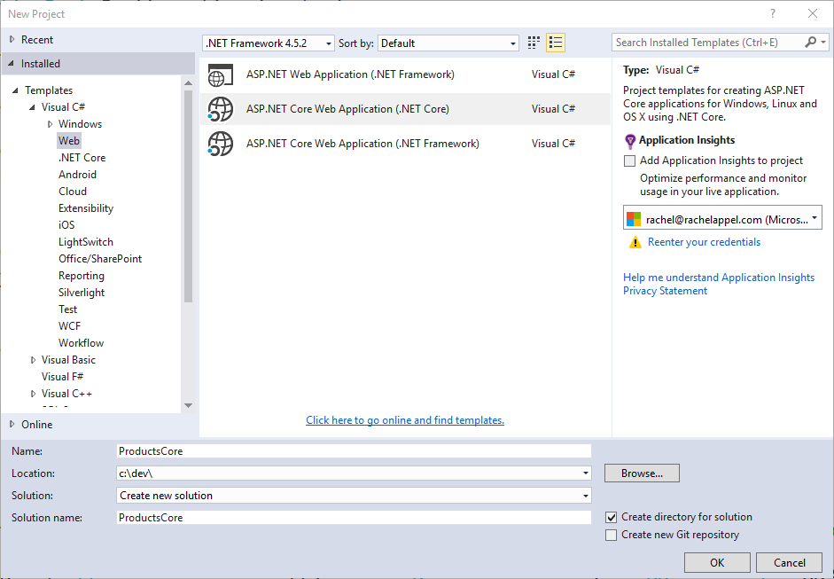

迁移自 ASP.NET Web API
==============================

作者： `Steve Smith`_ 与 `Scott Addie`_

翻译： `刘怡(AlexLEWIS) <http://github.com/alexinea>`_

校对：

Web APIs are HTTP services that reach a broad range of clients, including browsers and mobile devices. ASP.NET Core MVC includes support for building Web APIs providing a single, consistent way of building web applications. In this article, we demonstrate the steps required to migrate a Web API implementation from ASP.NET Web API to ASP.NET Core MVC.

Web APIs 是一种可被包括浏览器和一种设备在内的广泛客户端所使用的 HTTP 服务。ASP.NET Core MVC（内部包含了对创建 Web APIs 的支持）为构建网络用用程序提供了一条单一且一致的路径。本文我们将一步步演示如何将 ASP.NET Web API 迁移到 ASP.NET Core MVC 的 Web API 实现之中。

.. contents:: Sections:
  :local:
  :depth: 1

`查看或下载演示代码 <https://github.com/aspnet/Docs/tree/master/aspnet/migration/webapi/sample>`__

回顾 ASP.NET Web API 项目
------------------------------

This article uses the sample project, *ProductsApp*, created in the article `Getting Started with ASP.NET Web API  <http://www.asp.net/web-api/overview/getting-started-with-aspnet-web-api/tutorial-your-first-web-api>`_ as its starting point. In that project, a simple ASP.NET Web API  project is configured as follows.

本文所使用的演示项目 *ProductsApp* 创建于文章 `ASP.NET Web API 入门 <http://www.asp.net/web-api/overview/getting-started-with-aspnet-web-api/tutorial-your-first-web-api>`_ ，该项目中所使用的 ASP.NET Web API 示例配置如下：

In *Global.asax.cs*, a call is made to ``WebApiConfig.Register``:

在 *Global.asax.cs* 中对 ``WebApiConfig.Register`` 做调用：

.. literalinclude:: webapi/sample/ProductsApp/Global.asax.cs
  :language: c#
  :emphasize-lines: 14
  :linenos:

``WebApiConfig`` is defined in *App_Start*, and has just one static ``Register`` method:

``WebApiConfig`` 定义于 *App_Start*，同时只有一个静态方法 ``Register``：

.. literalinclude:: webapi/sample/ProductsApp/App_Start/WebApiConfig.cs
  :language: c#
  :emphasize-lines: 15-20
  :linenos:

This class configures `attribute routing <http://www.asp.net/web-api/overview/web-api-routing-and-actions/attribute-routing-in-web-api-2>`_, although it's not actually being used in the project. It also configures the routing table which is used by ASP.NET Web API. In this case, ASP.NET Web API will expect URLs to match the format */api/{controller}/{id}*, with *{id}* being optional.

这个类配置了 `路由特性 <http://www.asp.net/web-api/overview/web-api-routing-and-actions/attribute-routing-in-web-api-2>`_ （尽管它并未被项目所使用）。它还为 ASP.NET Web API 配置了路由表。在本例中，ASP.NET Web API 将要求 URL 匹配 */api/{controller}/{id}* ，其中 *{id}* 是可选的。

The *ProductsApp* project includes just one simple controller, which inherits from ``ApiController`` and exposes two methods:

*ProductsApp* 只包含一个简单的控制器，继承自 ``ApiController`` 并向外暴露两个方法：

.. literalinclude:: webapi/sample/ProductsApp/Controllers/ProductsController.cs
  :language: c#
  :emphasize-lines: 19,24
  :linenos:

Finally, the model, *Product*, used by the *ProductsApp*, is a simple class:

最后，在 *ProductsApp* 中使用 *Product* 模型：

.. literalinclude:: webapi/sample/ProductsApp/Models/Product.cs
  :language: c#
  :linenos:

Now that we have a simple project from which to start, we can demonstrate how to migrate this Web API project to ASP.NET Core MVC.

至此我们已经准备好了一个简单 ASP.NET Web API 项目，之后我们就将演示如何把它迁移到 ASP.NET Core MVC 中。

创建目标项目
------------------------------

Using Visual Studio, create a new, empty solution, and name it *WebAPIMigration*. Add the existing *ProductsApp* project to it, then, add a new ASP.NET Core Web Application Project to the solution. Name the new project *ProductsCore*.

在 Visual Studio 创建一个新的空坚决方案，把之前就存在的 *ProductsApp* 项目添加进去。然后添加一个新的 Web 项目到该解决方案内，取名为 `ProductsCore`。

Next, choose the Web API project template. We will migrate the *ProductsApp* contents to this new project.

接下来，选择 ASP.NET Core Web API 项目模板，我们将会把 *ProductsApp* 迁移到这个新项目中。

.. image:: webapi/_static/aspnet-5-webapi.png

Delete the ``Project_Readme.html`` file from the new project. Your solution should now look like this:

从新项目中删除 ``Project_Readme.html`` 文件，此时你的解决方案将如下所示：

.. migrate-webapi-config:

迁移 Configuration
---------------------

ASP.NET Core no longer uses *Global.asax*, *web.config*, or *App_Start* folders. Instead, all startup tasks are done in *Startup.cs* in the root of the project (see :doc:`/fundamentals/startup`). In ASP.NET Core MVC, attribute-based routing is now included by default when ``UseMvc()`` is called; and, this is the recommended approach for configuring Web API routes (and is how the Web API starter project handles routing).

ASP.NET Core 已经不再使用 *Global.asax*、*web.config* 或 *App_Start* 文件夹了。相反，所有的启动任务都由项目跟路径下的 *Startup.cs* 完成（参考 :doc:`/fundamentals/startup` ）。在 ASP.NET Core Mvc 中，只要调用了 ``UseMvc()`` 基于特性的路由机制就会被默认引入，而这也是 Web API 路由所推荐的做法（同时也是 Web API 初始项目默认的路由处理方法）。

.. literalinclude:: webapi/sample/ProductsCore/Startup.cs
  :language: none
  :emphasize-lines: 40
  :linenos:

Assuming you want to use attribute routing in your project going forward, no additional configuration is needed. Simply apply the attributes as needed to your controllers and actions, as is done in the sample ``ValuesController`` class that is included in the Web API starter project:

如果你想在你的项目中使用特性路由，那么不需要额外的配置。就如 ``ValuesController`` 类中所包含的那样，在你需要的控制器和 actions 上简单地加上特性：

.. literalinclude:: webapi/sample/ProductsCore/Controllers/ValuesController.cs
  :language: c#
  :emphasize-lines: 9,13,20,27,33,39
  :linenos:

Note the presence of *[controller]* on line 8. Attribute-based routing now supports certain tokens, such as *[controller]* and *[action]*. These tokens are replaced at runtime with the name of the controller or action, respectively, to which the attribute has been applied. This serves to reduce the number of magic strings in the project, and it ensures the routes will be kept synchronized with their corresponding controllers and actions when automatic rename refactorings are applied.

注意第八行所存在的 *[controller]*。基于特性的路由目前支持特定标记（诸如 *[controller]* 和 *[action]*）。在运行时这些标记会分别被相应的控制器或 action 的名字所取代。这样可以有效减少项目中魔法字符串的数量，并确保路由将会与对应的控制器和 actions 名称在重构时保持同步。

To migrate the Products API controller, we must first copy *ProductsController* to the new project. Then simply include the route attribute on the controller:

要迁移 Products API 控制器，首先我们必须把 *ProductsController* 复制到新项目中，然后在控制器上增加路由特性：

.. code-block:: c#

  [Route("api/[controller]")]

You also need to add the ``[HttpGet]`` attribute to the two methods, since they both should be called via HTTP Get. Include the expectation of an "id" parameter in the attribute for ``GetProduct()``:

另外再给这两个方法增加 ``[HttpGet]`` 特性（因为它们都应可以通过 HTTP Get 被调用）。特性中包含了 ``GetProduct()`` 希望获得的参数「id」：

.. code-block:: c#

  // /api/products
  [HttpGet]
  ...

  // /api/products/1
  [HttpGet("{id}")]

At this point, routing is configured correctly; however, we can't yet test it. Additional changes must be made before *ProductsController* will compile.

这么一来路由配置就正确了。不过我们目前还不能测试。*ProductsController* 编译之前还必须更新其它东西。

迁移模型和控制器
------------------------------

The last step in the migration process for this simple Web API project is to copy over the Controllers and any Models they use. In this case, simply copy *Controllers/ProductsController.cs* from the original project to the new one. Then, copy the entire Models folder from the original project to the new one. Adjust the namespaces to match the new project name (`ProductsCore`).  At this point, you can build the application, and you will find a number of compilation errors. These should generally fall into the following categories:

本例中迁移过程的最后一步是将它们使用的 Controllers 和所有 Models 复制出来。在本例中，把 *Controllers/ProductsController.cs* 从原项目复制到新项目之中，然后是把原始项目的整个 Models 文件夹复制到新项目内。调整命名空间以匹配新的命名空间（`ProductsCore`）。此时你可以构建你的应用程序，不过你会看到许多编译错误，这一般分为以下几种情况：

- `ApiController` does not exist
- `System.Web.Http` namespace does not exist
- `IHttpActionResult` does not exist
- `NotFound` does not exist
- `Ok` does not exist

- `ApiController` 不存在；
- `System.Web.Http` 命名空间不存在；
- `IHttpActionResult` 不存在；
- `NotFound` 不存在；
- `Ok` 不存在。

Fortunately, these are all very easy to correct:

所幸这些都很容易解决：

- Change `ApiController` to `Controller` (you may need to add `using Microsoft.AspNetCore.Mvc`)
- Delete any using statement referring to `System.Web.Http`
- Change any method returning `IHttpActionResult` to return a `IActionResult`
- Change `NotFound` to `HttpNotFound`
- Change `Ok(product)` to `new ObjectResult(product)`

- 把 `ApiController` 改为 `Controller` （你需要添加 `using Microsoft.AspNet.Mvc`）；
- 删除所有引用了 `System.Web.Http` 的 using 语句；
- 把所有返回 `IHttpActionResult` 的方法都改成返回 `IActionResult`；
- 把 `NotFound` 改为 `HttpNotFound`；
- 把 `Ok(product)` 改为 `new ObjectResult(product)`。

Once these changes have been made and unused using statements removed, the migrated *ProductsController* class looks like this:

一旦完成这些变更并把无用的 using 语句剔除后，所迁移的 *ProductsController* 类看上去就像是这样的：

.. literalinclude:: webapi/sample/ProductsCore/Controllers/ProductsController.cs
  :language: c#
  :emphasize-lines: 1,2,6,8-9,27,32,34
  :linenos:

You should now be able to run the migrated project and browse to */api/products*; and, you should see the full list of 3 products. Browse to */api/products/1* and you should see the first product.

至此项目迁移完毕，运行一下试试看，浏览 */api/products* 能看到完整的包含三个产品的清单，浏览 */api/products/1* 则可以看到第一个产品的详细数据。

总结
------- 

Migrating a simple ASP.NET Web API project to ASP.NET Core MVC is fairly straightforward, thanks to the built-in support for Web APIs in ASP.NET Core MVC. The main pieces every ASP.NET Web API project will need to migrate are routes, controllers, and models, along with updates to the types used by  controllers and actions.

从一个简单的 ASP.NET Web API 项目迁移到 ASP.NET Core MVC 是相当简单的，这主要归功于 ASp.NET Core 内建支持 Web APIs 的缘故。ASP.NET Web API 项目迁移的主要部分是路由、控制器、模型，以及通过控制器和 Action 更新时所使用的类型。