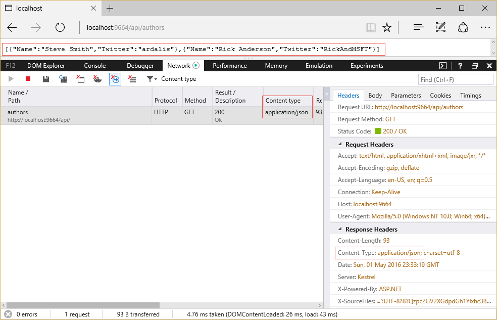
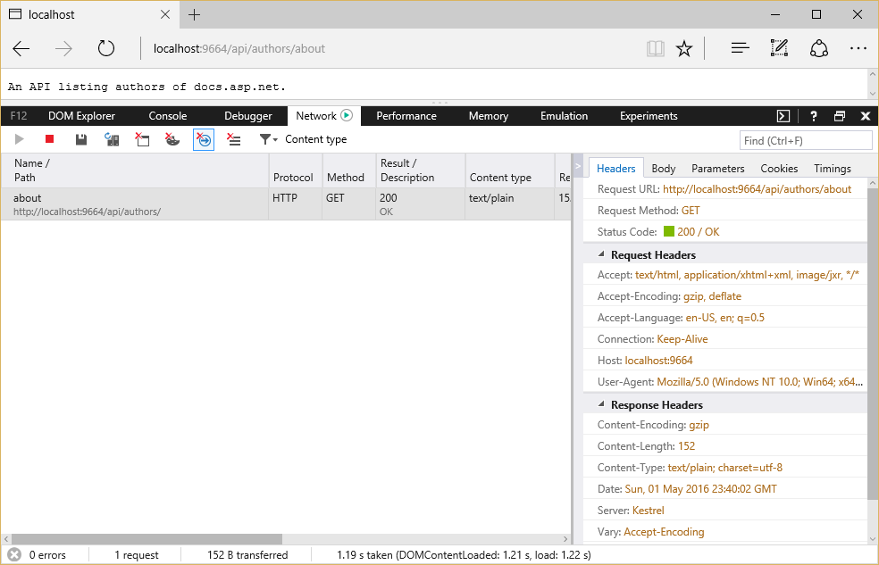
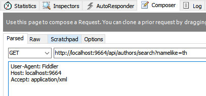
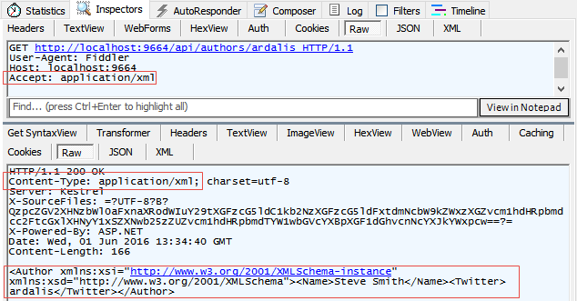
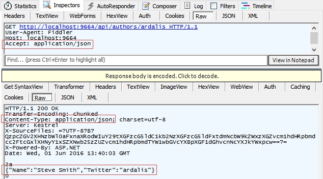

格式化响应数据
========================

原文：`Formatting Response Data <https://docs.asp.net/en/latest/mvc/models/formatting.html>`_

作者：`Steve Smith`_

翻译：`刘怡(AlexLEWIS) <https://github.com/alexinea>`_

校对：`许登洋(Seay) <https://github.com/SeayXu>`_

ASP.NET Core MVC has built-in support for formatting response data, using fixed formats or in response to client specifications.

ASP.NET Core MVC 内建支持对相应数据（response data）的格式化，用来修正格式或生成客户端指定的格式。

.. contents:: Sections
    :local:
    :depth: 1

`View or download sample from GitHub <https://github.com/aspnet/Docs/tree/master/mvc/models/formatting/sample>`_.

`从 GitHub 上查看或下载相关样例 <https://github.com/aspnet/Docs/tree/master/mvc/models/formatting/sample>`_ 。

特定格式的操作结果
------------------------------

Some action result types are specific to a particular format, such as ``JsonResult`` and ``ContentResult``. Actions can return specific results that are always formatted in a particular manner. For example, returning a ``JsonResult`` will return JSON-formatted data, regardless of client preferences. Likewise, returning a ``ContentResult`` will return plain-text-formatted string data (as will simply returning a string).

某些操作结果（Action result）的类型是指定的特定格式，比如 ``JsonResult`` 或 ``ContentResult``。Action 可以返回格式化为特定方式的具体结果。比如返回 ``JsonResult`` 将返回 JSON 格式化数据，而不是客户端要求的的格式。同样地，返回 ``ContentResult`` 将返回纯文本格式的字符串数据（就像是简单第返回一个字符串那样）。

.. note:: An action isn't required to return any particular type; MVC supports any object return value. If an action returns an ``IActionResult`` implementation and the controller inherits from ``Controller``, developers have many helper methods corresponding to many of the choices. Results from actions that return objects that are not ``IActionResult`` types will be serialized using the appropriate ``IOutputFormatter`` implementation.

.. note:: Action 并不强制要求返回一个特定的类型，MVC 支持任何对象作为返回值。如果 Action 返回的是 ``IActionResult`` 的某个实现并且控制器继承自 ``Controller`` ，那么开发人员就可以使用很多辅助方法（对应地就会有很多选择）。从 Action 返回的结果如果不是 ``IActionResult`` 类型的对象的话将使用适当的 ``IOutputFormatter`` 实现序列化。

To return data in a specific format from a controller that inherits from the ``Controller`` base class, use the built-in helper method ``Json`` to return JSON and ``Content`` for plain text. Your action method should return either the specific result type (for instance, ``JsonResult``) or ``IActionResult``.

若要从继承了 ``Controller`` 基类的控制器返回指定格式的数据，可以使用内置的辅助方法 ``Json`` 来返回 JSON 格式，使用 ``Content`` 来返回纯文本。此时你的 Action 方法的返回类型就必须是指定的结果类型（如 ``JsonResult``）或 ``IActionResult``。

Returning JSON-formatted data:

返回 JSON 格式的数据：

.. literalinclude:: formatting/sample/src/ResponseFormattingSample/Controllers/Api/AuthorsController.cs
  :language: c#
  :lines: 21-26
  :emphasize-lines: 3,5
  :dedent: 8

Sample response from this action:

这个操作（Action）将返回的响应样本：

Note that the content type of the response is ``application/json``, shown both in the list of network requests and in the Response Headers section. Also note the list of options presented by the browser (in this case, Microsoft Edge) in the Accept header in the Request Headers section. The current technique is ignoring this header; obeying it is discussed below.

注意，响应的内容类型是 ``application/json``，它同时显示在网络请求列表中和响应的头节点中。另外还要注意，由浏览器（比如 Microsoft Edge）提交的请求头中 Accept 头的选择列表。当前的技术方案是忽略这个头信息，下面将具体讨论。

To return plain text formatted data, use ``ContentResult`` and the ``Content`` helper:

要返回纯文本格式的数据，请使用 ``ContentResult`` 以及 ``Content`` 辅助方法：

.. literalinclude:: formatting/sample/src/ResponseFormattingSample/Controllers/Api/AuthorsController.cs
  :language: c#
  :lines: 47-52
  :emphasize-lines: 3,5
  :dedent: 8

A response from this action:

该 Action 的响应：

Note in this case the ``Content-Type`` returned is ``text/plain``. You can also achieve this same behavior using just a string response type:

注意在此情况下， ``Content-Type`` 将返回 ``test/plain``。你也可以通过一个字符串来实现响应这一相同行为：

.. literalinclude:: formatting/sample/src/ResponseFormattingSample/Controllers/Api/AuthorsController.cs
  :language: c#
  :lines: 54-59
  :emphasize-lines: 3,5
  :dedent: 8

.. tip:: For non-trivial actions with multiple return types or options (for example, different HTTP status codes based on the result of operations performed), prefer ``IActionResult`` as the return type.

.. tip:: 对于将返回不同类型或选项的复杂操作（non-trivial actions）（比如根据操作的结果不同返回不同 HTTP 状态码），那么请使用 ``IActionResult`` 作为返回类型。

内容协商
-------------------

Content negotiation (*conneg* for short) occurs when the client specifies an `Accept header <https://www.w3.org/Protocols/rfc2616/rfc2616-sec14.html>`_. The default format used by ASP.NET Core MVC is JSON. Content negotiation is implemented by ``ObjectResult``. It is also built into the status code specific action results returned from the helper methods (which are all based on ``ObjectResult``). You can also return a model type (a class you've defined as your data transfer type) and the framework will automatically wrap it in an ``ObjectResult`` for you.

内容协商（简写为 *conneg*）是指：当客户端在 `Accept 头 <https://www.w3.org/Protocols/rfc2616/rfc2616-sec14.html>`_ 中指定接受要求时会发生的过程。ASP.NET Core
MVC 默认格式使用的是 JSON。内容协商由 ``ObjectResult`` 实现，它还内置了从辅助方法（它们尽数基于 ``ObjectResult``）为指定的 Action 结果返回状态码的功能。你也可以返回一个模型类型（你自行定义的数据传输类），框架将自动为你将其包装在 ``ObjectResult`` 内。

The following action method uses the ``Ok`` and ``NotFound`` helper methods:

下面的 Action 方法使用 ``Ok`` 和 ``NotFound`` 两种辅助方法：

.. literalinclude:: formatting/sample/src/ResponseFormattingSample/Controllers/Api/AuthorsController.cs
  :language: c#
  :lines: 28-38
  :emphasize-lines: 8,10
  :dedent: 8

A JSON-formatted response will be returned unless another format was requested and the server can return the requested format. You can use a tool like `Fiddler <http://www.telerik.com/fiddler>`_ to create a request that includes an Accept header and specify another format. In that case, if the server has a *formatter* that can produce a response in the requested format, the result will be returned in the client-preferred format.

除非要求返回另一种服务器可以返回的格式，不然将返回 JSON 格式的响应。你可以使用像 `Fiddler <http://www.telerik.com/fiddler>`_ 这样的工具来创建包含 Accept 头的、并且指定另一种格式的请求。在这种情况下，如果服务器具有创建请求中指定格式的 *formatter*，那么该结果将按客户端所选的格式返回。

In the above screenshot, the Fiddler Composer has been used to generate a request, specifying ``Accept: application/xml``. By default, ASP.NET Core MVC only supports JSON, so even when another format is specified, the result returned is still JSON-formatted. You'll see how to add additional formatters in the next section.

在上面的截图中，Fiddler 的 Composer 标签可用于生成请求，并指定 ``Accept: application/xml``。默认情况下，ASP.NET Core MVC 只支持 JSON，所以即使是指定了另一种格式，返回的依旧是 JSON 格式。你可以在下一节中了解到如何增加其它格式。

Controller actions can return POCOs (Plain Old CLR Objects), in which case ASP.NET MVC will automatically create an ``ObjectResult`` for you that wraps the object. The client will get the formatted serialized object (JSON format is the default; you can configure XML or other formats). If the object being returned is ``null``, then the framework will return a ``204 No Content`` response.

控制器的 Action 可以返回 POCO（Plain Old CLR Objects），此时 ASP.NET Core MVC 会自动创建 ``ObjectResult`` 并将该对象进行包装。客户端将获得经序列化后的对象（默认是 JSON 格式，当然你也可以自己配置 XML 或其它格式）、如果对象返回的是 ``null``，那么框架将返回 ``204 No Content`` 响应。

Returning an object type:

返回对象类型：

.. literalinclude:: formatting/sample/src/ResponseFormattingSample/Controllers/Api/AuthorsController.cs
  :language: c#
  :lines: 40-45
  :emphasize-lines: 3
  :dedent: 8

In the sample, a request for a valid author alias will receive a 200 OK response with the author's data. A request for an invalid alias will receive a 204 No Content response. Screenshots showing the response in XML and JSON formats are shown below.

在本例中，有效的作者别名的请求将收到 200 OK 响应（带着作者的数据），而无效别名将收到 204 No Content 响应。截图中分别显示了 XML 和 JSON 的响应。

内容协商过程
^^^^^^^^^^^^^^^^^^^^^^^^^^^

Content *negotiation* only takes place if an ``Accept`` header appears in the request. When a request contains an accept header, the framework will enumerate the media types in the accept header in preference order and will try to find a formatter that can produce a response in one of the formats specified by the accept header. In case no formatter is found that can satisfy the client's request, the framework will try to find the first formatter that can produce a response (unless the developer has configured the option on ``MvcOptions`` to return 406 Not Acceptable instead). If the request specifies XML, but the XML formatter has not been configured, then the JSON formatter will be used. More generally, if no formatter is configured that can provide the requested format, then the first formatter than can format the object is used. If no header is given, the first formatter that can handle the object to be returned will be used to serialize the response. In this case, there isn't any negotiation taking place - the server is determining what format it will use.

内容\ *协商*\ 只在当 ``Accept`` 头出现在请求中时才会发生。当请求包含 Accept 头时，框架将按优先级的顺序枚举媒体类型（media types）并尝试寻找能生产出 Accept 头中指定格式（中的一种）的格式化程序。如果找到可以满足客户端请求的格式化程序，框架将尝试寻找第一个能生产响应的格式化程序（除非开发人员已经在 ``MvcOptions`` 中配置返回 406 Not Acceptable 响应）。如果请求指定的格式是 XML，但 XML 格式化程序并没有被配置，那么将使用 JSON 格式化程序。更通常地来讲，如果没有配置任何可以提供所请求的格式的格式化程序，那么将使用第一个格式化程序来格式化对象。如果没有给定头，那么所返回的对象将使用第一个格式化程序来序列化。在这种情况下并没有发生内容协商——其实是由服务器来决定使用哪种格式来格式化对象。

.. note:: If the Accept header contains ``/``, the Header will be ignored unless ``RespectBrowserAcceptHeader`` is set to true on ``MvcOptions``.

.. note:: 如果 Accept 头中包含 ``/``，那么 Header 将被忽略，除非 ``MvcOptions`` 的 ``RespectBrowserAcceptHeader`` 设置为 true。

浏览器和内容协商
^^^^^^^^^^^^^^^^^^^^^^^^^^^^^^^^

Unlike typical API clients, web browsers tend to supply ``Accept`` headers that include a wide array of formats, including wildcards. By default, when the framework detects that the request is coming from a browser, it will ignore the ``Accept`` header and instead return the content in the application's configured default format (JSON unless otherwise configured). This provides a more consistent experience when using different browsers to consume APIs.

与其它 API 客户端不同，Web 浏览器一般都会在请求中包含 ``Accept`` 头，其中使用通配符（wildcards）。默认情况下，当框架检测到请求来自浏览器，它就会忽略 ``Accept`` 头并返回应用程序配置的默认格式（如果没有另行安排，则默认为 JSON 格式）。这样一来，当使用不同的浏览器消费 API 时提供一致的体验。

If you would prefer your application honor browser accept headers, you can configure this as part of MVC's configuration by setting ``RespectBrowserAcceptHeader`` to ``true`` in the ``ConfigureServices`` method in *Startup.cs*.

如果你希望你的应用程序优先考虑浏览器的 Accept 头，你可以在 MVC 的配置中进行相关配置，具体来讲是在 *Startup.cs* 的 ``ConfigureServices`` 方法中将 ``RespectBrowserAcceptHeader`` 设置为 ``true``。

.. code-block:: c#

  services.AddMvc(options =>
  {
    options.RespectBrowserAcceptHeader = true; // false by default
  }

配置格式化程序
----------------------

If your application needs to support additional formats beyond the default of JSON, you can add these as additional dependencies in *project.json* and configure MVC to support them. There are separate formatters for input and output. Input formatters are used by :doc:`model-binding`; output formatters are used to format responses. You can also configure :doc:`custom-formatters`.

如果你的应用程序需要支持默认的 JSON 之外的格式，那么你需要在 *project.json* 文件中添加这些额外的依赖项，并配置 MVC 来支持它们。输入和输出的格式是可以隔离的。输入格式通过使用 :doc:`model-binding`，输出格式通过使用格式化响应。你也可以配置 :doc:`custom-formatters` 。

添加对 XML 格式的支持
^^^^^^^^^^^^^^^^^^^^^^^^^

To add support for XML formatting, add the "Microsoft.AspNetCore.Mvc.Formatters.Xml" package to your *project.json*'s list of dependencies.

为增加对 XML 格式的支持，需要在 *project.json* 的 dependencies 列表中增加“Microsoft.AspNetCore.Mvc.Formatters.Xml”包。

Add the XmlSerializerFormatters to MVC's configuration in *Startup.cs*:

在 *Startup.cs* 的 MVC 配置中添加 XmlSerializerFormatters：

.. literalinclude:: formatting/sample/src/ResponseFormattingSample/Startup.cs
  :language: c#
  :lines: 30-36
  :emphasize-lines: 4
  :dedent: 8

Alternately, you can add just the output formatter:

或者你可以只添加输出格式：

.. code-block:: c#

  services.AddMvc(options =>
  {
    options.OutputFormatters.Add(new XmlSerializerOutputFormatter());
  });
  
These two approaches will serialize results using `System.Xml.Serialization.XmlSerializer <https://dotnet.github.io/api/System.Xml.Serialization.XmlSerializer.html>`_. If you prefer, you can use the `System.Runtime.Serialization.DataContractSerializer <https://dotnet.github.io/api/System.Runtime.Serialization.DataContractSerializer.html>`_ by adding its associated formatter:

这两种方法都将使用 `System.Xml.Serialization.XmlSerializer <https://dotnet.github.io/api/System.Xml.Serialization.XmlSerializer.html>`_ 序列化结果。如果你愿意，你可以通过添加其它相关格式来使用 `System.Runtime.Serialization.DataContractSerializer <https://dotnet.github.io/api/System.Runtime.Serialization.DataContractSerializer.html>`_ 。

.. code-block:: c#

  services.AddMvc(options =>
  {
    options.OutputFormatters.Add(new XmlDataContractSerializerOutputFormatter());
  });

Once you've added support for XML formatting, your controller methods should return the appropriate format based on the request's ``Accept`` header, as this Fiddler example demonstrates:

一旦你添加了对 XML 格式的支持，你的控制器方法就可以根据 ``Accept`` 头信息来返回相应的格式了，就像下面这个 Fiddler 的演示：

You can see in the Inspectors tab that the Raw GET request was made with an ``Accept: application/xml`` header set. The response pane shows the ``Content-Type: application/xml`` header, and the ``Author`` object has been serialized to XML.

你可以在 Inspectors 标签下看到，原始 GET 请求设置了 ``Accept: application/xml`` 头，在响应面板中显示 ``Content-Type: application/xml`` 头，并且有一个已经被序列化为 XML 格式的 ``Author`` 对象。

Use the Composer tab to modify the request to specify ``application/json`` in the ``Accept`` header. Execute the request, and the response will be formatted as JSON:

使用 Composer 面板可以修改请求，把 ``Accept`` 头改为 ``application/json``，然后执行这个请求，此时将获得一个格式化为 JSON 格式的响应：

In this screenshot, you can see the request sets a header of ``Accept: application/json`` and the response specifies the same as its ``Content-Type``. The ``Author`` object is shown in the body of the response, in JSON format.

在这个截图中，你可以发现请求报文中的 ``Accept: application/json`` 头以及与之相同的响应 ``Content-Type`` 。同时 ``Author`` 对象也序列化为 JSON 格式后出现在响应报文中。

强制特定格式化
^^^^^^^^^^^^^^^^^^^^^^^^^^^

If you would like to restrict the response formats for a specific action you can, you can apply the ``[Produces]`` filter. The ``[Produces]`` filter specifies the response formats for a specific action (or controller). Like most :doc:`/mvc/controllers/filters`, this can be applied at the action, controller, or global scope.

若是你想为某个 action 限制响应格式，可以使用 ``[Produces]`` 过滤器。``[Produces]`` 过滤器可以为这个控制器或 Action 指定响应格式。就像大多数 :doc:`/mvc/controllers/filters` 那样，这一过滤器可应用于 Action、控制器，甚至全局范围。

.. code-block:: c#

  [Produces("application/json")]
  public class AuthorsController

The ``[Produces]`` filter will force all actions within the ``AuthorsController`` to return JSON-formatted responses, even if other formatters were configured for the application and the client provided an ``Accept`` header requesting a different, available format. See :doc:`/mvc/controllers/filters` to learn more, including how to apply filters globally.

``[Produces]`` 过滤器会强制要求所有 ``AuthorsController`` 内的 Action 返回 JSON 格式的响应，即使其它格式化程序已经在应用程序中配置了、且客户端也通过 ``Accept`` 头指明要返回 JSON 之外的其他可用格式。更多请查阅 :doc:`/mvc/controllers/filters`，包括如何在全局范围应用过滤器。

特例格式化程序
^^^^^^^^^^^^^^^^^^^^^^^

Some special cases are implemented using built-in formatters. By default, ``string`` return types will be formatted as `text/plain` (`text/html` if requested via ``Accept`` header). This behavior can be removed by removing the ``TextOutputFormatter``. You remove formatters in the ``Configure`` method in *Startup.cs* (shown below). Actions that have a model object return type will return a 204 No Content response when returning ``null``. This behavior can be removed by removing the ``HttpNoContentOutputFormatter``. The following code removes the ``TextOutputFormatter`` and ``HttpNoContentOutputFormatter`` .

一些特殊情况下使用的是内建的格式化实现。默认情况下，返回类型为 ``string`` 将格式化为 ``text/plain`` （如果通过 ``Accept`` 头的话则是 ``text/html`` ）。这种行为可以通过移除 ``TextOutputFormatter`` 来改变。如果你如下例代码这般在 *Startup.cs* 的 ``Configure`` 方法中移除了 ``HttpNoContentOutputFormatter``，那么当你某个返回类型为模型对象的 Action 返回了 ``null`` 时将返回 204 No Content 响应。下列代码移除了 ``TextOutputFormatter`` 和 ``HttpNoContentOutputFormatter`` 。

.. code-block:: c#

  services.AddMvc(options =>
  {
    options.OutputFormatters.RemoveType<TextOutputFormatter>();
    options.OutputFormatters.RemoveType<HttpNoContentOutputFormatter>();
  });

Without the ``TextOutputFormatter``, ``string`` return types return 406 Not Acceptable, for example. Note that if an XML formatter exists, it will format ``string`` return types if the ``TextOutputFormatter`` is removed.

如果没有 ``TextOutputFormatter``，返回类型为 ``string`` 的操作将返回 406 Not Acceptable。此时请注意，如果存在 XML 格式化程序，此时将格式化该响应结果。

Without the ``HttpNoContentOutputFormatter``, null objects are formatted using the configured formatter. For example, the JSON formatter will simply return a response with a body of ``null``, while the XML formatter will return an empty XML element with the attribute ``xsi:nil="true"`` set.

如果没有 ``HttpNoContentOutputFormatter``，空对象将使用配置的格式进行格式化。比如 JSON 格式将简单的返回主体信息为 ``null`` 的响应，而 XML 格式将返回一个空的带有 ``xsi:nil="true"`` 特性集的 XML 元素。

响应格式 URL 映射
----------------------------

Clients can request a particular format as part of the URL, such as in the query string or part of the path, or by using a format-specific file extension such as .xml or .json. The mapping from request path should be specified in the route the API is using. For example:

客户端可以在 URL 中请求特定的格式，比如在请求字符串（query string）或路径（path）中，或者索性使用特定格式的文件扩展名（比如 .xml 或 .json）。从请求路径中进行映射的话需要在 API 所使用的路由中进行指定，比如：

.. code-block:: c#

  [FormatFilter]
  public class ProductsController
  {
    [Route("[controller]/[action]/{id}.{format?}")]
    public Product GetById(int id)
  
This route would allow the requested format to be specified as an optional file extension. The ``[FormatFilter]`` attribute checks for the existence of the format value in the ``RouteData`` and will map the response format to the appropriate formatter when the response is created.

这一路由配置将允许使用可选的文件扩展名来指定格式。``[FormatFilter]`` 特性将在 ``RouteData`` 中检查该格式的值是否存在，并在创建响应时将响应数据映射为适当的格式。

.. list-table:: Examples
  :header-rows: 1
  
  * - Route
    - Formatter
  * - ``/products/GetById/5`` 
    - The default output formatter
  * - ``/products/GetById/5.json``
    - The JSON formatter (if configured)
  * - ``/products/GetById/5.xml``
    - The XML formatter (if configured)

  * - 路由
    - 格式化
  * - ``/products/GetById/5`` 
    - 默认输出格式
  * - ``/products/GetById/5.json``
    - JSON 格式（如果配置了的话）
  * - ``/products/GetById/5.xml``
    - XML 格式（如果配置了的话）