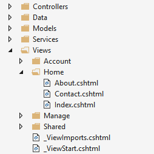
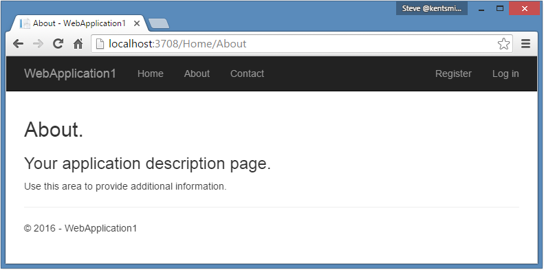

Views Overview
==============

视图概述
==============

作者： `Steve Smith`_

翻译：`姚阿勇（Dr.Yao） <https://github.com/YaoaY>`_

ASP.NET MVC Core controllers can return formatted results using *views*.

ASP.NET MVC Core 的控制器可以利用 *视图* 返回格式化结果。

.. contents:: Sections
  :local:
  :depth: 1

What are Views?
---------------

什么是视图？
---------------

In the Model-View-Controller (MVC) pattern, the *view* encapsulates the presentation details of the user's interaction with the app. Views are HTML templates with embedded code that generate content to send to the client. Views use :doc:`Razor syntax <razor>`, which allows code to interact with HTML with minimal code or ceremony.

在模型-视图-控制器（MVC）模式中，*视图* 封装用户与应用交互的表现细节。视图是带有嵌入代码的 HTML 模版，用以生成发送给客户端的内容。视图采用 :doc:`Razor 语法 <razor>` ，该语法允许以最小的代码量或复杂度与 HTML 进行编码交互。

ASP.NET Core MVC views are *.cshtml* files stored by default in a *Views* folder within the application. Typically, each controller will have its own folder, in which are views for specific controller actions. 

ASP.NET Core MVC 视图默认以 *.cshtml* 文件保存在应用程序的 *Views* 文件夹里面。通常，每个控制器都会有自己的文件夹，里面是对应控制器操作的视图。

In addition to action-specific views, :doc:`partial views <partial>`, :doc:`layouts, and other special view files <layout>` can be used to help reduce repetition and allow for reuse within the app's views.

除了对应操作的视图，:doc:`局部视图 <partial>`, :doc:`布局，以及其他特定视图文件 <layout>` 可以用来帮助减少重复并允许在应用视图里重用。

Benefits of Using Views
-----------------------

使用视图的好处
-----------------------

Views provide `separation of concerns <http://deviq.com/separation-of-concerns/>`_ within an MVC app, encapsulating user interface level markup separately from business logic. ASP.NET MVC views use :doc:`Razor syntax <razor>` to make switching between HTML markup and server side logic painless. Common, repetitive aspects of the app's user interface can easily be reused between views using :doc:`layout and shared directives <layout>` or :doc:`partial views <partial>`.

视图在 MVC 应用中提供 `关注点分离 <http://deviq.com/separation-of-concerns/>`_ ，将用户界面层级的标记从业务逻辑中封装出来。ASP.NET MVC 视图采用 :doc:`Razor 语法 <razor>` 在 HTML 标记和服务端逻辑之间进行轻松切换。通常，可以通过 :doc:`布局与共享指令 <layout>` 或者 :doc:`局部视图 <partial>` 对应用的用户界面中重复的外观轻松地进行复用。

Creating a View
---------------

创建视图
---------------

Views that are specific to a controller are created in the *Views/[ControllerName]* folder. Views that are shared among controllers are placed in the */Views/Shared* folder. Name the view file the same as its associated controller action, and add the *.cshtml* file extension. For example, to create a view for the *About* action on the *Home* controller, you would create the *About.cshtml* file in the */Views/Home* folder.

属于某个控制器的视图创建在 *Views/[ControllerName]* 文件夹下。在控制器之间共用的视图则放在 */Views/Shared* 文件夹下。将视图文件命名为与其关联的控制器操作一样的名字，并添加 *.cshtml* 文件扩展名。例如，为 *Home* 控制器的 *About* 操作创建一个视图，你应该在 */Views/Home* 文件夹下创建一个 *About.cshtml* 文件。

A sample view file (*About.cshtml*):

一个示例视图文件 （ *About.cshtml* ）：

.. literalinclude:: /../common/samples/WebApplication1/src/WebApplication1/Views/Home/About.cshtml
   :language: html

*Razor* code is denoted by the ``@`` symbol. C# statements are run within Razor code blocks set off by curly braces (``{`` ``}``), such as the assignment of "About" to the ``ViewData["Title"]`` element shown above. Razor can be used to display values within HTML by simply referencing the value with the ``@`` symbol, as shown within the ``<h2>`` and ``<h3>`` elements above.

``@`` 符号代表 *Razor* 代码。 C# 语句在大括号（ ``{`` ``}`` ）包裹的 Razor 代码块中运行，就像上面展示的用 “About” 给 ``ViewData["Title"]`` 元素进行的赋值操作那样。Razor 可以通过简单地用 ``@`` 符号对值进行引用从而在 HTML 里显示它们，就像上面 ``<h2>`` 和 ``<h3>`` 元素里面展示的那样。

This view focuses on just the portion of the output for which it is responsible. The rest of the page's layout, and other common aspects of the view, are specified elsewhere. Learn more about :doc:`layout and shared view logic <layout>`.

这个视图只关心由它负责的这部分输出。而页面布局的其余部分，以及视图中的通用外观，则在别的地方指定。了解更多关于 :doc:`布局与共享视图逻辑 <layout>` 。

How do Controllers Specify Views?
---------------------------------

控制器如何指定视图？
---------------------------------

Views are typically returned from actions as a :dn:cls:`~Microsoft.AspNetCore.Mvc.ViewResult`. Your action method can create and return a ``ViewResult`` directly, but more commonly if your controller inherits from :dn:cls:`~Microsoft.AspNetCore.Mvc.Controller`, you'll simply use the ``View`` helper method, as this example demonstrates:

视图通常作为一个 :dn:cls:`~Microsoft.AspNetCore.Mvc.ViewResult` 从操作中返回。你的操作方法可以直接返回一个 ``ViewResult`` ，但是更常见的是如果你的控制器是继承自 :dn:cls:`~Microsoft.AspNetCore.Mvc.Controller` 的，那么可以简单地使用 ``View`` 辅助方法，如下例所示：

*HomeController.cs*

.. literalinclude:: /../common/samples/WebApplication1/src/WebApplication1/Controllers/HomeController.cs
  :language: c#
  :lines: 16-21
  :emphasize-lines: 5
  :dedent: 4
  
The ``View`` helper method has several overloads to make returning views easier for app developers. You can optionally specify a view to return, as well as a model object to pass to the view.

这个 ``View`` 辅助方法有多个重载版本以便于帮助应用开发人员返回视图。你可以有选择性地指定一个返回的视图，还可以给视图传递一个模型对象。

When this action returns, the *About.cshtml* view shown above is rendered:

当这个操作返回时，上面展示的 *About.cshtml* 视图将会被渲染：

View Discovery
^^^^^^^^^^^^^^

视图发现
^^^^^^^^^^^^^^

When an action returns a view, a process called *view discovery* takes place. This process determines which view file will be used. Unless a specific view file is specified, the runtime looks for a controller-specific view first, then looks for matching view name in the *Shared* folder.

当操作返回视图的时，会进行一个叫做 *视图发现* 的过程。这个过程决定哪个视图文件将被采用。如果没有指定特定的视图文件，运行时首先会寻找与控制器对应的视图，然后再去 *Shared* 文件夹里寻找匹配的视图名称。

When an action returns the ``View`` method, like so ``return View();``, the action name is used as the view name. For example, if this were called from an action method named "Index", it would be equivalent to passing in a view name of "Index". A view name can be explicitly passed to the method (``return View("SomeView");``). In both of these cases, view discovery searches for a matching view file in:

当操作返回 ``View`` 方法，就像 ``return View();`` 这样，这个操作的名字则被用作视图名称。例如，假如这是从一个叫做 “ Index ” 的操作方法调用的，那么它就等价于传递了一个视图名称 “ Index ” 。也可以给这个方法传递一个明确的视图名称（ ``return View("SomeView");`` ）。在这两种情况中，视图探寻都会在以下位置搜索匹配的视图文件：

  1. Views/<ControllerName>/<ViewName>.cshtml
  2. Views/Shared/<ViewName>.cshtml

  1. Views/<控制器名称>/<视图名称>.cshtml
  2. Views/Shared/<视图名称>.cshtml
  
.. tip:: We recommend following the convention of simply returning ``View()`` from actions when possible, as it results in more flexible, easier to refactor code.

.. tip:: 我们推荐遵循约定，在可能的情况下简单地从操作中返回 ``View()`` ，这样会更加灵活，更易于重构代码。

A view file path can be provided, instead of a view name. In this case, the *.cshtml* extension must be specified as part of the file path. The path should be relative to the application root (and can optionally start with "/" or "~/"). For example: ``return View("Views/Home/About.cshtml");``

可以提供视图文件路径，而非视图名。在这种情况下，*.cshtml* 扩展名必须作为文件路径的一部分明确指定。路径可以是相对于应用程序根目录的（可以选择性地以 “ / ” 或者 “ ~/ ” 开头）。例如： ``return View("Views/Home/About.cshtml");``

.. note:: :doc:`Partial views <partial>` and :doc:`view components <view-components>` use similar (but not identical) discovery mechanisms.

.. note:: :doc:`局部视图 <partial>`  以及 :doc:`视图组件 <view-components>` 采用了类似（但不完全一致）的发现机制。

.. note:: You can customize the default convention regarding where views are located within the app by using a custom :dn:iface:`~Microsoft.AspNetCore.Mvc.Razor.IViewLocationExpander`.

.. note:: 你可以通过自定义的 :dn:iface:`~Microsoft.AspNetCore.Mvc.Razor.IViewLocationExpander` 来定制关于应用中的视图位于哪里的默认约定。

.. tip:: View names may be case sensitive depending on the underlying file system. For compatibility across operating systems, always match case between controller and action names and associated view folders and filenames.

.. tip:: 取决于基本文件系统，视图名称可能会区分大小写。为了跨系统的兼容性，应当总是保持控制器与操作名称同相关联的视图文件夹与文件名之间保持大小写一致。

Passing Data to Views
---------------------

给视图传递数据
---------------------

You can pass data to views using several mechanisms. The most robust approach is to specify a *model* type in the view (commonly referred to as a *viewmodel*, to distinguish it from business domain model types), and then pass an instance of this type to the view from the action. We recommend you use a model or view model to pass data to a view. This allows the view to take advantage of strong type checking. You can specify a model for a view using the ``@model`` directive:

你可以使用多种机制给视图传递数据。最健壮的方式就是在视图中指定一个 *模型* 类型（通常称为 *视图模型* ，以区别于业务领域的模型类型 ），然后从操作中给视图传递一个该类型的实例。我们推荐你采用模型或视图模型给视图传递数据。这使得视图可以利用到强类型检查的优势。你可以通过 ``@model`` 指令为视图指定一个模型：

.. code-block:: html
    :emphasize-lines: 1

    @model WebApplication1.ViewModels.Address
    <h2>Contact</h2>
    <address>
        @Model.Street 
        @Model.City, @Model.State @Model.PostalCode 
        <abbr title="Phone">P:</abbr>
        425.555.0100
    </address>

Once a model has been specified for a view, the instance sent to the view can be accessed in a strongly-typed manner using ``@Model`` as shown above. To provide an instance of the model type to the view, the controller passes it as a parameter:

一旦为视图指定了模型，就可以像上面展示的那样，通过 ``@Model`` 以强类型的方式访问发送给视图的实例。为了给视图提供模型类型的实例，控制器将其作为参数传递进去：

.. code-block:: c#
    :emphasize-lines: 13
   
    public IActionResult Contact()
    {
        ViewData["Message"] = "Your contact page.";

        var viewModel = new Address()
        {
            Name = "Microsoft",
            Street = "One Microsoft Way",
            City = "Redmond",
            State = "WA",
            PostalCode = "98052-6399"
        };
        return View(viewModel);
    }

There are no restrictions on the types that can be provided to a view as a model. We recommend passing Plain Old CLR Object (POCO) view models with little or no behavior, so that business logic can be encapsulated elsewhere in the app. An example of this approach is the *Address* viewmodel used in the example above:

对于能够作为模型提供给视图的类型没有限制。我们推荐传递具有少量行为或者没有行为的普通旧 CLR 对象（Plain Old CLR Object，POCO）视图模型，这样就可以在应用的其他地方封装业务逻辑。这种方法的一个例子就是上面示例中的 *Address* 视图模型：

.. code-block:: c#
    :emphasize-lines: 13
   
    namespace WebApplication1.ViewModels
    {
        public class Address
        {
            public string Name { get; set; }
            public string Street { get; set; }
            public string City { get; set; }
            public string State { get; set; }
            public string PostalCode { get; set; }
        }
    }

.. note:: Nothing prevents you from using the same classes as your business model types and your display model types. However, keeping them separate allows your views to vary independently from your domain or persistence model, and can offer some security benefits as well (for models that users will send to the app using :doc:`model binding </mvc/models/model-binding>`).

.. note:: 虽然你可以使用相同的类作为你的业务模型类型和显示模型类型。然而，将它们与你的领域或持久模型区分开来可以使视图独立地变化，并且还可以提供一些安全上的收益（对于那些用户通过 :doc:`模型绑定 </mvc/models/model-binding>` 发送给应用的模型）。

Loosely Typed Data
^^^^^^^^^^^^^^^^^^

弱类型数据
^^^^^^^^^^^^^^^^^^

In addition to strongly typed views, all views have access to a loosely typed collection of data. This same collection can be referenced through either the ``ViewData`` or ``ViewBag`` properties on controllers and views. The ``ViewBag`` property is a wrapper around ``ViewData`` that provides a dynamic view over that collection. It is not a separate collection.

除了强类型视图之外，所有的视图都可以访问弱类型的数据集合。这个集合可以通过控制器和视图的 ``ViewData`` 或者 ``ViewBag`` 属性来引用。``ViewBag`` 属性是对 ``ViewData`` 的封装用以在集合上提供动态视图。它不是一个独立的集合。  

``ViewData`` is a dictionary object accessed through ``string`` keys. You can store and retrieve objects in it, and you'll need to cast them to a specific type when you extract them. You can use ``ViewData`` to pass data from a controller to views, as well as within views (and partial views and layouts). String data can be stored and used directly, without the need for a cast.

``ViewData`` 是一个通过 ``string`` 键访问的字典对象。你可以在里面储存和查询对象，并且在提取它们的时候无需转换成特定的类型。可以利用 ``ViewData`` 从控制器传递数据给视图，以及在视图之间（还有局部视图与布局）。字符串数据可以直接储存和使用，无需进行转换。

Set some values for ``ViewData`` in an action:

在操作中为 ``ViewData`` 设置一些值：

.. code-block:: c#

    public IActionResult SomeAction()
    {
        ViewData["Greeting"] = "Hello";
        ViewData["Address"]  = new Address()
        {
            Name = "Steve",
            Street = "123 Main St",
            City = "Hudson",
            State = "OH",
            PostalCode = "44236"
        };
        
        return View();
    }

Work with the data in a view:

在视图中使用数据：

.. code-block:: html
    :emphasize-lines: 3,6
   
    @{
        // Requires cast
        var address = ViewData["Address"] as Address;
    }

    @ViewData["Greeting"] World!

    <address>
        @address.Name 
        @address.Street 
        @address.City, @address.State @address.PostalCode
    </address>

The ``ViewBag`` objects provides dynamic access to the objects stored in ``ViewData``. This can be more convenient to work with, since it doesn't require casting. The same example as above, using ``ViewBag`` instead of a strongly typed ``address`` instance in the view:

``ViewBag`` 对象为储存在 ``ViewData`` 里的对象提供动态访问。这样使用起来就更方便了，因为不需要转换。与上面的例子一样，在视图中采用了 ``ViewBag`` 而不是强类型的 ``Address`` 实例： 

.. code-block:: html
    :emphasize-lines: 1,4-6

    @ViewBag.Greeting World!

    <address>
        @ViewBag.Address.Name 
        @ViewBag.Address.Street 
        @ViewBag.Address.City, @ViewBag.Address.State @ViewBag.Address.PostalCode
    </address>

.. note:: Since both refer to the same underlying ``ViewData`` collection, you can mix and match between ``ViewData`` and ``ViewBag`` when reading and writing values, if convenient.

.. note:: 由于二者引用的是相同的底层 ``ViewData`` 集合，在你读取和写入值的时候，可以根据方便与否来协调混用 ``ViewData`` 和 ``ViewBag`` 。

Dynamic Views
^^^^^^^^^^^^^

动态视图
^^^^^^^^^^^^^

Views that do not declare a model type but have a model instance passed to them can reference this instance dynamically. For example, if an instance of ``Address`` is passed to a view that doesn't declare an ``@model``, the view would still be able to refer to the instance's properties dynamically as shown:

对于没有声明模型类型但给它们传递了模型实例的视图，可以动态地引用这个实例。例如，如果将一个 ``Address`` 实例传给了一个并没有声明 ``@model`` 的视图，那么这个视图还是能够像下面展示的那样去引用这个实例的属性：

.. code-block:: html
    :emphasize-lines: 13,16-18
    
    <address>
        @Model.Street 
        @Model.City, @Model.State @Model.PostalCode 
        <abbr title="Phone">P:</abbr>
        425.555.0100
    </address>

This feature can offer some flexibility, but does not offer any compilation protection or IntelliSense. If the property doesn't exist, the page will fail at runtime.

这种特性能提供一些灵活性，但无法提供编译保护和智能提示。如果属性并不存在，页面将在运行时出错。

More View Features
------------------

更多视图特性
------------------

:doc:`Tag helpers <tag-helpers/intro>` make it easy to add server-side behavior to existing HTML tags, avoiding the need to use custom code or helpers within views. Tag helpers are applied as attributes to HTML elements, which are ignored by editors that aren't familiar with them, allowing view markup to be edited and rendered in a variety of tools. Tag helpers have many uses, and in particular can make :doc:`working with forms <working-with-forms>` much easier.

:doc:`Tag helpers <tag-helpers/intro>` 便于给已有的 HTML 标记添加服务端行为，不需要视图中的自定义代码或助手代码。Tag helper 是作为 HTML 元素的属性启用的，会被不认识它们的编辑器忽略掉，使得视图标签可以被很多的工具编辑和渲染。Tag helper 有很多用途，尤其是非常便于 :doc:`使用表单 <working-with-forms>` 。 

Generating custom HTML markup can be achieved with many built-in :doc:`HTML Helpers <html-helpers>`, and more complex UI logic (potentially with its own data requirements) can be encapsulated in :doc:`view-components`. View components provide the same separation of concerns that controllers and views offer, and can eliminate the need for actions and views to deal with data used by common UI elements.

可以用很多内置的 :doc:`HTML Helpers <html-helpers>` 生成自定义的 HTML 标记，更复杂的 UI 逻辑（可能有它自己的数据需求）可以在 :doc:`view-components` 中封装。与控制器和视图一样，视图组件也提供关注点分离，并且无需操作和视图就可以处理通用 UI 元素用到的数据。

Like many other aspects of ASP.NET Core, views support :doc:`dependency injection </fundamentals/dependency-injection>`, allowing services to be :doc:`injected into views <dependency-injection>`.

与 ASP.NET Core 的很多方面一样，视图也支持 :doc:`依赖注入 </fundamentals/dependency-injection>` ，允许将服务 :doc:`注入到视图 <dependency-injection>` 。
