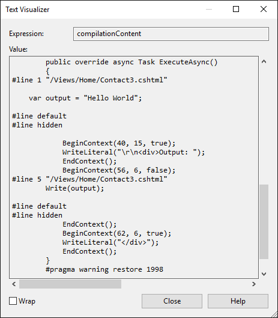

Razor 语法参考
===========================

作者： `Taylor Mullen <https://twitter.com/ntaylormullen>`__ 与 `Rick Anderson`_
翻译： `刘怡(AlexLEWIS) <https://github.com/alexinea>`_
校对：

.. contents:: Sections
  :local:
  :depth: 1

什么是 Razor？
--------------

Razor is a markup syntax for embedding server based code into web pages. The Razor syntax consists of Razor markup, C# and HTML. Files containing Razor generally have a *.cshtml* file extension.

Razor 是一种基于服务器端代码的可以转换为网页的标记语法。Razor 语法包括 Razor 标记、C# 和 HTML 组成。包含 Razor 的文件通常后缀名为 *.cshtml* 。

渲染 HTML
--------------

The default Razor language is HTML. Rendering HTML from Razor is no different than in an HTML file. A Razor file with the following markup:

Razor 的默认语言是 HTML。从 Razor 渲染为 HTML 和直接一个 HTML 文件没啥区别，这种 Razor 文件包含下面这种标记：

.. code-block:: html

  
Hello World

Is rendered unchanged as ``
Hello World
`` by the server.

服务器最后渲染出的页面也是 ``
Hello World
``，没有任何不改变。

Razor 语法
----------------------

Razor supports C# and uses the ``@`` symbol to transition from HTML to C#. Razor evaluates C# expressions and renders them in the HTML output. Razor can transition from HTML into C# or into Razor specific markup. When an ``@`` symbol is followed by a :ref:`Razor reserved keyword <razor-reserved-keywords-label>` it transitions into Razor specific markup, otherwise it transitions into plain C# .

Razor 支持 C# 并通过使用 ``@`` 符号从 HTML 切换到 C#。Razor 运算 C# 表达式并将之渲染为 HTML 输出。Razor 能通过 Razor 指定的标记从 HTML 切换到 C#。当 ``@`` 符号后面紧跟一个 :ref:`Razor 保留字 <razor-reserved-keywords-label>` ，则将切换为 Razor 特定标记，不然的话切换到普通的 C#。

.. _escape-at-label:

HTML containing ``@`` symbols may need to be escaped with a second ``@`` symbol. For example:

HTML 如果需要包含 ``@`` 符号的话需要使用两个 ``@@`` 符号来进行转移，比如：

.. code-block:: html

 
@@Username

would render the following HTML:

这样将渲染成这样一段 HTML：

.. code-block:: html

 
@Username

.. _razor-email-ref:

HTML attributes and content containing email addresses don’t treat the ``@`` symbol as a transition character.

这样就不会因为在 HTML 特性或内容中包含邮件地址而误将 ``@`` 处理为转换字符（进而切换到 Razor 指定标记或 C# 模式）。

 ``<a href="mailto:Support@contoso.com">Support@contoso.com</a>``

隐式 Razor 表达式
---------------------------

Implicit Razor expressions start with ``@`` followed by C# code. For example:

隐式 Razor 表达式起于 ``@`` 符号，后面紧跟 C# 代码，比如：

.. code-block:: html

  
@DateTime.Now

  
@DateTime.IsLeapYear(2016)

With the exception of the C# ``await`` keyword implicit expressions must not contain spaces. For example, you can intermingle spaces as long as the C# statement has a clear ending:

除 C# 关键字 ``await`` 以外的隐式表达式都不能包含空格。比如你可以在 C# 语句中混进一些空格，只要 C# 语句的结尾明确：

.. code-block:: html

  
@await DoSomething("hello", "world")

.. _explicit-razor-expressions:

显式 Razor 表达式
----------------------------

Explicit Razor expressions consists of an @ symbol with balanced parenthesis. For example, to render last weeks’ time:

显式 Razor 表达式包含一个带一对括号的 ``@`` 符号，比如在页面上渲染上周的时间：

.. code-block:: html

  
Last week this time: @(DateTime.Now - TimeSpan.FromDays(7))

Any content within the @() parenthesis is evaluated and rendered to the output.

任何在 ``@()`` 内的内容都会被运算并渲染输出。

Implicit expressions generally cannot contain spaces. For example, in the code below, one week is not subtracted from the current time:

隐式表达式通常不能包含空格，比如在下面这段代码，上周的时间并不能通过减去当前时间来获得：

.. literalinclude:: razor/sample/Views/Home/Contact.cshtml
  :language: html
  :start-after: @* End of greeting *@
  :end-before: @*Add () to get correct time.*@

Which renders the following HTML:

这将会被渲染为：

.. code-block:: html

  
Last week: 7/7/2016 4:39:52 PM - TimeSpan.FromDays(7)

You can use an explicit expression to concatenate text with an expression result:

不过你可以使用显式表达式在表达式结果中把这段文本连接起来：

.. code-block:: none
  :emphasize-lines: 5

  @{
      var joe = new Person("Joe", 33);
   }

  
Age@(joe.Age)

Without the explicit expression, ``
Age@joe.Age
`` would be treated as an email address and ``
Age@joe.Age
`` would be rendered. When written as an explicit expression, ``
Age33
`` is rendered.

如果写成 ``
Age@joe.Age
`` 这种非显式表达式，那么它将当做邮件地址来处理并渲染为 ``
Age@joe.Age
``。当写成显式表达式时，将渲染为 ``
Age33
`` 。

.. _expression-encoding-label:

Expression 编码
-------------------

C# expressions that evaluate to a string are HTML encoded. C# expressions that evaluate to :dn:iface:`~Microsoft.AspNetCore.Html.IHtmlContent` are rendered directly through `IHtmlContent.WriteTo`. C# expressions that don't evaluate to `IHtmlContent` are converted to a string (by `ToString`) and encoded before they are rendered. For example, the following Razor markup:

C# 表达式计算后的字符串是 HTML 编码的。C# 表达式的计算结果为 :dn:iface:`~Microsoft.AspNetCore.Html.IHtmlContent`，将直接通过 `IHtmlContent.WriteTo` 渲染到页面。不会计算为 `IHtmlContent` 的 C# 表达式将会转换为字符串（通过 `ToString`）并在渲染前编码。比方说下面这段 Razor 标记：

.. code-block:: html

  @("Hello World")

Renders this HTML:

将渲染为这段 HTML：

.. code-block:: html

  &lt;span&gt;Hello World&lt;/span&gt;

Which the browser renders as:

而浏览器将显示为：

``Hello World``

:dn:cls:`~Microsoft.AspNetCore.Mvc.ViewFeatures.HtmlHelper` :dn:method:`~Microsoft.AspNetCore.Mvc.ViewFeatures.HtmlHelper.Raw` output is not encoded but rendered as HTML markup.

:dn:cls:`~Microsoft.AspNetCore.Mvc.ViewFeatures.HtmlHelper` :dn:method:`~Microsoft.AspNetCore.Mvc.ViewFeatures.HtmlHelper.Raw` 的输出不会被转码但会被渲染为 HTML 标记。

.. warning:: Using ``HtmlHelper.Raw`` on unsanitized user input is a security risk. User input might contain malicious JavaScript or other exploits. Sanitizing user input is difficult, avoid using ``HtmlHelper.Raw`` on user input.

.. warning:: 为未经认可的用户输入使用 ``HtmlHelper.Raw`` 是存在安全风险的。用户输入可能会包含恶意的 JavaScript 代码或其他攻击。为用户输入的信息进行过滤和清理是非常困难的，所以尽量避免为用户输入使用 ``HtmlHelper.Raw``。

The following Razor markup:

下面这段 Razor 标记：

.. code-block:: html

  @Html.Raw("Hello World")

Renders this HTML:

将渲染为：

.. code-block:: html

  Hello World

.. _razor-code-blocks-label:

Razor 代码块
------------------

Razor code blocks start with ``@`` and are enclosed by ``{}``. Unlike expressions, C# code inside code blocks is not rendered. Code blocks and expressions in a Razor page share the same scope and are defined in order (that is, declarations in a code block will be in scope for later code blocks and expressions).

Razor 代码块起于 ``@`` 并通过 ``{}`` 闭包。不像表达式，代码块内的 C# 代码不会被渲染到页面中。Razor 页面中的代码块和表达式将共享同一个作用域，并按顺序定义（也就是说，之前在代码块中声明的对象可以在之后的代码块与表达式中使用）。

.. code-block:: none

  @{
      var output = "Hello World";
  }

  
The rendered result: @output

Would render:

将渲染为：

.. code-block:: html

  
The rendered result: Hello World

.. _implicit-transitions-label:

隐式转换
^^^^^^^^^^^^^^^^^^^^^

The default language in a code block is C#, but you can transition back to HTML. HTML within a code block will transition back into rendering HTML:

代码块的默认语言是 C#，但你可以随时过渡回 HTML。代码块内的 HTML 可以正确渲染。

.. code-block:: none

  @{
      var inCSharp = true;
      
Now in HTML, was in C# @inCSharp

  }

.. _explicit-delimited-transition-label:

显式分隔转换
^^^^^^^^^^^^^^^^^^^^^^^^^^^^^

To define a sub-section of a code block that should render HTML, surround the characters to be rendered with the Razor ``<text>`` tag:

为定义在代码块中可渲染出 HTML，应在需要渲染的字符周围用 Razor ``<text>`` 标签环绕：

.. code-block:: none
  :emphasize-lines: 4

  @for (var i = 0; i < people.Length; i++)
  {
      var person = people[i];
      <text>Name: @person.Name</text>
  }

You generally use this approach when you want to render HTML that is not surrounded by an HTML tag. Without an HTML or Razor tag, you get a Razor runtime error.

当你需要渲染一段不包含 HTML 标签的 HTML 内容时可以试试这种办法。不过如果即不包含 HTML 标签也不包含 Razor 标签的话，你的 Razor 页面会在运行时出错。

.. _explicit-line-transition-with-label:

以 ``@:`` 符号显式行转换
^^^^^^^^^^^^^^^^^^^^^^^^^^^^^^^^^^^^^

To render the rest of an entire line as HTML inside a code block, use the ``@:`` syntax:

为了将 HTML 内嵌到代码块中（以便能渲染出来），可以使用 ``@:`` 语法：

.. code-block:: none
  :emphasize-lines: 4

  @for (var i = 0; i < people.Length; i++)
  {
      var person = people[i];
      @:Name: @person.Name
  }

Without the ``@:`` in the code above, you'd get a Razor run time error.

如果上面代码不使用 ``@:`` ，你的 Razor 页面会在运行时出错。

.. _control-structures-razor-label:

控制结构
------------------

Control structures are an extension of code blocks. All aspects of code blocks (transitioning to markup, inline C#) also apply to the following structures.

控制结构（controller structures）是代码块表达式。所有类型的代码块（包括过渡表及、内联式C#）都适用以下结构：

``@if``、``else if``、``else`` 与 ``@switch`` 条件
^^^^^^^^^^^^^^^^^^^^^^^^^^^^^^^^^^^^^^^^^^^^^^^^^^^^^^^^^^^^

The ``@if`` family controls when code runs:

当 ``@if`` 满足指定条件时，``@if`` 系列关键词将获得控制权并运行 if 内的代码：

.. code-block:: none

  @if (value % 2 == 0)
  {
      
The value was even

  }

``else`` and ``else if`` don't require the ``@`` symbol:

``else`` 和 ``else if`` 并不一定需要 ``@`` 符号：

.. code-block:: none

 @if (value % 2 == 0)
 {
     
The value was even

 }
 else if (value >= 1337)
 {
     
The value is large.

 }
 else
 {
     
The value was not large and is odd.

 }

You can use a switch statement like this:

你可以使用 switch 语句，就像这样：

.. code-block:: none

 @switch (value)
 {
     case 1:
         
The value is 1!

         break;
     case 1337:
         
Your number is 1337!

         break;
     default:
         
Your number was not 1 or 1337.

         break;
 }

``@for``、``@foreach``、``@while`` 与 ``@do while`` 循环
^^^^^^^^^^^^^^^^^^^^^^^^^^^^^^^^^^^^^^^^^^^^^^^^^^^^^^^^^^^^^^^

You can render templated HTML with looping control statements. For example, to render a list of people:

你可以使用循环控制语句宣传出经过排版的 HTML，比如人名表：

.. code-block:: none

  @{
      var people = new Person[]
      {
            new Person("John", 33),
            new Person("Doe", 41),
      };
  }

You can use any of the following looping statements:

你可以使用下面任意一种循环语句：

``@for``

.. code-block:: none

  @for (var i = 0; i < people.Length; i++)
  {
      var person = people[i];
      
Name: @person.Name

      
Age: @person.Age

  }

``@foreach``

.. code-block:: none

  @foreach (var person in people)
  {
      
Name: @person.Name

      
Age: @person.Age

  }

``@while``

.. code-block:: none

  @{ var i = 0; }
  @while (i < people.Length)
  {
      var person = people[i];
      
Name: @person.Name

      
Age: @person.Age

      i++;
  }

``@do while``

.. code-block:: none

  @{ var i = 0; }
  @do
  {
      var person = people[i];
      
Name: @person.Name

      
Age: @person.Age

      i++;
  } while (i < people.Length);

``@using`` 复合
^^^^^^^^^^^^^^^^^^^^

In C# a using statement is used to ensure an object is disposed. In Razor this same mechanism can be used to create :doc:`HTML helpers </mvc/views/html-helpers>` that contain additional content. For instance, we can utilize :doc:`/mvc/views/html-helpers` to render a form tag with the ``@using`` statement:

在 C# 中 using 语句用于确保对象被正确释放。在 Razor 中这一相同机制被用于创建包含额外内容的 :doc:`HTML helpers </mvc/views/html-helpers>` 。比如我们可以利用 :doc:`/mvc/views/html-helpers` ，通过 ``@using`` 语句渲染 form 标签：

.. code-block:: none

  @using (Html.BeginForm())
  {
      

          email:
          <input type="email" id="Email" name="Email" value="" />
          <button type="submit"> Register </button>
      

  }

You can also perform scope level actions like the above with :doc:`/mvc/views/tag-helpers/index`.

你也可以在作用级别上执行一些类似上面这样的带 :doc:`/mvc/views/tag-helpers/index` 的操作。

``@try``、``catch`` 与 ``finally``
^^^^^^^^^^^^^^^^^^^^^^^^^^^^^^^^^

Exception handling is similar to  C#:

异常处理和 C# 十分类似：

.. literalinclude:: razor/sample/Views/Home/Contact7.cshtml
  :language: html

``@lock``
^^^^^^^^^

Razor has the capability to protect critical sections with lock statements:

Razor 能通过 lock 语句保护重要代码：

.. code-block:: none

  @lock (SomeLock)
  {
      // Do critical section work
  }

注释
^^^^^^^^^^

Razor supports C# and HTML comments. The following markup:

Razor 支持 C# 和 HTML 注释。这面这段标记：

.. code-block:: none

  @{
      /* C# comment. */
      // Another C# comment.
  }
  <!-- HTML comment -->

Is rendered by the server as:

被服务器渲染为：

.. code-block:: none

  <!-- HTML comment -->

Razor comments are removed by the server before the page is rendered. Razor uses ``@*  *@`` to delimit comments. The following code is commented out, so the server will not render any markup:

Razor 注释将在页面渲染之前被服务器移除。Razor 使用 ``@* *@`` 来界定注释。下面这段代码就被注释掉了，因此服务器不会渲染出任何标记：

.. code-block:: none

    @*
    @{
        /* C# comment. */
        // Another C# comment.
    }
    <!-- HTML comment -->
   *@

.. _razor-directives-label:

指令
-----------

Razor directives are represented by implicit expressions with reserved keywords following the ``@`` symbol. A directive will typically change the way a page is parsed or enable different functionality within your Razor page.

Razor 指令表现为「``@`` 符号 + 保留关键字」的隐式表达式。指令通常能改变页面的解析或为 Razor 页面启用不同的功能。

Understanding how Razor generates code for a view will make it easier to understand how directives work. A Razor page is used to generate a C# file. For example, this Razor page:

理解 Razor 如何为视图生成代码后，就能轻松理解指令是如何工作的。Razor 页面用于创建 C# 文件，比如这样一个 Razor 页面：

.. literalinclude:: razor/sample/Views/Home/Contact8.cshtml
  :language: html

Generates a class similar to the following:

将生成一个类似下面这样的类：

.. code-block:: c#

  public class _Views_Something_cshtml : RazorPage<dynamic>
  {
      public override async Task ExecuteAsync()
      {
          var output = "Hello World";

          WriteLiteral("/r/n
Output: ");
          Write(output);
          WriteLiteral("
");
      }
  }

:ref:`razor-customcompilationservice-label` explains how to view this generated class.

:ref:`razor-customcompilationservice-label` 解释了如何查看这段自动生成的类。

``@using``
^^^^^^^^^^^^^

The ``@using`` directive will add the c# ``using`` directive to the generated razor page:

``@using`` 指令将为 razor 页面增加 C# 的 ``using`` 指令。

.. literalinclude:: razor/sample/Views/Home/Contact9.cshtml
  :language: html

``@model``
^^^^^^^^^^^^

The ``@model`` directive allows you to specify the type of the model passed to your Razor page. It uses the following syntax:

``@model`` 指令让你可以为传入 Razor 页面的模型指定类型，其语法为：

.. code-block:: none

  @model TypeNameOfModel

For example, if you create an ASP.NET Core MVC app with individual user accounts, the *Views/Account/Login.cshtml* Razor view contains the following model declaration:

比方说，如果你创建了一个带身份验证的 ASP.NET Core MVC 应用，你可以在 *Views/Account/Login.cshtml* Razor 视图文件中看到包含如下这段模型声明：

.. code-block:: c#

  @model LoginViewModel

In the class example in :ref:`razor-directives-label`, the class generated inherits from ``RazorPage<dynamic>``. By adding an ``@model`` you control what’s inherited. For example

在 :ref:`razor-directives-label` 的样例类被自动生成为继承了``RazorPage<dynamic>`` 的。通过添加 ``@model``，你可以控制继承什么，比如：

.. code-block:: c#

  @model LoginViewModel

Generates the following class

将生成下面这个类

.. code-block:: c#

 public class _Views_Account_Login_cshtml : RazorPage<LoginViewModel>

Razor pages expose a ``Model`` property for accessing the model passed to the page.

Razor 页面将暴露一个 ``Model`` 属性给传入页面的模型访问。

.. code-block:: html

  
The Login Email: @Model.Email

The ``@model`` directive specified the type of this property (by specifying the ``T`` in ``RazorPage<T>`` that the generated class for your page derives from). If you don't specify the ``@model`` directive the ``Model`` property will be of type ``dynamic``. The value of the model is passed from the controller to the view. See :ref:`strongly-typed-models-keyword-label` for more information.

``@model`` 指令能为这个属性指定类型（通过为自动生成的类 ``RazorPage<T>`` 中的 ``T`` 指定类型）。如果你没有指定 ``@model`` 指令，那么 ``Model`` 属性将使用类型 ``dynamic`` 。模型的值将从控制器传入视图。更多请查阅 :ref:`strongly-typed-models-keyword-label` 。

``@inherits``
^^^^^^^^^^^^^^^

The ``@inherits`` directive gives you full control of the class your Razor page inherits:

``@inherits`` 指令让使你具有你 Razor 页面所继承的类的完整控制权：

.. code-block:: none

 @inherits TypeNameOfClassToInheritFrom

For instance, let’s say we had the following custom Razor page type:

例如让我们来看一下下面这个自定义的 Razor 页面类型：

.. literalinclude:: razor/sample/Classes/CustomRazorPage.cs
  :language: c#

The following Razor would generate ``
Custom text: Hello World
``.

随后 Razor 将生成 ``
Custom text: Hello World
`` 。

.. literalinclude:: razor/sample/Views/Home/Contact10.cshtml
  :language: html

You can't use ``@model`` and ``@inherits`` on the same page. You can have ``@inherits`` in a *_ViewImports.cshtml* file that the Razor page imports. For example, if your Razor view imported the following *_ViewImports.cshtml* file:

你不能在同一个页面中同时使用 ``@model`` 和 ``@inherits``。你可以在 *_ViewImports.cshtml* 文件中使用 ``@inherits`` 指令，然后在其他 Razor 页面中导入。举例来说，如果你的 Razor 视图导入了下面这个 *_ViewImports.cshtml* 文件：

.. literalinclude:: razor/sample/Views/_ViewImportsModel.cshtml
  :language: html

The following strongly typed Razor page

那么在下面这个强类型 Razor 文件

.. literalinclude:: razor/sample/Views/Home/Login1.cshtml
  :language: html

Generates this HTML markup:

将生成这么一段 HTML 标记：

.. code-block:: none

  
The Login Email: Rick@contoso.com

  
Custom text: Hello World

When passed "Rick@contoso.com" in the model:

此时模型中被传入了「Rick@contoso.com」。

 See :doc:`/mvc/views/layout` for more information.

 更多信息请查看 :doc:`/mvc/views/layout` 。

``@inject``
^^^^^^^^^^^^^^

The ``@inject`` directive enables you to inject a service from your :doc:`service container </fundamentals/dependency-injection>`  into your Razor page for use. See :doc:`/mvc/views/dependency-injection`.

``@inject`` 指令让你可在 Razor 页面中自 :doc:`服务容器 </fundamentals/dependency-injection>` 注入服务，更多请查看 :doc:`/mvc/views/dependency-injection` 。

``@functions``
^^^^^^^^^^^^^^

The ``@functions`` directive enables you to add function level content to your Razor page. The syntax is:

``@functions`` 指令让你能在 Razor 页面中添加函数级别的内容，其语法为：

.. code-block:: none

  @functions { // C# Code }

For example:

例如：

.. literalinclude:: razor/sample/Views/Home/Contact6.cshtml
  :language: html

Generates the following HTML markup:

生成如下 HTML 标记：

.. code-block:: none

  
From method: Hello

The generated Razor C# looks like:

生成的 Razor C# 类似下面这段：

.. literalinclude:: razor/sample/Classes/Views_Home_Test_cshtml.cs
  :language: c#
  :lines: 1-19

``@section``
^^^^^^^^^^^^^^

The ``@section`` directive is used in conjunction with the :doc:`layout page </mvc/views/layout>` to enable views to render content in different parts of the rendered HTML page. See :ref:`layout-sections-label` for more information.

``@section`` 指令通常与 :doc:`布局页 </mvc/views/layout>` 一起使用，这样可以使视图所渲染的 HTML 页面能具有不同的内容。更多请查看 :ref:`layout-sections-label` 。

TagHelpers
-----------

The following :doc:`/mvc/views/tag-helpers/index` directives are detailed in the links provided.

下列 :doc:`/mvc/views/tag-helpers/index` 指令的详细信息可以点击链接查看。

- :ref:`@addTagHelper <add-helper-label>`
- :ref:`@removeTagHelper <remove-razor-directives-label>`
- :ref:`@tagHelperPrefix <prefix-razor-directives-label>`

.. _razor-reserved-keywords-label:

Razor 保留关键字
------------------------

Razor 关键字
^^^^^^^^^^^^^^^

- functions
- inherits
- model
- section
- helper   (Not supported by ASP.NET Core.)

- functions
- inherits
- model
- section
- helper   （ASP.NET Core 不支持）

Razor keywords can be escaped with ``@(Razor Keyword)``, for example ``@(functions)``. See the complete sample below.

Razoe 关键字可以转义，形如 ``@(Razor Keyword)`` ，举一个例子：``@(functions)`` 。上面是完整举例。

C# Razor 关键字
^^^^^^^^^^^^^^^^^^

- case
- do
- default
- for
- foreach
- if
- lock
- switch
- try
- using
- while

C# Razor keywords need to be double escaped with ``@(@C# Razor Keyword)``, for example ``@(@case)``. The first ``@`` escapes the Razor parser, the second ``@`` escapes the C# parser. See the complete sample below.

C# Razor 关键字需要使用两个转义符号，形如 ``@(@C# Razor Keyword)``，举一个实际例子：``@(@case)`` 。第一个 ``@`` 转义符用于 Razor 解析，第二个 ``@`` 转义符用于 C# 解析。上面是完整举例。

Razor 未使用的保留关键字
^^^^^^^^^^^^^^^^^^^^^^^^^^^^^^^^^^^^

- namespace
- class

The following sample show all the Razor reserved words escaped:

下列是所有 Razor 保留字的转义：

.. literalinclude:: razor/sample/Views/Home/Contact5.cshtml
  :language: html

.. _razor-customcompilationservice-label:

查看生成视图的 Razor C# 类
------------------------------------------------

Add the following class to your ASP.NET Core MVC project:

在 ASP.NET Core MVC 项目中增加下面这个类：

.. literalinclude:: razor/sample/Services/CustomCompilationService.cs

Override the :dn:iface:`~Microsoft.AspNetCore.Mvc.Razor.Compilation.ICompilationService` added by MVC with the above class;

通过为 MVC 加上上面这个类来覆盖 :dn:iface:`~Microsoft.AspNetCore.Mvc.Razor.Compilation.ICompilationService` ：

.. literalinclude:: razor/sample/Startup.cs
  :start-after:  Use this method to add services to the container.
  :end-before:  // This method gets called by the runtime.
  :dedent: 8
  :emphasize-lines: 4

Set a break point on the ``Compile`` method of ``CustomCompilationService`` and view ``compilationContent``.

在 ``Compile`` 方法的 ``CustomCompilationService`` 上、在视图``compilationContent`` 上设断点。

