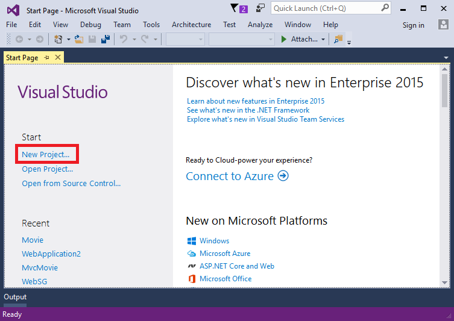
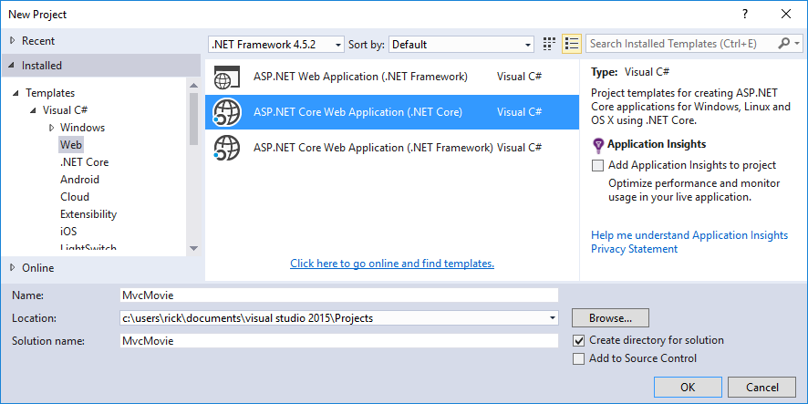

添加模型
================

Adding a model
==================================================

原文 `Adding a model <https://docs.asp.net/en/latest/tutorials/first-mvc-app/adding-model.html>`_

作者： `Rick Anderson`_

翻译： `娄宇(Lyrics) <http://github.com/xbuilder>`_

校对： `许登洋(Seay) <https://github.com/SeayXu>`_、`孟帅洋(书缘) <https://github.com/mengshuaiyang>`_、`姚阿勇(Mr.Yao) <https://github.com/YaoaY>`_、`夏申斌 <https://github.com/xiashenbin>`_

In this section you'll add some classes for managing movies in a database. These classes will be the "**M**\odel" part of the **M**\VC app.

在这一节里，你将添加一些类来管理数据库中的电影数据。这些类将成为 MVC 应用程序中的 “Model” 部分。

You’ll use a .NET Framework data-access technology known as the `Entity Framework Core <http://ef.readthedocs.org/>`__ to define and work with these data model classes. Entity Framework Core (often referred to as **EF** Core) features a development paradigm called *Code First*. You write the code first, and the database tables are created from this code. Code First allows you to create data model objects by writing simple classes. (These are also known as POCO classes, from "plain-old CLR objects.") The database is created from your classes. If you are required to create the database first, you can still follow this tutorial to learn about MVC and EF app development.

你将使用 .NET Framework 中名为 `Entity Framework Core <http://ef.readthedocs.org/>`__ 的数据库访问技术来定义和使用这些数据模型类。Entity Framework Core (通常被称为 **EF** Core) 有一种具有特色的被称为 *Code First* 开发模式。你先编写代码，然后通过这些代码创建数据库表。 Code First 允许你通过编写一些简单的类(也被称为 POCO 类， "plain-old CLR objects." )来创建数据模型对象，然后根据你的类创建数据库。如果你需要先创建数据库，你仍然可以按照本教程来学习 MVC 和 EF 应用程序开发。

Create a new project with individual user accounts
^^^^^^^^^^^^^^^^^^^^^^^^^^^^^^^^^^^^^^^^^^^^^^^^^^^

使用个人用户账户身份认证创建新项目
^^^^^^^^^^^^^^^^^^^^^^^^^^^^^^^^^^^^^^^^^^^^^^^^^^^

In the current version of the ASP.NET Core MVC tools for Visual Studio, scaffolding a model is only supported when you create a new project with individual user accounts. We hope to have this fixed in the next tooling update. Until that's fixed, you'll need to create a new project with the same name. Because the project has the same name, you'll need to create it in another directory.

在 Visual Studio 当前版本的 ASP.NET Core MVC 工具中，仅在以个人用户账户身份认证方式创建新项目时支持通过基架生成模型。我们希望在下一个工具更新中修复这个问题。直到问题被修复之前，你需要以相同的名称创建新项目。因为项目有相同的名字，你需要在其他的文件夹中创建。

From the Visual Studio **Start** page, tap **New Project**.

在 Visual studio **起始页（Start Page）**，点击 **新建项目（New Project）** 

Alternatively, you can use the menus to create a new project. Tap **File > New > Project**.

或者，你可以使用菜单来创建新项目。点击 **文件（File）> 新建（New） > 项目（Project）**。

.. image:: start-mvc/_static/alt_new_project.png

Complete the **New Project** dialog:

- In the left pane, tap **Web**
- In the center pane, tap **ASP.NET Core Web Application (.NET Core)**
- Change the location to a different directory from the previous project you created or you'll get an error
- Name the project "MvcMovie" (It's important to name the project "MvcMovie" so when you copy code, the namespace will match.)
- Tap **OK**

完成 **新建项目（New Project）** 对话框：
- 在左窗格，点击 **Web**
- 在中间窗格，点击 **ASP.NET Core Web Application (.NET Core)**
- 将位置更改为你创建的前一个项目的不同目录，否则你将遇到错误
- 命名项目为“MvcMovie”（将项目命名为“MvcMovie”非常重要，当你复制带啊名时，命名空间将会匹配）
- 点击 **确定（OK）**

.. Warning:: You must have the **Authentication** set to **Individual User Accounts** in this release for the scaffolding engine to work.

.. Warning:: 在本教程中，你必须将 **身份验证(Authentication)** 设置为 **个人用户账户(Individual User Accounts)** ，以便基架引擎能正常工作（译者注：不同的身份认证通过基架引擎生成的代码不一样，为了教程顺利进行，此处必须选用个人用户账户的认证方式)。

In the **New ASP.NET Core Web Application - MvcMovie** dialog:

- tap **Web Application**
- tap the **Change Authentication** button and change the authentication to **Individual User Accounts** and tap **OK**

在 **New ASP.NET Core Web Application - MvcMovie** 对话框中：

- 点击 **Web 应用程序（Web Application）**
- 点击 **更改身份验证（Change Authentication）** 按钮并将身份验证改为 **Individual User Accounts（个人用户账户）** 之后点击 **确定（OK）**

.. image:: start-mvc/_static/p4.png

Follow the instructions in :ref:`change-title-link-reference-label` so you can tap the **MvcMovie** link to invoke the Movie controller. We'll scaffold the movies controller in this tutorial.

按照 :ref:`change-title-link-reference-label` 的指示你可以点击 **MvcMovie** 链接来调用 Movie 控制器（Controller）。我们将在本教程中通过基架生成 Movie 控制器（Controller）。

Adding data model classes
--------------------------

添加数据模型类
-----------------

In Solution Explorer, right click the *Models* folder > **Add** > **Class**. Name the class **Movie** and add the following properties:

在解决方案资源管理器中，右键点击 *Models* 文件夹 > **添加** > **类** 。将类名命名为 **Movie** 并且添加以下属性：

.. literalinclude:: start-mvc/sample2/src/MvcMovie/Models/MovieNoEF.cs
  :language: c#
  :start-after: #region snippet_1
  :end-before: #endregion
  :dedent: 0
  :emphasize-lines: 7

In addition to the properties you'd expect to model a movie, the ``ID`` field is required by the DB for the primary key. Build the project. If you don't build the app, you'll get an error in the next section. We've finally added a **M**\odel to our **M**\VC app.

除了你期望用来构造电影的属性，还需要一个 ID 字段来作为数据库主键。生成项目。如果没有生成这个应用程序，将在下一节中遇到错误。我们终于为这个 MVC 应用程序添加了一个 Model 。

Scaffolding a controller
-------------------------

通过基架生成一个控制器（Controller）
------------------------------

In **Solution Explorer**, right-click the *Controllers* folder **> Add > Controller**.

在 **解决方案资源管理器** 中，右键点击 *Controllers* 文件夹 **> 添加 > 控制器**

.. image:: adding-model/_static/add_controller.png

In the **Add Scaffold** dialog, tap **MVC Controller with views, using Entity Framework > Add**.

在 **添加基架** 对话框中，点击 **MVC Controller with views, using Entity Framework > 添加** 。

.. image:: adding-model/_static/add_scaffold2.png

Complete the **Add Controller** dialog

- **Model class:** *Movie(MvcMovie.Models)*
- **Data context class:** *ApplicationDbContext(MvcMovie.Models)*
- **Views:**: Keep the default of each option checked
- **Controller name:** Keep the default *MoviesController*
- Tap **Add** 

完成 **添加控制器（Add Controller）** 对话框

- **模型类（Model class）：** *Movie(MvcMovie.Models)*
- **数据上下文类（Data context class）：** *ApplicationDbContext(MvcMovie.Models)*
- **视图（Views）：** 保持默认的选项
- **控制器名称（Controller name）：** 保持默认的 *MoviesController*
- Tap **添加（Add）** 

.. image:: adding-model/_static/add_controller2.png

The Visual Studio scaffolding engine creates the following:

- A movies controller (*Controllers/MoviesController.cs*)
- Create, Delete, Details, Edit and Index Razor view files (*Views/Movies*)

Visual Studio 基架引擎创建的东西如下：

- 一个电影控制器（Controller）（*Controllers/MoviesController.cs*）
- Create、Delete、Details、Edit 以及 Index 的 Razor 视图文件（Views/Movies）

Visual Studio automatically created the `CRUD <https://en.wikipedia.org/wiki/Create,_read,_update_and_delete>`__ (create, read, update, and delete) action methods and views for you (the automatic creation of CRUD action methods and views is known as *scaffolding*). You'll soon have a fully functional web application that lets you create, list, edit, and delete movie entries.

Visual Studio 为你自动创建 `CRUD <https://en.wikipedia.org/wiki/Create,_read,_update_and_delete>`__ （创建、读取、更新以及删除）Action 方法和视图（View）（自动创建 CRUD Action 方法和 View 视图被称为 *搭建基架（scaffolding）*）。很快你将拥有一个可以让你创建、查看、编辑以及删除电影条目的完整功能的 Web 应用程序。

If you run the app and click on the **Mvc Movie** link, you'll get the following errors:

如果你运行这个应用程序并且点击 **Mvc Movie** 链接。你将遇到以下错误：

.. image:: adding-model/_static/pending.png

We'll follow those instructions to get the database ready for our Movie app.

我们将按照这些指示来为 Movie 应用程序准备好数据库

Update the database
-------------------------------------------

更新数据库
-------------------------------------------

.. warning:: You must stop IIS Express before you update the database.

.. warning:: 你必须在更新数据库之前停止 IIS Express。

.. _stop-IIS-Express-reference-label:

To Stop IIS Express:
^^^^^^^^^^^^^^^^^^^^^

停止 IIS Express:
^^^^^^^^^^^^^^^^^^^^^

- Right click the IIS Express system tray icon in the notification area

- 右键点击通知区域的 IIS Express 系统托盘图标

 .. image:: working-with-sql/_static/iisExIcon.png
   :scale: 100%

- Tap **Exit** or **Stop Site**

- 点击 **退出（Exit）** 或者 **停止站点（Stop Site）**

.. image:: working-with-sql/_static/stopIIS.png

- Alternatively, you can exit and restart Visual Studio

- 除此之外, 你可以退出并重启 Visual Studio

.. To-do replace command prompt to PMC. It's the preferred approach, you  don't need to leave VS

- Open a command prompt in the project directory (MvcMovie/src/MvcMovie). Follow these instructions for a quick way to open a folder in the project directory.

  - Open a file in the root of the project (for this example, use *Startup.cs*.)
  - Right click on *Startup.cs*  **> Open Containing Folder**.

- 在项目文件夹（MvcMovie/src/MvcMovie）打开命令提示符。按照以下说明，以一个快捷的方式打开项目文件夹

  - 打开一个在项目根目录下的文件（在这个例子中，使用 *Startup.cs* )。
  - 右键点击 *Startup.cs* **> 打开所在的文件夹（Open Containing Folder）** 。
 
  .. image:: adding-model/_static/quick.png

  - Shift + right click a folder > **Open command window here**
  
  - Shift + 右键点击一个文件夹 > **在此处打开命令窗口（Open command window here）**

  .. image:: adding-model/_static/folder.png

  - Run ``cd ..`` to move back up to the project directory
  
  - 运行 ``cd ..`` 将路径退回项目文件夹

- Run the following commands in the command prompt:

- 在命令提示符中运行以下命令：

.. code-block:: console

  dotnet ef migrations add Initial
  dotnet ef database update

.. note:: If IIS-Express is running, you'll get the error *CS2012: Cannot open 'MvcMovie/bin/Debug/netcoreapp1.0/MvcMovie.dll' for writing -- 'The process cannot access the file 'MvcMovie/bin/Debug/netcoreapp1.0/MvcMovie.dll' because it is being used by another process.'*

.. note:: 如果 IIS-Express 在运行中，你会遇到错误 *CS2012: Cannot open 'MvcMovie/bin/Debug/netcoreapp1.0/MvcMovie.dll' for writing -- 'The process cannot access the file 'MvcMovie/bin/Debug/netcoreapp1.0/MvcMovie.dll' because it is being used by another process.'*

dotnet ef commands
^^^^^^^^^^^^^^^^^^^

dotnet ef 命令
^^^^^^^^^^^^^^^^^^^

- ``dotnet`` (.NET Core) is a cross-platform implementation of .NET. You can read about it `here <http://go.microsoft.com/fwlink/?LinkID=517853>`__
- ``dotnet ef migrations add Initial`` Runs the Entity Framework .NET Core CLI migrations command and creates the initial migration. The parameter "Initial" is arbitrary, but customary for the first (*initial*) database migration. This operation creates the *Data/Migrations/<date-time>_Initial.cs* file containing the migration commands to add (or drop) the `Movie` table to the database
- ``dotnet ef database update``  Updates the database with the migration we just created

- ``dotnet`` （.NET Core） 是 .NET 的跨平台实现。你可以在 `这里 <http://go.microsoft.com/fwlink/?LinkId=517853>`__ 了解它。
- ``dotnet ef migrations add Initial`` 运行 Entity Framework .NET Core CLI 迁移命令并创建初始化迁移。参数 "Initial" 可以是任意值，但是通常用这个作为第一个（*初始的*） 数据库迁移。这个操作创建了一个 *Data/Migrations/<date-time>_Initial.cs* 文件，这个文件包含了添加（或删除）`Movie` 表到数据库的迁移命令。
- ``dotnet ef database update`` dotnet ef database update 用我们刚刚创建的迁移来更新数据库。

Test the app
------------------

测试一下
--------

.. note:: If your browser is unable to connect to the movie app you might need to wait for IIS Express to load the app. It can sometimes take up to 30 seconds to build the app and have it ready to respond to requests.

.. note:: 如果你的浏览器不能连接到 Movie 应用程序，你可能需要等待 IIS Express 加载它。它有时需要 30 秒来构建应用程序并准备好响应请求。

- Run the app and tap the **Mvc Movie** link
- Tap the **Create New** link and create a movie

- 运行应用程序并点击 **Mvc Movie** 链接
- 点击 **Create New** 链接并创建电影

.. image:: adding-model/_static/movies.png

.. note:: You may not be able to enter decimal points or commas in the ``Price`` field. To support `jQuery validation <http://jqueryvalidation.org/>`__ for non-English locales that use a comma (",") for a decimal point, and non US-English date formats, you must take steps to globalize your app. See `Additional resources`_ for more information. For now, just enter whole numbers like 10. 

.. note:: 你也许不能在 ``Price`` 字段中输入小数点或逗号。为了实现对非英语环境中用逗号(",")来表示小数点，以及非美国英语日期格式的 `jQuery 验证 <http://jqueryvalidation.org/>`__ ，你必须采取措施国际化你的应用程序。查看 `额外的资源`_ 获取更多的信息。现在仅仅输入完整的数字，比如10。

.. _DisplayFormatDateLocal:

.. note:: In some locales you'll need to specify the date format. See the highlighted code below.

.. note:: 在某些地区你需要指定日期格式。查看下方高亮代码。

.. literalinclude:: start-mvc/sample2/src/MvcMovie/Models/MovieDateFormat.cs
  :language: c#
  :start-after: // Start
  :end-before:  */
  :emphasize-lines: 10,2

Tapping **Create** causes the form to be posted to the server, where the movie information is saved in a database. You are then redirected to the `/Movies` URL, where you can see the newly created movie in the listing.

点击 **Create** 提交表单到服务器，将电影数据保存到数据库中。然后重定向到 `/Movies` URL ，你可以在列表中看到新创建的电影。

.. image:: adding-model/_static/h.png

Create a couple more movie entries. Try the **Edit**, **Details**, and **Delete** links, which are all functional.

再创建几个电影条目。尝试 **Edit** 、 **Details** 、 **Delete** 链接来执行各个功能。

Examining the Generated Code
---------------------------------

检查生成的代码
------------------

Open the *Controllers/MoviesController.cs* file and examine the generated ``Index`` method. A portion of the movie controller with the ``Index`` method is shown below:

打开 *Controllers/MoviesController.cs* 文件并检查生成的 ``Index`` 方法。 MoviesController 中包含 ``Index`` 方法的部分如下所示：

.. code-block:: c#

    public class MoviesController : Controller
    {
        private readonly ApplicationDbContext _context;

        public MoviesController(ApplicationDbContext context)
        {
            _context = context;
        }

        // GET: Movies
        public async Task<IActionResult> Index()
        {
            return View(await _context.Movie.ToListAsync());
        }

.. can't use this because we commenent out the initial index method and update it later
.. comment literalinclude:: start-mvc/sample2/src/MvcMovie/Controllers/MoviesController.cs
  :language: c#
  :start-after: // The Movies Controller
  :end-before: // GET: Movies/Details/5
  :dedent: 4

The constructor uses :doc:`Dependency Injection  </fundamentals/dependency-injection>` to inject the database context into the controller. The database context is used in each of the `CRUD <https://en.wikipedia.org/wiki/Create,_read,_update_and_delete>`__ methods in the controller.

构造函数使用 :doc:`依赖注入  </fundamentals/dependency-injection>` 将数据库上下文注入到控制器（Controller）。 数据上下文在控制器（Controller）中被用来执行 `增删改查 (CRUD) <https://en.wikipedia.org/wiki/Create,_read,_update_and_delete>`__ 方法。

A request to the Movies controller returns all the entries in the ``Movies`` table and then passes the data to the ``Index`` view.

一个到 MoviesController 的请求从 ``Movies`` 表返回所有的条目，然后传递数据到 ``Index`` 视图 (View) 。

.. _strongly-typed-models-keyword-label:

Strongly typed models and the @model keyword
^^^^^^^^^^^^^^^^^^^^^^^^^^^^^^^^^^^^^^^^^^^^^^^^

强类型模型与 @model 关键字
^^^^^^^^^^^^^^^^^^^^^^^^^^^^^^^^^^^^^^^^^^^^^^^^

Earlier in this tutorial, you saw how a controller can pass data or objects to a view using the ``ViewData`` dictionary. The ``ViewData`` dictionary is a dynamic object that provides a convenient late-bound way to pass information to a view.

在之前的教程中，你看到了控制器（Controller）如何通过 ``ViewData`` 字典传递数据到一个视图（View）。 ``ViewData`` 字典是一个动态类型对象，它提供了一种便捷的后期绑定方式将信息传递给视图。

MVC also provides the ability to pass strongly typed objects to a view. This strongly typed approach enables better compile-time checking of your code and richer `IntelliSense <https://msdn.microsoft.com/en-us/library/hcw1s69b.aspx>`__ in Visual Studio (VS). The scaffolding mechanism in VS used this approach (that is, passing a strongly typed model) with the ``MoviesController`` class and views when it created the methods and views.

MVC 也提供了传递强类型数据给视图的能力。这种强类型的方式可以提供给你更好的代码编译时检查，并在 Visual Studio（VS） 中具有更丰富的 `智能感知 <https://msdn.microsoft.com/en-us/library/hcw1s69b.aspx>`__ 。VS 中的基架机制在为 ``MoviesController`` 类创建方法（Action）和视图（View）的时候就采用了这种方式（即，传递强类型模型）。

Examine the generated ``Details`` method in the *Controllers/MoviesController.cs* file:

检查在 *Controllers/MoviesController.cs* 文件中生成的 ``Details`` 方法：

.. literalinclude:: start-mvc/sample2/src/MvcMovie/Controllers/MoviesController.cs
 :language: c#
 :start-after: // GET: Movies/Details/5
 :end-before: // GET: Movies/Create
 :dedent: 8

The ``id`` parameter is generally passed as route data, for example ``http://localhost:1234/movies/details/1`` sets:

- The controller to the ``movies`` controller (the first URL segment)
- The action to ``details`` (the second URL segment)
- The id to 1 (the last URL segment)

``id`` 参数一般作为路由数据传递，例如 ``http://localhost:1234/movies/details/1`` 将：

- Controller 设置为 ``movies``（对应第一个 URL 段）
- Action 设置为 ``details``（对应第二个 URL 段）
- id 设置为 1（对应最后一个 URL 段）

You could also pass in the ``id`` with a query string as follows:

你也可以向下面一样通过查询字符串（Query String）传递 ``id`` ：

``http://localhost:1234/movies/details?id=1``

If a Movie is found, an instance of the ``Movie`` model is passed to the ``Details`` view:

如果电影被找到了， ``Movie`` 模型（Model）的实例将被传递给 ``Details`` 视图（View）。

.. code-block:: C#

  return View(movie);

.. make a copy of details - later we add Ratings to it.

Examine the contents of the *Views/Movies/Details.cshtml* file:

检查  *Views/Movies/Details.cshtml* 文件的内容：

.. literalinclude:: start-mvc/sample2/src/MvcMovie/Views/Movies/DetailsOriginal.cshtml
 :language: HTML
 :emphasize-lines: 1

By including a ``@model`` statement at the top of the view file, you can specify the type of object that the view expects. When you created the movie controller, Visual Studio automatically included the following ``@model`` statement at the top of the *Details.cshtml* file:

通过在视图（View）文件顶部加入一个 ``@model`` 语句，你可以指定视图（View）所期望的对象类型。当你创建这个 MoviesController 时， Visual Studio 自动在 *Details.cshtml* 顶部加入了 ``@model`` 语句后面的部分。

.. code-block:: HTML

  @model MvcMovie.Models.Movie

This ``@model`` directive allows you to access the movie that the controller passed to the view by using a ``Model`` object that's strongly typed. For example, in the *Details.cshtml* view, the code passes each movie field to the ``DisplayNameFor`` and ``DisplayFor`` HTML Helpers with the strongly typed ``Model`` object. The ``Create`` and ``Edit`` methods and views also pass a ``Movie`` model object.

``@model`` 指令允许你访问从控制器（Controller）传递给视图（View）的这个强类型电影 ``Model`` 对象。例如，在 *Details.cshtml* 视图中，代码用强类型 ``Model`` 对象传递所有的电影字段到 ``DisplayNameFor`` 和 ``DisplayFor`` HTML 帮助类（HTML Helper）里。 ``Create`` 和 ``Edit`` 方法和视图（View）也传递一个 ``Movie`` 模型（Model）对象。

Examine the *Index.cshtml* view and the ``Index`` method in the Movies controller. Notice how the code creates a ``List`` object when it calls the View method. The code passes this ``Movies`` list from the ``Index`` action method to the view:

检查 *Index.cshtml* 视图（View）和 MoviesController 里的 ``Index`` 方法。注意观察代码在调用 View 方法时，是如何创建一个 ``列表（List）`` 对象的。这段代码将 ``Movies`` 列表从 ``Index`` Action 方法传递给视图（View）：

.. literalinclude:: start-mvc/sample2/src/MvcMovie/Controllers/MoviesController.cs
 :language: c#
 :start-after:  // GET: Movies
 :end-before:  // End of first Index
 :dedent: 8

When you created the movies controller, Visual Studio automatically included the following ``@model`` statement at the top of the *Index.cshtml* file:

当你创建这个 MoviesController 时，Visual Studio 自动在 *Index.cshtml* 顶部加入以下 ``@model`` 语句:

.. Copy Index.cshtml to IndexOriginal.cshtml

.. literalinclude:: start-mvc/sample2/src/MvcMovie/Views/Movies/IndexOriginal.cshtml
 :language: HTML
 :lines: 1

The ``@model`` directive allows you to access the list of movies that the controller passed to the view by using a ``Model`` object that's strongly typed. For example, in the *Index.cshtml* view, the code loops through the movies with a ``foreach`` statement over the strongly typed ``Model`` object:

``@model`` 指令允许你访问电影列表这个从控制器（Controller）传递给视图（View）的强类型 ``Model`` 对象。例如，在 *Index.cshtml* 视图中，代码通过 ``foreach`` 语句遍历了电影列表这个强类型的 ``模型（Model）`` 对象。

.. Copy Index.cshtml to IndexOriginal.cshtml

.. literalinclude:: start-mvc/sample2/src/MvcMovie/Views/Movies/IndexOriginal.cshtml
  :language: HTML
  :emphasize-lines: 1,31, 34,37,40,43,46-48

Because the ``Model`` object is strongly typed (as an ``IEnumerable<Movie>`` object), each item in the loop is typed as ``Movie``. Among other benefits, this means that you get compile-time checking of the code and full `IntelliSense <https://msdn.microsoft.com/en-us/library/hcw1s69b.aspx>`__ support in the code editor:

因为 ``模型（Model）`` 对象是强类型的（作为 ``IEnumerable<Movie>`` 对象），循环中的每一个 item 的类型被类型化为 ``Movie`` 。除了其他好处外，这意味着你将获得代码的编译时检查以及在代码编辑器里得到完整的 `智能感知 <https://msdn.microsoft.com/en-us/library/hcw1s69b.aspx>`__ 支持：

.. image:: adding-model/_static/ints.png

You now have a database and pages to display, edit, update and delete data. In the next tutorial, we'll work with the database.

现在你有了数据库和用于显示、编辑、更新以及删除数据的页面。在下一篇教程中，我们将学习使用数据库。

Additional resources
-----------------------

额外的资源
-----------------------

- :doc:`/mvc/views/tag-helpers/index`
- :doc:`/fundamentals/localization`