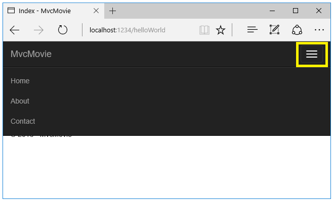

Adding a view
================================================
添加视图
===================

By `Rick Anderson`_

作者： `Rick Anderson`_

翻译： `魏美娟(初见) <http://github.com/ChujianA>`_

校对： `赵亮(悲梦) <http://github.com/BeiMeng>`_、`高嵩(Jack) <http://github.com/jack2gs>`_、`何镇汐 <https://github.com/UtilCore>`_

In this section you're going to modify the ``HelloWorldController`` class to use Razor view template files to cleanly encapsulate the process of generating HTML responses to a client.

本节将更新  ``HelloWorldController`` 类，用 Razor 视图模板干净利落地把生成对客户端的 HTML 响应的过程封装起来。

You'll create a view template file using the Razor view engine. Razor-based view templates have a *.cshtml* file extension, and provide an elegant way to create HTML output using C#. Razor minimizes the number of characters and keystrokes required when writing a view template, and enables a fast, fluid coding workflow.

您将用Razor视图引擎创建一个视图模板。基于Razor视图模板是扩展名为 *.cshtml* 的文件，并提供了一种优雅的方式使用 C# 输出 HTML。用 Razor 编写视图模板能减少字符的个数和敲击键盘的次数，并使工作流程快速灵活。

Currently the ``Index`` method returns a string with a message that is hard-coded in the controller class. Change the ``Index`` method to return a View object, as shown in the following code:

目前，在控制器类中， ``Index`` 通过硬编码返回字符串。下例演示如何通过 ``Index`` 返回视图对象：

.. literalinclude:: start-mvc/sample/src/MvcMovie/Controllers/HelloWorldController.cs
  :language: c#
  :lines: 102-105
  :dedent: 8

The ``Index`` method above uses a view template to generate an HTML response to the browser. Controller methods (also known as `action methods <http://rachelappel.com/asp.net-mvc-actionresults-explained>`__), such as the ``Index`` method above, generally return an ``IActionResult`` (or a class derived from ``ActionResult``), not primitive types like string.

上例中 ``Index`` 方法用一个视图模板生成对浏览器的HTML响应。控制器方法 (类似于 `action 方法 <http://rachelappel.com/asp.net-mvc-actionresults-explained>`__)，比方说上述的 ``Index`` 方法，通常返回一个 ``IActionResult`` （或者派生自 ``ActionResult``)的类，并不是原始类型（如string）。

- Right click on the *Views* folder, and then **Add > New Folder** and name the folder *HelloWorld*.

- 右击 *Views* （视图）文件夹，选择 **Add > New Folder** （添加->新建文件夹），然后将文件夹命名为 *HelloWorld* 。

.. image:: adding-view/_static/add_folder.png

- Right click on the *Views/HelloWorld* folder, and then **Add > New Item**.

- 右击 *Views/HelloWorld* （视图/Helloworld）文件夹，选择 **Add > New Item** (添加->新建项)

- In the **Add New Item - MvcMovie** dialog

- 在 **Add New Item - MvcMovie** 对话框中：

  - In the search box in the upper-right, enter *view*

  - 在右上方的搜索框中输入 *view* (视图)

  - Tap **MVC View Page**

  - 点击 **MVC View Page**

  - In the **Name** box, keep the default *Index.cshtml*

  - 在 **Name** 框中, 保持默认的命名 *Index.cshtml*

  - Tap **Add**

  - 点击 **Add**

.. image:: adding-view/_static/add_view.png

Replace the contents of the *Views/HelloWorld/Index.cshtml* Razor view file with the following:

用以下代码替换 *Views/HelloWorld/Index.cshtml* 的Razor视图文件。

.. literalinclude:: start-mvc/sample/src/MvcMovie/Views/HelloWorld/Index.cshtml
  :language: HTML

Navigate to ``http://localhost:xxxx/HelloWorld``. The ``Index`` method in the ``HelloWorldController`` didn't do much work; it simply ran the statement ``return View();``, which specified that the method should use a view template file to render a response to the browser. Because you didn't explicitly specify the name of the view template file to use, MVC defaulted to using the *Index.cshtml* view file in the */Views/HelloWorld* folder. The image below shows the string "Hello from our View Template!" hard-coded in the view.

导航到 ``http://localhost:xxxx/HelloWorld``。 ``HelloWorldController`` 的 ``Index`` 方法作用并不大；它仅仅运行语句 ``return View();`` 来指定该方法应该用一个视图模板文件渲染对浏览器的响应。因为没有明确指定所使用视图模板的文件名，MVC默认使用 */Views/HelloWorld* 文件夹中的 *Index.cshtml* 视图文件。下图显示了通过硬编码在视图中显示 "Hello from our View Template!" 字符串。

.. image:: adding-view/_static/hell_template.png

If your browser window is small (for example on a mobile device), you might need to toggle (tap) the `Bootstrap navigation button <http://getbootstrap.com/components/#navbar>`__ in the upper right to see the to the **Home**, **About**, **Contact**, **Register** and **Log in** links.

如果浏览器窗体比较小（比如在手机设备上），可能需要点击右上方的 `Bootstrap navigation button <http://getbootstrap.com/components/#navbar>`__ 就能看到 **Home**, **About**, **Contact**, **Register** 和 **Log in** 的链接。

Changing views and layout pages
--------------------------------------
改变视图和布局页
--------------------------------------

Tap on the menu links (**MvcMovie**, **Home**, **About**). Each page shows the same menu layout. The menu layout is implemented in the *Views/Shared/_Layout.cshtml* file. Open the *Views/Shared/_Layout.cshtml* file.

点击菜单链接 (**MvcMovie**, **Home**, **About**)。每个页面都显示相同的菜单布局。菜单布局由 *Views/Shared/_Layout.cshtml* 文件夹实现，打开 *Views/Shared/_Layout.cshtml* 文件。

:doc:`Layout </mvc/views/layout>` templates allow you to specify the HTML container layout of your site in one place and then apply it across multiple pages in your site. Find the ``@RenderBody()`` line. ``RenderBody`` is a placeholder where all the view-specific pages you create show up, "wrapped" in the layout page. For example, if you select the **About** link, the **Views/Home/About.cshtml** view is rendered inside the ``RenderBody`` method.

:doc:`Layout </mvc/views/layout>` 模板允许在一个地方指定包含网站布局的HTML，并在网站的多个页面应用。找到 ``@RenderBody()`` 那行。 ``RenderBody`` 是你所显示的指定视图“包装在”布局页内的占位符。例如，比如点击 **About** 链接， **Views/Home/About.cshtml**  视图就会在 ``RenderBody`` 方法内渲染。

Change the contents of the title element. Change the anchor text in the layout template to "MVC Movie" and the controller from ``Home`` to ``Movies`` as highlighted below:

改变标题元素的内容。在布局模板中将锚文本改成 "MVC Movie" ，控制器将 ``Home`` 改成 ``Movies`` ，如下列高亮显示的：

.. literalinclude:: start-mvc/sample/src/MvcMovie/Views/Shared/_Layout.cshtml
  :language: HTML
  :linenos:
  :emphasize-lines: 29,6

.. warning:: We haven't implemented the ``Movies`` controller yet, so if you click on that link, you'll get a 404 (Not found) error.

.. warning:: 我们尚未实现 ``Movies`` 控制器，故若你点击链接，你将会得到404错误（文件未找到）。

Save your changes and tap the **About** link. Notice how each page displays the **Mvc Movie** link. We were able to make the change once in the layout template and have all pages on the site reflect the new link text and new title.

保存，点击 **About** 链接，注意每个页面怎样显示 **Mvc Movie** 链接。只在布局模板中改变一次，网站中的所有页面都显示新的链接和新的标题。

Examine the *Views/_ViewStart.cshtml* file:

查看一下 *Views/_ViewStart.cshtml* 文件：

.. literalinclude:: start-mvc/sample/src/MvcMovie/Views/_ViewStart.cshtml
  :language: HTML

The *Views/_ViewStart.cshtml* file brings in the *Views/Shared/_Layout.cshtml* file to each view. You can use the ``Layout`` property to set a different layout view, or set it to ``null`` so no layout file will be used.

 *Views/_ViewStart.cshtml* 文件使 *Views/Shared/_Layout.cshtml* 文件出现在每个视图中。可使用 ``Layout`` 属性设置一个不同的布局视图或者设置成 ``null`` 禁用布局文件。

Now, let's change the title of the ``Index`` view.

现在，让我们改变 ``Index`` 视图的标题。

Open *Views/HelloWorld/Index.cshtml*. There are two places to make a change:

打开 *Views/HelloWorld/Index.cshtml*。这里有2个地方需要改变：

 - The text that appears in the title of the browser

 - 出现在浏览器上的标题文本

 - The secondary header (``<h2>`` element).

 - 二级标题 (``<h2>`` 元素)。

You'll make them slightly different so you can see which bit of code changes which part of the app.

稍微改动一下，看看应用程序的哪些地方发生了变化。

.. literalinclude:: start-mvc/sample/src/MvcMovie/Views/HelloWorld/Index2.cshtml
  :language: HTML
  :emphasize-lines: 2, 5

``ViewData["Title"] = "Movie List";`` in the code above sets the ``Title`` property of the `ViewDataDictionary <https://docs.asp.net/projects/api/en/latest/autoapi/Microsoft/AspNet/Mvc/ViewFeatures/ViewDataDictionary/index.html>`__ to "Movie List". The ``Title`` property is used in the ``<title>`` HTML element in the layout page:

在以上代码中 ``ViewData["Title"] = "Movie List";`` 设置了 `ViewDataDictionary <https://docs.asp.net/projects/api/en/latest/autoapi/Microsoft/AspNet/Mvc/ViewFeatures/ViewDataDictionary/index.html>`__ 的Title属性为 "Movie List"。 ``Title`` 属性被用在布局页的 ``<title>`` HTML元素中。

.. code-block:: HTML

  <title>@ViewData["Title"] - Movie App</title>

Save your change and refresh the page. Notice that the browser title, the primary heading, and the secondary headings have changed. (If you don't see changes in the browser, you might be viewing cached content. Press Ctrl+F5 in your browser to force the response from the server to be loaded.) The browser title is created with ``ViewData["Title"]`` we set in the **Index.cshtml** view template and the additional "- Movie App" added in the layout file.

保存并刷新页面。注意浏览器标题，原标题，二级标题，他们都发生了改变（如果你没有看到变化，可能因为缓存的缘故，使用 Ctrl+F5 强制刷新浏览器）。浏览器标题由我们设置在 **Index.cshtml** 视图模型中的 ``ViewData["Title"]`` 以及位于布局页的 "- Movie App" 组合构成。

Also notice how the content in the *Index.cshtml* view template was merged with the *Views/Shared/_Layout.cshtml* view template and a single HTML response was sent to the browser. Layout templates make it really easy to make changes that apply across all of the pages in your application. To learn more see :doc:`/mvc/views/layout`.

同时注意， *Index.cshtml* 视图模板的内容是怎样和 *Views/Shared/_Layout.cshtml* 视图模板合并的，及一个HTML响应是怎样被发送到浏览器的。布局模板很容易改变在应用程序中应用它的所有页面。要学习更多参见 :doc:`/mvc/views/layout`。

.. image:: adding-view/_static/hell3.png

Our little bit of "data" (in this case the "Hello from our View Template!" message) is hard-coded, though. The MVC application has a "V" (view) and you've got a "C" (controller), but no "M" (model) yet. Shortly, we'll walk through how create a database and retrieve model data from it.

少量 "data" (像 "Hello from our View Template!" 这种情况)是硬编码的。MVC应用程序有一个 "V" (view) ，你有一个 "C" (controller)，但是没有 "M" (模型)。不久，我们将介绍如何创建一个数据库和从中搜索模型数据。

Passing Data from the Controller to the View
-----------------------------------------------
从控制器传递数据到视图
-----------------------

Before we go to a database and talk about models, though, let's first talk about passing information from the controller to a view. Controller classes are invoked in response to an incoming URL request. A controller class is where you write the code that handles the incoming browser requests, retrieves data from a database, and ultimately decides what type of response to send back to the browser. View templates can then be used from a controller to generate and format an HTML response to the browser.

在我们转到数据库去讨论模型之前，让我们先讨论从控制器传递信息到视图。控制器类在响应传入的URL请求时被调用。控制类是编写处理传入的浏览器请求，从数据库中检索数据，并最终决定发送什么类型的响应返回给浏览器的代码的地方。然后可以在控制器中使用视图模板生成和格式化 HTML 来响应给浏览器。

Controllers are responsible for providing whatever data or objects are required in order for a view template to render a response to the browser. A best practice: A view template should never perform business logic or interact with a database directly. Instead, a view template should work only with the data that's provided to it by the controller. Maintaining this "separation of concerns" helps keep your code clean, testable and more maintainable.

控制器负责提供所需要的任何数据或者对象，以便视图模板向浏览器呈现响应。最佳的实践：视图模板不应该执行业务逻辑或者直接与数据库进行交互。以便视图模板向浏览器呈现响应。保持这种 “关注点分离” 有助于保持你的代码整洁，可测试和更易于维护。

Currently, the ``Welcome`` method in the ``HelloWorldController`` class takes a ``name`` and a ``ID`` parameter and then outputs the values directly to the browser. Rather than have the controller render this response as a string, let’s change the controller to use a view template instead. The view template will generate a dynamic response, which means that you need to pass appropriate bits of data from the controller to the view in order to generate the response. You can do this by having the controller put the dynamic data (parameters) that the view template needs in a ``ViewData`` dictionary that the view template can then access.

目前， ``HelloWorldController`` 类中的 ``Welcome`` 方法接受一个 ``name`` 和一个 ``ID`` 参数，然后直接将值输出到浏览器。让我们更改控制器来使用视图模板，而不是让控制器使用字符串呈现这个响应。视图模板将生成一个动态响应。这就意味着需要通过控制器传递恰当的数据给视图以生成响应。可过控制器将视图模板所需的动态数据（参数）放在ViewData字典中，以便视图模板可以访问。

Return to the *HelloWorldController.cs* file and change the ``Welcome`` method to add a ``Message`` and ``NumTimes`` value to the ``ViewData`` dictionary. The ``ViewData`` dictionary is a dynamic object, which means you can put whatever you want in to it; the ``ViewData`` object has no defined properties until you put something inside it. The `MVC model binding system <http://docs.asp.net/projects/mvc/en/latest/models/index.html>`__ automatically maps the named parameters (``name`` and ``numTimes``) from the query string in the address bar to parameters in your method. The complete *HelloWorldController.cs* file looks like this:

回到 *HelloWorldController.cs* 文件，在 ``Welcome`` 方法中添加一个 ``Message`` 和 ``NumTimes`` 的值到 ``ViewData`` 字典中。 ``ViewData`` 字典是个动态对象，这就意味着可以把任何自己想要的数据添加进去。 ``ViewData`` 对象并没有定义属性，直到放一些值到该对象里。 `MVC model binding system <http://docs.asp.net/projects/mvc/en/latest/models/index.html>`__ 自动映射地址栏中查询字符串的命名参数 (``name`` and ``numTimes``) 到你的方法参数中。完整的 *HelloWorldController.cs* 文件看起来是这样的：

.. literalinclude:: start-mvc/sample/src/MvcMovie/Controllers/HelloWorldController.cs
  :language: c#
  :lines: 152-172

The ``ViewData`` dictionary object contains data that will be passed to the view. Next, you need a Welcome view template.

 ``ViewData`` 字典对象包含将要传递给视图的数据。下一步，需要一个Welcome的视图模板。

- Right click on the *Views/HelloWorld* folder, and then **Add > New Item**.

- 右键 *Views/HelloWorld* 文件夹，点击 添加 > 新建项 （Add > New Item）。

- In the **Add New Item - MvcMovie** dialog

- 在 **Add New Item - MvcMovie** 对话框中

  - In the search box in the upper-right, enter *view*

  - 在右上角的搜索框中，输入 *view*

  - Tap **MVC View Page**

  - 点击 **MVC View Page**

  - In the **Name** box, enter *Welcome.cshtml*

  - 在 **Name** 框中，输入 *Welcome.cshtml*

  - Tap **Add**

  - 点击 **Add**

You'll create a loop in the *Welcome.cshtml* view template that displays "Hello" ``NumTimes``. Replace the contents of *Views/HelloWorld/Welcome.cshtml* with the following:

在 *Welcome.cshtml* 视图模板中创建一个循环来显示 "Hello" ``NumTimes`` 次。用以下代码来代替 *Views/HelloWorld/Welcome.cshtml* 视图中的内容。

.. literalinclude:: start-mvc/sample/src/MvcMovie/Views/HelloWorld/Welcome.cshtml
  :language: HTML

Save your changes and browse to the following URL:

更改后保存，浏览以下网址：

\http://localhost:xxxx/HelloWorld/Welcome?name=Rick&numtimes=4

Data is taken from the URL and passed to the controller using the `model binder <http://docs.asp.net/projects/mvc/en/latest/models/index.html>`__. The controller packages the data into a ``ViewData`` dictionary and passes that object to the view. The view then renders the data as HTML to the browser.

数据是从URL获取并用 `model binder <http://docs.asp.net/projects/mvc/en/latest/models/index.html>`__ 将数据传递给控制器。控制器将数据封装到 ``ViewData`` 字典中，并将对象传递到视图里。然后，视图渲染那些数据作为 HTML 到浏览器中。

.. image:: adding-view/_static/rick.png

In the sample above, we used the ``ViewData`` dictionary to pass data from the controller to a view. Later in the tutorial, we will use a view model to pass data from a controller to a view. The view model approach to passing data is generally much preferred over the ``ViewData`` dictionary approach. See `Dynamic V Strongly Typed Views <http://blogs.msdn.com/b/rickandy/archive/2011/01/28/dynamic-v-strongly-typed-views.aspx>`__ for more information.

在以上例子中，我们用 ``ViewData`` 字典传递数据从控制器到视图。在后面的教程中，我们将使用视图模型（view model）传递数据从控制器到视图。通常用视图模型方法传递数据优先于 ``ViewData`` 字典方法。查看 `Dynamic V Strongly Typed Views <http://blogs.msdn.com/b/rickandy/archive/2011/01/28/dynamic-v-strongly-typed-views.aspx>`__ 了解更多信息。

Well, that was a kind of an "M" for model, but not the database kind. Let's take what we've learned and create a database of movies.

这是一种数据模型，但不是数据库类。让我们用学到的知识创建一个movies的数据库。