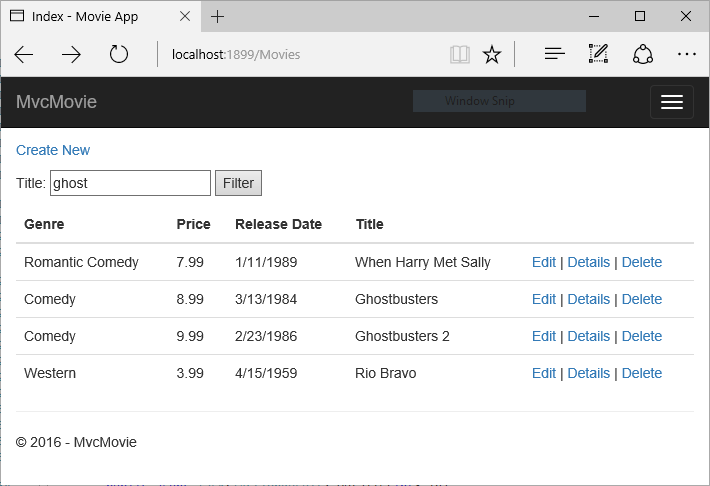

Adding Search

添加搜索
==================================================

作者 `Rick Anderson`_ 

翻译： `魏美娟(初见) <http://github.com/ChujianA>`_ 

校对：  `谢炀（Kiler） <https://github.com/kiler398/>`_  `张仁建(第二年.夏) <https://github.com/stoneniqiu>`_   `孟帅洋(书缘)  <https://github.com/mengshuaiyang>`_ 

在本节中，你可以为 ``Index`` 方法添加查询功能，使其能够根据电影的 *genre* 或 *name* 进行查找。

In this section you'll add search capability to the ``Index`` action method that lets you search movies by *genre* or *name*.

更新 ``Index`` 方法来开启搜索功能：

Update the ``Index`` action method to enable search:

.. literalinclude:: start-mvc/sample/src/MvcMovie/Controllers/MoviesController.cs
 :language: c#
 :lines: 154-166
 :dedent: 8

``Index`` 方法的第一行代码创建了一个 `LINQ <http://msdn.microsoft.com/en-us/library/bb397926.aspx>`__ 查询，用来查找符合条件的电影：

The first line of the ``Index`` action method creates a `LINQ <http://msdn.microsoft.com/en-us/library/bb397926.aspx>`__ query to select the movies:

.. literalinclude:: start-mvc/sample/src/MvcMovie/Controllers/MoviesController.cs
 :language: c#
 :lines: 156-157
 :dedent: 12

这个查询 *仅仅只是* 在这里被定义出来，但是 **并未** 在数据库中执行。

The query is *only* defined at this point, it **has not** been run against the database.

如果 ``searchString`` 参数包含一个字符串，movies 查询将会添加对应查询过滤条件（ *译者注* 本例为 Title 包含 ``searchString`` 查询条件），代码如下：

If the ``searchString`` parameter contains a string, the movies query is modified to filter on the value of the search string, using the following code:

.. literalinclude:: start-mvc/sample/src/MvcMovie/Controllers/MoviesController.cs
  :language: c#
  :lines: 159-163
  :dedent: 12
  :emphasize-lines: 3

代码中的 ``s => s.Title.Contains()`` 是一个  `Lambda 表达式 <http://msdn.microsoft.com/en-us/library/bb397687.aspx>`__ ，Lambda 表达式被用在基于方法的 `LINQ <http://msdn.microsoft.com/en-us/library/bb397926.aspx>`__ 查询（例如：上面代码中的 `Where <http://msdn.microsoft.com/en-us/library/system.linq.enumerable.where.aspx>`__ 方法 或者 ``Contains``）中当做参数来使用。LINQ 语句在定义或调用类似 ``Where`` 、``Contains`` 或者 ``OrderBy`` 的方法进行修改的时候不会执行，相反的，查询会延迟执行，这意味着一个赋值语句直到迭代完成或调用 ``ToListAsync`` 方法才具备真正的值。更多关于延时查询的信息。请参考 `查询执行 <http://msdn.microsoft.com/en-us/library/bb738633.aspx>`__ 。

The ``s => s.Title.Contains()`` code above is a `Lambda Expression <http://msdn.microsoft.com/en-us/library/bb397687.aspx>`__. Lambdas are used in method-based `LINQ <http://msdn.microsoft.com/en-us/library/bb397926.aspx>`__ queries as arguments to standard query operator methods such as the `Where <http://msdn.microsoft.com/en-us/library/system.linq.enumerable.where.aspx>`__ method or ``Contains`` used in the code above. LINQ queries are not executed when they are defined or when they are modified by calling a method such as ``Where``, ``Contains``  or ``OrderBy``. Instead, query execution is deferred, which means that the evaluation of an expression is delayed until its realized value is actually iterated over or the ``ToListAsync`` method is called. For more information about deferred query execution, see `Query Execution <http://msdn.microsoft.com/en-us/library/bb738633.aspx>`__.

.. Note:: The `Contains <http://msdn.microsoft.com/en-us/library/bb155125.aspx>`__ method is run on the database, not the c# code above. On the database, `Contains <http://msdn.microsoft.com/en-us/library/bb155125.aspx>`__ maps to `SQL LIKE <http://msdn.microsoft.com/en-us/library/ms179859.aspx>`__, which is case insensitive.

.. Note:: `Contains <http://msdn.microsoft.com/en-us/library/bb155125.aspx>`__ 方法是在数据库中运行的，并非在上面的 C# 代码中。在数据库中， `Contains <http://msdn.microsoft.com/en-us/library/bb155125.aspx>`__ 方法被翻译为不区分大小写的 `SQL LIKE <http://msdn.microsoft.com/en-us/library/ms179859.aspx>`__ 脚本。

运行应用程序，并导航到 ``/Movies/Index``，在 URL 后面添加一个查询字符串，例如 ``?searchString=ghost``，被过滤后的电影列表如下：

Navigate to ``/Movies/Index``. Append a query string such as ``?searchString=ghost`` to the URL. The filtered movies are displayed.

.. image:: search/_static/ghost.png

如果你修改 ``Index`` 方法签名使得方法包含一个名为 ``id`` 的参数，那么 ``id`` 参数将会匹配 *Startup.cs* 文件中的默认路由中的可选项 {id} 。

If you change the signature of the ``Index`` method to have a parameter named ``id``, the ``id`` parameter will match the optional ``{id}`` placeholder for the default routes set in *Startup.cs*.

.. literalinclude:: start-mvc/sample/src/MvcMovie/Startup.cs
  :language: c#
  :lines: 80-86
  :dedent: 12
  :emphasize-lines: 5

你可以使用 **rename** 操作快速的把 ``searchString`` 参数重命名为 ``id``，在 ``searchString`` 上右击 **> Rename** 。

You can quickly rename the ``searchString`` parameter to ``id`` with the **rename** command. Right click on ``searchString`` **> Rename**.

.. image:: search/_static/rename.png

会被重命名的代码会高亮显示。

The rename targets are highlighted.

.. image:: search/_static/rename2.png

修改参数为 ``id`` ，其他引用到 ``searchString`` 的地方也会自动变更为 ``id``。

Change the parameter to ``id`` and all occurrences of ``searchString`` change to ``id``.

.. image:: search/_static/rename3.png

修改前的 ``Index`` 方法：

The previous ``Index`` method:

.. literalinclude:: start-mvc/sample/src/MvcMovie/Controllers/MoviesController.cs
 :language: c#
 :lines: 154-166
 :emphasize-lines: 1, 6,8
 :dedent: 8

修改后的 ``Index`` 方法:

The updated ``Index`` method:

.. literalinclude:: start-mvc/sample/src/MvcMovie/Controllers/MoviesController.cs
 :language: c#
 :lines: 173-185
 :emphasize-lines: 1, 6,8
 :dedent: 8

修改完成以后，我们可以通过路由数据（URL 区块）来传递标题搜索条件而非查询字符串：

You can now pass the search title as route data (a URL segment) instead of as a query string value.

.. image:: search/_static/g2.png

然而，你不能指望用户每次都通过修改URL来查找电影，因此你需要在界面上帮助他们过滤数据。如果你想要修改 ``Index`` 方法的签名并测试了路由绑定是如何传递 ``ID`` 参数，现在再把它改成原来的参数  ``searchString`` 。

However, you can't expect users to modify the URL every time they want to search for a movie. So now you'll add UI to help them filter movies. If you changed the signature of the ``Index`` method to test how to pass the route-bound ``ID`` parameter, change it back so that it takes a parameter named ``searchString``:

.. literalinclude:: start-mvc/sample/src/MvcMovie/Controllers/MoviesController.cs
 :language: c#
 :lines: 154-166
 :emphasize-lines: 1, 6,8
 :dedent: 8

.. Index.cshtml is never referenced in the .rst files and is used only to test the code.
  Copy the relevant IndexXXX.cshtml file to Index.cshtml and test.
  Open the *Views/Movies/Index.cshtml* file, and add the ``<form>`` markup highlighted below:

.. literalinclude:: start-mvc/sample/src/MvcMovie/Views/Movies/IndexForm1.cshtml
  :language: HTML
  :lines: 1-21
  :emphasize-lines: 13-18

HTML ``<form>`` 标签使用 :doc:`Form Tag Helper </mvc/views/working-with-forms>` 生成，所以当你提交表单的时候，过滤字符串都被传到了 movies 控制器的 ``Index`` 方法。保存你的修改并测试过滤。

The HTML ``<form>`` tag uses the :doc:`Form Tag Helper </mvc/views/working-with-forms>`, so when you submit the form, the filter string is posted to the ``Index`` action of the movies controller. Save your changes and then test the filter.

然而 ``Index`` 方法并没有你所希望的 ``[HttpPost]`` 重载。你也不需要，因为方法并不会修改应用程序的状态，仅仅只是过滤数据。

There's no ``[HttpPost]`` overload of the ``Index`` method as you might expect. You don't need it, because the method isn't changing the state of the app, just filtering data.

你可以添加下面的 ``[HttpPost] Index`` 方法。

You could add the following ``[HttpPost] Index`` method.

.. literalinclude:: start-mvc/sample/src/MvcMovie/Controllers/MoviesController.cs
  :language: c#
  :lines: 212-218
  :dedent: 8
  :emphasize-lines: 1

 ``notUsed`` 参数用创建 ``Index`` 方法重载。我们在后续教程中会讨论。

The ``notUsed`` parameter is used to create an overload for the ``Index`` method. We'll talk about that later in the tutorial.

如果你添加了这个方法。action 会调用匹配 ``[HttpPost] Index`` 的方法， ``[HttpPost] Index`` 方法运行结果如下所示。

If you add this method, the action invoker would match the ``[HttpPost] Index`` method, and the ``[HttpPost] Index`` method would run as shown in the image below.

.. image:: search/_static/fo.png

然而，尽管添加了 ``[HttpPost]`` 版的 ``Index`` 方法，在实现的时候仍然存在一些局限性。设想你想将一个比较详细的查询添加书签，或者你想将查询结果以链接形式发送给朋友以便于你的朋友可以看到同样的过滤结果的电影，注意观察 HTTP POST 请求的时候，URL 是没有改变的（仍然是 localhost:xxxxx/Movies/Index），这个地址本身不包含查询信息。现在，查询信息是作为  `表单数据 <https://developer.mozilla.org/en-US/docs/Web/Guide/HTML/Forms/Sending_and_retrieving_form_data>`__ 发送到服务器的，你可以通过 `F12 开发者工具 <https://dev.windows.com/en-us/microsoft-edge/platform/documentation/f12-devtools-guide/>`__ 或者优秀的抓包工具 `Fiddler tool <http://www.telerik.com/fiddler>`__。  `F12 tool <https://dev.windows.com/en-us/microsoft-edge/platform/documentation/f12-devtools-guide/>`__ ：

However, even if you add this ``[HttpPost]`` version of the ``Index`` method, there's a limitation in how this has all been implemented. Imagine that you want to bookmark a particular search or you want to send a link to friends that they can click in order to see the same filtered list of movies. Notice that the URL for the HTTP POST request is the same as the URL for the GET request (localhost:xxxxx/Movies/Index) -- there's no search information in the URL. The search string information is sent to the server as a `form field value <https://developer.mozilla.org/en-US/docs/Web/Guide/HTML/Forms/Sending_and_retrieving_form_data>`__. You can verify that with the `F12 Developer tools <https://dev.windows.com/en-us/microsoft-edge/platform/documentation/f12-devtools-guide/>`__ or the excellent `Fiddler tool <http://www.telerik.com/fiddler>`__. Start the `F12 tool <https://dev.windows.com/en-us/microsoft-edge/platform/documentation/f12-devtools-guide/>`__:

选择 **http://localhost:xxx/Movies  HTTP POST 200** 行点击 **Body  > Request Body**。

.. image:: search/_static/f12_rb.png

你可以在请求正文中看到查询参数和上一个教程中提到的 :doc:`XSRF </security/anti-request-forgery>` 令牌。 :doc:`Form Tag Helper </mvc/views/working-with-forms>`  生成  :doc:`XSRF </security/anti-request-forgery>`  反伪造令牌。我们没有修改数据，所以无需再控制器方法中验证令牌。

You can see the search parameter and :doc:`XSRF </security/anti-request-forgery>` token in the request body. Note, as mentioned in the previous tutorial, the :doc:`Form Tag Helper </mvc/views/working-with-forms>` generates an :doc:`XSRF </security/anti-request-forgery>` anti-forgery token. We're not modifying data, so we don't need to validate the token in the controller method.

因为查询参数在请求正文中而不是 Url 里，所以你在书签里面无法保存查询参数并共享给他人，为了解决这个问题我们必须把请求指定为 ``HTTP GET``。注意智能感知将帮我们更新标签。

Because the search parameter is in the request body and not the URL, you can't capture that search information to bookmark or share with others. We'll fix this by specifying the request should be ``HTTP GET``. Notice how intelliSense helps us update the markup.

.. image:: search/_static/int_m.png

.. image:: search/_static/int_get.png

请注意， ``<form>`` 标签中的专有标记。这种专有标记表示的标签是由 :doc:`Tag Helpers </mvc/views/tag-helpers/intro>` 支持的。

Notice the distinctive font in the ``<form>`` tag. That distinctive font indicates the tag is supported by :doc:`Tag Helpers </mvc/views/tag-helpers/intro>`.

.. image:: search/_static/th_font.png

当你提交检索的时候，URL 包含查询条件，如果存在  ``HttpPost Index`` 方法，查询会跳转到 ``HttpGet Index`` 方法。

Now when you submit a search, the URL contains the search query string. Searching will also go to the ``HttpGet Index`` action method, even if you have a ``HttpPost Index`` method.

.. image:: search/_static/search_get.png

添加按照 Genre 查询
------------------------

Adding Search by Genre
------------------------

在 *Models* 目录添加下面的 ``MovieGenreViewModel`` 类：

Add the following ``MovieGenreViewModel`` class to the *Models* folder:

.. literalinclude:: start-mvc/sample/src/MvcMovie/Models/MovieGenreViewModel.cs
 :language: c#

move-genre 视图模型包含：

The move-genre view model will contain:

 - 电影列表
 - 包含 genre 列表的 `SelectList <https://docs.asp.net/projects/api/en/latest/autoapi/Microsoft/AspNet/Mvc/Rendering/SelectList/index.html>`__ 。允许用户从列表中选择 genre 。
 - ``movieGenre``，包含选中的 genre

 - a list of movies
 - a `SelectList <https://docs.asp.net/projects/api/en/latest/autoapi/Microsoft/AspNet/Mvc/Rendering/SelectList/index.html>`__ containing the list of genres. This will allow the user to select a genre from the list.
 - ``movieGenre``, which contains the selected genre

用下面的代码替换 ``Index`` 方法：

.. literalinclude:: start-mvc/sample/src/MvcMovie/Controllers/MoviesController.cs
 :language: c#
 :lines: 223-247
 :dedent: 8

下面代码是通过 ``LINQ`` 语句从数据库中检索所有 genre 数据。

The following code is a ``LINQ`` query that retrieves all the genres from the database.

.. literalinclude:: start-mvc/sample/src/MvcMovie/Controllers/MoviesController.cs
 :language: c#
 :lines: 225-228
 :dedent: 12

``SelectList`` 的 genres 通过 Distinct 方法投影查询创建（我们不想选择列表中出现重复的数据）。

The ``SelectList`` of genres is created by projecting the distinct genres (we don't want our select list to have duplicate genres).

.. literalinclude:: start-mvc/sample/src/MvcMovie/Controllers/MoviesController.cs
 :language: c#
 :lines: 243
 :dedent: 12

在 Index 视图中添加通过 genre 检索
--------------------------------------------

Adding search by genre to the Index view
--------------------------------------------

.. literalinclude:: start-mvc/sample/src/MvcMovie/Views/Movies/IndexFormGenre.cshtml
  :language: HTML
  :lines: 1-64
  :emphasize-lines: 1, 15-17,27,41

测试程序并分别通过 genre 或者 电影标题以及两个条件同时进行检索

Test the app by searching by genre, by movie title, and by both.Adding Search
 
