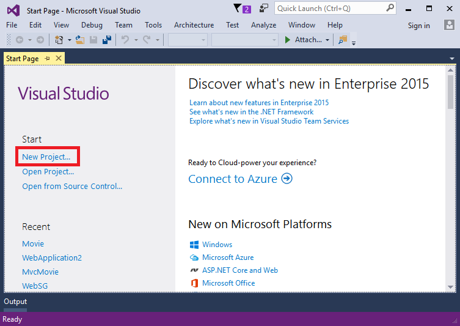
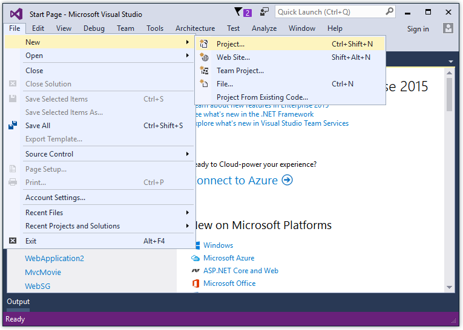
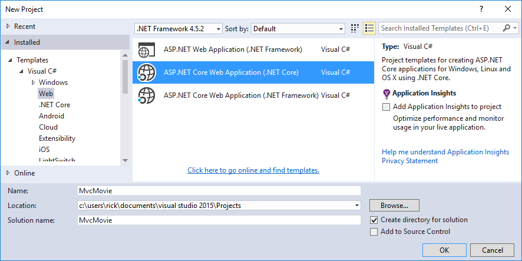
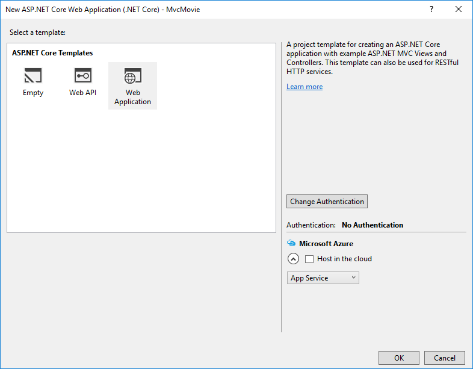
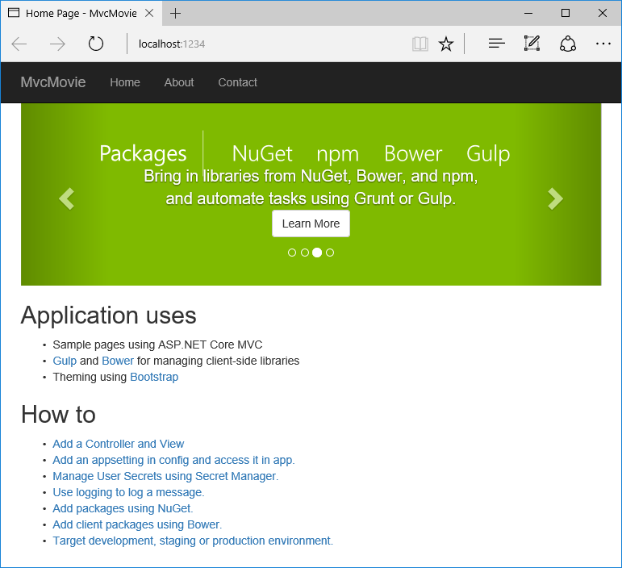
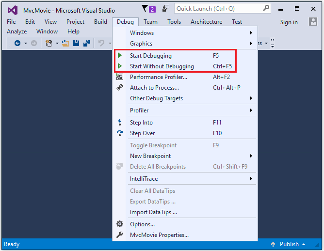

ASP.NET Core MVC 和 Visual Studio 入门
======================================

Getting started with ASP.NET Core MVC and Visual Studio
=======================================================

原文 `Getting started with ASP.NET Core MVC and Visual Studio <https://docs.asp.net/en/latest/tutorials/first-mvc-app/start-mvc.html>`_

作者： `Rick Anderson`_

翻译： `娄宇(Lyrics) <https://github.com/xbuilder>`_

校对： `刘怡(AlexLEWIS) <https://github.com/alexinea>`_ 、`夏申斌 <https://github.com/xiashenbin>`_ 、`张硕(Apple) <#>`_

This tutorial will teach you the basics of building an ASP.NET Core MVC  web app using `Visual Studio 2015 <https://www.visualstudio.com/en-us/visual-studio-homepage-vs.aspx>`__.

这篇教程将告诉你如何使用 `Visual Studio 2015 <https://www.visualstudio.com/zh-cn/visual-studio-homepage-vs.aspx>`__ 构建一个 ASP.NET Core MVC Web 应用程序的基础知识。

Install Visual Studio and .NET Core
----------------------------------------

安装 Visual Studio 和 .NET Core
-------------------------------

- Install Visual Studio Community 2015. Select the Community download and the default installation. Skip this step if you have Visual Studio 2015 installed.

  - `Visual Studio 2015 Home page installer  <https://www.visualstudio.com/en-us/visual-studio-homepage-vs.aspx>`__

- Install `.NET Core + Visual Studio tooling <http://go.microsoft.com/fwlink/?LinkID=798306>`__

- 安装 Visual Studio Community 2015。 选择 Community 下载并执行默认安装。 如果你已经安装了 Visual Studio 2015 ，请跳过本步骤。

  - `Visual Studio 2015 安装程序首页  <https://www.visualstudio.com/zh-cn/downloads/download-visual-studio-vs.aspx>`__

- 安装 `.NET Core + Visual Studio 工具 <http://go.microsoft.com/fwlink/?LinkID=798306>`__

Create a web app
-----------------------------------

创建一个 Web 应用程序
---------------------

From the Visual Studio **Start** page, tap **New Project**.

从 Visual Studio **起始页(Start Page)** 点击 **新建项目(New Project)**。

Alternatively, you can use the menus to create a new project. Tap **File > New > Project**.

或者使用菜单创建一个新项目。点击 **文件(File) > 新建(New) > 项目(Project)**。

Complete the **New Project** dialog:

- In the left pane, tap **Web**
- In the center pane, tap **ASP.NET Core Web Application (.NET Core)**
- Name the project "MvcMovie" (It's important to name the project "MvcMovie" so when you copy code, the namespace will match. )
- Tap **OK**

按以下步骤完成 **新建项目(New Project)** 对话框的设置：

- 在左边的窗格, 点击 **Web**
- 在中间的窗格, 点击 **ASP.NET Core Web Application (.NET Core)**
- 将项目命名为 "MvcMovie" (将项目命名为 "MvcMovie" 非常重要，当你复制代码的时候，命名空间才会匹配 )
- 点击 **确定(OK)**

In the **New ASP.NET Core Web Application - MvcMovie** dialog, tap **Web Application**, and then tap **OK**.

在 **New ASP.NET Core Web Application - MvcMovie** 对话框中，点击 **Web 应用程序(Web Application)**，然后点击 **确定(OK)**。

Visual Studio used a default template for the MVC project you just created, so you have a working app right now by entering a project name and selecting a few options. This is a simple "Hello World!" project, and it's a good place to start,

Tap **F5** to run the app in debug mode or **Ctl-F5** in non-debug mode.

Visual Studio 给刚才创建的 MVC 项目提供了默认模板，输入项目名并选择一些选项后便可得到一个应用程序。这就是一个简单的 "Hello World!" 项目，一个很好的开始。

按下 **F5** 以 Debug 模式运行这个应用程序，或者按下 **Ctrl+F5** 以非 Debug 模式运行。

- Visual Studio starts `IIS Express <http://www.iis.net/learn/extensions/introduction-to-iis-express/iis-express-overview>`__ and runs your app. Notice that the address bar shows ``localhost:port#`` and not something like ``example.com``. That's because ``localhost`` always points to your own local computer, which in this case is running the app you just created. When Visual Studio creates a web project, a random port is used for the web server. In the image above, the port number is 1234. When you run the app, you'll see a different port number.
- Launching the app with **Ctrl+F5** (non-debug mode) allows you to make code changes, save the file, refresh the browser, and see the code changes. Many developers prefer to use non-debug mode to quickly launch the app and view changes.
- You can launch the app in debug or non-debug mode from the **Debug** menu item:

- Visual Studio 启动 `IIS Express <http://www.iis.net/learn/extensions/introduction-to-iis-express/iis-express-overview>`__ 并且运行你的应用程序。注意地址栏显示的 ``localhost:端口#`` 而不是像 ``example.com`` 。那是因为 ``localhost`` 总是指向本地计算机，在本例中也就是运行你这个应用程序的计算机。当 Visual Studio 创建一个 Web 项目，Web 服务器使用随机的端口。如上图所示，端口号是 1234。当你运行这个应用程序，你可能会看到不同的端口号。
- 通过 **Ctrl+F5** (非调试模式)启动这个应用程序允许你进行代码更改，保存文件，刷新浏览器，之后查看代码改变。许多开发者更倾向于使用非调试模式来快速启动应用程序和查看变化。
- 你可以通过 **Debug** 菜单项选择以调试模式或者非调试模式启动应用程序

- You can debug the app by tapping the **IIS Express** button
- 你可以通过点击 **IIS Express** 按钮调试应用程序

.. image:: start-mvc/_static/iis_express.png

The default template gives you working **Home, Contact, About, Register** and **Log in** links. The browser image above doesn't show these links. Depending on the size of your browser, you might need to click the navigation icon to show them. 

默认的模板提供 **Home、Contact、About、Register** 和 **Log in** 链接。下面的浏览器图片没有显示这些链接。根据您的浏览器的尺寸，您可能需要点击导航图标来显示他们。

.. image:: start-mvc/_static/2.png

In the next part of this tutorial, we'll learn about MVC and start writing some code.

我们将在本教程下一节中学习 MVC 并尝试写些代码。
