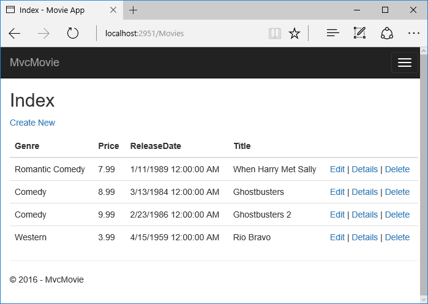

Working with SQL Server LocalDB    
===============================
使用 SQL Server LocalDB
================

翻译： `魏美娟(初见) <http://github.com/ChujianA>`_

校对： `

 The ``ApplicationDbContext`` class handles the task of connecting to the database and mapping ``Movie`` objects to database records. The database context is registered with the :doc:`Dependency Injection  </fundamentals/dependency-injection>` container in the ``ConfigureServices`` method in the *Startup.cs* file:

``ApplicationDbContext`` 类负责链接数据库并将 ``Movie`` 对象和数据记录进行映射。 *Startup.cs* 文件中，数据库上下文是在 ``ConfigureServices`` 方法中用 :doc:`Dependency Injection  </fundamentals/dependency-injection>`_ 容器进行注入的。

.. literalinclude:: start-mvc/sample/src/MvcMovie/Startup.cs
  :language: c#
  :lines: 39-45
  :dedent: 8
  :emphasize-lines: 5,6

The ASP.NET Core :doc:`Configuration </fundamentals/configuration>`_ system reads the ``ConnectionString``. For local development, it gets the connection string from the *appsettings.json* file:

ASP.NET Core  :doc:`Configuration </fundamentals/configuration>`_ 系统读取 ``ConnectionString`` 。为了本地开发，从 *appsettings.json* 文件中获取连接字符串。

.. literalinclude:: start-mvc/sample/src/MvcMovie/appsettings.json
  :language: javascript
  :lines: 1-6
  :emphasize-lines: 3

When you deploy the app to a test or production server, you can use an environment variable or another approach to set the connection string to a real SQL Server. See :doc:`Configuration </fundamentals/configuration>`_ .

当你部署应用程序到测试服务器或者生产服务器时，你可以使用环境变量或者另一种方法来设置实际数据库的连接字符串。看 :doc:`Configuration </fundamentals/configuration>`_。

SQL Server Express LocalDB
--------------------------------

SQL Server Express LocalDB
--------------------------

LocalDB is a lightweight version of the SQL Server Express Database Engine that is targeted for program development. LocalDB starts on demand and runs in user mode, so there is no complex configuration. By default, LocalDB database creates "\*.mdf" files in the *C:/Users/<user>* directory.

LocalDB是一个针对程序开发的轻量级版本的SQL Server Express数据库引擎，这是针对程序开发。LocalDB按需启动并且在用户模式下运行，所以它没有复杂的配置。默认情况下，LocalDB数据库在 *C:/Users/<user>* 目录下创建 "\*.mdf" 文件。

- From the **View** menu, open **SQL Server Object Explorer** (SSOX).

从 **View** 菜单中，打开SQL Server对象资源管理器（**SQL Server Object Explorer** ，(SSOX)）.

.. image:: working-with-sql/_static/ssox.png

- Right click on the ``Movie`` table **> View Designer**

右击 ``Movie`` 表 **> 视图设计器（View Designer）**

.. image:: working-with-sql/_static/design.png

.. image:: working-with-sql/_static/dv.png

Note the key icon next to ``ID``. By default, EF will make a property named ``ID`` the primary key.

注意钥匙图标后面的 ``ID``。默认情况下，EF将命名为 ``ID`` 的属性作为主键。

.. comment: add this when we have it for MVC 6: For more information on EF and MVC, see Tom Dykstra's excellent tutorial on MVC and EF.

- Right click on the ``Movie`` table **> View Data**

-右击 ``Movie`` 表>**> 查看数据（View Data）**

.. image:: working-with-sql/_static/ssox2.png

.. image:: working-with-sql/_static/vd22.png

Seed the database
--------------------------

填充数据库
-------------

Create a new class named ``SeedData`` in the *Models* folder. Replace the generated code with the following:

在 *Models* 文件夹中创建一个名叫 ``SeedData`` 的新类。用以下代码替换生成的代码。

.. literalinclude:: start-mvc/sample/src/MvcMovie/Models/SeedData.cs
  :language: c#
  :lines: 3-62

Notice if there are any movies in the DB, the seed initializer returns.

注意如果数据库上下文中存在movies，填充初始化器返回。

.. literalinclude:: start-mvc/sample/src/MvcMovie/Models/SeedData.cs
  :language: c#
  :lines: 18-21
  :dedent: 12
  :emphasize-lines: 3

Add the seed initializer to the end of the ``Configure`` method in the *Startup.cs* file: 

*Startup.cs* 文件中，在 ``Configure`` 方法的最后添加填充初始化器。

.. literalinclude:: start-mvc/sample/src/MvcMovie/Startup.cs
  :language: c#
  :lines: 80-88
  :dedent: 8
  :emphasize-lines: 8

Test the app

测试应用程序

- Delete all the records in the DB. You can do this with the delete links in the browser or from SSOX.

- 在数据库中删除所有的记录。你可以在浏览器中使用删除链接或者在 SQL Server对象资源管理器（SSOX）中做这件事。

- Force the app to initialize (call the methods in the ``Startup`` class) so the seed method runs. To force initialization, IIS Express must be stopped and restarted. You can do this with any of the following approaches:

- 强制应用程序初始化（在 ``Startup`` 类中调用方法），让填充方法运行。为了初始化，IIS Express必须停止，然后重新启动。可以用下列的任何一个方法来实现：

.. comment this no longer works  - ^<Shift>F5 (Hold down the control and Shift keys and tap F5)
  - Right click the IIS Express system tray icon in the notification area and tap **Exit** or **Stop* Site*
  - .. image:: working-with-sql/_static/iisExIcon.png
  - .. image:: working-with-sql/_static/stopIIS.png
  - If you were running VS in non-debug mode, press F5 to run in debug mode
  - If you were running VS in debug mode, stop the debugger and press ^F5

.. Note:: If the database doesn't initialize, put a break point on the line ``if (context.Movie.Any())`` and start debugging.

.. Note:: 如果是数据库没有初始化，在 ``if (context.Movie.Any())`` 这行设置断点，并开始调试

.. image:: working-with-sql/_static/dbg.png

The app shows the seeded data.

应用程序显示了被填充的数据

