使用 Visual Studio 发布一个 ASP.NET Core Azure 云 Web 应用程序 
============================================================
 
作者 `Rick Anderson`_

翻译 `谢炀（Kiler） <https://github.com/kiler398/aspnetcore>`_  

校对 

.. contents:: 章节：
  :local:
  :depth: 1

设置开发环境
^^^^^^^^^^^^^^^^^^^^^^^^^^^^^^^^^^^

- `安装最新版本的 Azure SDK for Visual Studio 2015 <http://go.microsoft.com/fwlink/?linkid=518003>`__ 。如果你之前没有装过 Visual Studio 2015，SDK 会安装 Visual Studio 2015。

.. note:: 如果你的机器之前任何依赖都没有安装过，SDK 的安装时间将会超过30分钟。

- 安装 `.NET Core + Visual Studio tooling <http://go.microsoft.com/fwlink/?LinkID=798306>`__

- 确认你的 `Azure 帐号 <https://portal.azure.com/>`__. 你可以 `注册免费　azure　帐号 <https://azure.microsoft.com/pricing/free-trial/>`__ 或者 `激活你的 Visual Studio 订阅用户权益 <https://azure.microsoft.com/pricing/member-offers/msdn-benefits-details/>`__.

创建一个 Web 应用程序
^^^^^^^^^^^^^^^^^^^^^^^^^^^^^^^^^^^

在 Visual Studio 的 **Start** 页面, 点击 **New Project**　。

.. image:: first-mvc-app/start-mvc/_static/new_project.png

另外, 你也可以通过菜单新建项目. 点击 **File > New > Project** 。 

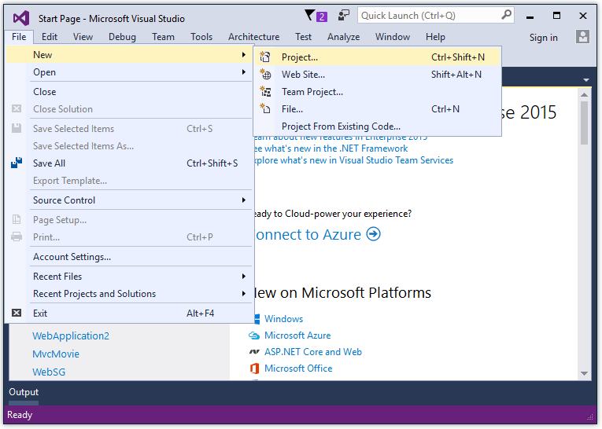

完成 **New Project** 对话框：

- 在右侧面板, 点击 **Web**
- 在中部面板, 点击 **ASP.NET Core Web Application (.NET Core)**
- 点击 **OK**

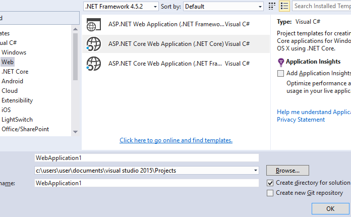

在 **New ASP.NET Core Web Application (.NET Core)** 对话框中：

- 点击 **Web Application**
- 确认 **Authentication** 设置为 **Individual User Accounts**
- 确认 **Host in the cloud** **没有** 被选中
- 点击 **OK**

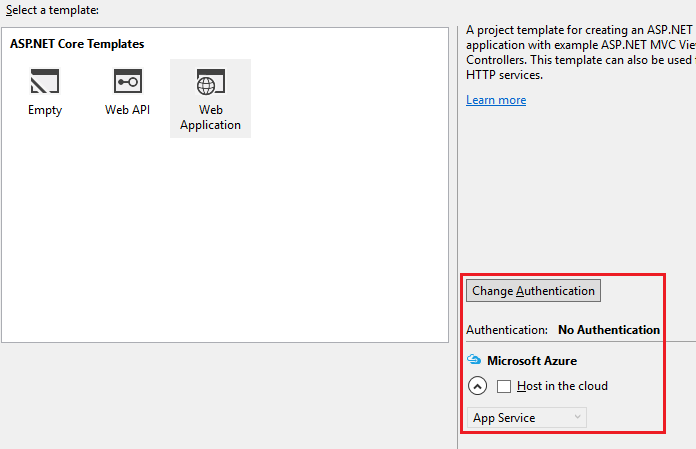

本地测试应用程序
^^^^^^^^^^^^^^^^^^^^^

- 使用 **Ctl-F5** 运行程序
- 点击 **About** 和 **Contact** 链接. 根据您的设备显示尺寸的大小，可能需要单击导航图标以显示链接

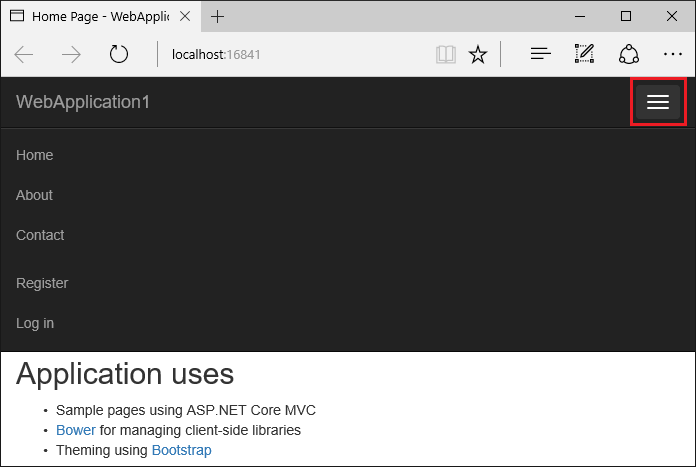

- 点击 **Register** 注册一个新用户 。您可以使用虚构的电子邮件。当你点击提交后，会收到以下错误：

.. image:: publish-to-azure-webapp-using-vs/_static/mig.png

可以通过两个方式来修复这个问题：

- 点击 **Apply Migrations** 当页面发生更新的时候, 刷新屏幕
- 在项目目录下运行该命令行 ：

    dotnet ef database update

应用程序显示用于注册用户的 **邮件注册** 以及 **注销** 链接。

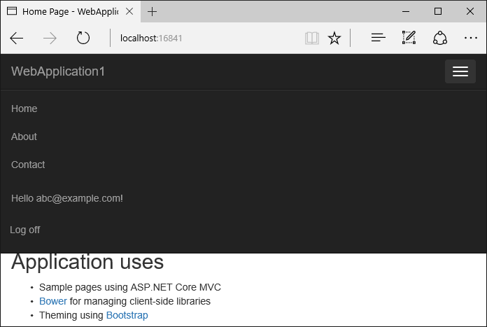

发布应用程序到 Azure
^^^^^^^^^^^^^^^^^^^^^^^^^^^^^^^^^^^

右击项目选择 **Publish**

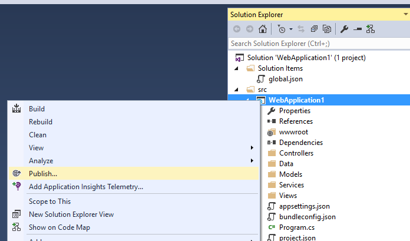

在 **Publish** 弹出对话框里，点击 **Microsoft Azure App Service**

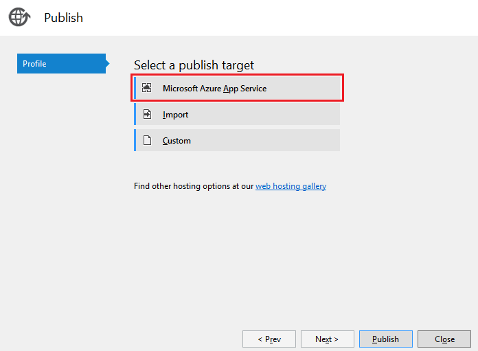

点击 **New** 输入一个新的资源组 。创建新的资源组目的是为了可以方便地删除所有您在本教程中创建在 Azure 资源 。 

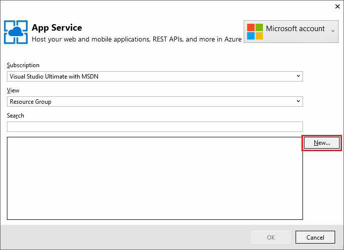

创建新的资源组以及应用服务计划：

- 点击 **New** 创建资源组并且输入新资源组的名称
- 点击 **New** 创建应用服务计划并且选择一个你附近的地址 。 你可以保留默认生成的名字
- 点击 **Explore additional Azure services** 创建新的数据库

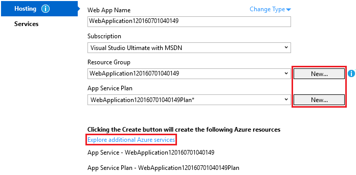

- 点击绿色的 **+** 图标来创建一个 SQL 数据库

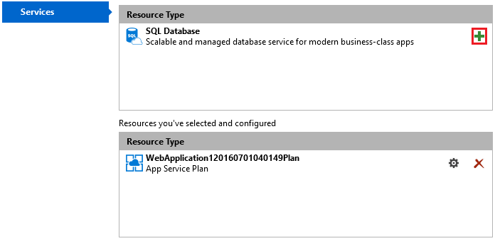

- 在 **Configure SQL Database** 弹出对话框中点击  **New**

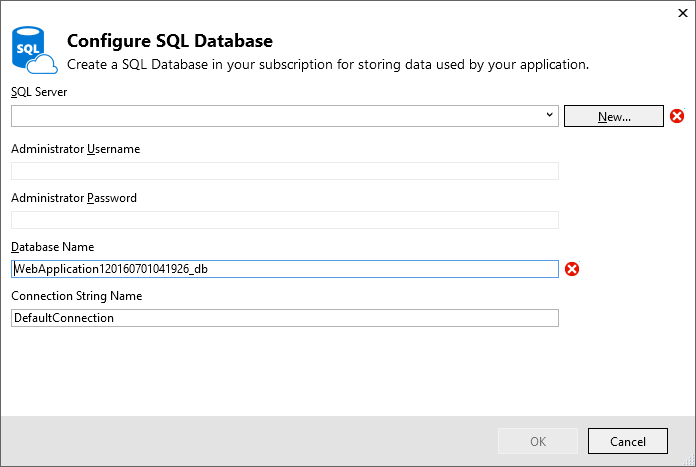

- 你可以保持默认 **Server Name**
- 输入管理员用户密码, 点击 **OK** 。记住用户名密码。

.. image:: publish-to-azure-webapp-using-vs/_static/dbrick.png

- 在  **Configure SQL Database** 弹出对话框中点击 **OK** 

- 在 **Create App Service** 弹出对话框中点击 **Create**

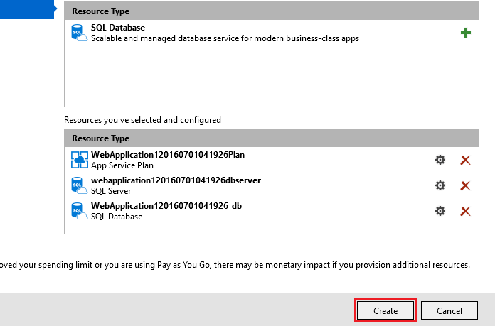

- 在 **Publish** 弹出对话框中点击 **Next**

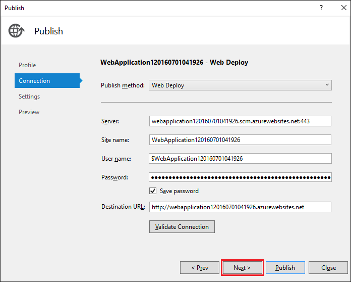

- 在 **Publish** 弹出对话框的 **Settings** 环节：

  - 选中 **Use this connection string at runtime**
  - 选中 **Apply this migration on publish**

  .. image:: publish-to-azure-webapp-using-vs/_static/pubs.png

- 点击 **Publish**

Visual Studio 将会把你的应用程序部署到 Azure 云，并在浏览器中启动你的云应用。

在 Azure 云中测试你应用程序
-----------------------

- 测试 **About** 以及 **Contact** 链接
- 注册新用户

.. image:: publish-to-azure-webapp-using-vs/_static/final.png

更新应用程序
--------------------

- 编辑 *Views/Home/About.cshtml* Razor 视图文件。修改内容，例如：

.. code-block:: html
  :emphasize-lines: 7

  @{
      ViewData["Title"] = "About";
  }
  <h2>@ViewData["Title"].</h2>
  <h3>@ViewData["Message"]</h3>

  
My updated about page.

- 右击项目选择 **Publish**

- 点 **Publish** 并在 Azure 云端应用中验证你的修改。

清理
--------------

如果你完成了应用程序的设置了，登录 `Azure 面板 <https://portal.azure.com/>`__ 并删除应用。

- 登录 `Azure 面板 <https://portal.azure.com/>`__
- 在右侧双击 **Resource groups** 并点击你创建的资源组。

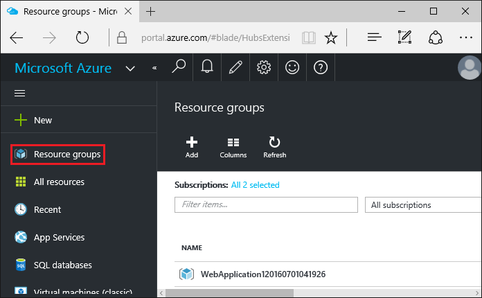

- 在 **Resource group** 里双击 **Delete**
- 输入资源名并点击 **Delete**

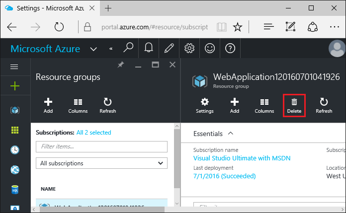

下一步
-----------

- :doc:`/tutorials/first-mvc-app/start-mvc`
- :doc:`/conceptual-overview/aspnet`
- :doc:`/fundamentals/index`
 